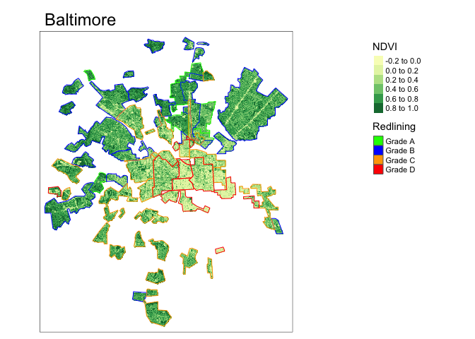
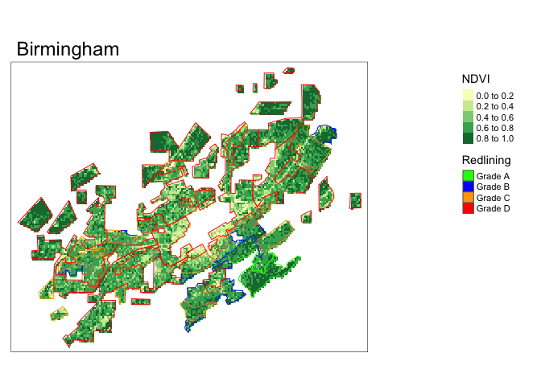
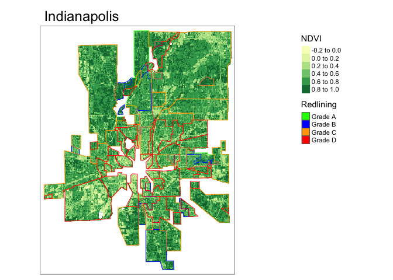
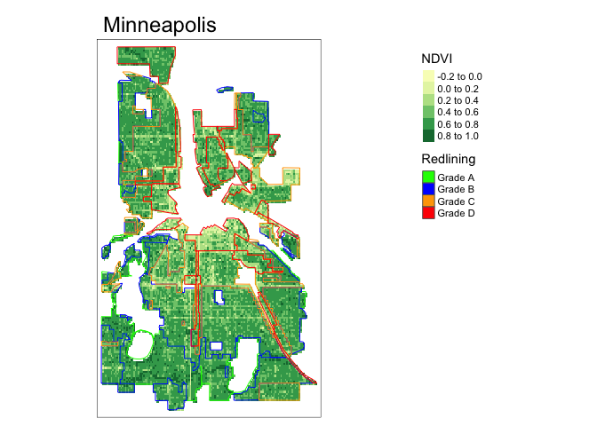
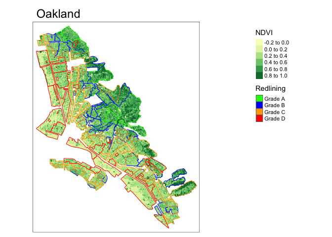
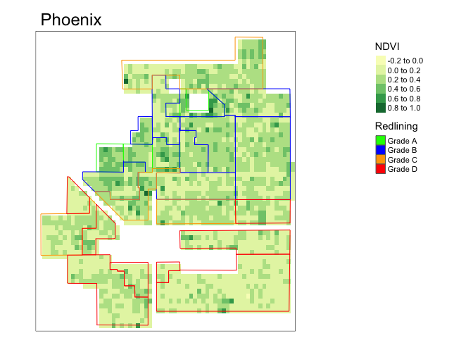

Welcome to our repository on exploring systemic racism in a geospatial context. We will use the example of redlining in US cities in the first half of the twentieth century, to show it's effect on vegatation variation across such areas, in the early twenty first century. This is jointly created by Ando Shah and Shravan Undaru for the UC Berkeley class ESPM 288 in the Spring of 2022. 

## Team Members:

- Ando Shah ([@ando-shah](https://github.com/ando-shah/))
- Shravan Kumar Undaru ([@undaru96](https://github.com/undaru96))

## Learning objectives
This module provides an introduction to the fundamentals of working with spatial vector and raster data in R while empirically exploring why systematic and structural racism is interwined with urban ecological processes. This module uses the Simple Features Access standard (ISO 19125) and tidyverse-style workflow using the sf package and emerging ecosystem of r-spatial tools.

# Exercise 
In August 2020, [Christopher Schell](http://directory.tacoma.uw.edu/employee/cjschell) and collegues published a review in *Science* on ['The ecological and evolutionary consequences of systemic racism in urban environments'](https://science.sciencemag.org/content/early/2020/08/12/science.aay4497) (DOI: 10.1126/science.aay4497), showing how systematic racism and classism  has significant impacts on ecological and evolutionary processes within urban environments. Here we explore a subset of the data used to support these findings in this review and the broader literature.

The [press release](https://www.washington.edu/news/2020/08/13/systemic-racism-has-consequences-for-all-life-in-cities/) on the paper is worth a read:

> “Racism is destroying our planet, and how we treat each other is essentially structural violence against our natural world,” said lead author Christopher Schell, an assistant professor of urban ecology at the University of Washington Tacoma. “Rather than just changing the conversation about how we treat each other, this paper will hopefully change the conversation about how we treat the natural world.”

In the paper, Schell writes: 

 > "In multiple cases, neighborhood racial composition can be a stronger predictor of urban socio-ecological patterns than wealth."

We are going to explore one metric for how structural racism and classism underpin landscape heterogeneity in cities.

**Figure 2** in the Schell paper shows how NDVI (Normalized Difference Vegetation Index) tracks historical redlining.
  

# Our Findings
We were able to reproduce the same figures as follows:

You can find the [RMD file here](assignment/spatial-assignment.Rmd) and the final knitted and formatted [output file here](assignment/spatial-assignment.md), and the final [rendered html here](assignment/spatial-assignment.html)

- `DESCRIPTION` a metadata file for the repository, based on the R package standard. It's main purpose here is as a place to list any additional R packages/libraries needed for any of the .Rmd files to run.
- `.github/workflows/main.yml` defines the Continuous Integration testing script for running the .Rmd files to confirm reproducibility.

