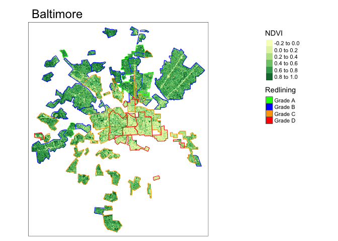
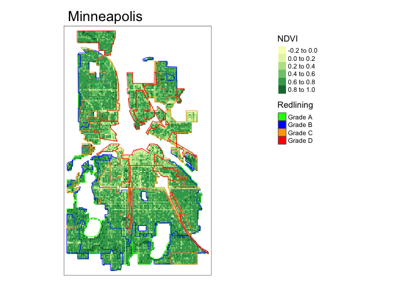

## Learning objectives
This module provides an introduction to the fundamentals of working with spatial vector and raster data in R while empirically exploring why systematic and structural racism is interwined with urban ecological processes. This module uses the Simple Features Access standard (ISO 19125) and tidyverse-style workflow using the sf package and emerging ecosystem of r-spatial tools.

# Exercise 
In August 2020, [Christopher Schell](http://directory.tacoma.uw.edu/employee/cjschell) and collegues published a review in *Science* on ['The ecological and evolutionary consequences of systemic racism in urban environments'](https://science.sciencemag.org/content/early/2020/08/12/science.aay4497) (DOI: 10.1126/science.aay4497), showing how systematic racism and classism  has significant impacts on ecological and evolutionary processes within urban environments. Here we explore a subset of the data used to support these findings in this review and the broader literature.

The [press release](https://www.washington.edu/news/2020/08/13/systemic-racism-has-consequences-for-all-life-in-cities/) on the paper is worth a read:

> “Racism is destroying our planet, and how we treat each other is essentially structural violence against our natural world,” said lead author Christopher Schell, an assistant professor of urban ecology at the University of Washington Tacoma. “Rather than just changing the conversation about how we treat each other, this paper will hopefully change the conversation about how we treat the natural world.”

In the paper, Schell writes: 

 > "In multiple cases, neighborhood racial composition can be a stronger predictor of urban socio-ecological patterns than wealth."

We are going to explore one metric for how structural racism and classism underpin landscape heterogeneity in cities.

**Figure 2** in the Schell paper shows how NDVI (Normalized Difference Vegetation Index) tracks historical redlining.
  

We are going to recreate these city maps, and plot the distributions and mean vegetation patterns across cities to explore the structural inequality and racism that Schell et al highlight in their paper.


## Acquire redlined areas for the following cities:


```r
#Sf <- simple features!
birm <- sf::st_read('https://dsl.richmond.edu/panorama/redlining/static/downloads/geojson/ALBirmingham1937.geojson')
```

```
## Reading layer `ALBirmingham1937' from data source 
##   `https://dsl.richmond.edu/panorama/redlining/static/downloads/geojson/ALBirmingham1937.geojson' 
##   using driver `GeoJSON'
## Simple feature collection with 60 features and 4 fields
## Geometry type: MULTIPOLYGON
## Dimension:     XY
## Bounding box:  xmin: -86.94663 ymin: 33.4393 xmax: -86.67684 ymax: 33.62239
## Geodetic CRS:  WGS 84
```

```r
ind <- sf::st_read('https://dsl.richmond.edu/panorama/redlining/static/downloads/geojson/INIndianapolis1937.geojson')
```

```
## Reading layer `INIndianapolis1937' from data source 
##   `https://dsl.richmond.edu/panorama/redlining/static/downloads/geojson/INIndianapolis1937.geojson' 
##   using driver `GeoJSON'
## Simple feature collection with 73 features and 4 fields
## Geometry type: MULTIPOLYGON
## Dimension:     XY
## Bounding box:  xmin: -86.28916 ymin: 39.66008 xmax: -86.03192 ymax: 39.91294
## Geodetic CRS:  WGS 84
```

```r
balti <- sf::st_read('https://dsl.richmond.edu/panorama/redlining/static/downloads/geojson/MDBaltimore1937.geojson')
```

```
## Reading layer `MDBaltimore1937' from data source 
##   `https://dsl.richmond.edu/panorama/redlining/static/downloads/geojson/MDBaltimore1937.geojson' 
##   using driver `GeoJSON'
## Simple feature collection with 59 features and 4 fields
## Geometry type: MULTIPOLYGON
## Dimension:     XY
## Bounding box:  xmin: -76.7569 ymin: 39.17874 xmax: -76.50928 ymax: 39.4068
## Geodetic CRS:  WGS 84
```

```r
phoenix <- sf::st_read('https://dsl.richmond.edu/panorama/redlining/static/downloads/geojson/AZPhoenix19XX.geojson')
```

```
## Reading layer `AZPhoenix19XX' from data source 
##   `https://dsl.richmond.edu/panorama/redlining/static/downloads/geojson/AZPhoenix19XX.geojson' 
##   using driver `GeoJSON'
## Simple feature collection with 25 features and 4 fields
## Geometry type: MULTIPOLYGON
## Dimension:     XY
## Bounding box:  xmin: -112.1087 ymin: 33.4258 xmax: -112.0305 ymax: 33.50111
## Geodetic CRS:  WGS 84
```

```r
minn <- sf::st_read('https://dsl.richmond.edu/panorama/redlining/static/downloads/geojson/MNMinneapolis1937.geojson')
```

```
## Reading layer `MNMinneapolis1937' from data source 
##   `https://dsl.richmond.edu/panorama/redlining/static/downloads/geojson/MNMinneapolis1937.geojson' 
##   using driver `GeoJSON'
## Simple feature collection with 70 features and 4 fields
## Geometry type: MULTIPOLYGON
## Dimension:     XY
## Bounding box:  xmin: -93.32903 ymin: 44.89379 xmax: -93.19715 ymax: 45.0513
## Geodetic CRS:  WGS 84
```

```r
oakland <- sf::st_read('https://dsl.richmond.edu/panorama/redlining/static/downloads/geojson/CAOakland1937.geojson')
```

```
## Reading layer `CAOakland1937' from data source 
##   `https://dsl.richmond.edu/panorama/redlining/static/downloads/geojson/CAOakland1937.geojson' 
##   using driver `GeoJSON'
## Simple feature collection with 119 features and 4 fields
## Geometry type: MULTIPOLYGON
## Dimension:     XY
## Bounding box:  xmin: -122.3097 ymin: 37.71369 xmax: -122.1168 ymax: 37.90601
## Geodetic CRS:  WGS 84
```


## Data Exploration


```r
#tmap interactive
tmap_mode("view")

oakland |> filter(holc_grade %in% c('D','C')) |> tm_shape() + tm_polygons("holc_grade", alpha=0.4) + tm_graticules() + tm_legend() 
```

```{=html}
<div id="htmlwidget-b7558d32d61cd2100e4b" style="width:672px;height:480px;" class="leaflet html-widget"></div>
<script type="application/json" data-for="htmlwidget-b7558d32d61cd2100e4b">{"x":{"options":{"crs":{"crsClass":"L.CRS.EPSG3857","code":null,"proj4def":null,"projectedBounds":null,"options":{}}},"calls":[{"method":"createMapPane","args":["tmap401",401]},{"method":"createMapPane","args":["tmap402",402]},{"method":"addProviderTiles","args":["Esri.WorldGrayCanvas",null,"Esri.WorldGrayCanvas",{"minZoom":0,"maxZoom":18,"tileSize":256,"subdomains":"abc","errorTileUrl":"","tms":false,"noWrap":false,"zoomOffset":0,"zoomReverse":false,"opacity":1,"zIndex":1,"detectRetina":false,"pane":"tilePane"}]},{"method":"addProviderTiles","args":["OpenStreetMap",null,"OpenStreetMap",{"minZoom":0,"maxZoom":18,"tileSize":256,"subdomains":"abc","errorTileUrl":"","tms":false,"noWrap":false,"zoomOffset":0,"zoomReverse":false,"opacity":1,"zIndex":1,"detectRetina":false,"pane":"tilePane"}]},{"method":"addProviderTiles","args":["Esri.WorldTopoMap",null,"Esri.WorldTopoMap",{"minZoom":0,"maxZoom":18,"tileSize":256,"subdomains":"abc","errorTileUrl":"","tms":false,"noWrap":false,"zoomOffset":0,"zoomReverse":false,"opacity":1,"zIndex":1,"detectRetina":false,"pane":"tilePane"}]},{"method":"addPolygons","args":[[[[{"lng":[-122.296257,-122.295871,-122.294831,-122.292187,-122.291533,-122.290226,-122.289869,-122.289067,-122.289542,-122.290256,-122.291147,-122.291979,-122.2929,-122.293969,-122.294474,-122.295574,-122.296138,-122.296465,-122.298237,-122.298527,-122.296455,-122.294644,-122.293434,-122.2929,-122.296257],"lat":[37.887832,37.886472,37.886637,37.887246,37.885089,37.885347,37.884479,37.884268,37.882885,37.882721,37.88265,37.882603,37.88265,37.882838,37.882932,37.883025,37.883049,37.883049,37.888745,37.889763,37.889896,37.89002,37.890201,37.88863,37.887832]}],[{"lng":[-122.302015,-122.298725,-122.301863,-122.303589,-122.304095,-122.305513,-122.303384,-122.302015],"lat":[37.89744,37.887626,37.887536,37.892567,37.892545,37.896809,37.897139,37.89744]}],[{"lng":[-122.297119,-122.296821,-122.296346,-122.295811,-122.295663,-122.294689,-122.298821,-122.300148,-122.300675,-122.301129,-122.300297,-122.299525,-122.298604,-122.297861,-122.297119],"lat":[37.898805,37.897609,37.896367,37.894585,37.893952,37.890988,37.890794,37.894868,37.896229,37.898172,37.898031,37.898102,37.898406,37.898688,37.898805]}]],[[{"lng":[-122.252511,-122.252314,-122.251957,-122.251577,-122.253502,-122.255546,-122.258589,-122.258565,-122.257947,-122.258018,-122.263128,-122.262344,-122.261951,-122.260382,-122.258434,-122.256157,-122.255206,-122.254692,-122.253989,-122.253323,-122.252511],"lat":[37.846026,37.842718,37.839715,37.836974,37.833427,37.833276,37.833314,37.832225,37.832188,37.831174,37.83093,37.837744,37.838075,37.839408,37.841529,37.84485,37.844445,37.845015,37.845466,37.845736,37.846026]}],[{"lng":[-122.243403,-122.24673,-122.247134,-122.250381,-122.250579,-122.251114,-122.251341,-122.24944,-122.248323,-122.243403],"lat":[37.848337,37.843701,37.842838,37.837775,37.839174,37.844406,37.847436,37.848018,37.84631,37.848337]}]],[[{"lng":[-122.255147,-122.259033,-122.259746,-122.261707,-122.261992,-122.261529,-122.261315,-122.261315,-122.260852,-122.259425,-122.261422,-122.264417,-122.264488,-122.266164,-122.263128,-122.258018,-122.255147],"lat":[37.831284,37.824442,37.824751,37.825202,37.823906,37.823568,37.823343,37.823033,37.82278,37.822611,37.819654,37.820133,37.819795,37.820133,37.83093,37.831174,37.831284]}],[{"lng":[-122.264708,-122.267661,-122.270442,-122.267667,-122.264708],"lat":[37.831054,37.820442,37.820865,37.831561,37.831054]}]],[[{"lng":[-122.264417,-122.261422,-122.26227,-122.262973,-122.265655,-122.267442,-122.266164,-122.264488,-122.264417],"lat":[37.820133,37.819654,37.818587,37.818557,37.814141,37.814471,37.820133,37.819795,37.820133]}],[{"lng":[-122.267661,-122.269457,-122.272405,-122.270442,-122.267661],"lat":[37.820442,37.812669,37.813194,37.820865,37.820442]}]],[[{"lng":[-122.247681,-122.24774,-122.247878,-122.249161,-122.249161,-122.24931,-122.249874,-122.250558,-122.250795,-122.25139,-122.252667,-122.253024,-122.252755,-122.254105,-122.254723,-122.255175,-122.256197,-122.256886,-122.25729,-122.258621,-122.258859,-122.259239,-122.259881,-122.260166,-122.26131,-122.259201,-122.256527,-122.256319,-122.24907,-122.248416,-122.244851,-122.243192,-122.243462,-122.243997,-122.244888,-122.245423,-122.247681],"lat":[37.826547,37.825608,37.825271,37.826071,37.825414,37.824827,37.824334,37.824123,37.82356,37.823114,37.82255,37.822457,37.822037,37.821964,37.822114,37.822471,37.822283,37.821569,37.821025,37.820293,37.819711,37.819129,37.818659,37.818472,37.818599,37.821744,37.823222,37.823152,37.828432,37.828878,37.83153,37.829975,37.829832,37.829082,37.827767,37.827415,37.826547]}],[{"lng":[-122.251602,-122.250614,-122.249929,-122.24913,-122.246963,-122.245385,-122.25725,-122.25801,-122.251602],"lat":[37.834588,37.834362,37.834452,37.834573,37.833762,37.832365,37.823459,37.824,37.834588]}]],[[{"lng":[-122.250421,-122.250909,-122.251037,-122.251166,-122.251551,-122.25205,-122.252406,-122.252506,-122.252649,-122.252906,-122.255829,-122.2562,-122.256642,-122.25707,-122.257925,-122.258382,-122.259023,-122.259394,-122.259038,-122.260897,-122.261899,-122.262107,-122.262523,-122.263504,-122.262196,-122.26131,-122.260166,-122.259263,-122.257979,-122.2571,-122.256363,-122.255864,-122.25565,-122.255626,-122.254818,-122.253677,-122.253083,-122.25237,-122.251087,-122.250421],"lat":[37.817721,37.817424,37.817097,37.816658,37.816466,37.816353,37.816444,37.816804,37.817074,37.817277,37.81552,37.815554,37.815576,37.815497,37.81508,37.8149,37.814878,37.814833,37.814405,37.812325,37.813752,37.814292,37.81455,37.814785,37.817249,37.818599,37.818472,37.817796,37.818472,37.818922,37.819147,37.819523,37.819955,37.820894,37.820405,37.819617,37.819091,37.818603,37.818058,37.817721]}]],[[{"lng":[-122.252513,-122.253671,-122.254931,-122.254527,-122.254361,-122.254408,-122.25467,-122.254099,-122.253695,-122.253196,-122.251865,-122.251152,-122.250677,-122.250154,-122.249369,-122.248942,-122.248062,-122.246921,-122.246707,-122.246541,-122.245818,-122.245034,-122.243513,-122.24318,-122.24394,-122.245828,-122.247349,-122.248205,-122.248872,-122.249702,-122.251033,-122.252198,-122.252911,-122.252459,-122.25177,-122.252008,-122.252513],"lat":[37.79951,37.798804,37.800025,37.800288,37.800682,37.801039,37.801227,37.802785,37.803781,37.804025,37.804382,37.804663,37.805302,37.80641,37.808081,37.808588,37.809039,37.809508,37.809827,37.810334,37.810155,37.809799,37.80931,37.80916,37.808165,37.807311,37.805677,37.805076,37.804783,37.804419,37.804156,37.80256,37.802091,37.801339,37.801264,37.799818,37.79951]}],[{"lng":[-122.259038,-122.258653,-122.258196,-122.257797,-122.257127,-122.256171,-122.255601,-122.255173,-122.255202,-122.254973,-122.253832,-122.252977,-122.251836,-122.25108,-122.250709,-122.250381,-122.250068,-122.249464,-122.249156,-122.248965,-122.24906,-122.249441,-122.250225,-122.251057,-122.252293,-122.252578,-122.252602,-122.252958,-122.253505,-122.254289,-122.254836,-122.255882,-122.256143,-122.256476,-122.2565,-122.256547,-122.257451,-122.258853,-122.260065,-122.260897,-122.261325,-122.260778,-122.260683,-122.260897,-122.259038],"lat":[37.814405,37.813943,37.814168,37.813931,37.813436,37.812906,37.812275,37.811599,37.810743,37.810596,37.810495,37.81054,37.810732,37.811036,37.811295,37.811633,37.811655,37.811048,37.810428,37.809996,37.809583,37.80917,37.808738,37.808513,37.808513,37.808607,37.807968,37.80763,37.807518,37.807461,37.807405,37.807274,37.807518,37.808006,37.808532,37.80887,37.808964,37.809414,37.809959,37.810635,37.810748,37.811161,37.811611,37.812325,37.814405]}]],[[{"lng":[-122.20812,-122.208726,-122.209047,-122.209083,-122.20894,-122.209439,-122.209938,-122.210473,-122.210901,-122.211151,-122.211436,-122.212078,-122.213931,-122.215215,-122.215714,-122.216142,-122.216498,-122.217104,-122.21739,-122.218031,-122.218887,-122.219743,-122.219743,-122.219885,-122.220206,-122.221235,-122.221116,-122.221259,-122.221425,-122.221782,-122.222495,-122.223446,-122.223874,-122.224444,-122.224824,-122.224777,-122.225989,-122.226821,-122.227439,-122.227938,-122.228318,-122.228889,-122.229625,-122.229982,-122.230647,-122.231289,-122.232287,-122.232644,-122.232977,-122.234236,-122.234545,-122.234569,-122.234403,-122.235287,-122.234289,-122.232613,-122.231829,-122.230759,-122.229939,-122.227087,-122.223914,-122.221917,-122.219992,-122.217817,-122.21739,-122.216997,-122.215999,-122.215037,-122.21411,-122.213504,-122.212755,-122.212291,-122.211971,-122.211614,-122.211436,-122.21058,-122.209974,-122.209083,-122.209154,-122.20812],"lat":[37.846264,37.84511,37.843787,37.842914,37.841619,37.841197,37.840296,37.839902,37.838804,37.837537,37.836607,37.834946,37.833848,37.834918,37.835537,37.835988,37.837002,37.837142,37.837002,37.837987,37.838522,37.839338,37.840071,37.840493,37.841197,37.84191,37.842398,37.843036,37.843336,37.843468,37.843505,37.843449,37.843168,37.842623,37.842098,37.841797,37.842154,37.842755,37.84298,37.843074,37.842999,37.843336,37.843468,37.843505,37.843656,37.844219,37.844838,37.845551,37.845889,37.846715,37.846771,37.849342,37.850018,37.851388,37.851473,37.851219,37.850712,37.850234,37.849615,37.848151,37.846461,37.845645,37.844829,37.844294,37.843984,37.844237,37.844519,37.845026,37.845927,37.847053,37.84801,37.849192,37.849671,37.849671,37.849671,37.849755,37.849615,37.848545,37.847672,37.846264]}]],[[{"lng":[-122.238057,-122.23939,-122.239828,-122.240208,-122.242205,-122.243707,-122.245095,-122.246045,-122.246654,-122.250932,-122.252513,-122.252008,-122.25177,-122.252459,-122.252911,-122.252198,-122.251033,-122.249702,-122.248872,-122.246769,-122.247149,-122.246598,-122.246009,-122.244982,-122.24424,-122.242567,-122.238536,-122.234656,-122.233316,-122.232389,-122.231961,-122.231319,-122.230428,-122.229893,-122.229608,-122.229465,-122.231961,-122.232531,-122.233886,-122.234635,-122.23517,-122.235847,-122.236596,-122.237166,-122.238057,-122.238057],"lat":[37.801563,37.80162,37.80141,37.801485,37.80153,37.80138,37.801004,37.800463,37.801004,37.798074,37.79951,37.799818,37.801264,37.801339,37.802091,37.80256,37.804156,37.804419,37.804783,37.80395,37.802718,37.802808,37.801516,37.801816,37.801907,37.802237,37.802658,37.803228,37.804351,37.805056,37.805366,37.805506,37.805422,37.805253,37.804943,37.804492,37.802464,37.80283,37.801844,37.802239,37.801873,37.802042,37.802126,37.802126,37.801732,37.801563]}]],[[{"lng":[-122.246045,-122.239948,-122.245424,-122.246185,-122.246318,-122.247116,-122.25303,-122.256338,-122.254931,-122.253671,-122.252513,-122.250932,-122.246654,-122.246045],"lat":[37.800463,37.79516,37.791118,37.791749,37.791794,37.791253,37.796527,37.799291,37.800025,37.798804,37.79951,37.798074,37.801004,37.800463]}]],[[{"lng":[-122.226114,-122.226863,-122.225365,-122.224987,-122.224659,-122.224231,-122.223076,-122.221593,-122.221148,-122.221568,-122.221663,-122.222138,-122.222481,-122.222157,-122.222348,-122.222994,-122.221682,-122.222983,-122.230169,-122.232142,-122.228933,-122.230288,-122.228458,-122.225867,-122.227626,-122.228077,-122.229646,-122.230098,-122.23188,-122.232783,-122.234946,-122.235564,-122.237561,-122.239961,-122.24096,-122.242481,-122.243931,-122.244739,-122.244978,-122.245424,-122.239948,-122.246045,-122.245095,-122.243707,-122.242205,-122.240208,-122.239828,-122.23939,-122.238057,-122.236738,-122.23599,-122.23492,-122.233387,-122.230963,-122.230678,-122.226114],"lat":[37.80083,37.798633,37.798379,37.797182,37.796247,37.795683,37.794951,37.794534,37.79454,37.794172,37.79306,37.791843,37.791557,37.790445,37.789844,37.788537,37.788026,37.784523,37.784927,37.785077,37.788308,37.789115,37.790637,37.793473,37.793792,37.793717,37.794581,37.79152,37.79259,37.791764,37.793022,37.792271,37.793435,37.790956,37.791557,37.790092,37.790956,37.790562,37.790756,37.791118,37.79516,37.800463,37.801004,37.80138,37.80153,37.801485,37.80141,37.80162,37.801563,37.800211,37.800605,37.800041,37.80114,37.800718,37.801816,37.80083]},{"lng":[-122.230459,-122.22929,-122.233043,-122.23295,-122.233159,-122.23295,-122.230459],"lat":[37.797511,37.798878,37.799571,37.798818,37.797962,37.796722,37.797511]}]],[[{"lng":[-122.301863,-122.307036,-122.308462,-122.304095,-122.303589,-122.301863],"lat":[37.887536,37.887338,37.892356,37.892545,37.892567,37.887536]}]],[[{"lng":[-122.220998,-122.22251,-122.223879,-122.224848,-122.224449,-122.223679,-122.222766,-122.221991,-122.220772,-122.219911,-122.219198,-122.21893,-122.219272,-122.219657,-122.220114,-122.220735,-122.220998],"lat":[37.778751,37.776441,37.777083,37.777511,37.778075,37.779867,37.782009,37.78367,37.783247,37.782777,37.78219,37.78165,37.781355,37.780543,37.779878,37.779086,37.778751]}],[{"lng":[-122.225333,-122.22579,-122.227087,-122.228171,-122.229954,-122.231237,-122.232849,-122.233604,-122.234294,-122.233362,-122.233257,-122.232079,-122.231351,-122.224763,-122.22338,-122.223322,-122.223921,-122.225333],"lat":[37.779089,37.778041,37.778751,37.779394,37.780498,37.78131,37.782245,37.782741,37.783228,37.784294,37.784428,37.784263,37.784173,37.783789,37.783665,37.783553,37.782166,37.779089]}]],[[{"lng":[-122.200705,-122.199291,-122.198934,-122.198792,-122.198792,-122.199101,-122.200289,-122.200788,-122.200812,-122.200479,-122.199933,-122.199742,-122.199742,-122.201056,-122.204829,-122.207633,-122.208156,-122.208774,-122.211776,-122.21398,-122.212408,-122.212102,-122.209773,-122.208156,-122.206707,-122.204971,-122.207158,-122.209273,-122.211199,-122.212054,-122.212601,-122.212435,-122.211484,-122.21234,-122.21348,-122.214716,-122.21365,-122.213292,-122.212493,-122.211618,-122.210972,-122.21023,-122.209926,-122.209717,-122.209546,-122.209489,-122.209489,-122.208918,-122.208424,-122.207416,-122.206047,-122.203594,-122.203022,-122.202547,-122.201977,-122.201549,-122.200705],"lat":[37.806829,37.805806,37.805524,37.805242,37.804942,37.804548,37.80374,37.803402,37.803064,37.802857,37.802801,37.802688,37.802519,37.801234,37.797543,37.798707,37.798707,37.798651,37.799322,37.799815,37.801292,37.80158,37.799928,37.801599,37.800566,37.802275,37.803026,37.804454,37.802651,37.803252,37.803458,37.80389,37.805017,37.805393,37.803703,37.803909,37.806301,37.806246,37.806366,37.806772,37.807418,37.808379,37.808109,37.807779,37.807478,37.807133,37.806997,37.807102,37.807102,37.806532,37.807328,37.808455,37.808172,37.808116,37.80804,37.80744,37.806829]}]],[[{"lng":[-122.211776,-122.212605,-122.212035,-122.212177,-122.208684,-122.205366,-122.205166,-122.20229,-122.201194,-122.203065,-122.20363,-122.208294,-122.208859,-122.210612,-122.211491,-122.211919,-122.213167,-122.21382,-122.212691,-122.216999,-122.216078,-122.218366,-122.21893,-122.219198,-122.219911,-122.220772,-122.221991,-122.22101,-122.219257,-122.218099,-122.21802,-122.215692,-122.21398,-122.211776],"lat":[37.799322,37.796597,37.79624,37.795057,37.793723,37.796947,37.797142,37.794493,37.793507,37.792474,37.792991,37.790338,37.790573,37.78968,37.789238,37.789023,37.788506,37.787943,37.786652,37.784327,37.783787,37.782073,37.78165,37.78219,37.782777,37.783247,37.78367,37.786558,37.791207,37.794094,37.794293,37.800151,37.799815,37.799322]}]],[[{"lng":[-122.207711,-122.206536,-122.205769,-122.203915,-122.203345,-122.199886,-122.198425,-122.195441,-122.194652,-122.194266,-122.194266,-122.19489,-122.195514,-122.196108,-122.195455,-122.195128,-122.195009,-122.195217,-122.195989,-122.197445,-122.198901,-122.199525,-122.200327,-122.201218,-122.201842,-122.200892,-122.201753,-122.201753,-122.200802,-122.202288,-122.201575,-122.201337,-122.201159,-122.206923,-122.20826,-122.209389,-122.210785,-122.21132,-122.212181,-122.212627,-122.213697,-122.214766,-122.215747,-122.216668,-122.217232,-122.217618,-122.218366,-122.216078,-122.216999,-122.212691,-122.21382,-122.213167,-122.211919,-122.211491,-122.207711],"lat":[37.785945,37.784921,37.784253,37.785295,37.784985,37.78724,37.785774,37.787089,37.786573,37.785963,37.785493,37.785399,37.785141,37.784625,37.784108,37.783638,37.78331,37.78277,37.782112,37.781314,37.782582,37.782042,37.781455,37.780985,37.780727,37.779999,37.779435,37.779247,37.778238,37.777416,37.776242,37.775161,37.773494,37.77347,37.774152,37.774598,37.775255,37.775631,37.775654,37.77603,37.77704,37.777956,37.778848,37.77967,37.780257,37.78068,37.782073,37.783787,37.784327,37.786652,37.787943,37.788506,37.789023,37.789238,37.785945]},{"lng":[-122.210281,-122.212092,-122.213789,-122.214759,-122.212948,-122.210281],"lat":[37.78353,37.785356,37.784173,37.783654,37.781727,37.78353]}]],[[{"lng":[-122.201194,-122.195386,-122.195441,-122.198425,-122.199886,-122.203345,-122.203915,-122.205769,-122.206536,-122.203391,-122.202536,-122.201623,-122.201794,-122.202536,-122.203163,-122.203772,-122.207711,-122.211491,-122.210612,-122.208859,-122.208294,-122.20363,-122.203065,-122.201194],"lat":[37.793507,37.787345,37.787089,37.785774,37.78724,37.784985,37.785295,37.784253,37.784921,37.786758,37.787314,37.787525,37.788637,37.788592,37.788351,37.788036,37.785945,37.789238,37.78968,37.790573,37.790338,37.792991,37.792474,37.793507]}],[{"lng":[-122.192399,-122.193398,-122.193754,-122.193926,-122.201339,-122.19945,-122.1985,-122.197692,-122.197501,-122.197454,-122.19705,-122.193326,-122.194289,-122.190367,-122.192792,-122.192399],"lat":[37.787972,37.787578,37.787831,37.787756,37.79532,37.798582,37.800065,37.799746,37.799277,37.798525,37.797981,37.794255,37.793691,37.789803,37.788479,37.787972]}]],[[{"lng":[-122.192296,-122.192534,-122.193009,-122.192582,-122.192463,-122.192201,-122.191655,-122.190965,-122.189753,-122.188493,-122.187757,-122.186996,-122.186616,-122.186117,-122.185903,-122.185596,-122.184847,-122.184419,-122.183563,-122.182922,-122.181745,-122.180889,-122.180069,-122.179285,-122.17818,-122.177146,-122.176255,-122.17572,-122.175328,-122.17515,-122.174436,-122.173866,-122.173616,-122.173545,-122.173759,-122.174258,-122.174508,-122.174579,-122.17515,-122.175684,-122.175898,-122.17584,-122.175441,-122.17487,-122.174514,-122.174143,-122.173829,-122.173473,-122.173102,-122.172788,-122.172089,-122.171291,-122.170849,-122.170549,-122.16985,-122.169579,-122.169323,-122.169023,-122.168325,-122.16784,-122.16744,-122.167041,-122.166385,-122.165601,-122.165087,-122.164674,-122.164417,-122.164317,-122.164303,-122.164431,-122.164802,-122.165401,-122.165843,-122.166399,-122.167098,-122.167925,-122.168695,-122.170178,-122.171063,-122.171605,-122.171776,-122.17199,-122.172118,-122.172275,-122.172531,-122.173287,-122.174057,-122.175169,-122.175347,-122.175549,-122.175799,-122.176013,-122.176334,-122.176536,-122.176999,-122.177296,-122.177843,-122.178247,-122.178544,-122.178889,-122.179091,-122.179281,-122.179424,-122.179554,-122.179721,-122.180137,-122.180529,-122.180814,-122.181444,-122.181943,-122.182537,-122.183143,-122.183975,-122.184451,-122.185009,-122.186143,-122.187227,-122.187127,-122.186985,-122.186814,-122.186771,-122.187441,-122.187969,-122.188211,-122.188525,-122.188625,-122.188568,-122.189652,-122.190379,-122.190792,-122.190322,-122.189865,-122.18978,-122.18983,-122.190008,-122.190279,-122.190621,-122.191092,-122.191463,-122.19224,-122.192789,-122.193081,-122.193416,-122.193737,-122.193901,-122.193973,-122.193131,-122.193398,-122.192399,-122.192792,-122.190367,-122.194289,-122.193326,-122.19705,-122.196598,-122.196337,-122.196313,-122.196313,-122.195576,-122.195315,-122.195315,-122.194578,-122.194269,-122.193936,-122.193485,-122.192938,-122.192296],"lat":[37.799765,37.798638,37.798225,37.797605,37.797023,37.796516,37.796159,37.796046,37.796178,37.796553,37.796892,37.797305,37.797662,37.798281,37.798713,37.79848,37.797663,37.797297,37.797382,37.797579,37.797551,37.797522,37.797663,37.797579,37.797241,37.796931,37.796367,37.795945,37.795269,37.794874,37.794564,37.794423,37.794029,37.793494,37.793015,37.792423,37.791888,37.791465,37.790874,37.790366,37.790141,37.789948,37.789824,37.789756,37.789722,37.789824,37.789857,37.789835,37.789733,37.789508,37.789102,37.788697,37.788573,37.788483,37.788178,37.787919,37.787705,37.787491,37.787254,37.786961,37.7866,37.78624,37.785823,37.785372,37.785034,37.78456,37.784245,37.783929,37.783602,37.783343,37.782971,37.782475,37.782182,37.781889,37.781641,37.781495,37.781326,37.780931,37.780683,37.780931,37.780965,37.780897,37.780706,37.780469,37.779996,37.780041,37.780007,37.779926,37.78095,37.781589,37.781908,37.782115,37.782312,37.782443,37.782669,37.782744,37.782706,37.782519,37.782434,37.78249,37.782575,37.7828,37.783016,37.783279,37.783524,37.78374,37.78389,37.783984,37.783984,37.783909,37.783796,37.783843,37.783927,37.783984,37.784087,37.784175,37.784198,37.78351,37.78262,37.78049,37.780152,37.780287,37.780512,37.780907,37.781594,37.78235,37.782767,37.783037,37.783308,37.783499,37.783995,37.784299,37.784397,37.784639,37.784892,37.785107,37.785202,37.78527,37.785377,37.785479,37.785541,37.785648,37.785794,37.785969,37.786228,37.786346,37.786927,37.787578,37.787972,37.788479,37.789803,37.793691,37.794255,37.797981,37.798356,37.798845,37.799465,37.799634,37.800404,37.800835,37.801061,37.801699,37.801756,37.801681,37.80123,37.80061,37.799765]}]],[[{"lng":[-122.182961,-122.185127,-122.191515,-122.189875,-122.190403,-122.18912,-122.189913,-122.194688,-122.194859,-122.194663,-122.192677,-122.193918,-122.193276,-122.194987,-122.196285,-122.199394,-122.20323,-122.204941,-122.206139,-122.206981,-122.208364,-122.214325,-122.213526,-122.215038,-122.213526,-122.212856,-122.213526,-122.21277,-122.212528,-122.211487,-122.209505,-122.208749,-122.208335,-122.206824,-122.204485,-122.20159,-122.200963,-122.200166,-122.199063,-122.197646,-122.196886,-122.196106,-122.195412,-122.194528,-122.19391,-122.193111,-122.192703,-122.192322,-122.19159,-122.191239,-122.191048,-122.190744,-122.190212,-122.189736,-122.1893,-122.188426,-122.187266,-122.185954,-122.184737,-122.182969,-122.182961],"lat":[37.76966,37.769858,37.765789,37.764019,37.763105,37.761865,37.761354,37.763354,37.763613,37.763733,37.764955,37.766116,37.766555,37.7681,37.767322,37.769949,37.767345,37.76801,37.768585,37.769148,37.769858,37.772665,37.77324,37.773905,37.775664,37.775044,37.774559,37.774052,37.774221,37.773714,37.772823,37.77244,37.772192,37.772192,37.772147,37.772057,37.771944,37.771854,37.771885,37.771854,37.771832,37.771712,37.771704,37.771637,37.771546,37.771268,37.77108,37.770885,37.770652,37.770487,37.770261,37.770442,37.770893,37.771208,37.771223,37.771163,37.770892,37.770637,37.770486,37.770321,37.76966]}]],[[{"lng":[-122.177163,-122.176718,-122.175708,-122.175054,-122.174192,-122.173205,-122.172931,-122.17286,-122.17286,-122.172967,-122.173407,-122.173953,-122.174654,-122.173775,-122.173228,-122.172492,-122.171707,-122.171267,-122.170923,-122.170531,-122.170234,-122.169984,-122.169782,-122.169604,-122.169592,-122.169627,-122.169116,-122.168855,-122.168629,-122.168249,-122.168011,-122.167928,-122.16751,-122.167006,-122.165485,-122.16461,-122.163926,-122.162395,-122.161083,-122.160247,-122.159096,-122.158846,-122.159692,-122.159849,-122.159807,-122.159621,-122.1594,-122.158958,-122.158609,-122.158309,-122.158195,-122.158188,-122.158388,-122.158716,-122.159158,-122.159479,-122.15975,-122.160035,-122.16037,-122.160598,-122.160726,-122.160969,-122.161133,-122.161454,-122.161903,-122.162167,-122.162324,-122.162652,-122.163258,-122.163849,-122.164206,-122.164734,-122.165047,-122.165967,-122.166395,-122.166716,-122.1678,-122.169233,-122.168285,-122.167785,-122.167315,-122.167065,-122.16678,-122.166552,-122.166516,-122.166609,-122.16698,-122.167415,-122.167857,-122.168121,-122.168306,-122.168441,-122.168641,-122.168798,-122.168941,-122.169411,-122.170317,-122.170823,-122.171443,-122.171885,-122.17237,-122.172762,-122.173247,-122.173511,-122.17359,-122.173625,-122.173675,-122.172727,-122.172135,-122.172991,-122.173333,-122.173632,-122.173918,-122.17411,-122.174353,-122.174574,-122.174845,-122.174959,-122.175137,-122.17523,-122.175436,-122.175736,-122.176007,-122.176249,-122.176485,-122.176784,-122.177909,-122.178353,-122.177633,-122.179194,-122.179793,-122.18072,-122.180527,-122.180371,-122.180014,-122.179672,-122.179558,-122.179194,-122.178916,-122.178723,-122.178488,-122.178153,-122.177163],"lat":[37.77976,37.779526,37.779267,37.779079,37.778915,37.778669,37.778396,37.77818,37.777945,37.77771,37.777551,37.77757,37.777617,37.77648,37.776273,37.77586,37.775503,37.775165,37.77478,37.77477,37.774874,37.775062,37.774902,37.774714,37.774517,37.774282,37.774357,37.774254,37.774028,37.773831,37.773822,37.773322,37.772758,37.77236,37.771368,37.770721,37.770323,37.769684,37.769076,37.768662,37.76776,37.76747,37.767439,37.76736,37.767214,37.767061,37.766864,37.766763,37.766701,37.766526,37.766346,37.766193,37.765996,37.765991,37.766036,37.766115,37.766177,37.766199,37.766165,37.766024,37.765883,37.765635,37.7655,37.765427,37.765472,37.765382,37.765252,37.7651,37.765151,37.765184,37.765117,37.764959,37.764891,37.766086,37.766498,37.766363,37.766994,37.767845,37.768938,37.769418,37.76962,37.769761,37.769908,37.770178,37.770387,37.770674,37.770939,37.771069,37.771193,37.771345,37.771751,37.771999,37.772281,37.772461,37.772546,37.771745,37.770939,37.771345,37.771728,37.771892,37.772038,37.772168,37.772377,37.772596,37.772822,37.773171,37.77347,37.774017,37.774248,37.77515,37.775527,37.775775,37.775939,37.775989,37.776001,37.776012,37.776063,37.776187,37.776423,37.776615,37.77675,37.776807,37.776801,37.776694,37.776536,37.776322,37.777272,37.777646,37.77799,37.779382,37.779005,37.779929,37.780171,37.780301,37.780267,37.780346,37.780335,37.780092,37.779974,37.77994,37.779968,37.780098,37.77976]}]],[[{"lng":[-122.176997,-122.178803,-122.180799,-122.18059,-122.177168,-122.176997],"lat":[37.769691,37.768413,37.769871,37.769962,37.769856,37.769691]}],[{"lng":[-122.179636,-122.176213,-122.175885,-122.175123,-122.174819,-122.174286,-122.173602,-122.172537,-122.172195,-122.172575,-122.172357,-122.172785,-122.172785,-122.1723,-122.171283,-122.169942,-122.169067,-122.16825,-122.167949,-122.167455,-122.169623,-122.171391,-122.17279,-122.172374,-122.173764,-122.172195,-122.175654,-122.176664,-122.176759,-122.175677,-122.176949,-122.177971,-122.179029,-122.181299,-122.180075,-122.182594,-122.17948,-122.178672,-122.177876,-122.177365,-122.17708,-122.176391,-122.175773,-122.175321,-122.174596,-122.173645,-122.17424,-122.174881,-122.174976,-122.174941,-122.176486,-122.176961,-122.177733,-122.177983,-122.178791,-122.179647,-122.179766,-122.180918,-122.182119,-122.183022,-122.183914,-122.179636],"lat":[37.774901,37.773368,37.773052,37.77237,37.772009,37.771573,37.771153,37.770717,37.770461,37.77007,37.769925,37.769421,37.769293,37.76897,37.768301,37.767429,37.766836,37.766332,37.766092,37.76537,37.764453,37.763281,37.762534,37.762083,37.761331,37.759396,37.757817,37.759133,37.759725,37.760119,37.761275,37.761078,37.760364,37.762769,37.763661,37.766132,37.767917,37.767325,37.766696,37.766235,37.765954,37.766442,37.766921,37.767203,37.767626,37.768227,37.768932,37.769636,37.769965,37.770416,37.77112,37.771336,37.772257,37.772501,37.773168,37.773929,37.773976,37.773131,37.772191,37.771515,37.772026,37.774901]}]],[[{"lng":[-122.145679,-122.146697,-122.148883,-122.14961,-122.152068,-122.154977,-122.156813,-122.158676,-122.160958,-122.162897,-122.165921,-122.170537,-122.167714,-122.167448,-122.167163,-122.166573,-122.165775,-122.167535,-122.165681,-122.163099,-122.162287,-122.161402,-122.160861,-122.159549,-122.160233,-122.16106,-122.161773,-122.163256,-122.162634,-122.161707,-122.160804,-122.159925,-122.159021,-122.157833,-122.157001,-122.156583,-122.15624,-122.157595,-122.157429,-122.157429,-122.156407,-122.156383,-122.156098,-122.154315,-122.153293,-122.152485,-122.152343,-122.151867,-122.150346,-122.149395,-122.148136,-122.147423,-122.147019,-122.146757,-122.146282,-122.145854,-122.14545,-122.144951,-122.143311,-122.141029,-122.140102,-122.138438,-122.136846,-122.135824,-122.135063,-122.134635,-122.133899,-122.133067,-122.132401,-122.131498,-122.130476,-122.129644,-122.129193,-122.128075,-122.127267,-122.125033,-122.123464,-122.122846,-122.12248,-122.122295,-122.121839,-122.121568,-122.121268,-122.120869,-122.120356,-122.120099,-122.119799,-122.119329,-122.118972,-122.118573,-122.118188,-122.117675,-122.117418,-122.117147,-122.117004,-122.116876,-122.116847,-122.11689,-122.117204,-122.117589,-122.117974,-122.11806,-122.118145,-122.118673,-122.119001,-122.119785,-122.120234,-122.12047,-122.120783,-122.121211,-122.121803,-122.122231,-122.122452,-122.122552,-122.122687,-122.122837,-122.123044,-122.12345,-122.123835,-122.124006,-122.124192,-122.124484,-122.124962,-122.125689,-122.126003,-122.126445,-122.126744,-122.12708,-122.127835,-122.128463,-122.128869,-122.129468,-122.130146,-122.130937,-122.131386,-122.131935,-122.13232,-122.132784,-122.13324,-122.133968,-122.134981,-122.136578,-122.137928,-122.13962,-122.140405,-122.141061,-122.14128,-122.14167,-122.142193,-122.142744,-122.142934,-122.143086,-122.14321,-122.143315,-122.143476,-122.143714,-122.144132,-122.144598,-122.145016,-122.14533,-122.145682,-122.145948,-122.146941,-122.147719,-122.149459,-122.152323,-122.15208,-122.151752,-122.151282,-122.150875,-122.14992,-122.149306,-122.148672,-122.148237,-122.147162,-122.146735,-122.146383,-122.145984,-122.145679],"lat":[37.741569,37.741351,37.74078,37.740577,37.739892,37.739043,37.74163,37.744322,37.746998,37.749809,37.753974,37.760143,37.761414,37.760963,37.760452,37.760076,37.759821,37.759201,37.756912,37.757825,37.756359,37.753811,37.752661,37.753281,37.755469,37.755784,37.757577,37.760384,37.760305,37.759816,37.759271,37.758727,37.758144,37.75728,37.756641,37.756197,37.755833,37.754536,37.754273,37.753897,37.75386,37.753427,37.752995,37.75168,37.751962,37.751022,37.750834,37.749725,37.747395,37.746117,37.746211,37.746474,37.74685,37.747677,37.748804,37.749387,37.749725,37.749819,37.75012,37.750684,37.751041,37.751962,37.752845,37.75339,37.753972,37.754273,37.754498,37.754799,37.755062,37.755682,37.756058,37.756547,37.75681,37.757186,37.757618,37.758219,37.758576,37.758764,37.758986,37.758929,37.758332,37.758129,37.758039,37.757982,37.757971,37.757915,37.757757,37.757283,37.756968,37.756618,37.756381,37.756032,37.755829,37.755468,37.755085,37.75469,37.754307,37.753923,37.753563,37.753269,37.753078,37.752999,37.75283,37.752491,37.752198,37.751826,37.751589,37.751432,37.75124,37.75093,37.750535,37.750186,37.749943,37.749746,37.749503,37.749019,37.748353,37.748173,37.748071,37.748015,37.74793,37.747778,37.747547,37.747197,37.746972,37.746803,37.746679,37.746577,37.746245,37.746047,37.745901,37.745799,37.74572,37.745602,37.745495,37.745421,37.745326,37.745286,37.745213,37.745179,37.74501,37.74474,37.744439,37.743913,37.743671,37.743543,37.743565,37.743753,37.743934,37.744174,37.744452,37.744693,37.744896,37.745016,37.745046,37.745039,37.744964,37.744806,37.744723,37.744768,37.744843,37.744731,37.74411,37.743614,37.744674,37.74279,37.742508,37.742299,37.742028,37.741808,37.742006,37.742181,37.7424,37.742626,37.743381,37.742967,37.742479,37.74199,37.741569]}]],[[{"lng":[-122.2929,-122.291979,-122.291147,-122.290256,-122.289542,-122.288579,-122.28808,-122.287486,-122.286844,-122.286202,-122.285608,-122.284895,-122.286131,-122.287676,-122.28721,-122.286773,-122.282851,-122.282692,-122.282352,-122.29281,-122.293784,-122.295091,-122.296465,-122.296138,-122.295574,-122.294474,-122.293969,-122.2929],"lat":[37.88265,37.882603,37.88265,37.882721,37.882885,37.882545,37.882488,37.882507,37.882244,37.882169,37.882226,37.882376,37.87943,37.878492,37.877533,37.876635,37.876935,37.875688,37.873014,37.871626,37.874403,37.878586,37.883049,37.883049,37.883025,37.882932,37.882838,37.88265]},{"lng":[-122.28762,-122.289884,-122.29071,-122.288366,-122.28762],"lat":[37.881483,37.882036,37.880038,37.879543,37.881483]}]],[[{"lng":[-122.181799,-122.182518,-122.180826,-122.179457,-122.178963,-122.176759,-122.176664,-122.175654,-122.172195,-122.170537,-122.165921,-122.162897,-122.160958,-122.158676,-122.156813,-122.154977,-122.15706,-122.157231,-122.159456,-122.160383,-122.163051,-122.163192,-122.164005,-122.1646,-122.166097,-122.166881,-122.167654,-122.169104,-122.170803,-122.169757,-122.170245,-122.169365,-122.170114,-122.167024,-122.168902,-122.174558,-122.178314,-122.180227,-122.185266,-122.187191,-122.187251,-122.183483,-122.181799],"lat":[37.762424,37.761928,37.760154,37.758891,37.758696,37.759725,37.759133,37.757817,37.759396,37.760143,37.753974,37.749809,37.746998,37.744322,37.74163,37.739043,37.738391,37.738921,37.741921,37.741245,37.740527,37.740489,37.740033,37.741838,37.74148,37.743473,37.744676,37.746508,37.749111,37.749628,37.750229,37.75068,37.751789,37.753151,37.755651,37.75317,37.75815,37.758657,37.76079,37.761382,37.761598,37.764069,37.762424]}]],[[{"lng":[-122.14961,-122.148883,-122.146697,-122.145679,-122.14468,-122.143996,-122.143482,-122.142798,-122.143862,-122.14487,-122.145707,-122.146943,-122.147703,-122.149225,-122.149662,-122.14961],"lat":[37.740577,37.74078,37.741351,37.741569,37.740418,37.739651,37.738929,37.737862,37.738358,37.738839,37.739125,37.73914,37.739004,37.738523,37.739907,37.740577]}]],[[{"lng":[-122.142798,-122.142037,-122.141372,-122.140269,-122.139812,-122.13947,-122.139375,-122.139394,-122.139318,-122.139185,-122.139147,-122.147342,-122.147989,-122.150936,-122.154977,-122.152068,-122.14961,-122.149662,-122.149225,-122.147703,-122.146943,-122.145707,-122.14487,-122.143862,-122.142798],"lat":[37.737862,37.737786,37.737591,37.737245,37.736974,37.736523,37.736042,37.73526,37.735095,37.734779,37.734373,37.734177,37.734057,37.733531,37.739043,37.739892,37.740577,37.739907,37.738523,37.739004,37.73914,37.739125,37.738839,37.738358,37.737862]}]],[[{"lng":[-122.147535,-122.151585,-122.156747,-122.147535],"lat":[37.718978,37.717432,37.725701,37.718978]}],[{"lng":[-122.148336,-122.147177,-122.145402,-122.145354,-122.138547,-122.138974,-122.139248,-122.139331,-122.139402,-122.139343,-122.139224,-122.139057,-122.138796,-122.138225,-122.13737,-122.136526,-122.137382,-122.141315,-122.143823,-122.145261,-122.143801,-122.144785,-122.15608,-122.157378,-122.157121,-122.156978,-122.156953,-122.156183,-122.155299,-122.1547,-122.153916,-122.15249,-122.151092,-122.150065,-122.149523,-122.148882,-122.148336],"lat":[37.728832,37.726486,37.726919,37.726807,37.728536,37.728291,37.727878,37.727567,37.727154,37.726449,37.725998,37.725706,37.72533,37.724888,37.724418,37.723967,37.723685,37.722708,37.721965,37.721439,37.718292,37.717728,37.72594,37.726888,37.727068,37.72726,37.727663,37.728092,37.728002,37.727945,37.728035,37.728216,37.728216,37.728227,37.728509,37.728938,37.728832]}]],[[{"lng":[-122.284426,-122.284562,-122.284611,-122.285205,-122.286007,-122.287196,-122.287998,-122.288919,-122.289365,-122.290434,-122.291563,-122.292128,-122.293078,-122.289679,-122.289679,-122.28918,-122.288657,-122.287968,-122.287896,-122.284426],"lat":[37.772701,37.771481,37.77104,37.771134,37.771369,37.77158,37.771862,37.772331,37.772543,37.773106,37.773928,37.774515,37.775144,37.775012,37.774505,37.774091,37.773753,37.773622,37.772851,37.772701]}]],[[{"lng":[-122.277129,-122.277272,-122.284355,-122.284426,-122.287896,-122.287968,-122.288657,-122.28918,-122.289679,-122.289679,-122.293078,-122.293149,-122.286399,-122.286375,-122.285667,-122.285681,-122.282312,-122.282293,-122.277129],"lat":[37.777567,37.774129,37.774279,37.772701,37.772851,37.773622,37.773753,37.774091,37.774505,37.775012,37.775144,37.779446,37.779276,37.777868,37.777845,37.777007,37.77694,37.777735,37.777567]}]],[[{"lng":[-122.270694,-122.276066,-122.276161,-122.27067,-122.270694],"lat":[37.773047,37.773047,37.774118,37.773967,37.773047]}],[{"lng":[-122.277272,-122.277249,-122.284562,-122.284426,-122.284355,-122.277272],"lat":[37.774129,37.77131,37.771481,37.772701,37.774279,37.774129]}]],[[{"lng":[-122.263522,-122.263611,-122.267984,-122.268079,-122.27269,-122.27269,-122.275424,-122.275305,-122.276137,-122.276066,-122.270694,-122.27067,-122.276161,-122.276208,-122.273404,-122.27338,-122.269529,-122.269529,-122.267057,-122.267248,-122.263445,-122.263522],"lat":[37.771128,37.769233,37.769289,37.767523,37.769252,37.771224,37.771281,37.769552,37.769834,37.773047,37.773047,37.773967,37.774118,37.77641,37.776334,37.777142,37.777086,37.775282,37.77517,37.772972,37.772784,37.771128]}]],[[{"lng":[-122.239952,-122.240117,-122.240473,-122.240681,-122.241038,-122.241721,-122.242612,-122.244068,-122.245049,-122.243682,-122.243771,-122.244454,-122.245821,-122.247782,-122.248376,-122.248049,-122.250396,-122.250961,-122.251763,-122.252506,-122.253694,-122.254675,-122.255835,-122.254219,-122.251747,-122.250131,-122.258474,-122.263522,-122.263445,-122.267248,-122.267057,-122.26335,-122.26335,-122.260498,-122.259577,-122.258507,-122.252803,-122.252536,-122.248673,-122.248941,-122.245851,-122.245554,-122.239493,-122.239952],"lat":[37.766262,37.766057,37.76608,37.766221,37.765963,37.765893,37.766268,37.766832,37.76554,37.764953,37.764695,37.763896,37.76197,37.759152,37.75934,37.760044,37.761007,37.760256,37.76096,37.761641,37.762393,37.763004,37.763572,37.765958,37.764944,37.767424,37.770956,37.771128,37.772784,37.772972,37.77517,37.774981,37.775263,37.775287,37.775146,37.774699,37.772234,37.772609,37.771012,37.770566,37.769228,37.769674,37.766832,37.766262]}]],[[{"lng":[-122.259144,-122.259068,-122.262205,-122.260551,-122.262623,-122.263611,-122.263522,-122.258474,-122.250131,-122.251747,-122.254219,-122.255835,-122.256691,-122.257879,-122.258783,-122.259144],"lat":[37.764358,37.764658,37.766071,37.768431,37.769228,37.769233,37.771128,37.770956,37.767424,37.764944,37.765958,37.763572,37.76391,37.764324,37.764474,37.764358]}]],[[{"lng":[-122.273202,-122.274785,-122.27526,-122.282692,-122.282851,-122.280634,-122.280575,-122.278198,-122.278228,-122.278733,-122.277723,-122.275257,-122.27527,-122.272974,-122.272969,-122.270535,-122.26958,-122.273202],"lat":[37.872506,37.872352,37.876498,37.875688,37.876935,37.877198,37.87776,37.878206,37.879214,37.880434,37.880997,37.881348,37.881087,37.881256,37.88163,37.881849,37.872859,37.872506]}]],[[{"lng":[-122.225201,-122.227126,-122.229266,-122.229836,-122.232807,-122.236467,-122.235398,-122.234495,-122.233544,-122.232142,-122.229575,-122.230755,-122.231547,-122.22784,-122.229289,-122.232997,-122.233972,-122.232736,-122.233425,-122.234138,-122.235968,-122.238987,-122.236444,-122.237751,-122.240032,-122.243075,-122.244359,-122.244739,-122.246402,-122.246973,-122.247923,-122.248256,-122.248446,-122.248732,-122.249967,-122.250961,-122.250396,-122.248049,-122.248376,-122.247782,-122.245119,-122.241245,-122.240746,-122.239723,-122.238535,-122.239082,-122.238606,-122.239581,-122.239002,-122.238164,-122.237189,-122.235478,-122.234706,-122.234076,-122.231592,-122.23005,-122.228814,-122.227483,-122.226271,-122.225439,-122.225201],"lat":[37.764232,37.762429,37.763669,37.76442,37.765905,37.761452,37.760681,37.761339,37.7607,37.761865,37.760193,37.759046,37.758276,37.755795,37.754442,37.756942,37.756115,37.755232,37.754518,37.75495,37.753315,37.75542,37.757656,37.758539,37.756265,37.757806,37.755949,37.755401,37.756134,37.75604,37.755683,37.756228,37.756904,37.758069,37.75899,37.760256,37.761007,37.760044,37.75934,37.759152,37.757769,37.762372,37.762579,37.762128,37.7635,37.763913,37.764533,37.765097,37.765823,37.765436,37.766545,37.76569,37.766667,37.766432,37.769335,37.768704,37.768009,37.76707,37.76613,37.765022,37.764232]}]],[[{"lng":[-122.229289,-122.231587,-122.23269,-122.234306,-122.235504,-122.236017,-122.236398,-122.236493,-122.23693,-122.23731,-122.237786,-122.237995,-122.238565,-122.237253,-122.23944,-122.240067,-122.242064,-122.244359,-122.243075,-122.240032,-122.237751,-122.236444,-122.238987,-122.235968,-122.234138,-122.233425,-122.232736,-122.233972,-122.232997,-122.229289],"lat":[37.754442,37.752993,37.752136,37.751459,37.750918,37.750647,37.750196,37.749896,37.74964,37.74961,37.749836,37.750347,37.751219,37.752391,37.753895,37.753399,37.754857,37.755949,37.757806,37.756265,37.758539,37.757656,37.75542,37.753315,37.75495,37.754518,37.755232,37.756115,37.756942,37.754442]}]],[[{"lng":[-122.250623,-122.24619,-122.245686,-122.245277,-122.246561,-122.247167,-122.248343,-122.248985,-122.249449,-122.249769,-122.249948,-122.250768,-122.251338,-122.25173,-122.251766,-122.251766,-122.251837,-122.251944,-122.252479,-122.253014,-122.253905,-122.25444,-122.254725,-122.255082,-122.255545,-122.264351,-122.265991,-122.266597,-122.26756,-122.268414,-122.266208,-122.265959,-122.266886,-122.266458,-122.265032,-122.264283,-122.264497,-122.264675,-122.26054,-122.25619,-122.253088,-122.250623],"lat":[37.880896,37.881374,37.876227,37.872054,37.871238,37.871041,37.870647,37.870619,37.870507,37.870788,37.87121,37.871576,37.871857,37.872195,37.873096,37.874109,37.874644,37.874869,37.875037,37.875037,37.875009,37.875178,37.875516,37.875685,37.875685,37.874447,37.874109,37.874081,37.873968,37.882093,37.882391,37.878873,37.878733,37.875694,37.87589,37.875834,37.878086,37.878958,37.879493,37.879915,37.880534,37.880896]}]],[[{"lng":[-122.259212,-122.264982,-122.265446,-122.259624,-122.259212],"lat":[37.865029,37.864321,37.867107,37.867824,37.865029]}],[{"lng":[-122.252433,-122.252076,-122.250173,-122.249936,-122.249556,-122.248824,-122.24869,-122.252421,-122.252207,-122.253431,-122.253538,-122.253966,-122.257831,-122.258341,-122.256711,-122.256925,-122.252433],"lat":[37.869584,37.869218,37.869454,37.867765,37.866133,37.866188,37.862555,37.862255,37.859928,37.859874,37.862125,37.865672,37.865198,37.868069,37.868289,37.869077,37.869584]}]],[[{"lng":[-122.267991,-122.269403,-122.271654,-122.271904,-122.272617,-122.27276,-122.272011,-122.272153,-122.268378,-122.267991],"lat":[37.859778,37.856254,37.856047,37.857961,37.857961,37.859594,37.859735,37.861423,37.861983,37.859778]}],[{"lng":[-122.271373,-122.271874,-122.270942,-122.269159,-122.268731,-122.268351,-122.267876,-122.267614,-122.267353,-122.266925,-122.266069,-122.266233,-122.264738,-122.264982,-122.259212,-122.259783,-122.260306,-122.260863,-122.265661,-122.26667,-122.268985,-122.268451,-122.269282,-122.268985,-122.270611,-122.271373],"lat":[37.846236,37.846165,37.848291,37.852833,37.85394,37.855179,37.856661,37.857356,37.857994,37.859045,37.861203,37.862301,37.862523,37.864321,37.865029,37.859457,37.855911,37.852883,37.852249,37.852115,37.851809,37.848619,37.848501,37.846578,37.846345,37.846236]}],[{"lng":[-122.25856,-122.259613,-122.259073,-122.258141,-122.257831,-122.257468,-122.257135,-122.256802,-122.256945,-122.256612,-122.258082,-122.257416,-122.25856],"lat":[37.853187,37.853048,37.857046,37.864822,37.865198,37.861674,37.861561,37.858108,37.857921,37.856588,37.856416,37.853339,37.853187]}]],[[{"lng":[-122.276837,-122.275509,-122.27608,-122.277506,-122.277758,-122.279041,-122.281212,-122.279786,-122.278588,-122.276837],"lat":[37.837278,37.836482,37.833741,37.831488,37.830671,37.830395,37.837432,37.837523,37.837252,37.837278]}]],[[{"lng":[-122.261538,-122.264616,-122.264761,-122.261538,-122.261252,-122.261538],"lat":[37.844033,37.8436,37.84481,37.845226,37.8441,37.844033]}],[{"lng":[-122.264138,-122.264708,-122.267667,-122.266812,-122.268737,-122.269985,-122.269949,-122.270199,-122.270611,-122.268985,-122.269282,-122.268451,-122.268985,-122.26667,-122.266384,-122.266241,-122.266146,-122.266051,-122.265766,-122.265386,-122.2651,-122.264138,-122.264138],"lat":[37.833138,37.831054,37.831561,37.835391,37.838178,37.842683,37.843077,37.844851,37.846345,37.846578,37.848501,37.848619,37.851809,37.852115,37.851059,37.849858,37.848094,37.845861,37.843721,37.842711,37.840177,37.833532,37.833138]}],[{"lng":[-122.261214,-122.265106,-122.265661,-122.260863,-122.261214],"lat":[37.849995,37.84962,37.852249,37.852883,37.849995]}],[{"lng":[-122.257164,-122.256898,-122.256157,-122.258434,-122.260382,-122.261951,-122.260739,-122.258125,-122.258647,-122.260002,-122.259613,-122.25856,-122.257678,-122.257164],"lat":[37.850601,37.849955,37.84485,37.841529,37.839408,37.838075,37.846202,37.846653,37.850463,37.850256,37.853048,37.853187,37.850616,37.850601]}]],[[{"lng":[-122.265908,-122.265352,-122.264895,-122.264068,-122.263526,-122.263141,-122.262685,-122.262228,-122.260866,-122.260509,-122.260176,-122.25976,-122.259689,-122.259915,-122.259832,-122.25976,-122.259428,-122.25919,-122.258869,-122.258762,-122.259309,-122.259891,-122.2602,-122.260521,-122.260901,-122.261876,-122.262411,-122.262304,-122.262078,-122.261602,-122.261448,-122.261436,-122.261531,-122.261769,-122.262113,-122.262363,-122.262553,-122.262601,-122.262601,-122.262755,-122.263112,-122.265334,-122.265655,-122.265908],"lat":[37.89001,37.890021,37.890224,37.890618,37.891057,37.891372,37.891698,37.891878,37.892182,37.892182,37.892023,37.891657,37.891404,37.891038,37.890907,37.890813,37.890701,37.890672,37.890672,37.890626,37.890316,37.890157,37.890138,37.890157,37.890185,37.889941,37.889669,37.889097,37.888862,37.888478,37.888206,37.888018,37.887821,37.887727,37.887615,37.887502,37.887352,37.887052,37.886733,37.886171,37.885552,37.885308,37.887962,37.89001]}]],[[{"lng":[-122.232142,-122.232697,-122.233257,-122.233362,-122.234294,-122.236595,-122.240892,-122.245227,-122.245664,-122.245607,-122.245303,-122.244978,-122.244739,-122.243931,-122.242481,-122.240493,-122.239028,-122.239961,-122.237561,-122.235564,-122.234946,-122.232783,-122.23188,-122.230098,-122.229646,-122.228077,-122.227626,-122.225867,-122.228458,-122.230288,-122.228933,-122.232142],"lat":[37.785077,37.785136,37.784428,37.784294,37.783228,37.784445,37.786999,37.789599,37.7899,37.79017,37.790501,37.790756,37.790562,37.790956,37.790092,37.788848,37.79029,37.790956,37.793435,37.792271,37.793022,37.791764,37.79259,37.79152,37.794581,37.793717,37.793792,37.793473,37.790637,37.789115,37.788308,37.785077]}]],[[{"lng":[-122.269511,-122.263393,-122.263693,-122.262894,-122.263023,-122.259985,-122.2597,-122.259714,-122.259499,-122.258322,-122.248981,-122.248035,-122.247165,-122.246195,-122.246209,-122.237082,-122.237339,-122.236412,-122.238066,-122.239278,-122.239293,-122.241073,-122.242302,-122.243314,-122.243471,-122.243728,-122.244284,-122.244911,-122.246409,-122.248405,-122.248933,-122.250231,-122.251215,-122.251913,-122.252413,-122.253553,-122.25458,-122.25545,-122.256776,-122.25873,-122.260128,-122.262253,-122.267643,-122.273376,-122.271125,-122.27,-122.269691,-122.270763,-122.269511],"lat":[37.800224,37.79788,37.797182,37.7969,37.796088,37.794939,37.796235,37.79788,37.798353,37.798127,37.790098,37.790702,37.789935,37.789451,37.788932,37.783523,37.783263,37.7827,37.780964,37.780818,37.779679,37.779513,37.779397,37.784052,37.785055,37.785371,37.785709,37.78607,37.78687,37.78767,37.787851,37.788132,37.788313,37.788538,37.788639,37.789034,37.789383,37.789586,37.789789,37.790104,37.790364,37.790702,37.791536,37.793733,37.797514,37.797014,37.797615,37.798122,37.800224]},{"lng":[-122.265254,-122.266195,-122.266521,-122.265589,-122.265254],"lat":[37.79748,37.797931,37.797461,37.797052,37.79748]}]],[[{"lng":[-122.22016,-122.220808,-122.221148,-122.221593,-122.223076,-122.222748,-122.221707,-122.221336,-122.221065,-122.221065,-122.221322,-122.221051,-122.219697,-122.219447,-122.21959,-122.219946,-122.22016],"lat":[37.794802,37.794545,37.79454,37.794534,37.794951,37.7953,37.795233,37.795864,37.796607,37.797137,37.79796,37.798098,37.797816,37.797393,37.796379,37.795111,37.794802]}]],[[{"lng":[-122.214759,-122.213789,-122.212092,-122.210281,-122.212948,-122.214759],"lat":[37.783654,37.784173,37.785356,37.78353,37.781727,37.783654]}]],[[{"lng":[-122.213526,-122.215038,-122.213526,-122.214325,-122.22251,-122.220998,-122.220735,-122.219441,-122.218205,-122.216137,-122.213526],"lat":[37.775664,37.773905,37.77324,37.772665,37.776441,37.778751,37.779086,37.778689,37.780211,37.777957,37.775664]}]],[[{"lng":[-122.241073,-122.239293,-122.239278,-122.238066,-122.236412,-122.233221,-122.232757,-122.231688,-122.230737,-122.229644,-122.226958,-122.226328,-122.216987,-122.215894,-122.214789,-122.206803,-122.21101,-122.211319,-122.21139,-122.213172,-122.213268,-122.214682,-122.214884,-122.215169,-122.215549,-122.215894,-122.219388,-122.222228,-122.223405,-122.226696,-122.228279,-122.228963,-122.229605,-122.230133,-122.230774,-122.232557,-122.235509,-122.23588,-122.236536,-122.23722,-122.237791,-122.238504,-122.239031,-122.239402,-122.239901,-122.240372,-122.240928,-122.241056,-122.241073],"lat":[37.779513,37.779679,37.780818,37.780964,37.7827,37.78084,37.780389,37.779159,37.778576,37.777984,37.776406,37.776453,37.77186,37.771334,37.771118,37.766327,37.763452,37.763518,37.763715,37.765021,37.764936,37.762343,37.762231,37.762156,37.762184,37.762419,37.76472,37.76721,37.768196,37.768206,37.768952,37.769324,37.769808,37.770259,37.77062,37.771477,37.772886,37.772875,37.772841,37.77292,37.7731,37.77354,37.774216,37.774892,37.776042,37.776865,37.778015,37.778432,37.779513]}]],[[{"lng":[-122.171063,-122.170296,-122.169716,-122.169031,-122.168423,-122.167482,-122.166103,-122.165542,-122.164782,-122.16384,-122.162814,-122.162082,-122.161502,-122.160912,-122.160494,-122.160066,-122.15941,-122.158687,-122.158222,-122.157651,-122.157204,-122.156853,-122.156282,-122.155807,-122.155398,-122.154942,-122.15458,-122.154067,-122.153744,-122.153382,-122.153078,-122.153002,-122.153002,-122.153078,-122.153668,-122.154057,-122.154343,-122.154599,-122.15478,-122.154866,-122.155427,-122.156159,-122.156824,-122.157062,-122.157147,-122.157195,-122.157138,-122.157109,-122.157147,-122.157223,-122.157375,-122.157499,-122.157632,-122.157822,-122.158288,-122.158773,-122.158846,-122.159096,-122.160247,-122.161083,-122.162395,-122.163926,-122.16461,-122.165485,-122.167006,-122.16751,-122.167928,-122.168011,-122.168249,-122.168629,-122.168855,-122.169116,-122.169627,-122.169592,-122.169604,-122.169782,-122.169984,-122.170234,-122.170531,-122.170923,-122.171267,-122.171707,-122.172492,-122.173228,-122.173775,-122.174654,-122.173953,-122.173407,-122.172967,-122.17286,-122.17286,-122.172931,-122.173205,-122.174192,-122.175054,-122.175708,-122.176718,-122.177163,-122.175169,-122.174057,-122.173287,-122.172531,-122.172275,-122.172118,-122.17199,-122.171776,-122.171605,-122.171063],"lat":[37.780683,37.780393,37.780077,37.779709,37.779386,37.778943,37.778296,37.778063,37.777718,37.777334,37.776876,37.77653,37.776275,37.776012,37.775786,37.775651,37.775456,37.77523,37.775012,37.774659,37.774374,37.774111,37.773727,37.773404,37.773141,37.772833,37.772533,37.772074,37.771781,37.771473,37.771142,37.770902,37.770691,37.770541,37.770068,37.769767,37.769587,37.769549,37.769549,37.769534,37.769113,37.768617,37.768196,37.767993,37.767933,37.767828,37.767633,37.767152,37.766738,37.76652,37.766378,37.7664,37.76649,37.766701,37.767152,37.767385,37.76747,37.76776,37.768662,37.769076,37.769684,37.770323,37.770721,37.771368,37.77236,37.772758,37.773322,37.773822,37.773831,37.774028,37.774254,37.774357,37.774282,37.774517,37.774714,37.774902,37.775062,37.774874,37.77477,37.77478,37.775165,37.775503,37.77586,37.776273,37.77648,37.777617,37.77757,37.777551,37.77771,37.777945,37.77818,37.778396,37.778669,37.778915,37.779079,37.779267,37.779526,37.77976,37.779926,37.780007,37.780041,37.779996,37.780469,37.780706,37.780897,37.780965,37.780931,37.780683]}]],[[{"lng":[-122.173675,-122.174477,-122.175703,-122.177101,-122.177757,-122.178028,-122.178641,-122.177909,-122.176784,-122.176485,-122.176249,-122.176007,-122.175736,-122.175436,-122.17523,-122.175137,-122.174959,-122.174845,-122.174574,-122.174353,-122.17411,-122.173918,-122.173632,-122.173333,-122.172991,-122.172135,-122.172727,-122.173675],"lat":[37.77347,37.772725,37.773931,37.775171,37.77578,37.776185,37.776817,37.777272,37.776322,37.776536,37.776694,37.776801,37.776807,37.77675,37.776615,37.776423,37.776187,37.776063,37.776012,37.776001,37.775989,37.775939,37.775775,37.775527,37.77515,37.774248,37.774017,37.77347]}]],[[{"lng":[-122.176226,-122.174101,-122.172761,-122.169296,-122.166729,-122.166187,-122.165089,-122.168697,-122.170736,-122.169253,-122.169994,-122.174742,-122.177238,-122.179555,-122.181902,-122.185259,-122.188943,-122.196014,-122.198896,-122.203293,-122.200709,-122.203947,-122.20772,-122.200827,-122.19843,-122.186123,-122.183257,-122.178636,-122.176226],"lat":[37.751416,37.748496,37.746906,37.742237,37.738978,37.739215,37.73767,37.735685,37.734772,37.732178,37.73167,37.731651,37.733695,37.735669,37.737384,37.740345,37.743657,37.749577,37.747863,37.752396,37.754111,37.757188,37.76043,37.765174,37.7641,37.758317,37.756828,37.754596,37.751416]}],[{"lng":[-122.182594,-122.180075,-122.181299,-122.181799,-122.183483,-122.187251,-122.187191,-122.185266,-122.180227,-122.178314,-122.174558,-122.168902,-122.167024,-122.170114,-122.169365,-122.170245,-122.169757,-122.170803,-122.169104,-122.167654,-122.166881,-122.166097,-122.1646,-122.164005,-122.165562,-122.167678,-122.169389,-122.172134,-122.175343,-122.177874,-122.181665,-122.185872,-122.189913,-122.18912,-122.182594],"lat":[37.766132,37.763661,37.762769,37.762424,37.764069,37.761598,37.761382,37.76079,37.758657,37.75815,37.75317,37.755651,37.753151,37.751789,37.75068,37.750229,37.749628,37.749111,37.746508,37.744676,37.743473,37.74148,37.741838,37.740033,37.739328,37.741941,37.744375,37.747918,37.752137,37.755641,37.757436,37.759578,37.761354,37.761865,37.766132]}],[{"lng":[-122.199394,-122.196285,-122.194987,-122.193276,-122.193918,-122.192677,-122.194663,-122.197131,-122.200173,-122.202788,-122.20323,-122.199394],"lat":[37.769949,37.767322,37.7681,37.766555,37.766116,37.764955,37.763733,37.7649,37.766243,37.767248,37.767345,37.769949]}]],[[{"lng":[-122.157718,-122.14985,-122.150255,-122.155032,-122.161901,-122.162329,-122.164991,-122.167843,-122.167082,-122.166084,-122.164658,-122.163541,-122.162305,-122.161521,-122.160546,-122.15931,-122.158692,-122.158146,-122.157718],"lat":[37.726329,37.713883,37.713694,37.716628,37.721347,37.721102,37.723546,37.726178,37.726611,37.726686,37.726423,37.726103,37.726272,37.726272,37.726047,37.725633,37.725558,37.726084,37.726329]}]],[[{"lng":[-122.273924,-122.27371,-122.272676,-122.272534,-122.273033,-122.273318,-122.273282,-122.272748,-122.272712,-122.272356,-122.272391,-122.288969,-122.291322,-122.291525,-122.273034,-122.272962,-122.273924],"lat":[37.870254,37.868762,37.868791,37.866961,37.866961,37.866623,37.865835,37.865807,37.865301,37.865244,37.863218,37.861107,37.868115,37.868955,37.871188,37.87062,37.870254]},{"lng":[-122.285716,-122.285702,-122.284489,-122.284546,-122.285716],"lat":[37.86679,37.866221,37.866356,37.866953,37.86679]}],[{"lng":[-122.27526,-122.274785,-122.273202,-122.273141,-122.292006,-122.29281,-122.282352,-122.282692,-122.27526],"lat":[37.876498,37.872352,37.872506,37.872021,37.869728,37.871626,37.873014,37.875688,37.876498]}]],[[{"lng":[-122.231592,-122.234076,-122.234706,-122.235478,-122.237189,-122.238164,-122.239002,-122.239952,-122.239493,-122.245554,-122.245851,-122.248941,-122.248673,-122.252536,-122.252803,-122.258507,-122.259577,-122.260498,-122.26335,-122.26335,-122.267057,-122.269529,-122.269529,-122.27338,-122.273404,-122.276208,-122.276096,-122.266541,-122.266089,-122.265614,-122.26502,-122.264425,-122.263712,-122.263106,-122.262821,-122.262738,-122.26269,-122.26237,-122.26187,-122.260991,-122.260468,-122.259589,-122.258008,-122.256843,-122.255025,-122.253837,-122.245066,-122.243518,-122.244852,-122.244186,-122.242808,-122.240184,-122.239768,-122.239091,-122.236536,-122.234706,-122.231592],"lat":[37.769335,37.766432,37.766667,37.76569,37.766545,37.765436,37.765823,37.766262,37.766832,37.769674,37.769228,37.770566,37.771012,37.772609,37.772234,37.774699,37.775146,37.775287,37.775263,37.774981,37.77517,37.775282,37.777086,37.777142,37.776334,37.77641,37.780053,37.779828,37.779659,37.779509,37.779415,37.779321,37.779058,37.77871,37.778344,37.777931,37.777733,37.777546,37.777358,37.777301,37.777198,37.777067,37.776559,37.775874,37.774953,37.776653,37.772858,37.772219,37.770395,37.770122,37.771925,37.770885,37.771336,37.772341,37.771505,37.770669,37.769335]}]],[[{"lng":[-122.289113,-122.295588,-122.29601,-122.29601,-122.296545,-122.297698,-122.298339,-122.298934,-122.29948,-122.299932,-122.300407,-122.300562,-122.30055,-122.301203,-122.302487,-122.302875,-122.299467,-122.292494,-122.291125,-122.28987,-122.28947,-122.286645,-122.289113],"lat":[37.849742,37.848417,37.849602,37.850024,37.851817,37.854969,37.85694,37.858619,37.85998,37.860824,37.861659,37.861922,37.862635,37.863639,37.865515,37.866487,37.867309,37.86893,37.864461,37.860588,37.859192,37.850247,37.849742]}],[{"lng":[-122.297043,-122.292836,-122.302438,-122.303056,-122.302985,-122.304791,-122.306978,-122.309592,-122.308309,-122.308119,-122.307833,-122.307406,-122.306906,-122.306122,-122.305504,-122.303484,-122.303056,-122.302153,-122.301155,-122.300418,-122.299491,-122.298944,-122.298041,-122.297043],"lat":[37.883124,37.869672,37.86759,37.867308,37.866783,37.866351,37.872993,37.881961,37.882205,37.882111,37.881867,37.881755,37.881811,37.881999,37.882092,37.882205,37.882392,37.882486,37.882711,37.882768,37.882711,37.882805,37.883012,37.883124]},{"lng":[-122.297869,-122.297519,-122.296511,-122.29692,-122.297869],"lat":[37.872397,37.871256,37.871443,37.872644,37.872397]}]],[[{"lng":[-122.27276,-122.272617,-122.271904,-122.271654,-122.272118,-122.27169,-122.270799,-122.270371,-122.271463,-122.275454,-122.275112,-122.27232,-122.272653,-122.273135,-122.276253,-122.276753,-122.281851,-122.282706,-122.283134,-122.283812,-122.285594,-122.288969,-122.272391,-122.26869,-122.268378,-122.272153,-122.272011,-122.27276],"lat":[37.859594,37.857961,37.857961,37.856047,37.855822,37.85388,37.853823,37.851121,37.848694,37.848204,37.846387,37.846792,37.846053,37.846001,37.845659,37.847461,37.846814,37.848756,37.848672,37.850501,37.850136,37.861107,37.863218,37.863704,37.861983,37.861423,37.859735,37.859594]},{"lng":[-122.28512,-122.284636,-122.282996,-122.283524,-122.28512],"lat":[37.857168,37.854171,37.854419,37.857335,37.857168]}],[{"lng":[-122.264738,-122.266233,-122.266879,-122.265446,-122.264982,-122.264738],"lat":[37.862523,37.862301,37.866961,37.867107,37.864321,37.862523]}]],[[{"lng":[-122.260739,-122.262046,-122.262355,-122.264803,-122.265106,-122.261214,-122.260002,-122.258647,-122.258125,-122.260739],"lat":[37.846202,37.84606,37.84743,37.847186,37.84962,37.849995,37.850256,37.850463,37.846653,37.846202]}]],[[{"lng":[-122.282619,-122.280516,-122.282227,-122.283404,-122.287717,-122.288751,-122.290177,-122.290962,-122.292923,-122.293208,-122.294135,-122.294456,-122.29499,-122.295276,-122.295276,-122.295588,-122.289113,-122.284152,-122.282619],"lat":[37.836662,37.830017,37.829622,37.830214,37.829369,37.829594,37.829904,37.829735,37.839393,37.840181,37.842715,37.844067,37.84584,37.846798,37.847361,37.848417,37.849742,37.836324,37.836662]}]],[[{"lng":[-122.273418,-122.273798,-122.278361,-122.277758,-122.277506,-122.27608,-122.275509,-122.271874,-122.271373,-122.270837,-122.269814,-122.268141,-122.273418],"lat":[37.815267,37.814479,37.82871,37.830671,37.831488,37.833741,37.836482,37.846165,37.846236,37.841915,37.837879,37.835543,37.815267]}],[{"lng":[-122.282619,-122.284152,-122.289113,-122.286645,-122.285947,-122.284749,-122.284635,-122.282619],"lat":[37.836662,37.836324,37.849742,37.850247,37.847433,37.844145,37.842928,37.836662]}],[{"lng":[-122.283812,-122.283134,-122.282706,-122.281851,-122.276753,-122.276253,-122.273135,-122.276837,-122.278588,-122.279786,-122.281212,-122.282239,-122.282981,-122.284179,-122.285594,-122.283812],"lat":[37.850501,37.848672,37.848756,37.846814,37.847461,37.845659,37.846001,37.837278,37.837252,37.837523,37.837432,37.840045,37.841757,37.845181,37.850136,37.850501]}]],[[{"lng":[-122.279575,-122.274356,-122.274921,-122.27911,-122.278991,-122.284131,-122.2852,-122.288171,-122.288672,-122.289805,-122.290667,-122.292123,-122.297722,-122.298257,-122.292481,-122.282855,-122.284138,-122.295155,-122.295761,-122.298898,-122.301002,-122.303854,-122.307597,-122.309701,-122.308524,-122.307277,-122.304817,-122.303925,-122.303355,-122.302784,-122.302,-122.301038,-122.299255,-122.297294,-122.295939,-122.294905,-122.294228,-122.293943,-122.293372,-122.293051,-122.292909,-122.290092,-122.28995,-122.290342,-122.2815,-122.279575],"lat":[37.827465,37.811752,37.811588,37.813254,37.813723,37.814827,37.812292,37.813113,37.811825,37.808912,37.809029,37.80525,37.806539,37.805751,37.804455,37.80237,37.798117,37.800596,37.80068,37.802483,37.803638,37.805159,37.807244,37.808314,37.809103,37.809779,37.811497,37.812285,37.812708,37.813074,37.813497,37.814004,37.815271,37.817327,37.818932,37.819946,37.820932,37.821411,37.822453,37.823157,37.823889,37.82479,37.824931,37.826085,37.827944,37.827465]},{"lng":[-122.283081,-122.284754,-122.28386,-122.283081],"lat":[37.824875,37.822794,37.822561,37.824875]},{"lng":[-122.295387,-122.29302,-122.292079,-122.294472,-122.295387],"lat":[37.816104,37.814898,37.815991,37.817286,37.816104]}]],[[{"lng":[-122.274029,-122.279347,-122.281992,-122.292123,-122.290667,-122.289805,-122.288672,-122.285688,-122.2852,-122.284131,-122.278991,-122.27911,-122.274921,-122.274356,-122.274029],"lat":[37.810508,37.801846,37.802996,37.80525,37.809029,37.808912,37.811825,37.811059,37.812292,37.814827,37.813723,37.813254,37.811588,37.811752,37.810508]}]]],["NA.","NA..1","NA..2","NA..3","NA..4","NA..5","NA..6","NA..7","NA..8","NA..9","NA..10","NA..11","NA..12","NA..13","NA..14","NA..15","NA..16","NA..17","NA..18","NA..19","NA..20","NA..21","NA..22","NA..23","NA..24","NA..25","NA..26","NA..27","NA..28","NA..29","NA..30","NA..31","NA..32","NA..33","NA..34","NA..35","NA..36","NA..37","NA..38","NA..39","NA..40","NA..41","NA..42","NA..43","NA..44","NA..45","NA..46","NA..47","NA..48","NA..49","NA..50","NA..51","NA..52","NA..53","NA..54","NA..55","NA..56","NA..57","NA..58","NA..59","NA..60"],"filter(oakland, holc_grade %in% c(\"D\", \"C\"))",{"interactive":true,"className":"","pane":"tmap401","stroke":true,"color":"#666666","weight":1,"opacity":1,"fill":true,"fillColor":["#8DD3C7","#8DD3C7","#8DD3C7","#8DD3C7","#8DD3C7","#8DD3C7","#8DD3C7","#8DD3C7","#8DD3C7","#8DD3C7","#8DD3C7","#8DD3C7","#8DD3C7","#8DD3C7","#8DD3C7","#8DD3C7","#8DD3C7","#8DD3C7","#8DD3C7","#8DD3C7","#8DD3C7","#8DD3C7","#8DD3C7","#8DD3C7","#8DD3C7","#8DD3C7","#8DD3C7","#8DD3C7","#8DD3C7","#8DD3C7","#8DD3C7","#8DD3C7","#8DD3C7","#8DD3C7","#8DD3C7","#8DD3C7","#8DD3C7","#8DD3C7","#8DD3C7","#8DD3C7","#8DD3C7","#FFFFB3","#FFFFB3","#FFFFB3","#FFFFB3","#FFFFB3","#FFFFB3","#FFFFB3","#FFFFB3","#FFFFB3","#FFFFB3","#FFFFB3","#FFFFB3","#FFFFB3","#FFFFB3","#FFFFB3","#FFFFB3","#FFFFB3","#FFFFB3","#FFFFB3","#FFFFB3"],"fillOpacity":[0.4,0.4,0.4,0.4,0.4,0.4,0.4,0.4,0.4,0.4,0.4,0.4,0.4,0.4,0.4,0.4,0.4,0.4,0.4,0.4,0.4,0.4,0.4,0.4,0.4,0.4,0.4,0.4,0.4,0.4,0.4,0.4,0.4,0.4,0.4,0.4,0.4,0.4,0.4,0.4,0.4,0.4,0.4,0.4,0.4,0.4,0.4,0.4,0.4,0.4,0.4,0.4,0.4,0.4,0.4,0.4,0.4,0.4,0.4,0.4,0.4],"dashArray":"none","smoothFactor":1,"noClip":false},["<style> div.leaflet-popup-content {width:auto !important;overflow-y:auto; overflow-x:hidden;}<\/style><div style=\"max-height:25em;padding-right:0px;\"><table>\n\t\t\t   <thead><tr><th colspan=\"2\"><b>NA<\/b><\/th><\/thead><\/tr><tr><td style=\"color: #888888;\"><nobr>holc_grade<\/nobr><\/td><td align=\"right\"><nobr>C<\/nobr><\/td><\/tr><\/table><\/div>","<style> div.leaflet-popup-content {width:auto !important;overflow-y:auto; overflow-x:hidden;}<\/style><div style=\"max-height:25em;padding-right:0px;\"><table>\n\t\t\t   <thead><tr><th colspan=\"2\"><b>NA<\/b><\/th><\/thead><\/tr><tr><td style=\"color: #888888;\"><nobr>holc_grade<\/nobr><\/td><td align=\"right\"><nobr>C<\/nobr><\/td><\/tr><\/table><\/div>","<style> div.leaflet-popup-content {width:auto !important;overflow-y:auto; overflow-x:hidden;}<\/style><div style=\"max-height:25em;padding-right:0px;\"><table>\n\t\t\t   <thead><tr><th colspan=\"2\"><b>NA<\/b><\/th><\/thead><\/tr><tr><td style=\"color: #888888;\"><nobr>holc_grade<\/nobr><\/td><td align=\"right\"><nobr>C<\/nobr><\/td><\/tr><\/table><\/div>","<style> div.leaflet-popup-content {width:auto !important;overflow-y:auto; overflow-x:hidden;}<\/style><div style=\"max-height:25em;padding-right:0px;\"><table>\n\t\t\t   <thead><tr><th colspan=\"2\"><b>NA<\/b><\/th><\/thead><\/tr><tr><td style=\"color: #888888;\"><nobr>holc_grade<\/nobr><\/td><td align=\"right\"><nobr>C<\/nobr><\/td><\/tr><\/table><\/div>","<style> div.leaflet-popup-content {width:auto !important;overflow-y:auto; overflow-x:hidden;}<\/style><div style=\"max-height:25em;padding-right:0px;\"><table>\n\t\t\t   <thead><tr><th colspan=\"2\"><b>NA<\/b><\/th><\/thead><\/tr><tr><td style=\"color: #888888;\"><nobr>holc_grade<\/nobr><\/td><td align=\"right\"><nobr>C<\/nobr><\/td><\/tr><\/table><\/div>","<style> div.leaflet-popup-content {width:auto !important;overflow-y:auto; overflow-x:hidden;}<\/style><div style=\"max-height:25em;padding-right:0px;\"><table>\n\t\t\t   <thead><tr><th colspan=\"2\"><b>NA<\/b><\/th><\/thead><\/tr><tr><td style=\"color: #888888;\"><nobr>holc_grade<\/nobr><\/td><td align=\"right\"><nobr>C<\/nobr><\/td><\/tr><\/table><\/div>","<style> div.leaflet-popup-content {width:auto !important;overflow-y:auto; overflow-x:hidden;}<\/style><div style=\"max-height:25em;padding-right:0px;\"><table>\n\t\t\t   <thead><tr><th colspan=\"2\"><b>NA<\/b><\/th><\/thead><\/tr><tr><td style=\"color: #888888;\"><nobr>holc_grade<\/nobr><\/td><td align=\"right\"><nobr>C<\/nobr><\/td><\/tr><\/table><\/div>","<style> div.leaflet-popup-content {width:auto !important;overflow-y:auto; overflow-x:hidden;}<\/style><div style=\"max-height:25em;padding-right:0px;\"><table>\n\t\t\t   <thead><tr><th colspan=\"2\"><b>NA<\/b><\/th><\/thead><\/tr><tr><td style=\"color: #888888;\"><nobr>holc_grade<\/nobr><\/td><td align=\"right\"><nobr>C<\/nobr><\/td><\/tr><\/table><\/div>","<style> div.leaflet-popup-content {width:auto !important;overflow-y:auto; overflow-x:hidden;}<\/style><div style=\"max-height:25em;padding-right:0px;\"><table>\n\t\t\t   <thead><tr><th colspan=\"2\"><b>NA<\/b><\/th><\/thead><\/tr><tr><td style=\"color: #888888;\"><nobr>holc_grade<\/nobr><\/td><td align=\"right\"><nobr>C<\/nobr><\/td><\/tr><\/table><\/div>","<style> div.leaflet-popup-content {width:auto !important;overflow-y:auto; overflow-x:hidden;}<\/style><div style=\"max-height:25em;padding-right:0px;\"><table>\n\t\t\t   <thead><tr><th colspan=\"2\"><b>NA<\/b><\/th><\/thead><\/tr><tr><td style=\"color: #888888;\"><nobr>holc_grade<\/nobr><\/td><td align=\"right\"><nobr>C<\/nobr><\/td><\/tr><\/table><\/div>","<style> div.leaflet-popup-content {width:auto !important;overflow-y:auto; overflow-x:hidden;}<\/style><div style=\"max-height:25em;padding-right:0px;\"><table>\n\t\t\t   <thead><tr><th colspan=\"2\"><b>NA<\/b><\/th><\/thead><\/tr><tr><td style=\"color: #888888;\"><nobr>holc_grade<\/nobr><\/td><td align=\"right\"><nobr>C<\/nobr><\/td><\/tr><\/table><\/div>","<style> div.leaflet-popup-content {width:auto !important;overflow-y:auto; overflow-x:hidden;}<\/style><div style=\"max-height:25em;padding-right:0px;\"><table>\n\t\t\t   <thead><tr><th colspan=\"2\"><b>NA<\/b><\/th><\/thead><\/tr><tr><td style=\"color: #888888;\"><nobr>holc_grade<\/nobr><\/td><td align=\"right\"><nobr>C<\/nobr><\/td><\/tr><\/table><\/div>","<style> div.leaflet-popup-content {width:auto !important;overflow-y:auto; overflow-x:hidden;}<\/style><div style=\"max-height:25em;padding-right:0px;\"><table>\n\t\t\t   <thead><tr><th colspan=\"2\"><b>NA<\/b><\/th><\/thead><\/tr><tr><td style=\"color: #888888;\"><nobr>holc_grade<\/nobr><\/td><td align=\"right\"><nobr>C<\/nobr><\/td><\/tr><\/table><\/div>","<style> div.leaflet-popup-content {width:auto !important;overflow-y:auto; overflow-x:hidden;}<\/style><div style=\"max-height:25em;padding-right:0px;\"><table>\n\t\t\t   <thead><tr><th colspan=\"2\"><b>NA<\/b><\/th><\/thead><\/tr><tr><td style=\"color: #888888;\"><nobr>holc_grade<\/nobr><\/td><td align=\"right\"><nobr>C<\/nobr><\/td><\/tr><\/table><\/div>","<style> div.leaflet-popup-content {width:auto !important;overflow-y:auto; overflow-x:hidden;}<\/style><div style=\"max-height:25em;padding-right:0px;\"><table>\n\t\t\t   <thead><tr><th colspan=\"2\"><b>NA<\/b><\/th><\/thead><\/tr><tr><td style=\"color: #888888;\"><nobr>holc_grade<\/nobr><\/td><td align=\"right\"><nobr>C<\/nobr><\/td><\/tr><\/table><\/div>","<style> div.leaflet-popup-content {width:auto !important;overflow-y:auto; overflow-x:hidden;}<\/style><div style=\"max-height:25em;padding-right:0px;\"><table>\n\t\t\t   <thead><tr><th colspan=\"2\"><b>NA<\/b><\/th><\/thead><\/tr><tr><td style=\"color: #888888;\"><nobr>holc_grade<\/nobr><\/td><td align=\"right\"><nobr>C<\/nobr><\/td><\/tr><\/table><\/div>","<style> div.leaflet-popup-content {width:auto !important;overflow-y:auto; overflow-x:hidden;}<\/style><div style=\"max-height:25em;padding-right:0px;\"><table>\n\t\t\t   <thead><tr><th colspan=\"2\"><b>NA<\/b><\/th><\/thead><\/tr><tr><td style=\"color: #888888;\"><nobr>holc_grade<\/nobr><\/td><td align=\"right\"><nobr>C<\/nobr><\/td><\/tr><\/table><\/div>","<style> div.leaflet-popup-content {width:auto !important;overflow-y:auto; overflow-x:hidden;}<\/style><div style=\"max-height:25em;padding-right:0px;\"><table>\n\t\t\t   <thead><tr><th colspan=\"2\"><b>NA<\/b><\/th><\/thead><\/tr><tr><td style=\"color: #888888;\"><nobr>holc_grade<\/nobr><\/td><td align=\"right\"><nobr>C<\/nobr><\/td><\/tr><\/table><\/div>","<style> div.leaflet-popup-content {width:auto !important;overflow-y:auto; overflow-x:hidden;}<\/style><div style=\"max-height:25em;padding-right:0px;\"><table>\n\t\t\t   <thead><tr><th colspan=\"2\"><b>NA<\/b><\/th><\/thead><\/tr><tr><td style=\"color: #888888;\"><nobr>holc_grade<\/nobr><\/td><td align=\"right\"><nobr>C<\/nobr><\/td><\/tr><\/table><\/div>","<style> div.leaflet-popup-content {width:auto !important;overflow-y:auto; overflow-x:hidden;}<\/style><div style=\"max-height:25em;padding-right:0px;\"><table>\n\t\t\t   <thead><tr><th colspan=\"2\"><b>NA<\/b><\/th><\/thead><\/tr><tr><td style=\"color: #888888;\"><nobr>holc_grade<\/nobr><\/td><td align=\"right\"><nobr>C<\/nobr><\/td><\/tr><\/table><\/div>","<style> div.leaflet-popup-content {width:auto !important;overflow-y:auto; overflow-x:hidden;}<\/style><div style=\"max-height:25em;padding-right:0px;\"><table>\n\t\t\t   <thead><tr><th colspan=\"2\"><b>NA<\/b><\/th><\/thead><\/tr><tr><td style=\"color: #888888;\"><nobr>holc_grade<\/nobr><\/td><td align=\"right\"><nobr>C<\/nobr><\/td><\/tr><\/table><\/div>","<style> div.leaflet-popup-content {width:auto !important;overflow-y:auto; overflow-x:hidden;}<\/style><div style=\"max-height:25em;padding-right:0px;\"><table>\n\t\t\t   <thead><tr><th colspan=\"2\"><b>NA<\/b><\/th><\/thead><\/tr><tr><td style=\"color: #888888;\"><nobr>holc_grade<\/nobr><\/td><td align=\"right\"><nobr>C<\/nobr><\/td><\/tr><\/table><\/div>","<style> div.leaflet-popup-content {width:auto !important;overflow-y:auto; overflow-x:hidden;}<\/style><div style=\"max-height:25em;padding-right:0px;\"><table>\n\t\t\t   <thead><tr><th colspan=\"2\"><b>NA<\/b><\/th><\/thead><\/tr><tr><td style=\"color: #888888;\"><nobr>holc_grade<\/nobr><\/td><td align=\"right\"><nobr>C<\/nobr><\/td><\/tr><\/table><\/div>","<style> div.leaflet-popup-content {width:auto !important;overflow-y:auto; overflow-x:hidden;}<\/style><div style=\"max-height:25em;padding-right:0px;\"><table>\n\t\t\t   <thead><tr><th colspan=\"2\"><b>NA<\/b><\/th><\/thead><\/tr><tr><td style=\"color: #888888;\"><nobr>holc_grade<\/nobr><\/td><td align=\"right\"><nobr>C<\/nobr><\/td><\/tr><\/table><\/div>","<style> div.leaflet-popup-content {width:auto !important;overflow-y:auto; overflow-x:hidden;}<\/style><div style=\"max-height:25em;padding-right:0px;\"><table>\n\t\t\t   <thead><tr><th colspan=\"2\"><b>NA<\/b><\/th><\/thead><\/tr><tr><td style=\"color: #888888;\"><nobr>holc_grade<\/nobr><\/td><td align=\"right\"><nobr>C<\/nobr><\/td><\/tr><\/table><\/div>","<style> div.leaflet-popup-content {width:auto !important;overflow-y:auto; overflow-x:hidden;}<\/style><div style=\"max-height:25em;padding-right:0px;\"><table>\n\t\t\t   <thead><tr><th colspan=\"2\"><b>NA<\/b><\/th><\/thead><\/tr><tr><td style=\"color: #888888;\"><nobr>holc_grade<\/nobr><\/td><td align=\"right\"><nobr>C<\/nobr><\/td><\/tr><\/table><\/div>","<style> div.leaflet-popup-content {width:auto !important;overflow-y:auto; overflow-x:hidden;}<\/style><div style=\"max-height:25em;padding-right:0px;\"><table>\n\t\t\t   <thead><tr><th colspan=\"2\"><b>NA<\/b><\/th><\/thead><\/tr><tr><td style=\"color: #888888;\"><nobr>holc_grade<\/nobr><\/td><td align=\"right\"><nobr>C<\/nobr><\/td><\/tr><\/table><\/div>","<style> div.leaflet-popup-content {width:auto !important;overflow-y:auto; overflow-x:hidden;}<\/style><div style=\"max-height:25em;padding-right:0px;\"><table>\n\t\t\t   <thead><tr><th colspan=\"2\"><b>NA<\/b><\/th><\/thead><\/tr><tr><td style=\"color: #888888;\"><nobr>holc_grade<\/nobr><\/td><td align=\"right\"><nobr>C<\/nobr><\/td><\/tr><\/table><\/div>","<style> div.leaflet-popup-content {width:auto !important;overflow-y:auto; overflow-x:hidden;}<\/style><div style=\"max-height:25em;padding-right:0px;\"><table>\n\t\t\t   <thead><tr><th colspan=\"2\"><b>NA<\/b><\/th><\/thead><\/tr><tr><td style=\"color: #888888;\"><nobr>holc_grade<\/nobr><\/td><td align=\"right\"><nobr>C<\/nobr><\/td><\/tr><\/table><\/div>","<style> div.leaflet-popup-content {width:auto !important;overflow-y:auto; overflow-x:hidden;}<\/style><div style=\"max-height:25em;padding-right:0px;\"><table>\n\t\t\t   <thead><tr><th colspan=\"2\"><b>NA<\/b><\/th><\/thead><\/tr><tr><td style=\"color: #888888;\"><nobr>holc_grade<\/nobr><\/td><td align=\"right\"><nobr>C<\/nobr><\/td><\/tr><\/table><\/div>","<style> div.leaflet-popup-content {width:auto !important;overflow-y:auto; overflow-x:hidden;}<\/style><div style=\"max-height:25em;padding-right:0px;\"><table>\n\t\t\t   <thead><tr><th colspan=\"2\"><b>NA<\/b><\/th><\/thead><\/tr><tr><td style=\"color: #888888;\"><nobr>holc_grade<\/nobr><\/td><td align=\"right\"><nobr>C<\/nobr><\/td><\/tr><\/table><\/div>","<style> div.leaflet-popup-content {width:auto !important;overflow-y:auto; overflow-x:hidden;}<\/style><div style=\"max-height:25em;padding-right:0px;\"><table>\n\t\t\t   <thead><tr><th colspan=\"2\"><b>NA<\/b><\/th><\/thead><\/tr><tr><td style=\"color: #888888;\"><nobr>holc_grade<\/nobr><\/td><td align=\"right\"><nobr>C<\/nobr><\/td><\/tr><\/table><\/div>","<style> div.leaflet-popup-content {width:auto !important;overflow-y:auto; overflow-x:hidden;}<\/style><div style=\"max-height:25em;padding-right:0px;\"><table>\n\t\t\t   <thead><tr><th colspan=\"2\"><b>NA<\/b><\/th><\/thead><\/tr><tr><td style=\"color: #888888;\"><nobr>holc_grade<\/nobr><\/td><td align=\"right\"><nobr>C<\/nobr><\/td><\/tr><\/table><\/div>","<style> div.leaflet-popup-content {width:auto !important;overflow-y:auto; overflow-x:hidden;}<\/style><div style=\"max-height:25em;padding-right:0px;\"><table>\n\t\t\t   <thead><tr><th colspan=\"2\"><b>NA<\/b><\/th><\/thead><\/tr><tr><td style=\"color: #888888;\"><nobr>holc_grade<\/nobr><\/td><td align=\"right\"><nobr>C<\/nobr><\/td><\/tr><\/table><\/div>","<style> div.leaflet-popup-content {width:auto !important;overflow-y:auto; overflow-x:hidden;}<\/style><div style=\"max-height:25em;padding-right:0px;\"><table>\n\t\t\t   <thead><tr><th colspan=\"2\"><b>NA<\/b><\/th><\/thead><\/tr><tr><td style=\"color: #888888;\"><nobr>holc_grade<\/nobr><\/td><td align=\"right\"><nobr>C<\/nobr><\/td><\/tr><\/table><\/div>","<style> div.leaflet-popup-content {width:auto !important;overflow-y:auto; overflow-x:hidden;}<\/style><div style=\"max-height:25em;padding-right:0px;\"><table>\n\t\t\t   <thead><tr><th colspan=\"2\"><b>NA<\/b><\/th><\/thead><\/tr><tr><td style=\"color: #888888;\"><nobr>holc_grade<\/nobr><\/td><td align=\"right\"><nobr>C<\/nobr><\/td><\/tr><\/table><\/div>","<style> div.leaflet-popup-content {width:auto !important;overflow-y:auto; overflow-x:hidden;}<\/style><div style=\"max-height:25em;padding-right:0px;\"><table>\n\t\t\t   <thead><tr><th colspan=\"2\"><b>NA<\/b><\/th><\/thead><\/tr><tr><td style=\"color: #888888;\"><nobr>holc_grade<\/nobr><\/td><td align=\"right\"><nobr>C<\/nobr><\/td><\/tr><\/table><\/div>","<style> div.leaflet-popup-content {width:auto !important;overflow-y:auto; overflow-x:hidden;}<\/style><div style=\"max-height:25em;padding-right:0px;\"><table>\n\t\t\t   <thead><tr><th colspan=\"2\"><b>NA<\/b><\/th><\/thead><\/tr><tr><td style=\"color: #888888;\"><nobr>holc_grade<\/nobr><\/td><td align=\"right\"><nobr>C<\/nobr><\/td><\/tr><\/table><\/div>","<style> div.leaflet-popup-content {width:auto !important;overflow-y:auto; overflow-x:hidden;}<\/style><div style=\"max-height:25em;padding-right:0px;\"><table>\n\t\t\t   <thead><tr><th colspan=\"2\"><b>NA<\/b><\/th><\/thead><\/tr><tr><td style=\"color: #888888;\"><nobr>holc_grade<\/nobr><\/td><td align=\"right\"><nobr>C<\/nobr><\/td><\/tr><\/table><\/div>","<style> div.leaflet-popup-content {width:auto !important;overflow-y:auto; overflow-x:hidden;}<\/style><div style=\"max-height:25em;padding-right:0px;\"><table>\n\t\t\t   <thead><tr><th colspan=\"2\"><b>NA<\/b><\/th><\/thead><\/tr><tr><td style=\"color: #888888;\"><nobr>holc_grade<\/nobr><\/td><td align=\"right\"><nobr>C<\/nobr><\/td><\/tr><\/table><\/div>","<style> div.leaflet-popup-content {width:auto !important;overflow-y:auto; overflow-x:hidden;}<\/style><div style=\"max-height:25em;padding-right:0px;\"><table>\n\t\t\t   <thead><tr><th colspan=\"2\"><b>NA<\/b><\/th><\/thead><\/tr><tr><td style=\"color: #888888;\"><nobr>holc_grade<\/nobr><\/td><td align=\"right\"><nobr>C<\/nobr><\/td><\/tr><\/table><\/div>","<style> div.leaflet-popup-content {width:auto !important;overflow-y:auto; overflow-x:hidden;}<\/style><div style=\"max-height:25em;padding-right:0px;\"><table>\n\t\t\t   <thead><tr><th colspan=\"2\"><b>NA<\/b><\/th><\/thead><\/tr><tr><td style=\"color: #888888;\"><nobr>holc_grade<\/nobr><\/td><td align=\"right\"><nobr>D<\/nobr><\/td><\/tr><\/table><\/div>","<style> div.leaflet-popup-content {width:auto !important;overflow-y:auto; overflow-x:hidden;}<\/style><div style=\"max-height:25em;padding-right:0px;\"><table>\n\t\t\t   <thead><tr><th colspan=\"2\"><b>NA<\/b><\/th><\/thead><\/tr><tr><td style=\"color: #888888;\"><nobr>holc_grade<\/nobr><\/td><td align=\"right\"><nobr>D<\/nobr><\/td><\/tr><\/table><\/div>","<style> div.leaflet-popup-content {width:auto !important;overflow-y:auto; overflow-x:hidden;}<\/style><div style=\"max-height:25em;padding-right:0px;\"><table>\n\t\t\t   <thead><tr><th colspan=\"2\"><b>NA<\/b><\/th><\/thead><\/tr><tr><td style=\"color: #888888;\"><nobr>holc_grade<\/nobr><\/td><td align=\"right\"><nobr>D<\/nobr><\/td><\/tr><\/table><\/div>","<style> div.leaflet-popup-content {width:auto !important;overflow-y:auto; overflow-x:hidden;}<\/style><div style=\"max-height:25em;padding-right:0px;\"><table>\n\t\t\t   <thead><tr><th colspan=\"2\"><b>NA<\/b><\/th><\/thead><\/tr><tr><td style=\"color: #888888;\"><nobr>holc_grade<\/nobr><\/td><td align=\"right\"><nobr>D<\/nobr><\/td><\/tr><\/table><\/div>","<style> div.leaflet-popup-content {width:auto !important;overflow-y:auto; overflow-x:hidden;}<\/style><div style=\"max-height:25em;padding-right:0px;\"><table>\n\t\t\t   <thead><tr><th colspan=\"2\"><b>NA<\/b><\/th><\/thead><\/tr><tr><td style=\"color: #888888;\"><nobr>holc_grade<\/nobr><\/td><td align=\"right\"><nobr>D<\/nobr><\/td><\/tr><\/table><\/div>","<style> div.leaflet-popup-content {width:auto !important;overflow-y:auto; overflow-x:hidden;}<\/style><div style=\"max-height:25em;padding-right:0px;\"><table>\n\t\t\t   <thead><tr><th colspan=\"2\"><b>NA<\/b><\/th><\/thead><\/tr><tr><td style=\"color: #888888;\"><nobr>holc_grade<\/nobr><\/td><td align=\"right\"><nobr>D<\/nobr><\/td><\/tr><\/table><\/div>","<style> div.leaflet-popup-content {width:auto !important;overflow-y:auto; overflow-x:hidden;}<\/style><div style=\"max-height:25em;padding-right:0px;\"><table>\n\t\t\t   <thead><tr><th colspan=\"2\"><b>NA<\/b><\/th><\/thead><\/tr><tr><td style=\"color: #888888;\"><nobr>holc_grade<\/nobr><\/td><td align=\"right\"><nobr>D<\/nobr><\/td><\/tr><\/table><\/div>","<style> div.leaflet-popup-content {width:auto !important;overflow-y:auto; overflow-x:hidden;}<\/style><div style=\"max-height:25em;padding-right:0px;\"><table>\n\t\t\t   <thead><tr><th colspan=\"2\"><b>NA<\/b><\/th><\/thead><\/tr><tr><td style=\"color: #888888;\"><nobr>holc_grade<\/nobr><\/td><td align=\"right\"><nobr>D<\/nobr><\/td><\/tr><\/table><\/div>","<style> div.leaflet-popup-content {width:auto !important;overflow-y:auto; overflow-x:hidden;}<\/style><div style=\"max-height:25em;padding-right:0px;\"><table>\n\t\t\t   <thead><tr><th colspan=\"2\"><b>NA<\/b><\/th><\/thead><\/tr><tr><td style=\"color: #888888;\"><nobr>holc_grade<\/nobr><\/td><td align=\"right\"><nobr>D<\/nobr><\/td><\/tr><\/table><\/div>","<style> div.leaflet-popup-content {width:auto !important;overflow-y:auto; overflow-x:hidden;}<\/style><div style=\"max-height:25em;padding-right:0px;\"><table>\n\t\t\t   <thead><tr><th colspan=\"2\"><b>NA<\/b><\/th><\/thead><\/tr><tr><td style=\"color: #888888;\"><nobr>holc_grade<\/nobr><\/td><td align=\"right\"><nobr>D<\/nobr><\/td><\/tr><\/table><\/div>","<style> div.leaflet-popup-content {width:auto !important;overflow-y:auto; overflow-x:hidden;}<\/style><div style=\"max-height:25em;padding-right:0px;\"><table>\n\t\t\t   <thead><tr><th colspan=\"2\"><b>NA<\/b><\/th><\/thead><\/tr><tr><td style=\"color: #888888;\"><nobr>holc_grade<\/nobr><\/td><td align=\"right\"><nobr>D<\/nobr><\/td><\/tr><\/table><\/div>","<style> div.leaflet-popup-content {width:auto !important;overflow-y:auto; overflow-x:hidden;}<\/style><div style=\"max-height:25em;padding-right:0px;\"><table>\n\t\t\t   <thead><tr><th colspan=\"2\"><b>NA<\/b><\/th><\/thead><\/tr><tr><td style=\"color: #888888;\"><nobr>holc_grade<\/nobr><\/td><td align=\"right\"><nobr>D<\/nobr><\/td><\/tr><\/table><\/div>","<style> div.leaflet-popup-content {width:auto !important;overflow-y:auto; overflow-x:hidden;}<\/style><div style=\"max-height:25em;padding-right:0px;\"><table>\n\t\t\t   <thead><tr><th colspan=\"2\"><b>NA<\/b><\/th><\/thead><\/tr><tr><td style=\"color: #888888;\"><nobr>holc_grade<\/nobr><\/td><td align=\"right\"><nobr>D<\/nobr><\/td><\/tr><\/table><\/div>","<style> div.leaflet-popup-content {width:auto !important;overflow-y:auto; overflow-x:hidden;}<\/style><div style=\"max-height:25em;padding-right:0px;\"><table>\n\t\t\t   <thead><tr><th colspan=\"2\"><b>NA<\/b><\/th><\/thead><\/tr><tr><td style=\"color: #888888;\"><nobr>holc_grade<\/nobr><\/td><td align=\"right\"><nobr>D<\/nobr><\/td><\/tr><\/table><\/div>","<style> div.leaflet-popup-content {width:auto !important;overflow-y:auto; overflow-x:hidden;}<\/style><div style=\"max-height:25em;padding-right:0px;\"><table>\n\t\t\t   <thead><tr><th colspan=\"2\"><b>NA<\/b><\/th><\/thead><\/tr><tr><td style=\"color: #888888;\"><nobr>holc_grade<\/nobr><\/td><td align=\"right\"><nobr>D<\/nobr><\/td><\/tr><\/table><\/div>","<style> div.leaflet-popup-content {width:auto !important;overflow-y:auto; overflow-x:hidden;}<\/style><div style=\"max-height:25em;padding-right:0px;\"><table>\n\t\t\t   <thead><tr><th colspan=\"2\"><b>NA<\/b><\/th><\/thead><\/tr><tr><td style=\"color: #888888;\"><nobr>holc_grade<\/nobr><\/td><td align=\"right\"><nobr>D<\/nobr><\/td><\/tr><\/table><\/div>","<style> div.leaflet-popup-content {width:auto !important;overflow-y:auto; overflow-x:hidden;}<\/style><div style=\"max-height:25em;padding-right:0px;\"><table>\n\t\t\t   <thead><tr><th colspan=\"2\"><b>NA<\/b><\/th><\/thead><\/tr><tr><td style=\"color: #888888;\"><nobr>holc_grade<\/nobr><\/td><td align=\"right\"><nobr>D<\/nobr><\/td><\/tr><\/table><\/div>","<style> div.leaflet-popup-content {width:auto !important;overflow-y:auto; overflow-x:hidden;}<\/style><div style=\"max-height:25em;padding-right:0px;\"><table>\n\t\t\t   <thead><tr><th colspan=\"2\"><b>NA<\/b><\/th><\/thead><\/tr><tr><td style=\"color: #888888;\"><nobr>holc_grade<\/nobr><\/td><td align=\"right\"><nobr>D<\/nobr><\/td><\/tr><\/table><\/div>","<style> div.leaflet-popup-content {width:auto !important;overflow-y:auto; overflow-x:hidden;}<\/style><div style=\"max-height:25em;padding-right:0px;\"><table>\n\t\t\t   <thead><tr><th colspan=\"2\"><b>NA<\/b><\/th><\/thead><\/tr><tr><td style=\"color: #888888;\"><nobr>holc_grade<\/nobr><\/td><td align=\"right\"><nobr>D<\/nobr><\/td><\/tr><\/table><\/div>","<style> div.leaflet-popup-content {width:auto !important;overflow-y:auto; overflow-x:hidden;}<\/style><div style=\"max-height:25em;padding-right:0px;\"><table>\n\t\t\t   <thead><tr><th colspan=\"2\"><b>NA<\/b><\/th><\/thead><\/tr><tr><td style=\"color: #888888;\"><nobr>holc_grade<\/nobr><\/td><td align=\"right\"><nobr>D<\/nobr><\/td><\/tr><\/table><\/div>"],null,[null,null,null,null,null,null,null,null,null,null,null,null,null,null,null,null,null,null,null,null,null,null,null,null,null,null,null,null,null,null,null,null,null,null,null,null,null,null,null,null,null,null,null,null,null,null,null,null,null,null,null,null,null,null,null,null,null,null,null,null,null],{"interactive":false,"permanent":false,"direction":"auto","opacity":1,"offset":[0,0],"textsize":"10px","textOnly":false,"className":"","sticky":true},null]},{"method":"addLegend","args":[{"colors":["#8DD3C7","#FFFFB3"],"labels":["C","D"],"na_color":null,"na_label":"NA","opacity":0.4,"position":"topright","type":"unknown","title":"holc_grade","extra":null,"layerId":"legend401","className":"info legend filter(oakland,holc_grade%in%c(\"D\",\"C\"))","group":"filter(oakland, holc_grade %in% c(\"D\", \"C\"))"}]},{"method":"addGraticule","args":[20,false,{"color":"#333","weight":1},null,null,{"interactive":true,"className":"","pane":"tmap402"}]},{"method":"addLayersControl","args":[["Esri.WorldGrayCanvas","OpenStreetMap","Esri.WorldTopoMap"],"filter(oakland, holc_grade %in% c(\"D\", \"C\"))",{"collapsed":true,"autoZIndex":true,"position":"topleft"}]}],"limits":{"lat":[37.713694,37.898805],"lng":[-122.309701,-122.116847]},"fitBounds":[37.713694,-122.309701,37.898805,-122.116847,[]]},"evals":[],"jsHooks":[]}</script>
```

```r
tm_shape(birm) + tm_polygons("holc_grade", alpha=0.4)  + tm_graticules() +  tm_legend()
```

```{=html}
<div id="htmlwidget-dba1aa6510d6beffebcb" style="width:672px;height:480px;" class="leaflet html-widget"></div>
<script type="application/json" data-for="htmlwidget-dba1aa6510d6beffebcb">{"x":{"options":{"crs":{"crsClass":"L.CRS.EPSG3857","code":null,"proj4def":null,"projectedBounds":null,"options":{}}},"calls":[{"method":"createMapPane","args":["tmap401",401]},{"method":"createMapPane","args":["tmap402",402]},{"method":"addProviderTiles","args":["Esri.WorldGrayCanvas",null,"Esri.WorldGrayCanvas",{"minZoom":0,"maxZoom":18,"tileSize":256,"subdomains":"abc","errorTileUrl":"","tms":false,"noWrap":false,"zoomOffset":0,"zoomReverse":false,"opacity":1,"zIndex":1,"detectRetina":false,"pane":"tilePane"}]},{"method":"addProviderTiles","args":["OpenStreetMap",null,"OpenStreetMap",{"minZoom":0,"maxZoom":18,"tileSize":256,"subdomains":"abc","errorTileUrl":"","tms":false,"noWrap":false,"zoomOffset":0,"zoomReverse":false,"opacity":1,"zIndex":1,"detectRetina":false,"pane":"tilePane"}]},{"method":"addProviderTiles","args":["Esri.WorldTopoMap",null,"Esri.WorldTopoMap",{"minZoom":0,"maxZoom":18,"tileSize":256,"subdomains":"abc","errorTileUrl":"","tms":false,"noWrap":false,"zoomOffset":0,"zoomReverse":false,"opacity":1,"zIndex":1,"detectRetina":false,"pane":"tilePane"}]},{"method":"addPolygons","args":[[[[{"lng":[-86.756777,-86.75692,-86.762018,-86.762268,-86.754496,-86.753961,-86.752891,-86.75225,-86.75225,-86.752178,-86.752071,-86.746046,-86.745904,-86.745797,-86.745079,-86.744128,-86.743415,-86.743178,-86.743273,-86.743938,-86.744889,-86.745032,-86.744651,-86.744128,-86.742892,-86.741799,-86.740658,-86.739755,-86.73947,-86.739375,-86.739898,-86.740563,-86.740896,-86.740278,-86.735619,-86.735334,-86.734811,-86.726207,-86.725637,-86.725257,-86.724829,-86.729107,-86.732054,-86.732577,-86.733243,-86.736285,-86.738614,-86.740021,-86.740497,-86.741305,-86.742446,-86.743254,-86.744299,-86.745155,-86.745963,-86.746201,-86.747247,-86.747912,-86.74853,-86.74872,-86.75143,-86.754377,-86.755375,-86.756374,-86.757277,-86.757467,-86.757847,-86.758941,-86.760081,-86.76089,-86.761365,-86.761222,-86.761222,-86.761365,-86.761603,-86.762648,-86.763647,-86.764027,-86.763456,-86.763266,-86.763742,-86.764787,-86.766118,-86.767925,-86.768353,-86.769351,-86.769779,-86.771015,-86.772346,-86.773296,-86.773059,-86.772964,-86.773106,-86.772441,-86.772203,-86.77206,-86.77168,-86.77111,-86.768971,-86.767354,-86.766641,-86.765881,-86.764787,-86.763361,-86.761935,-86.761127,-86.761222,-86.76184,-86.762458,-86.762458,-86.762078,-86.76146,-86.760652,-86.760462,-86.760319,-86.758132,-86.757241,-86.756528,-86.756777],"lat":[33.497543,33.495789,33.491924,33.488921,33.488832,33.487642,33.486899,33.487791,33.490437,33.491745,33.492102,33.496621,33.497038,33.500159,33.499216,33.49878,33.498661,33.497432,33.49656,33.495806,33.495251,33.494062,33.493071,33.492437,33.492952,33.493032,33.492992,33.492675,33.492199,33.491803,33.491446,33.491049,33.490256,33.489503,33.491327,33.492199,33.494023,33.4987,33.498502,33.497987,33.497471,33.492794,33.490296,33.489543,33.488909,33.486966,33.485142,33.484508,33.485499,33.485578,33.485697,33.485578,33.484944,33.484825,33.485142,33.484904,33.484667,33.484548,33.483993,33.48312,33.4809,33.477807,33.477847,33.477411,33.476856,33.476102,33.475785,33.47527,33.474794,33.474278,33.473604,33.473089,33.472256,33.47186,33.471542,33.472018,33.47293,33.473565,33.474556,33.475111,33.476063,33.476816,33.477411,33.478323,33.478759,33.480067,33.480741,33.481415,33.48201,33.483081,33.483437,33.483794,33.484191,33.484548,33.484944,33.485539,33.486173,33.486966,33.488393,33.489305,33.490058,33.490574,33.490891,33.491723,33.492635,33.493705,33.494023,33.494023,33.494498,33.494895,33.495291,33.495806,33.497313,33.498185,33.498462,33.50088,33.501794,33.501765,33.497543]}]],[[{"lng":[-86.758669,-86.760927,-86.756886,-86.757421,-86.758045,-86.759471,-86.761194,-86.762501,-86.763393,-86.763868,-86.765175,-86.765562,-86.766245,-86.767225,-86.768414,-86.769157,-86.769751,-86.771296,-86.773346,-86.774296,-86.774207,-86.778456,-86.778426,-86.781219,-86.781367,-86.793923,-86.794547,-86.794576,-86.794131,-86.792776,-86.790548,-86.785646,-86.785556,-86.784784,-86.783774,-86.782764,-86.782972,-86.782585,-86.781962,-86.781248,-86.780595,-86.779882,-86.77596,-86.775425,-86.773732,-86.773138,-86.77186,-86.770523,-86.769157,-86.768443,-86.768087,-86.766988,-86.766186,-86.764878,-86.764522,-86.764076,-86.763333,-86.761878,-86.761343,-86.758669],"lat":[33.509329,33.508066,33.503632,33.503384,33.50326,33.503706,33.501625,33.501154,33.500758,33.500262,33.498825,33.498255,33.497859,33.49776,33.497859,33.497537,33.497066,33.496794,33.495431,33.495382,33.493796,33.49392,33.493672,33.493697,33.496026,33.490401,33.492532,33.493077,33.493771,33.494737,33.494267,33.496918,33.497388,33.497859,33.498231,33.49833,33.499692,33.500337,33.500708,33.500931,33.50103,33.500783,33.502764,33.503111,33.505316,33.505737,33.50653,33.507422,33.507868,33.508413,33.508883,33.509627,33.50985,33.510271,33.511014,33.511559,33.511831,33.511955,33.512401,33.509329]}]],[[{"lng":[-86.756777,-86.751964,-86.746046,-86.745797,-86.745904,-86.746046,-86.752071,-86.752178,-86.75225,-86.75225,-86.752891,-86.753961,-86.754496,-86.762268,-86.762018,-86.75692,-86.756777],"lat":[33.497543,33.501349,33.500903,33.500159,33.497038,33.496621,33.492102,33.491745,33.490437,33.487791,33.486899,33.487642,33.488832,33.488921,33.491924,33.495789,33.497543]}]],[[{"lng":[-86.801113,-86.800994,-86.800578,-86.798112,-86.798736,-86.800667,-86.800489,-86.793418,-86.792318,-86.786971,-86.786941,-86.78706,-86.784891,-86.784089,-86.7829,-86.780006,-86.779863,-86.776512,-86.776512,-86.778223,-86.778188,-86.769702,-86.76956,-86.767064,-86.769374,-86.771193,-86.772369,-86.781567,-86.783029,-86.782958,-86.781888,-86.781817,-86.782459,-86.783671,-86.784705,-86.785632,-86.786844,-86.788983,-86.788092,-86.787807,-86.787842,-86.78884,-86.790038,-86.79068,-86.791001,-86.791785,-86.79503,-86.795636,-86.804905,-86.80929,-86.815458,-86.812891,-86.813462,-86.806902,-86.805048,-86.801113],"lat":[33.480713,33.480242,33.479499,33.478904,33.477219,33.476624,33.474641,33.475063,33.476401,33.476351,33.478755,33.482125,33.482819,33.483612,33.483538,33.483678,33.481507,33.483142,33.479693,33.479782,33.476214,33.475798,33.474489,33.473597,33.472348,33.471485,33.470385,33.466786,33.469106,33.469701,33.470593,33.471247,33.472437,33.473121,33.473508,33.473597,33.473418,33.47205,33.471931,33.471694,33.471396,33.470474,33.469969,33.469463,33.468571,33.468155,33.467649,33.468006,33.465032,33.464794,33.469731,33.471366,33.477701,33.47782,33.480436,33.480713]}]],[[{"lng":[-86.749227,-86.749156,-86.753886,-86.754373,-86.754729,-86.754729,-86.756048,-86.755395,-86.754456,-86.753196,-86.749714,-86.749227],"lat":[33.533325,33.530809,33.529075,33.529382,33.529769,33.530294,33.531225,33.532008,33.532335,33.531483,33.533295,33.533325]}]],[[{"lng":[-86.849468,-86.850205,-86.85049,-86.850252,-86.849135,-86.846687,-86.842409,-86.842432,-86.844025,-86.849468],"lat":[33.514127,33.51597,33.517615,33.51817,33.519557,33.520092,33.520052,33.514781,33.514088,33.514127]}]],[[{"lng":[-86.895995,-86.89604,-86.900634,-86.900598,-86.905911,-86.906053,-86.906481,-86.9078,-86.909191,-86.909369,-86.915287,-86.914503,-86.914717,-86.911223,-86.909832,-86.908549,-86.907764,-86.905839,-86.904877,-86.904556,-86.903914,-86.903308,-86.902238,-86.902148,-86.900935,-86.900329,-86.897869,-86.897869,-86.895995],"lat":[33.492478,33.489626,33.489623,33.486025,33.485966,33.487185,33.487869,33.489118,33.48891,33.486382,33.48659,33.487453,33.488315,33.489564,33.489712,33.489891,33.490277,33.491407,33.49108,33.491972,33.492329,33.492745,33.493072,33.493651,33.493681,33.4949,33.493532,33.492521,33.492478]}]],[[{"lng":[-86.805968,-86.807971,-86.811857,-86.813604,-86.817098,-86.818275,-86.818158,-86.818066,-86.805968],"lat":[33.487403,33.486324,33.484362,33.48338,33.480555,33.480139,33.484212,33.487423,33.487403]}]],[[{"lng":[-86.707038,-86.716108,-86.715751,-86.716108,-86.714565,-86.713704,-86.712842,-86.7121,-86.711089,-86.710703,-86.709366,-86.703781,-86.702087,-86.701315,-86.700334,-86.6998,-86.699532,-86.698255,-86.697482,-86.697096,-86.696799,-86.696769,-86.696947,-86.697215,-86.697423,-86.695967,-86.695878,-86.700423,-86.700245,-86.705652,-86.707038],"lat":[33.572133,33.576174,33.576679,33.577986,33.578228,33.578673,33.579391,33.580133,33.581272,33.58298,33.584118,33.584613,33.58392,33.583425,33.583178,33.582757,33.58246,33.582435,33.582435,33.582435,33.582114,33.581594,33.580777,33.57996,33.578871,33.579341,33.576346,33.576445,33.572658,33.57397,33.572133]}]],[[{"lng":[-86.756886,-86.760927,-86.758669,-86.755044,-86.756886],"lat":[33.503632,33.508066,33.509329,33.504994,33.503632]}]],[[{"lng":[-86.751964,-86.756777,-86.756528,-86.757241,-86.758045,-86.757421,-86.756886,-86.754104,-86.751964],"lat":[33.501349,33.497543,33.501765,33.501794,33.50326,33.503384,33.503632,33.501438,33.501349]}]],[[{"lng":[-86.756958,-86.751241,-86.752281,-86.753083,-86.754064,-86.755579,-86.756203,-86.757451,-86.758669,-86.761343,-86.761878,-86.763333,-86.764076,-86.764522,-86.764878,-86.766186,-86.766988,-86.768087,-86.768443,-86.769454,-86.769216,-86.774356,-86.774237,-86.775396,-86.779347,-86.780167,-86.779026,-86.779097,-86.77514,-86.775069,-86.772003,-86.769828,-86.769828,-86.768723,-86.769186,-86.765764,-86.76391,-86.763874,-86.76145,-86.756958],"lat":[33.519327,33.513169,33.512624,33.512252,33.511658,33.510295,33.509973,33.509527,33.509329,33.512401,33.511955,33.511831,33.511559,33.511014,33.510271,33.50985,33.509627,33.508883,33.508413,33.509181,33.512178,33.512351,33.514853,33.514928,33.513293,33.514333,33.514838,33.514987,33.5168,33.515968,33.515968,33.516503,33.517514,33.517573,33.521229,33.523339,33.523339,33.522864,33.519267,33.519327]}]],[[{"lng":[-86.778426,-86.778474,-86.783227,-86.78602,-86.786911,-86.793121,-86.793923,-86.781367,-86.781219,-86.778426],"lat":[33.493672,33.490575,33.490481,33.490426,33.491492,33.48837,33.490401,33.496026,33.493697,33.493672]}]],[[{"lng":[-86.80027,-86.802083,-86.804073,-86.805975,-86.808559,-86.810758,-86.811857,-86.811976,-86.811857,-86.811352,-86.811828,-86.812154,-86.812867,-86.814204,-86.814947,-86.815185,-86.815155,-86.814769,-86.814442,-86.814472,-86.814739,-86.814769,-86.814442,-86.813967,-86.812986,-86.811441,-86.810609,-86.809688,-86.808381,-86.807074,-86.806539,-86.806094,-86.805945,-86.805351,-86.80443,-86.803628,-86.802617,-86.801815,-86.800865,-86.80033,-86.80027],"lat":[33.458549,33.457731,33.457062,33.4555,33.454211,33.4526,33.451733,33.451311,33.450915,33.450047,33.449923,33.449303,33.448783,33.449948,33.450716,33.451609,33.452104,33.45265,33.453493,33.454211,33.454707,33.455327,33.456021,33.456442,33.456913,33.456393,33.456219,33.456194,33.456219,33.45674,33.457136,33.457657,33.458227,33.458698,33.459045,33.459218,33.459888,33.459912,33.459813,33.459318,33.458549]}]],[[{"lng":[-86.779597,-86.778129,-86.778159,-86.777178,-86.776525,-86.774564,-86.774504,-86.769454,-86.768443,-86.769157,-86.770523,-86.77186,-86.773138,-86.773732,-86.775425,-86.77596,-86.779882,-86.780595,-86.781248,-86.781962,-86.782585,-86.782972,-86.782764,-86.783774,-86.784784,-86.785556,-86.785646,-86.790548,-86.792776,-86.792479,-86.792509,-86.79233,-86.789538,-86.789478,-86.790548,-86.789805,-86.787369,-86.787131,-86.786656,-86.786269,-86.786032,-86.786002,-86.785586,-86.784635,-86.783685,-86.783061,-86.782942,-86.782942,-86.782734,-86.780803,-86.780714,-86.782951,-86.78203,-86.780889,-86.779597],"lat":[33.512401,33.511261,33.508586,33.508958,33.508041,33.507769,33.508859,33.509181,33.508413,33.507868,33.507422,33.50653,33.505737,33.505316,33.503111,33.502764,33.500783,33.50103,33.500931,33.500708,33.500337,33.499692,33.49833,33.498231,33.497859,33.497388,33.496918,33.494267,33.494737,33.495431,33.496001,33.496273,33.496323,33.497587,33.501377,33.503136,33.502641,33.50212,33.501922,33.502071,33.502591,33.503409,33.504077,33.504697,33.504424,33.5044,33.504548,33.505787,33.506109,33.506728,33.50871,33.511847,33.512298,33.512536,33.512401]}]],[[{"lng":[-86.852664,-86.852782,-86.854351,-86.854993,-86.854708,-86.857132,-86.857061,-86.8658,-86.865776,-86.875664,-86.875593,-86.87438,-86.872717,-86.871909,-86.871338,-86.870649,-86.869983,-86.865943,-86.865919,-86.86089,-86.860842,-86.860153,-86.859369,-86.858679,-86.853403,-86.852664],"lat":[33.51183,33.510185,33.510165,33.508798,33.508243,33.508223,33.507827,33.507867,33.507232,33.507431,33.509432,33.509452,33.510284,33.511097,33.511751,33.512008,33.512068,33.51189,33.515397,33.515298,33.513138,33.512979,33.512603,33.512226,33.512266,33.51183]}]],[[{"lng":[-86.834767,-86.83964,-86.839616,-86.835385,-86.8346,-86.834767],"lat":[33.498898,33.496535,33.501549,33.502723,33.501435,33.498898]}]],[[{"lng":[-86.896087,-86.89604,-86.895995,-86.88753,-86.88753,-86.888422,-86.888529,-86.889812,-86.889741,-86.891951,-86.896087],"lat":[33.486634,33.489626,33.492478,33.492283,33.490232,33.490202,33.489578,33.489518,33.488507,33.486456,33.486634]}]],[[{"lng":[-86.714325,-86.714211,-86.716949,-86.722368,-86.717862,-86.717273,-86.714706,-86.713337,-86.713527,-86.714325],"lat":[33.555305,33.554418,33.554513,33.557286,33.557713,33.558252,33.556683,33.556398,33.555812,33.555305]}]],[[{"lng":[-86.808386,-86.811309,-86.812759,-86.81321,-86.811642,-86.808386],"lat":[33.531828,33.53048,33.532898,33.536048,33.536701,33.531828]}],[{"lng":[-86.815872,-86.8163,-86.816847,-86.817917,-86.817917,-86.814803,-86.816348,-86.81592,-86.815777,-86.815872],"lat":[33.531491,33.531471,33.53157,33.532244,33.536484,33.537118,33.533452,33.532521,33.531887,33.531491]}],[{"lng":[-86.793495,-86.793067,-86.793851,-86.793115,-86.803875,-86.807019,-86.806757,-86.805712,-86.804832,-86.802955,-86.802788,-86.793495],"lat":[33.541416,33.539673,33.538801,33.537256,33.532187,33.536266,33.540248,33.540723,33.54104,33.541,33.541714,33.541416]}]],[[{"lng":[-86.75888,-86.756958,-86.76145,-86.763874,-86.76391,-86.765764,-86.769186,-86.768723,-86.769828,-86.769828,-86.772003,-86.775069,-86.77514,-86.779097,-86.779026,-86.780167,-86.779347,-86.779597,-86.780889,-86.782933,-86.781412,-86.780699,-86.775422,-86.776135,-86.773806,-86.774376,-86.770431,-86.765012,-86.764109,-86.763491,-86.762445,-86.761779,-86.75888],"lat":[33.522206,33.519327,33.519267,33.522864,33.523339,33.523339,33.521229,33.517573,33.517514,33.516503,33.515968,33.515968,33.5168,33.514987,33.514838,33.514333,33.513293,33.512401,33.512536,33.515508,33.516103,33.515152,33.517886,33.518877,33.520105,33.520977,33.52284,33.525971,33.526327,33.526644,33.526763,33.52712,33.522206]}]],[[{"lng":[-86.805968,-86.818066,-86.818019,-86.818796,-86.819825,-86.816997,-86.817425,-86.813503,-86.813503,-86.811364,-86.81134,-86.808773,-86.808203,-86.798149,-86.796081,-86.795557,-86.79233,-86.792509,-86.792479,-86.792776,-86.794131,-86.794576,-86.794547,-86.805968],"lat":[33.487403,33.487423,33.489802,33.4908,33.492121,33.49337,33.494163,33.496026,33.497849,33.497671,33.497393,33.497453,33.49664,33.501793,33.498424,33.498726,33.496273,33.496001,33.495431,33.494737,33.493771,33.493077,33.492532,33.487403]}]],[[{"lng":[-86.791001,-86.789605,-86.790674,-86.791239,-86.792011,-86.793883,-86.79727,-86.797299,-86.798696,-86.799379,-86.799617,-86.799171,-86.80027,-86.80033,-86.800865,-86.801815,-86.802617,-86.803628,-86.80443,-86.805351,-86.805945,-86.806094,-86.806539,-86.807074,-86.808381,-86.809688,-86.810609,-86.811441,-86.812986,-86.813343,-86.814323,-86.814828,-86.814947,-86.816938,-86.817175,-86.818067,-86.818423,-86.819344,-86.815458,-86.80929,-86.804905,-86.795636,-86.79503,-86.791785,-86.791001],"lat":[33.468571,33.466704,33.467075,33.467348,33.467323,33.466505,33.464399,33.463804,33.462986,33.462961,33.462837,33.458971,33.458549,33.459318,33.459813,33.459912,33.459888,33.459218,33.459045,33.458698,33.458227,33.457657,33.457136,33.45674,33.456219,33.456194,33.456219,33.456393,33.456913,33.457359,33.458301,33.462168,33.462862,33.464225,33.464498,33.465935,33.466406,33.466927,33.469731,33.464794,33.465032,33.468006,33.467649,33.468155,33.468571]}]],[[{"lng":[-86.786941,-86.786971,-86.792318,-86.793418,-86.800489,-86.800667,-86.798736,-86.798112,-86.797844,-86.794725,-86.794636,-86.791427,-86.791279,-86.786941],"lat":[33.478755,33.476351,33.476401,33.475063,33.474641,33.476624,33.477219,33.478904,33.479623,33.478681,33.479003,33.478978,33.477491,33.478755]}]],[[{"lng":[-86.865919,-86.865943,-86.869983,-86.870649,-86.871338,-86.871909,-86.872717,-86.87438,-86.875593,-86.875664,-86.865776,-86.8658,-86.857061,-86.857132,-86.854708,-86.854993,-86.854351,-86.852782,-86.852664,-86.849087,-86.846378,-86.846077,-86.845994,-86.849013,-86.849013,-86.86773,-86.874101,-86.874361,-86.878616,-86.879017,-86.88192,-86.878949,-86.878568,-86.883274,-86.883251,-86.884522,-86.885378,-86.88602,-86.886162,-86.884356,-86.880553,-86.879507,-86.876377,-86.876543,-86.865919],"lat":[33.515397,33.51189,33.512068,33.512008,33.511751,33.511097,33.510284,33.509452,33.509432,33.507431,33.507232,33.507867,33.507827,33.508223,33.508243,33.508798,33.510165,33.510185,33.51183,33.511729,33.511749,33.509214,33.508521,33.508322,33.505587,33.505607,33.500238,33.500018,33.498235,33.498504,33.500454,33.500494,33.503923,33.504022,33.502179,33.502139,33.502932,33.503982,33.505369,33.505726,33.506043,33.507728,33.509749,33.515655,33.515397]}]],[[{"lng":[-86.884522,-86.887952,-86.887952,-86.887424,-86.887439,-86.882176,-86.882091,-86.88192,-86.879017,-86.880471,-86.879901,-86.878083,-86.881042,-86.878974,-86.879544,-86.878974,-86.88311,-86.882896,-86.885177,-86.885249,-86.890953,-86.89081,-86.896051,-86.896061,-86.896087,-86.891951,-86.889741,-86.889812,-86.888529,-86.888422,-86.88753,-86.88753,-86.895995,-86.897869,-86.897869,-86.900329,-86.900935,-86.902148,-86.90229,-86.901096,-86.900335,-86.899251,-86.898072,-86.89657,-86.894441,-86.891584,-86.886162,-86.88602,-86.885378,-86.884522],"lat":[33.502139,33.502163,33.500296,33.50032,33.498678,33.49869,33.500438,33.500454,33.498504,33.49707,33.496624,33.494186,33.492224,33.490291,33.489756,33.489013,33.485742,33.482114,33.482144,33.478665,33.478784,33.481401,33.481311,33.482787,33.486634,33.486456,33.488507,33.489518,33.489578,33.490202,33.490232,33.492283,33.492478,33.492521,33.493532,33.4949,33.493681,33.493651,33.493889,33.495511,33.496843,33.497826,33.498556,33.499206,33.500855,33.502833,33.505369,33.503982,33.502932,33.502139]}]],[[{"lng":[-86.909333,-86.909191,-86.902631,-86.90229,-86.902148,-86.902238,-86.903308,-86.903914,-86.904556,-86.904877,-86.905839,-86.907764,-86.908549,-86.909832,-86.911223,-86.914717,-86.914824,-86.911294,-86.910973,-86.909333],"lat":[33.497502,33.494143,33.494172,33.493889,33.493651,33.493072,33.492745,33.492329,33.491972,33.49108,33.491407,33.490277,33.489891,33.489712,33.489564,33.488315,33.49105,33.495272,33.495778,33.497502]}],[{"lng":[-86.893081,-86.896266,-86.893793,-86.895087,-86.896038,-86.896665,-86.898738,-86.899993,-86.898415,-86.894441,-86.89657,-86.898072,-86.899251,-86.900335,-86.901096,-86.902027,-86.902598,-86.903054,-86.903606,-86.906895,-86.899746,-86.899194,-86.896741,-86.893081],"lat":[33.50963,33.505766,33.504217,33.50252,33.50309,33.502187,33.503392,33.501727,33.500871,33.500855,33.499206,33.498556,33.497826,33.496843,33.495511,33.496621,33.497192,33.497351,33.497351,33.499317,33.508893,33.50856,33.511747,33.50963]}]],[[{"lng":[-86.918427,-86.918427,-86.929586,-86.930264,-86.918427,-86.918427],"lat":[33.475086,33.470536,33.470833,33.474669,33.484929,33.475086]}]],[[{"lng":[-86.921386,-86.911119,-86.907054,-86.919853,-86.921386],"lat":[33.460245,33.465301,33.460662,33.456051,33.460245]}]],[[{"lng":[-86.860107,-86.860202,-86.862965,-86.862905,-86.867035,-86.867124,-86.86757,-86.869976,-86.870125,-86.86032,-86.860107],"lat":[33.477524,33.476865,33.47689,33.469182,33.467497,33.472603,33.472057,33.471487,33.47684,33.480676,33.477524]}]],[[{"lng":[-86.835385,-86.839616,-86.83964,-86.842603,-86.848595,-86.849187,-86.851053,-86.854499,-86.855735,-86.861083,-86.86258,-86.865718,-86.865765,-86.870186,-86.870091,-86.867809,-86.867771,-86.865347,-86.853772,-86.848457,-86.843704,-86.840329,-86.839473,-86.836027,-86.835385],"lat":[33.502723,33.501549,33.496535,33.495029,33.491457,33.491104,33.493264,33.491124,33.492551,33.489518,33.491362,33.490866,33.486584,33.486545,33.491144,33.491124,33.492789,33.49263,33.499964,33.500043,33.504066,33.504324,33.503373,33.504388,33.502723]}]],[[{"lng":[-86.756886,-86.755044,-86.758669,-86.757451,-86.756203,-86.755579,-86.754064,-86.753083,-86.752281,-86.751241,-86.750574,-86.737846,-86.736099,-86.733853,-86.729825,-86.730823,-86.735351,-86.735529,-86.738096,-86.738773,-86.740092,-86.740484,-86.741055,-86.745654,-86.746831,-86.748506,-86.749611,-86.751964,-86.754104,-86.756886],"lat":[33.503632,33.504994,33.509329,33.509527,33.509973,33.510295,33.511658,33.512252,33.512624,33.513169,33.512496,33.520641,33.521651,33.521592,33.516242,33.515023,33.511307,33.510505,33.508602,33.508691,33.507918,33.506848,33.506551,33.505035,33.50453,33.503281,33.502449,33.501349,33.501438,33.503632]}]],[[{"lng":[-86.716108,-86.715751,-86.716108,-86.707038,-86.699975,-86.713221,-86.717357,-86.717452,-86.724107,-86.730905,-86.734042,-86.737322,-86.741648,-86.745641,-86.739176,-86.738986,-86.731475,-86.726722,-86.723632,-86.733804,-86.727862,-86.726912,-86.726912,-86.722871,-86.722301,-86.71732,-86.717534,-86.719031,-86.718568,-86.718211,-86.717463,-86.716108],"lat":[33.577986,33.576679,33.576174,33.572133,33.568986,33.55115,33.551229,33.553884,33.557211,33.550398,33.552418,33.548932,33.545842,33.549407,33.554795,33.555508,33.562876,33.559984,33.564817,33.569411,33.579234,33.580659,33.58454,33.584421,33.584699,33.584758,33.583629,33.582323,33.58161,33.578491,33.578045,33.577986]},{"lng":[-86.72581,-86.725449,-86.725335,-86.725335,-86.725335,-86.725107,-86.724935,-86.724479,-86.723795,-86.723452,-86.723414,-86.723414,-86.723623,-86.723985,-86.724346,-86.725259,-86.726285,-86.727046,-86.727426,-86.72754,-86.727616,-86.727826,-86.728225,-86.728358,-86.728376,-86.727179,-86.726457,-86.726076,-86.72581],"lat":[33.567648,33.567885,33.568218,33.568868,33.56947,33.569898,33.570436,33.571038,33.571577,33.57183,33.572258,33.572543,33.572622,33.572607,33.572591,33.571973,33.571323,33.570896,33.570531,33.570119,33.569628,33.569311,33.569074,33.568915,33.568709,33.568012,33.567711,33.567584,33.567648]},{"lng":[-86.714325,-86.713527,-86.713337,-86.714706,-86.717273,-86.717862,-86.722368,-86.716949,-86.714211,-86.714325],"lat":[33.555305,33.555812,33.556398,33.556683,33.558252,33.557713,33.557286,33.554513,33.554418,33.555305]}]],[[{"lng":[-86.88192,-86.882091,-86.882176,-86.887439,-86.887424,-86.887952,-86.887952,-86.884522,-86.883251,-86.883274,-86.878568,-86.878949,-86.88192],"lat":[33.500454,33.500438,33.49869,33.498678,33.50032,33.500296,33.502163,33.502139,33.502179,33.504022,33.503923,33.500494,33.500454]}]],[[{"lng":[-86.841327,-86.844334,-86.846378,-86.849087,-86.848969,-86.849468,-86.844025,-86.842432,-86.842409,-86.846687,-86.849135,-86.850252,-86.85049,-86.850205,-86.852676,-86.852807,-86.837714,-86.837762,-86.840923,-86.840899,-86.841327],"lat":[33.513881,33.512819,33.511749,33.511729,33.513453,33.514127,33.514088,33.514781,33.520052,33.520092,33.519557,33.51817,33.517615,33.51597,33.516049,33.521748,33.521292,33.515228,33.515308,33.514039,33.513881]}]],[[{"lng":[-86.742532,-86.74277,-86.747749,-86.747845,-86.752028,-86.756311,-86.756645,-86.758357,-86.757834,-86.758642,-86.758266,-86.752467,-86.742532],"lat":[33.540889,33.533163,33.533434,33.529789,33.527451,33.527518,33.527873,33.529022,33.529735,33.53029,33.530904,33.537521,33.540889]},{"lng":[-86.749227,-86.749714,-86.753196,-86.754456,-86.755395,-86.756048,-86.754729,-86.754729,-86.754373,-86.753886,-86.749156,-86.749227],"lat":[33.533325,33.533295,33.531483,33.532335,33.532008,33.531225,33.530294,33.529769,33.529382,33.529075,33.530809,33.533325]}]],[[{"lng":[-86.765962,-86.767008,-86.76986,-86.76986,-86.771049,-86.771239,-86.774709,-86.777324,-86.777466,-86.776468,-86.776706,-86.781174,-86.780984,-86.782505,-86.781649,-86.784169,-86.781602,-86.783123,-86.77894,-86.773235,-86.767404,-86.76582,-86.765915,-86.767484,-86.765962],"lat":[33.581788,33.57961,33.578026,33.57256,33.572481,33.570699,33.570501,33.572045,33.56452,33.563569,33.558301,33.55842,33.564797,33.566223,33.566936,33.569431,33.57153,33.573194,33.576521,33.580204,33.585886,33.584639,33.584204,33.583016,33.581788]}]],[[{"lng":[-86.825369,-86.829437,-86.830554,-86.832146,-86.834072,-86.833668,-86.824446,-86.823566,-86.823019,-86.823113,-86.817363,-86.816483,-86.815247,-86.820144,-86.819716,-86.834072,-86.835236,-86.832408,-86.831861,-86.831077,-86.830958,-86.827737,-86.82599,-86.825369],"lat":[33.561193,33.557508,33.557448,33.556755,33.555131,33.554596,33.557349,33.557329,33.560696,33.561163,33.561085,33.560241,33.558201,33.556715,33.555705,33.551546,33.554437,33.556775,33.557428,33.558359,33.559151,33.560607,33.561201,33.561193]}]],[[{"lng":[-86.782951,-86.780714,-86.780803,-86.782734,-86.782942,-86.782942,-86.783061,-86.783685,-86.784635,-86.785586,-86.786002,-86.786032,-86.786269,-86.786656,-86.787131,-86.787369,-86.789805,-86.790548,-86.789478,-86.789538,-86.79233,-86.795557,-86.793121,-86.795319,-86.793685,-86.790298,-86.790655,-86.790476,-86.789229,-86.789882,-86.787116,-86.785072,-86.784216,-86.782951],"lat":[33.511847,33.50871,33.506728,33.506109,33.505787,33.504548,33.5044,33.504424,33.504697,33.504077,33.503409,33.502591,33.502071,33.501922,33.50212,33.502641,33.503136,33.501377,33.497587,33.496323,33.496273,33.498726,33.498949,33.50212,33.504573,33.506158,33.506902,33.508338,33.508834,33.50985,33.511149,33.511981,33.511228,33.511847]}]],[[{"lng":[-86.814918,-86.815207,-86.819409,-86.822547,-86.828489,-86.830319,-86.831531,-86.832624,-86.833622,-86.83424,-86.835191,-86.836261,-86.837544,-86.838899,-86.84042,-86.840919,-86.841371,-86.843094,-86.846897,-86.850771,-86.852839,-86.852981,-86.851389,-86.851484,-86.848537,-86.845851,-86.848988,-86.848584,-86.846612,-86.841715,-86.834918,-86.83144,-86.828161,-86.829373,-86.830799,-86.835434,-86.841221,-86.842362,-86.834518,-86.834281,-86.833972,-86.833259,-86.831571,-86.830834,-86.832427,-86.843645,-86.843146,-86.842576,-86.840722,-86.837561,-86.835236,-86.834072,-86.819716,-86.820144,-86.815247,-86.812818,-86.815338,-86.817405,-86.818665,-86.816692,-86.826604,-86.830098,-86.829575,-86.816479,-86.814244,-86.810739,-86.807791,-86.802158,-86.794253,-86.791948,-86.791876,-86.791044,-86.803475,-86.805139,-86.80685,-86.806113,-86.814893,-86.814918],"lat":[33.525018,33.52488,33.522595,33.52097,33.51877,33.51988,33.521505,33.524259,33.525626,33.526062,33.526359,33.526458,33.526122,33.525488,33.524754,33.524259,33.523744,33.523486,33.523605,33.523704,33.523407,33.529371,33.529232,33.532382,33.533611,33.529629,33.528321,33.526874,33.52624,33.526696,33.531927,33.533116,33.534859,33.537098,33.53581,33.53585,33.533016,33.534839,33.538524,33.540604,33.541218,33.541951,33.542863,33.543219,33.547676,33.5473,33.54829,33.548865,33.550192,33.552688,33.554437,33.551546,33.555705,33.556715,33.558201,33.552298,33.551506,33.556458,33.556062,33.55109,33.548099,33.5459,33.54485,33.548654,33.543265,33.545028,33.54065,33.543246,33.543206,33.542374,33.535836,33.534509,33.528684,33.531537,33.530685,33.529219,33.52503,33.525018]},{"lng":[-86.808386,-86.811642,-86.81321,-86.812759,-86.811309,-86.808386],"lat":[33.531828,33.536701,33.536048,33.532898,33.53048,33.531828]},{"lng":[-86.815872,-86.815777,-86.81592,-86.816348,-86.814803,-86.817917,-86.817917,-86.816847,-86.8163,-86.815872],"lat":[33.531491,33.531887,33.532521,33.533452,33.537118,33.536484,33.532244,33.53157,33.531471,33.531491]},{"lng":[-86.793495,-86.802788,-86.802955,-86.804832,-86.805712,-86.806757,-86.807019,-86.803875,-86.793115,-86.793851,-86.793067,-86.793495],"lat":[33.541416,33.541714,33.541,33.54104,33.540723,33.540248,33.536266,33.532187,33.537256,33.538801,33.539673,33.541416]}]],[[{"lng":[-86.709653,-86.70989,-86.703414,-86.703027,-86.701096,-86.699967,-86.698987,-86.698363,-86.698155,-86.698303,-86.699403,-86.700532,-86.701156,-86.702106,-86.704156,-86.709653],"lat":[33.528284,33.545247,33.550893,33.544777,33.543861,33.542722,33.541459,33.539924,33.538363,33.536333,33.534797,33.533757,33.533411,33.531627,33.530612,33.528284]}]],[[{"lng":[-86.723848,-86.715767,-86.715618,-86.723313,-86.723848],"lat":[33.525188,33.528507,33.521275,33.520953,33.525188]}]],[[{"lng":[-86.684998,-86.676841,-86.676879,-86.685455,-86.684998],"lat":[33.539755,33.53985,33.530403,33.529785,33.539755]}]],[[{"lng":[-86.7234,-86.713655,-86.709585,-86.708664,-86.711516,-86.711427,-86.7111,-86.711189,-86.711427,-86.711932,-86.712586,-86.71315,-86.713209,-86.713328,-86.713417,-86.713804,-86.71422,-86.714309,-86.714338,-86.721885,-86.723222,-86.723103,-86.7234],"lat":[33.611138,33.611039,33.606486,33.598865,33.598914,33.597751,33.59587,33.595202,33.59446,33.594088,33.59342,33.592653,33.591911,33.59097,33.590203,33.589535,33.589213,33.58904,33.587975,33.58805,33.589312,33.59978,33.611138]}]],[[{"lng":[-86.721885,-86.722301,-86.722871,-86.726912,-86.726912,-86.727862,-86.744025,-86.744072,-86.747923,-86.750252,-86.750917,-86.755718,-86.757145,-86.757236,-86.75724,-86.749206,-86.749634,-86.735658,-86.723222,-86.721885],"lat":[33.58805,33.584699,33.584421,33.58454,33.580659,33.579234,33.568817,33.573293,33.573412,33.57254,33.571907,33.570402,33.570402,33.581274,33.581728,33.581491,33.585768,33.589015,33.589312,33.58805]}]],[[{"lng":[-86.764061,-86.759854,-86.757038,-86.744559,-86.731618,-86.735254,-86.738998,-86.750656,-86.764061],"lat":[33.592104,33.596291,33.599765,33.599736,33.599854,33.595935,33.592044,33.591866,33.592104]}]],[[{"lng":[-86.770264,-86.775006,-86.774899,-86.770122,-86.770264],"lat":[33.60704,33.607011,33.610811,33.610811,33.60704]}],[{"lng":[-86.759034,-86.761637,-86.761494,-86.75882,-86.759034],"lat":[33.606833,33.606743,33.611821,33.61194,33.606833]}],[{"lng":[-86.748196,-86.752973,-86.752759,-86.745237,-86.745486,-86.742385,-86.745166,-86.748196],"lat":[33.608792,33.608555,33.618739,33.618798,33.61482,33.614226,33.610722,33.608792]}],[{"lng":[-86.73012,-86.737893,-86.738213,-86.734399,-86.730049,-86.73012],"lat":[33.618857,33.618768,33.619362,33.62239,33.622004,33.618857]}]],[[{"lng":[-86.817363,-86.823113,-86.825369,-86.82599,-86.827737,-86.827559,-86.842319,-86.842212,-86.842533,-86.842747,-86.828486,-86.820072,-86.806917,-86.794759,-86.808414,-86.808343,-86.817363],"lat":[33.561085,33.561163,33.561193,33.561201,33.560607,33.567886,33.567499,33.57448,33.575015,33.579827,33.58051,33.569371,33.586183,33.576738,33.563459,33.560964,33.561085]}]],[[{"lng":[-86.831077,-86.831861,-86.832408,-86.835236,-86.837561,-86.840722,-86.842576,-86.843146,-86.843645,-86.844176,-86.847384,-86.848632,-86.848846,-86.831077],"lat":[33.558359,33.557428,33.556775,33.554437,33.552688,33.550192,33.548865,33.54829,33.5473,33.547131,33.544219,33.543595,33.558511,33.558359]}]],[[{"lng":[-86.893152,-86.90033,-86.900425,-86.893057,-86.893152],"lat":[33.533133,33.533054,33.54189,33.541969,33.533133]}],[{"lng":[-86.8826,-86.904514,-86.905084,-86.887115,-86.8826],"lat":[33.552864,33.541097,33.551081,33.559519,33.552864]}]],[[{"lng":[-86.727862,-86.733804,-86.723632,-86.726722,-86.731475,-86.738986,-86.739176,-86.745641,-86.741648,-86.737322,-86.734042,-86.730905,-86.724107,-86.717452,-86.717357,-86.713221,-86.721379,-86.722424,-86.737969,-86.737778,-86.74277,-86.742532,-86.752467,-86.758266,-86.761879,-86.761546,-86.759788,-86.757363,-86.751963,-86.752011,-86.749777,-86.749444,-86.748541,-86.750727,-86.751155,-86.752201,-86.751725,-86.74816,-86.74816,-86.747923,-86.744357,-86.744025,-86.727862],"lat":[33.579234,33.569411,33.564817,33.559984,33.562876,33.555508,33.554795,33.549407,33.545842,33.548932,33.552418,33.550398,33.557211,33.553884,33.551229,33.55115,33.540097,33.540295,33.541166,33.532925,33.533163,33.540889,33.537521,33.530904,33.536451,33.546158,33.544693,33.544693,33.548219,33.54913,33.550596,33.551824,33.552458,33.553289,33.554319,33.554755,33.555112,33.560143,33.56141,33.562797,33.562678,33.568817,33.579234]}]],[[{"lng":[-86.90062,-86.916212,-86.92377,-86.906705,-86.90062],"lat":[33.523266,33.513041,33.514151,33.535035,33.523266]}],[{"lng":[-86.919345,-86.932322,-86.94663,-86.928424,-86.919345],"lat":[33.525565,33.514666,33.52073,33.537175,33.525565]}]],[[{"lng":[-86.857266,-86.843451,-86.843213,-86.857266,-86.857266],"lat":[33.470521,33.470099,33.466655,33.466729,33.470521]}]],[[{"lng":[-86.899746,-86.906895,-86.903606,-86.903054,-86.902598,-86.902027,-86.901096,-86.90229,-86.902631,-86.909191,-86.909333,-86.910973,-86.912441,-86.916327,-86.916898,-86.916719,-86.915287,-86.909369,-86.90966,-86.896061,-86.896051,-86.89081,-86.890953,-86.885249,-86.885177,-86.882896,-86.88311,-86.878974,-86.879544,-86.878974,-86.881042,-86.878083,-86.879901,-86.880471,-86.879017,-86.878616,-86.874361,-86.874101,-86.86773,-86.849013,-86.849013,-86.845994,-86.846077,-86.839676,-86.839235,-86.836906,-86.836858,-86.836535,-86.845186,-86.84893,-86.852958,-86.8659,-86.868156,-86.868037,-86.870639,-86.876379,-86.876058,-86.876272,-86.873601,-86.876047,-86.880646,-86.884425,-86.887381,-86.906669,-86.909878,-86.914049,-86.914085,-86.918427,-86.918427,-86.918078,-86.915368,-86.914299,-86.911839,-86.913942,-86.914085,-86.917793,-86.917721,-86.922855,-86.925422,-86.935583,-86.93569,-86.930913,-86.931519,-86.926278,-86.926135,-86.912694,-86.913051,-86.909165,-86.902391,-86.900002,-86.901357,-86.899746],"lat":[33.508893,33.499317,33.497351,33.497351,33.497192,33.496621,33.495511,33.493889,33.494172,33.494143,33.497502,33.495778,33.496405,33.4915,33.487337,33.485018,33.48659,33.486382,33.482907,33.482787,33.481311,33.481401,33.478784,33.478665,33.482144,33.482114,33.485742,33.489013,33.489756,33.490291,33.492224,33.494186,33.496624,33.49707,33.498504,33.498235,33.500018,33.500238,33.505607,33.505587,33.508322,33.508521,33.509214,33.510362,33.509422,33.508292,33.507163,33.506085,33.504403,33.503659,33.502619,33.497089,33.496023,33.500478,33.501697,33.496941,33.496227,33.495632,33.492094,33.48924,33.483174,33.478327,33.474729,33.474788,33.471041,33.472647,33.474997,33.475086,33.484929,33.492808,33.495959,33.497208,33.500003,33.500538,33.500895,33.500924,33.497178,33.496703,33.496643,33.496911,33.502084,33.502232,33.512161,33.512369,33.508802,33.509367,33.504938,33.503124,33.512578,33.51127,33.509754,33.508893]}],[{"lng":[-86.86986,-86.869693,-86.874257,-86.874209,-86.877941,-86.878155,-86.878321,-86.878606,-86.876543,-86.876377,-86.879507,-86.880553,-86.884356,-86.886162,-86.891584,-86.893793,-86.896266,-86.893081,-86.892653,-86.885974,-86.886022,-86.89175,-86.895268,-86.890894,-86.892653,-86.887258,-86.892938,-86.888945,-86.887044,-86.883241,-86.882837,-86.884192,-86.884715,-86.885665,-86.882908,-86.878749,-86.878797,-86.879058,-86.879652,-86.879985,-86.880674,-86.881768,-86.883027,-86.88538,-86.885261,-86.86986],"lat":[33.544601,33.536677,33.536618,33.532992,33.532972,33.529069,33.528316,33.515754,33.515655,33.509749,33.507728,33.506043,33.505726,33.505369,33.502833,33.504217,33.505766,33.50963,33.509353,33.509393,33.511394,33.511394,33.513455,33.518904,33.519737,33.526454,33.528514,33.532338,33.533765,33.537054,33.533686,33.532061,33.531843,33.531605,33.530496,33.534775,33.536063,33.536637,33.537747,33.538123,33.538262,33.538321,33.538084,33.540124,33.544918,33.544601]}]],[[{"lng":[-86.75888,-86.761779,-86.762445,-86.763491,-86.764109,-86.765012,-86.770431,-86.774376,-86.773806,-86.776135,-86.775422,-86.780699,-86.781412,-86.782933,-86.780889,-86.78203,-86.782951,-86.784216,-86.785072,-86.787116,-86.787877,-86.794246,-86.797003,-86.782838,-86.78203,-86.777799,-86.778512,-86.774519,-86.77642,-86.779986,-86.77951,-86.779605,-86.787496,-86.78916,-86.783313,-86.785072,-86.787116,-86.78916,-86.787021,-86.788209,-86.785928,-86.786355,-86.783361,-86.783408,-86.786783,-86.786783,-86.786165,-86.786498,-86.780984,-86.775232,-86.77238,-86.770241,-86.768387,-86.767404,-86.773235,-86.77894,-86.783123,-86.781602,-86.784169,-86.781649,-86.782505,-86.780984,-86.781174,-86.776706,-86.776468,-86.777466,-86.777324,-86.774709,-86.771239,-86.771049,-86.76986,-86.76986,-86.767008,-86.765962,-86.757236,-86.757145,-86.761922,-86.765297,-86.764917,-86.771619,-86.778845,-86.778987,-86.77566,-86.775612,-86.772522,-86.772332,-86.761589,-86.761684,-86.755029,-86.755267,-86.757121,-86.761304,-86.761542,-86.761546,-86.761879,-86.758266,-86.758642,-86.757834,-86.758357,-86.756645,-86.756311,-86.754221,-86.75888],"lat":[33.522206,33.52712,33.526763,33.526644,33.526327,33.525971,33.52284,33.520977,33.520105,33.518877,33.517886,33.515152,33.516103,33.515508,33.512536,33.512298,33.511847,33.511228,33.511981,33.511149,33.512219,33.509405,33.513764,33.52074,33.519749,33.52181,33.522721,33.524584,33.52815,33.526723,33.527397,33.534252,33.534411,33.537066,33.539958,33.542692,33.541939,33.545029,33.54598,33.547327,33.548278,33.548991,33.552517,33.563688,33.563846,33.568758,33.569312,33.578778,33.577788,33.581352,33.584164,33.585194,33.586659,33.585886,33.580204,33.576521,33.573194,33.57153,33.569431,33.566936,33.566223,33.564797,33.55842,33.558301,33.563569,33.56452,33.572045,33.570501,33.570699,33.572481,33.57256,33.578026,33.57961,33.581788,33.581274,33.570402,33.570263,33.570699,33.561707,33.557706,33.555132,33.539799,33.539601,33.54602,33.545901,33.548555,33.548278,33.552081,33.551923,33.549348,33.548357,33.548278,33.54804,33.546158,33.536451,33.530904,33.53029,33.529735,33.529022,33.527873,33.527518,33.525297,33.522206]}]],[[{"lng":[-86.798149,-86.808203,-86.808773,-86.81134,-86.811364,-86.813503,-86.813194,-86.81443,-86.80894,-86.801557,-86.798149],"lat":[33.501793,33.49664,33.497453,33.497393,33.497671,33.497849,33.498652,33.500491,33.50302,33.506421,33.501793]}],[{"lng":[-86.793685,-86.795319,-86.79725,-86.795705,-86.796775,-86.789882,-86.789229,-86.790476,-86.790655,-86.790298,-86.793685],"lat":[33.504573,33.50212,33.504845,33.505167,33.506778,33.50985,33.508834,33.508338,33.506902,33.506158,33.504573]}]],[[{"lng":[-86.836027,-86.839473,-86.840329,-86.843704,-86.848457,-86.853772,-86.865347,-86.867771,-86.867809,-86.870091,-86.870186,-86.865765,-86.865718,-86.86258,-86.861083,-86.855735,-86.854499,-86.851053,-86.849187,-86.848595,-86.848545,-86.844266,-86.844195,-86.839952,-86.83964,-86.834767,-86.83403,-86.834529,-86.831202,-86.828326,-86.826828,-86.813503,-86.813503,-86.817425,-86.816997,-86.819825,-86.818796,-86.823242,-86.827093,-86.822743,-86.822743,-86.818158,-86.818275,-86.824169,-86.823742,-86.831139,-86.83253,-86.840623,-86.85032,-86.850213,-86.860107,-86.86032,-86.870125,-86.873048,-86.876674,-86.878884,-86.879562,-86.880596,-86.881344,-86.882699,-86.869864,-86.869686,-86.870827,-86.870756,-86.873287,-86.873751,-86.88687,-86.887405,-86.903056,-86.906943,-86.911256,-86.908547,-86.907299,-86.906194,-86.898136,-86.899955,-86.884924,-86.884924,-86.885958,-86.891733,-86.891591,-86.883712,-86.882107,-86.882642,-86.882606,-86.884425,-86.880646,-86.876047,-86.873601,-86.872353,-86.871747,-86.869109,-86.868156,-86.8659,-86.852958,-86.84893,-86.845186,-86.836535,-86.836027],"lat":[33.504388,33.503373,33.504324,33.504066,33.500043,33.499964,33.49263,33.492789,33.491124,33.491144,33.486545,33.486584,33.490866,33.491362,33.489518,33.492551,33.491124,33.493264,33.491104,33.491457,33.481598,33.48139,33.477465,33.477346,33.496535,33.498898,33.497689,33.497293,33.492496,33.493923,33.491624,33.497849,33.496026,33.494163,33.49337,33.492121,33.4908,33.491054,33.485969,33.48588,33.484245,33.484212,33.480139,33.48026,33.481152,33.481271,33.480141,33.47458,33.474848,33.477197,33.477524,33.480676,33.47684,33.474967,33.474878,33.473777,33.473331,33.471101,33.470209,33.469554,33.469435,33.463755,33.463309,33.458609,33.458609,33.44921,33.449477,33.442635,33.443409,33.439303,33.444509,33.446919,33.445551,33.4468,33.452749,33.454296,33.467234,33.467621,33.467859,33.467889,33.473123,33.472707,33.474313,33.47568,33.478089,33.478327,33.483174,33.48924,33.492094,33.493551,33.494146,33.495573,33.496023,33.497089,33.502619,33.503659,33.504403,33.506085,33.504388]}]],[[{"lng":[-86.836535,-86.836858,-86.836906,-86.839235,-86.839676,-86.841327,-86.840899,-86.840923,-86.837762,-86.837714,-86.852807,-86.852839,-86.850771,-86.846897,-86.843094,-86.841371,-86.840919,-86.84042,-86.838899,-86.837544,-86.836261,-86.835191,-86.83424,-86.833622,-86.832624,-86.831531,-86.830319,-86.828489,-86.822547,-86.819409,-86.815207,-86.814918,-86.811108,-86.81251,-86.811726,-86.814246,-86.813366,-86.816385,-86.815077,-86.821804,-86.821328,-86.827104,-86.825963,-86.827841,-86.826439,-86.826201,-86.822445,-86.8214,-86.818619,-86.818357,-86.811584,-86.80894,-86.81443,-86.813194,-86.813503,-86.826828,-86.828326,-86.831202,-86.834529,-86.83403,-86.834767,-86.8346,-86.835385,-86.836027,-86.836535],"lat":[33.506085,33.507163,33.508292,33.509422,33.510362,33.513881,33.514039,33.515308,33.515228,33.521292,33.521748,33.523407,33.523704,33.523605,33.523486,33.523744,33.524259,33.524754,33.525488,33.526122,33.526458,33.526359,33.526062,33.525626,33.524259,33.521505,33.51988,33.51877,33.52097,33.522595,33.52488,33.525018,33.519647,33.518934,33.517666,33.516457,33.515327,33.51392,33.512176,33.509105,33.508233,33.505835,33.504368,33.503893,33.502089,33.498938,33.498938,33.497273,33.498541,33.503595,33.506786,33.50302,33.500491,33.498652,33.497849,33.491624,33.493923,33.492496,33.497293,33.497689,33.498898,33.501435,33.502723,33.504388,33.506085]},{"lng":[-86.831382,-86.831572,-86.83616,-86.836183,-86.831382],"lat":[33.513881,33.516556,33.516754,33.513881,33.513881]}]],[[{"lng":[-86.783227,-86.7829,-86.784089,-86.784891,-86.78706,-86.786941,-86.791279,-86.791427,-86.794636,-86.794725,-86.797844,-86.798112,-86.800578,-86.800994,-86.801113,-86.800934,-86.796478,-86.79627,-86.792705,-86.793121,-86.786911,-86.78602,-86.783227],"lat":[33.490481,33.483538,33.483612,33.482819,33.482125,33.478755,33.477491,33.478978,33.479003,33.478681,33.479623,33.478904,33.479499,33.480242,33.480713,33.482893,33.483216,33.487626,33.487651,33.48837,33.491492,33.490426,33.490481]}]],[[{"lng":[-86.809228,-86.806566,-86.806661,-86.80407,-86.803928,-86.797534,-86.795205,-86.793803,-86.795823,-86.791473,-86.789382,-86.791854,-86.796298,-86.796298,-86.808681,-86.809204,-86.809228],"lat":[33.557488,33.557488,33.558656,33.558577,33.561548,33.563231,33.566816,33.567311,33.56945,33.572223,33.569688,33.556814,33.556834,33.549743,33.5501,33.552595,33.557488]}]]],["Mountain.Brook.Estates.and.Country.Club.Gardens..outside.city.limits.","Redmont.Park..Rockridge.Park..Warwick.Manor..and.southern.portion.of.Milner.Heights","Colonial.Hills..Pine.Crest..outside.city.limits.","Grove.Park..Hollywood..Mayfair..and.Edgewood.sections.of.Home.wood..Alabama..an.incorporated.community.","Best.section.of.Woodlawn.Highlands","College.Hills","Fairfield.Highlands","Red.Acres","Roebuck.Springs..outside.of.city.limits.of.Birmingham.","Better.part.of.Crestline.Heights..outside.of.city.limits.","White.dairy.section..outside.city.limits.","Forrest.Park","First.Addition.to.South.Highlands","Lakeview.Park..outside.city.limits.","Highland.Avenue..Milner.Heights..and.Milner.Crescent","Bush.Hills..Ridgewood.Park..Owenton.Ensley.Highlands..Virginia.Heights..and.Highland.Lake.Company.Surveys","Arlington","Belview.Heights..Central.Park.Highlands","Howard.College.Estates","Norwood..Druid.Hill..Walnut.Hill","Avondale.and.Avonwood","South.side..west.of.20th.St...Glen.Iris..Idlewild..Glenwild","Edgemont.section.of.Homewood..Ala...an.incorporated.community.","Northeastern.portion.of.Homewood..an.incorporated.community.","Outlying.portions.of.Ensley.Highlands.from.Ensley.Ave..northeast.to.McLendon.Park.including.Fairview","Birmingham...Ensley.survey.and.Central.Park.south.of.Warrior.Rd.","Better.residential.section.of.Ensley.and.residential.area.around.school.in.Fairfield..outside.of.city.limits.","Interurban.Heights...Forest.Hills..outside.of.both.Fairfield.and.Birmingham.city.limits.","Midfield..outside.of.city.limits.of.both.Fairfield.and.Birmingham.","West.end.Highlands.and.Springfield..outside.city.limits.","West.End.and.Oakwood.Place","Crestline.Heights..Overlook..McElwain..all.outside.of.city.limits.","Eastern.section.of.Woodlawn.and.East.Lake.and.Lakewood.Park","Better.portion.of.Ensley.Highlands","Outlying.portion.of.College.Hills","Outlying.portion.of.Woodlawn.Highlands","Best.portion.of.Inglenook..Boyles..and.Tarrant.City..Latter.two.are.separate.municipalities..Both.outside.city.limits","North.Birmingham","Highland.Avenue..east.of.Twentieth.Street","Outlying.portions.of.Norwood..North.Birmingham.and.Fountain.Heights","Irondale..Alabama..an.incorporated.community.outside.city.limits.of.Birmingham.","Springdale..outside.city.limits.","East.Irondale.Heights..outside.city.limits.","Roebuck.Highlands..outside.city.limits.","Zion.City...College.Highlands..outside.city.","Tarrant.Heights...Booker.Wood.Heights..outside.city.limits.","Pittsburgh.Addition..Vulcan.Heights..Bibb.Addition","Washington.Heights..Ellenen.City..Mountain.View...Fairview..outside.city.limits.","Acipco.Highlands..Hooper.City...Midtown..majority.outside.city.limits.","Sandusky...Pratt.City.Highlands..outside.city.limits.","Woodlawn..East.Lake...Gate.City","Sherman.Heights..West.Ensley..Katherwood.Park..Gary.Ensley.and.Oakridge.Addition..all.outside.of.city.limits.","Mason.City..outside.city.limits.","Owenton..old.portion.of.Graymont..Wylam..Pratt.City..Ensley..Central.Park..Fairview.and.Fairfield..all.in.city.limits.except.Fairfield.","Avondale..Kingston..East.Birmingham.and.poorer.sections.of.Inglenook.and.Tarrant.City","Oldest.portion.of.Southside","Outlying.portion.of.West.End..southeastern.portion.of.Elyton..Cleveland..and.Powderly..Powderly.outside.of.city.limits.","Graymont..Smithfield.and.northeast.portion.of.Elyton","Rosedale.portion.of.Homewood..an.incorporated.community.outside.city.limits.of.Birmingham.","Collegeville"],"birm",{"interactive":true,"className":"","pane":"tmap401","stroke":true,"color":"#666666","weight":1,"opacity":1,"fill":true,"fillColor":["#8DD3C7","#8DD3C7","#8DD3C7","#FFFFB3","#FFFFB3","#FFFFB3","#FFFFB3","#FFFFB3","#FFFFB3","#FFFFB3","#FFFFB3","#FFFFB3","#FFFFB3","#FFFFB3","#FFFFB3","#FFFFB3","#FFFFB3","#FFFFB3","#FFFFB3","#BEBADA","#BEBADA","#BEBADA","#BEBADA","#BEBADA","#BEBADA","#BEBADA","#BEBADA","#BEBADA","#BEBADA","#BEBADA","#BEBADA","#BEBADA","#BEBADA","#BEBADA","#BEBADA","#BEBADA","#BEBADA","#BEBADA","#BEBADA","#FB8072","#FB8072","#FB8072","#FB8072","#FB8072","#FB8072","#FB8072","#FB8072","#FB8072","#FB8072","#FB8072","#FB8072","#FB8072","#FB8072","#FB8072","#FB8072","#FB8072","#FB8072","#FB8072","#FB8072","#FB8072"],"fillOpacity":[0.4,0.4,0.4,0.4,0.4,0.4,0.4,0.4,0.4,0.4,0.4,0.4,0.4,0.4,0.4,0.4,0.4,0.4,0.4,0.4,0.4,0.4,0.4,0.4,0.4,0.4,0.4,0.4,0.4,0.4,0.4,0.4,0.4,0.4,0.4,0.4,0.4,0.4,0.4,0.4,0.4,0.4,0.4,0.4,0.4,0.4,0.4,0.4,0.4,0.4,0.4,0.4,0.4,0.4,0.4,0.4,0.4,0.4,0.4,0.4],"dashArray":"none","smoothFactor":1,"noClip":false},["<style> div.leaflet-popup-content {width:auto !important;overflow-y:auto; overflow-x:hidden;}<\/style><div style=\"max-height:25em;padding-right:0px;\"><table>\n\t\t\t   <thead><tr><th colspan=\"2\"><b>Mountain Brook Estates and Country Club Gardens (outside city limits)<\/b><\/th><\/thead><\/tr><tr><td style=\"color: #888888;\"><nobr>holc_grade<\/nobr><\/td><td align=\"right\"><nobr>A<\/nobr><\/td><\/tr><\/table><\/div>","<style> div.leaflet-popup-content {width:auto !important;overflow-y:auto; overflow-x:hidden;}<\/style><div style=\"max-height:25em;padding-right:0px;\"><table>\n\t\t\t   <thead><tr><th colspan=\"2\"><b>Redmont Park, Rockridge Park, Warwick Manor, and southern portion of Milner Heights<\/b><\/th><\/thead><\/tr><tr><td style=\"color: #888888;\"><nobr>holc_grade<\/nobr><\/td><td align=\"right\"><nobr>A<\/nobr><\/td><\/tr><\/table><\/div>","<style> div.leaflet-popup-content {width:auto !important;overflow-y:auto; overflow-x:hidden;}<\/style><div style=\"max-height:25em;padding-right:0px;\"><table>\n\t\t\t   <thead><tr><th colspan=\"2\"><b>Colonial Hills, Pine Crest (outside city limits)<\/b><\/th><\/thead><\/tr><tr><td style=\"color: #888888;\"><nobr>holc_grade<\/nobr><\/td><td align=\"right\"><nobr>A<\/nobr><\/td><\/tr><\/table><\/div>","<style> div.leaflet-popup-content {width:auto !important;overflow-y:auto; overflow-x:hidden;}<\/style><div style=\"max-height:25em;padding-right:0px;\"><table>\n\t\t\t   <thead><tr><th colspan=\"2\"><b>Grove Park, Hollywood, Mayfair, and Edgewood sections of Home-wood, Alabama (an incorporated community)<\/b><\/th><\/thead><\/tr><tr><td style=\"color: #888888;\"><nobr>holc_grade<\/nobr><\/td><td align=\"right\"><nobr>B<\/nobr><\/td><\/tr><\/table><\/div>","<style> div.leaflet-popup-content {width:auto !important;overflow-y:auto; overflow-x:hidden;}<\/style><div style=\"max-height:25em;padding-right:0px;\"><table>\n\t\t\t   <thead><tr><th colspan=\"2\"><b>Best section of Woodlawn Highlands<\/b><\/th><\/thead><\/tr><tr><td style=\"color: #888888;\"><nobr>holc_grade<\/nobr><\/td><td align=\"right\"><nobr>B<\/nobr><\/td><\/tr><\/table><\/div>","<style> div.leaflet-popup-content {width:auto !important;overflow-y:auto; overflow-x:hidden;}<\/style><div style=\"max-height:25em;padding-right:0px;\"><table>\n\t\t\t   <thead><tr><th colspan=\"2\"><b>College Hills<\/b><\/th><\/thead><\/tr><tr><td style=\"color: #888888;\"><nobr>holc_grade<\/nobr><\/td><td align=\"right\"><nobr>B<\/nobr><\/td><\/tr><\/table><\/div>","<style> div.leaflet-popup-content {width:auto !important;overflow-y:auto; overflow-x:hidden;}<\/style><div style=\"max-height:25em;padding-right:0px;\"><table>\n\t\t\t   <thead><tr><th colspan=\"2\"><b>Fairfield Highlands<\/b><\/th><\/thead><\/tr><tr><td style=\"color: #888888;\"><nobr>holc_grade<\/nobr><\/td><td align=\"right\"><nobr>B<\/nobr><\/td><\/tr><\/table><\/div>","<style> div.leaflet-popup-content {width:auto !important;overflow-y:auto; overflow-x:hidden;}<\/style><div style=\"max-height:25em;padding-right:0px;\"><table>\n\t\t\t   <thead><tr><th colspan=\"2\"><b>Red Acres<\/b><\/th><\/thead><\/tr><tr><td style=\"color: #888888;\"><nobr>holc_grade<\/nobr><\/td><td align=\"right\"><nobr>B<\/nobr><\/td><\/tr><\/table><\/div>","<style> div.leaflet-popup-content {width:auto !important;overflow-y:auto; overflow-x:hidden;}<\/style><div style=\"max-height:25em;padding-right:0px;\"><table>\n\t\t\t   <thead><tr><th colspan=\"2\"><b>Roebuck Springs (outside of city limits of Birmingham)<\/b><\/th><\/thead><\/tr><tr><td style=\"color: #888888;\"><nobr>holc_grade<\/nobr><\/td><td align=\"right\"><nobr>B<\/nobr><\/td><\/tr><\/table><\/div>","<style> div.leaflet-popup-content {width:auto !important;overflow-y:auto; overflow-x:hidden;}<\/style><div style=\"max-height:25em;padding-right:0px;\"><table>\n\t\t\t   <thead><tr><th colspan=\"2\"><b>Better part of Crestline Heights (outside of city limits)<\/b><\/th><\/thead><\/tr><tr><td style=\"color: #888888;\"><nobr>holc_grade<\/nobr><\/td><td align=\"right\"><nobr>B<\/nobr><\/td><\/tr><\/table><\/div>","<style> div.leaflet-popup-content {width:auto !important;overflow-y:auto; overflow-x:hidden;}<\/style><div style=\"max-height:25em;padding-right:0px;\"><table>\n\t\t\t   <thead><tr><th colspan=\"2\"><b>White dairy section (outside city limits)<\/b><\/th><\/thead><\/tr><tr><td style=\"color: #888888;\"><nobr>holc_grade<\/nobr><\/td><td align=\"right\"><nobr>B<\/nobr><\/td><\/tr><\/table><\/div>","<style> div.leaflet-popup-content {width:auto !important;overflow-y:auto; overflow-x:hidden;}<\/style><div style=\"max-height:25em;padding-right:0px;\"><table>\n\t\t\t   <thead><tr><th colspan=\"2\"><b>Forrest Park<\/b><\/th><\/thead><\/tr><tr><td style=\"color: #888888;\"><nobr>holc_grade<\/nobr><\/td><td align=\"right\"><nobr>B<\/nobr><\/td><\/tr><\/table><\/div>","<style> div.leaflet-popup-content {width:auto !important;overflow-y:auto; overflow-x:hidden;}<\/style><div style=\"max-height:25em;padding-right:0px;\"><table>\n\t\t\t   <thead><tr><th colspan=\"2\"><b>First Addition to South Highlands<\/b><\/th><\/thead><\/tr><tr><td style=\"color: #888888;\"><nobr>holc_grade<\/nobr><\/td><td align=\"right\"><nobr>B<\/nobr><\/td><\/tr><\/table><\/div>","<style> div.leaflet-popup-content {width:auto !important;overflow-y:auto; overflow-x:hidden;}<\/style><div style=\"max-height:25em;padding-right:0px;\"><table>\n\t\t\t   <thead><tr><th colspan=\"2\"><b>Lakeview Park (outside city limits)<\/b><\/th><\/thead><\/tr><tr><td style=\"color: #888888;\"><nobr>holc_grade<\/nobr><\/td><td align=\"right\"><nobr>B<\/nobr><\/td><\/tr><\/table><\/div>","<style> div.leaflet-popup-content {width:auto !important;overflow-y:auto; overflow-x:hidden;}<\/style><div style=\"max-height:25em;padding-right:0px;\"><table>\n\t\t\t   <thead><tr><th colspan=\"2\"><b>Highland Avenue, Milner Heights, and Milner Crescent<\/b><\/th><\/thead><\/tr><tr><td style=\"color: #888888;\"><nobr>holc_grade<\/nobr><\/td><td align=\"right\"><nobr>B<\/nobr><\/td><\/tr><\/table><\/div>","<style> div.leaflet-popup-content {width:auto !important;overflow-y:auto; overflow-x:hidden;}<\/style><div style=\"max-height:25em;padding-right:0px;\"><table>\n\t\t\t   <thead><tr><th colspan=\"2\"><b>Bush Hills, Ridgewood Park, Owenton-Ensley Highlands, Virginia Heights, and Highland Lake Company Surveys<\/b><\/th><\/thead><\/tr><tr><td style=\"color: #888888;\"><nobr>holc_grade<\/nobr><\/td><td align=\"right\"><nobr>B<\/nobr><\/td><\/tr><\/table><\/div>","<style> div.leaflet-popup-content {width:auto !important;overflow-y:auto; overflow-x:hidden;}<\/style><div style=\"max-height:25em;padding-right:0px;\"><table>\n\t\t\t   <thead><tr><th colspan=\"2\"><b>Arlington<\/b><\/th><\/thead><\/tr><tr><td style=\"color: #888888;\"><nobr>holc_grade<\/nobr><\/td><td align=\"right\"><nobr>B<\/nobr><\/td><\/tr><\/table><\/div>","<style> div.leaflet-popup-content {width:auto !important;overflow-y:auto; overflow-x:hidden;}<\/style><div style=\"max-height:25em;padding-right:0px;\"><table>\n\t\t\t   <thead><tr><th colspan=\"2\"><b>Belview Heights, Central Park Highlands<\/b><\/th><\/thead><\/tr><tr><td style=\"color: #888888;\"><nobr>holc_grade<\/nobr><\/td><td align=\"right\"><nobr>B<\/nobr><\/td><\/tr><\/table><\/div>","<style> div.leaflet-popup-content {width:auto !important;overflow-y:auto; overflow-x:hidden;}<\/style><div style=\"max-height:25em;padding-right:0px;\"><table>\n\t\t\t   <thead><tr><th colspan=\"2\"><b>Howard College Estates<\/b><\/th><\/thead><\/tr><tr><td style=\"color: #888888;\"><nobr>holc_grade<\/nobr><\/td><td align=\"right\"><nobr>B<\/nobr><\/td><\/tr><\/table><\/div>","<style> div.leaflet-popup-content {width:auto !important;overflow-y:auto; overflow-x:hidden;}<\/style><div style=\"max-height:25em;padding-right:0px;\"><table>\n\t\t\t   <thead><tr><th colspan=\"2\"><b>Norwood, Druid Hill, Walnut Hill<\/b><\/th><\/thead><\/tr><tr><td style=\"color: #888888;\"><nobr>holc_grade<\/nobr><\/td><td align=\"right\"><nobr>C<\/nobr><\/td><\/tr><\/table><\/div>","<style> div.leaflet-popup-content {width:auto !important;overflow-y:auto; overflow-x:hidden;}<\/style><div style=\"max-height:25em;padding-right:0px;\"><table>\n\t\t\t   <thead><tr><th colspan=\"2\"><b>Avondale and Avonwood<\/b><\/th><\/thead><\/tr><tr><td style=\"color: #888888;\"><nobr>holc_grade<\/nobr><\/td><td align=\"right\"><nobr>C<\/nobr><\/td><\/tr><\/table><\/div>","<style> div.leaflet-popup-content {width:auto !important;overflow-y:auto; overflow-x:hidden;}<\/style><div style=\"max-height:25em;padding-right:0px;\"><table>\n\t\t\t   <thead><tr><th colspan=\"2\"><b>South side (west of 20th St.) Glen Iris, Idlewild, Glenwild<\/b><\/th><\/thead><\/tr><tr><td style=\"color: #888888;\"><nobr>holc_grade<\/nobr><\/td><td align=\"right\"><nobr>C<\/nobr><\/td><\/tr><\/table><\/div>","<style> div.leaflet-popup-content {width:auto !important;overflow-y:auto; overflow-x:hidden;}<\/style><div style=\"max-height:25em;padding-right:0px;\"><table>\n\t\t\t   <thead><tr><th colspan=\"2\"><b>Edgemont section of Homewood, Ala. (an incorporated community)<\/b><\/th><\/thead><\/tr><tr><td style=\"color: #888888;\"><nobr>holc_grade<\/nobr><\/td><td align=\"right\"><nobr>C<\/nobr><\/td><\/tr><\/table><\/div>","<style> div.leaflet-popup-content {width:auto !important;overflow-y:auto; overflow-x:hidden;}<\/style><div style=\"max-height:25em;padding-right:0px;\"><table>\n\t\t\t   <thead><tr><th colspan=\"2\"><b>Northeastern portion of Homewood (an incorporated community)<\/b><\/th><\/thead><\/tr><tr><td style=\"color: #888888;\"><nobr>holc_grade<\/nobr><\/td><td align=\"right\"><nobr>C<\/nobr><\/td><\/tr><\/table><\/div>","<style> div.leaflet-popup-content {width:auto !important;overflow-y:auto; overflow-x:hidden;}<\/style><div style=\"max-height:25em;padding-right:0px;\"><table>\n\t\t\t   <thead><tr><th colspan=\"2\"><b>Outlying portions of Ensley Highlands from Ensley Ave. northeast to McLendon Park including Fairview<\/b><\/th><\/thead><\/tr><tr><td style=\"color: #888888;\"><nobr>holc_grade<\/nobr><\/td><td align=\"right\"><nobr>C<\/nobr><\/td><\/tr><\/table><\/div>","<style> div.leaflet-popup-content {width:auto !important;overflow-y:auto; overflow-x:hidden;}<\/style><div style=\"max-height:25em;padding-right:0px;\"><table>\n\t\t\t   <thead><tr><th colspan=\"2\"><b>Birmingham - Ensley survey and Central Park south of Warrior Rd.<\/b><\/th><\/thead><\/tr><tr><td style=\"color: #888888;\"><nobr>holc_grade<\/nobr><\/td><td align=\"right\"><nobr>C<\/nobr><\/td><\/tr><\/table><\/div>","<style> div.leaflet-popup-content {width:auto !important;overflow-y:auto; overflow-x:hidden;}<\/style><div style=\"max-height:25em;padding-right:0px;\"><table>\n\t\t\t   <thead><tr><th colspan=\"2\"><b>Better residential section of Ensley and residential area around school in Fairfield (outside of city limits)<\/b><\/th><\/thead><\/tr><tr><td style=\"color: #888888;\"><nobr>holc_grade<\/nobr><\/td><td align=\"right\"><nobr>C<\/nobr><\/td><\/tr><\/table><\/div>","<style> div.leaflet-popup-content {width:auto !important;overflow-y:auto; overflow-x:hidden;}<\/style><div style=\"max-height:25em;padding-right:0px;\"><table>\n\t\t\t   <thead><tr><th colspan=\"2\"><b>Interurban Heights &amp; Forest Hills (outside of both Fairfield and Birmingham city limits)<\/b><\/th><\/thead><\/tr><tr><td style=\"color: #888888;\"><nobr>holc_grade<\/nobr><\/td><td align=\"right\"><nobr>C<\/nobr><\/td><\/tr><\/table><\/div>","<style> div.leaflet-popup-content {width:auto !important;overflow-y:auto; overflow-x:hidden;}<\/style><div style=\"max-height:25em;padding-right:0px;\"><table>\n\t\t\t   <thead><tr><th colspan=\"2\"><b>Midfield (outside of city limits of both Fairfield and Birmingham)<\/b><\/th><\/thead><\/tr><tr><td style=\"color: #888888;\"><nobr>holc_grade<\/nobr><\/td><td align=\"right\"><nobr>C<\/nobr><\/td><\/tr><\/table><\/div>","<style> div.leaflet-popup-content {width:auto !important;overflow-y:auto; overflow-x:hidden;}<\/style><div style=\"max-height:25em;padding-right:0px;\"><table>\n\t\t\t   <thead><tr><th colspan=\"2\"><b>West end Highlands and Springfield (outside city limits)<\/b><\/th><\/thead><\/tr><tr><td style=\"color: #888888;\"><nobr>holc_grade<\/nobr><\/td><td align=\"right\"><nobr>C<\/nobr><\/td><\/tr><\/table><\/div>","<style> div.leaflet-popup-content {width:auto !important;overflow-y:auto; overflow-x:hidden;}<\/style><div style=\"max-height:25em;padding-right:0px;\"><table>\n\t\t\t   <thead><tr><th colspan=\"2\"><b>West End and Oakwood Place<\/b><\/th><\/thead><\/tr><tr><td style=\"color: #888888;\"><nobr>holc_grade<\/nobr><\/td><td align=\"right\"><nobr>C<\/nobr><\/td><\/tr><\/table><\/div>","<style> div.leaflet-popup-content {width:auto !important;overflow-y:auto; overflow-x:hidden;}<\/style><div style=\"max-height:25em;padding-right:0px;\"><table>\n\t\t\t   <thead><tr><th colspan=\"2\"><b>Crestline Heights, Overlook, McElwain (all outside of city limits)<\/b><\/th><\/thead><\/tr><tr><td style=\"color: #888888;\"><nobr>holc_grade<\/nobr><\/td><td align=\"right\"><nobr>C<\/nobr><\/td><\/tr><\/table><\/div>","<style> div.leaflet-popup-content {width:auto !important;overflow-y:auto; overflow-x:hidden;}<\/style><div style=\"max-height:25em;padding-right:0px;\"><table>\n\t\t\t   <thead><tr><th colspan=\"2\"><b>Eastern section of Woodlawn and East Lake and Lakewood Park<\/b><\/th><\/thead><\/tr><tr><td style=\"color: #888888;\"><nobr>holc_grade<\/nobr><\/td><td align=\"right\"><nobr>C<\/nobr><\/td><\/tr><\/table><\/div>","<style> div.leaflet-popup-content {width:auto !important;overflow-y:auto; overflow-x:hidden;}<\/style><div style=\"max-height:25em;padding-right:0px;\"><table>\n\t\t\t   <thead><tr><th colspan=\"2\"><b>Better portion of Ensley Highlands<\/b><\/th><\/thead><\/tr><tr><td style=\"color: #888888;\"><nobr>holc_grade<\/nobr><\/td><td align=\"right\"><nobr>C<\/nobr><\/td><\/tr><\/table><\/div>","<style> div.leaflet-popup-content {width:auto !important;overflow-y:auto; overflow-x:hidden;}<\/style><div style=\"max-height:25em;padding-right:0px;\"><table>\n\t\t\t   <thead><tr><th colspan=\"2\"><b>Outlying portion of College Hills<\/b><\/th><\/thead><\/tr><tr><td style=\"color: #888888;\"><nobr>holc_grade<\/nobr><\/td><td align=\"right\"><nobr>C<\/nobr><\/td><\/tr><\/table><\/div>","<style> div.leaflet-popup-content {width:auto !important;overflow-y:auto; overflow-x:hidden;}<\/style><div style=\"max-height:25em;padding-right:0px;\"><table>\n\t\t\t   <thead><tr><th colspan=\"2\"><b>Outlying portion of Woodlawn Highlands<\/b><\/th><\/thead><\/tr><tr><td style=\"color: #888888;\"><nobr>holc_grade<\/nobr><\/td><td align=\"right\"><nobr>C<\/nobr><\/td><\/tr><\/table><\/div>","<style> div.leaflet-popup-content {width:auto !important;overflow-y:auto; overflow-x:hidden;}<\/style><div style=\"max-height:25em;padding-right:0px;\"><table>\n\t\t\t   <thead><tr><th colspan=\"2\"><b>Best portion of Inglenook, Boyles, and Tarrant City (Latter two are separate municipalities) Both outside city limits<\/b><\/th><\/thead><\/tr><tr><td style=\"color: #888888;\"><nobr>holc_grade<\/nobr><\/td><td align=\"right\"><nobr>C<\/nobr><\/td><\/tr><\/table><\/div>","<style> div.leaflet-popup-content {width:auto !important;overflow-y:auto; overflow-x:hidden;}<\/style><div style=\"max-height:25em;padding-right:0px;\"><table>\n\t\t\t   <thead><tr><th colspan=\"2\"><b>North Birmingham<\/b><\/th><\/thead><\/tr><tr><td style=\"color: #888888;\"><nobr>holc_grade<\/nobr><\/td><td align=\"right\"><nobr>C<\/nobr><\/td><\/tr><\/table><\/div>","<style> div.leaflet-popup-content {width:auto !important;overflow-y:auto; overflow-x:hidden;}<\/style><div style=\"max-height:25em;padding-right:0px;\"><table>\n\t\t\t   <thead><tr><th colspan=\"2\"><b>Highland Avenue, east of Twentieth Street<\/b><\/th><\/thead><\/tr><tr><td style=\"color: #888888;\"><nobr>holc_grade<\/nobr><\/td><td align=\"right\"><nobr>C<\/nobr><\/td><\/tr><\/table><\/div>","<style> div.leaflet-popup-content {width:auto !important;overflow-y:auto; overflow-x:hidden;}<\/style><div style=\"max-height:25em;padding-right:0px;\"><table>\n\t\t\t   <thead><tr><th colspan=\"2\"><b>Outlying portions of Norwood, North Birmingham and Fountain Heights<\/b><\/th><\/thead><\/tr><tr><td style=\"color: #888888;\"><nobr>holc_grade<\/nobr><\/td><td align=\"right\"><nobr>D<\/nobr><\/td><\/tr><\/table><\/div>","<style> div.leaflet-popup-content {width:auto !important;overflow-y:auto; overflow-x:hidden;}<\/style><div style=\"max-height:25em;padding-right:0px;\"><table>\n\t\t\t   <thead><tr><th colspan=\"2\"><b>Irondale, Alabama (an incorporated community outside city limits of Birmingham)<\/b><\/th><\/thead><\/tr><tr><td style=\"color: #888888;\"><nobr>holc_grade<\/nobr><\/td><td align=\"right\"><nobr>D<\/nobr><\/td><\/tr><\/table><\/div>","<style> div.leaflet-popup-content {width:auto !important;overflow-y:auto; overflow-x:hidden;}<\/style><div style=\"max-height:25em;padding-right:0px;\"><table>\n\t\t\t   <thead><tr><th colspan=\"2\"><b>Springdale (outside city limits)<\/b><\/th><\/thead><\/tr><tr><td style=\"color: #888888;\"><nobr>holc_grade<\/nobr><\/td><td align=\"right\"><nobr>D<\/nobr><\/td><\/tr><\/table><\/div>","<style> div.leaflet-popup-content {width:auto !important;overflow-y:auto; overflow-x:hidden;}<\/style><div style=\"max-height:25em;padding-right:0px;\"><table>\n\t\t\t   <thead><tr><th colspan=\"2\"><b>East Irondale Heights (outside city limits)<\/b><\/th><\/thead><\/tr><tr><td style=\"color: #888888;\"><nobr>holc_grade<\/nobr><\/td><td align=\"right\"><nobr>D<\/nobr><\/td><\/tr><\/table><\/div>","<style> div.leaflet-popup-content {width:auto !important;overflow-y:auto; overflow-x:hidden;}<\/style><div style=\"max-height:25em;padding-right:0px;\"><table>\n\t\t\t   <thead><tr><th colspan=\"2\"><b>Roebuck Highlands (outside city limits)<\/b><\/th><\/thead><\/tr><tr><td style=\"color: #888888;\"><nobr>holc_grade<\/nobr><\/td><td align=\"right\"><nobr>D<\/nobr><\/td><\/tr><\/table><\/div>","<style> div.leaflet-popup-content {width:auto !important;overflow-y:auto; overflow-x:hidden;}<\/style><div style=\"max-height:25em;padding-right:0px;\"><table>\n\t\t\t   <thead><tr><th colspan=\"2\"><b>Zion City &amp; College Highlands (outside city)<\/b><\/th><\/thead><\/tr><tr><td style=\"color: #888888;\"><nobr>holc_grade<\/nobr><\/td><td align=\"right\"><nobr>D<\/nobr><\/td><\/tr><\/table><\/div>","<style> div.leaflet-popup-content {width:auto !important;overflow-y:auto; overflow-x:hidden;}<\/style><div style=\"max-height:25em;padding-right:0px;\"><table>\n\t\t\t   <thead><tr><th colspan=\"2\"><b>Tarrant Heights &amp; Booker Wood Heights (outside city limits)<\/b><\/th><\/thead><\/tr><tr><td style=\"color: #888888;\"><nobr>holc_grade<\/nobr><\/td><td align=\"right\"><nobr>D<\/nobr><\/td><\/tr><\/table><\/div>","<style> div.leaflet-popup-content {width:auto !important;overflow-y:auto; overflow-x:hidden;}<\/style><div style=\"max-height:25em;padding-right:0px;\"><table>\n\t\t\t   <thead><tr><th colspan=\"2\"><b>Pittsburgh Addition, Vulcan Heights, Bibb Addition<\/b><\/th><\/thead><\/tr><tr><td style=\"color: #888888;\"><nobr>holc_grade<\/nobr><\/td><td align=\"right\"><nobr>D<\/nobr><\/td><\/tr><\/table><\/div>","<style> div.leaflet-popup-content {width:auto !important;overflow-y:auto; overflow-x:hidden;}<\/style><div style=\"max-height:25em;padding-right:0px;\"><table>\n\t\t\t   <thead><tr><th colspan=\"2\"><b>Washington Heights, Ellenen City, Mountain View &amp; Fairview (outside city limits)<\/b><\/th><\/thead><\/tr><tr><td style=\"color: #888888;\"><nobr>holc_grade<\/nobr><\/td><td align=\"right\"><nobr>D<\/nobr><\/td><\/tr><\/table><\/div>","<style> div.leaflet-popup-content {width:auto !important;overflow-y:auto; overflow-x:hidden;}<\/style><div style=\"max-height:25em;padding-right:0px;\"><table>\n\t\t\t   <thead><tr><th colspan=\"2\"><b>Acipco Highlands, Hooper City &amp; Midtown (majority outside city limits)<\/b><\/th><\/thead><\/tr><tr><td style=\"color: #888888;\"><nobr>holc_grade<\/nobr><\/td><td align=\"right\"><nobr>D<\/nobr><\/td><\/tr><\/table><\/div>","<style> div.leaflet-popup-content {width:auto !important;overflow-y:auto; overflow-x:hidden;}<\/style><div style=\"max-height:25em;padding-right:0px;\"><table>\n\t\t\t   <thead><tr><th colspan=\"2\"><b>Sandusky &amp; Pratt City Highlands (outside city limits)<\/b><\/th><\/thead><\/tr><tr><td style=\"color: #888888;\"><nobr>holc_grade<\/nobr><\/td><td align=\"right\"><nobr>D<\/nobr><\/td><\/tr><\/table><\/div>","<style> div.leaflet-popup-content {width:auto !important;overflow-y:auto; overflow-x:hidden;}<\/style><div style=\"max-height:25em;padding-right:0px;\"><table>\n\t\t\t   <thead><tr><th colspan=\"2\"><b>Woodlawn, East Lake &amp; Gate City<\/b><\/th><\/thead><\/tr><tr><td style=\"color: #888888;\"><nobr>holc_grade<\/nobr><\/td><td align=\"right\"><nobr>D<\/nobr><\/td><\/tr><\/table><\/div>","<style> div.leaflet-popup-content {width:auto !important;overflow-y:auto; overflow-x:hidden;}<\/style><div style=\"max-height:25em;padding-right:0px;\"><table>\n\t\t\t   <thead><tr><th colspan=\"2\"><b>Sherman Heights, West Ensley, Katherwood Park, Gary-Ensley and Oakridge Addition (all outside of city limits)<\/b><\/th><\/thead><\/tr><tr><td style=\"color: #888888;\"><nobr>holc_grade<\/nobr><\/td><td align=\"right\"><nobr>D<\/nobr><\/td><\/tr><\/table><\/div>","<style> div.leaflet-popup-content {width:auto !important;overflow-y:auto; overflow-x:hidden;}<\/style><div style=\"max-height:25em;padding-right:0px;\"><table>\n\t\t\t   <thead><tr><th colspan=\"2\"><b>Mason City (outside city limits)<\/b><\/th><\/thead><\/tr><tr><td style=\"color: #888888;\"><nobr>holc_grade<\/nobr><\/td><td align=\"right\"><nobr>D<\/nobr><\/td><\/tr><\/table><\/div>","<style> div.leaflet-popup-content {width:auto !important;overflow-y:auto; overflow-x:hidden;}<\/style><div style=\"max-height:25em;padding-right:0px;\"><table>\n\t\t\t   <thead><tr><th colspan=\"2\"><b>Owenton, old portion of Graymont, Wylam, Pratt City, Ensley, Central Park, Fairview and Fairfield (all in city limits except Fairfield)<\/b><\/th><\/thead><\/tr><tr><td style=\"color: #888888;\"><nobr>holc_grade<\/nobr><\/td><td align=\"right\"><nobr>D<\/nobr><\/td><\/tr><\/table><\/div>","<style> div.leaflet-popup-content {width:auto !important;overflow-y:auto; overflow-x:hidden;}<\/style><div style=\"max-height:25em;padding-right:0px;\"><table>\n\t\t\t   <thead><tr><th colspan=\"2\"><b>Avondale, Kingston, East Birmingham and poorer sections of Inglenook and Tarrant City<\/b><\/th><\/thead><\/tr><tr><td style=\"color: #888888;\"><nobr>holc_grade<\/nobr><\/td><td align=\"right\"><nobr>D<\/nobr><\/td><\/tr><\/table><\/div>","<style> div.leaflet-popup-content {width:auto !important;overflow-y:auto; overflow-x:hidden;}<\/style><div style=\"max-height:25em;padding-right:0px;\"><table>\n\t\t\t   <thead><tr><th colspan=\"2\"><b>Oldest portion of Southside<\/b><\/th><\/thead><\/tr><tr><td style=\"color: #888888;\"><nobr>holc_grade<\/nobr><\/td><td align=\"right\"><nobr>D<\/nobr><\/td><\/tr><\/table><\/div>","<style> div.leaflet-popup-content {width:auto !important;overflow-y:auto; overflow-x:hidden;}<\/style><div style=\"max-height:25em;padding-right:0px;\"><table>\n\t\t\t   <thead><tr><th colspan=\"2\"><b>Outlying portion of West End, southeastern portion of Elyton, Cleveland, and Powderly (Powderly outside of city limits)<\/b><\/th><\/thead><\/tr><tr><td style=\"color: #888888;\"><nobr>holc_grade<\/nobr><\/td><td align=\"right\"><nobr>D<\/nobr><\/td><\/tr><\/table><\/div>","<style> div.leaflet-popup-content {width:auto !important;overflow-y:auto; overflow-x:hidden;}<\/style><div style=\"max-height:25em;padding-right:0px;\"><table>\n\t\t\t   <thead><tr><th colspan=\"2\"><b>Graymont, Smithfield and northeast portion of Elyton<\/b><\/th><\/thead><\/tr><tr><td style=\"color: #888888;\"><nobr>holc_grade<\/nobr><\/td><td align=\"right\"><nobr>D<\/nobr><\/td><\/tr><\/table><\/div>","<style> div.leaflet-popup-content {width:auto !important;overflow-y:auto; overflow-x:hidden;}<\/style><div style=\"max-height:25em;padding-right:0px;\"><table>\n\t\t\t   <thead><tr><th colspan=\"2\"><b>Rosedale portion of Homewood (an incorporated community outside city limits of Birmingham)<\/b><\/th><\/thead><\/tr><tr><td style=\"color: #888888;\"><nobr>holc_grade<\/nobr><\/td><td align=\"right\"><nobr>D<\/nobr><\/td><\/tr><\/table><\/div>","<style> div.leaflet-popup-content {width:auto !important;overflow-y:auto; overflow-x:hidden;}<\/style><div style=\"max-height:25em;padding-right:0px;\"><table>\n\t\t\t   <thead><tr><th colspan=\"2\"><b>Collegeville<\/b><\/th><\/thead><\/tr><tr><td style=\"color: #888888;\"><nobr>holc_grade<\/nobr><\/td><td align=\"right\"><nobr>D<\/nobr><\/td><\/tr><\/table><\/div>"],null,["Mountain Brook Estates and Country Club Gardens (outside city limits)","Redmont Park, Rockridge Park, Warwick Manor, and southern portion of Milner Heights","Colonial Hills, Pine Crest (outside city limits)","Grove Park, Hollywood, Mayfair, and Edgewood sections of Home-wood, Alabama (an incorporated community)","Best section of Woodlawn Highlands","College Hills","Fairfield Highlands","Red Acres","Roebuck Springs (outside of city limits of Birmingham)","Better part of Crestline Heights (outside of city limits)","White dairy section (outside city limits)","Forrest Park","First Addition to South Highlands","Lakeview Park (outside city limits)","Highland Avenue, Milner Heights, and Milner Crescent","Bush Hills, Ridgewood Park, Owenton-Ensley Highlands, Virginia Heights, and Highland Lake Company Surveys","Arlington","Belview Heights, Central Park Highlands","Howard College Estates","Norwood, Druid Hill, Walnut Hill","Avondale and Avonwood","South side (west of 20th St.) Glen Iris, Idlewild, Glenwild","Edgemont section of Homewood, Ala. (an incorporated community)","Northeastern portion of Homewood (an incorporated community)","Outlying portions of Ensley Highlands from Ensley Ave. northeast to McLendon Park including Fairview","Birmingham - Ensley survey and Central Park south of Warrior Rd.","Better residential section of Ensley and residential area around school in Fairfield (outside of city limits)","Interurban Heights &amp; Forest Hills (outside of both Fairfield and Birmingham city limits)","Midfield (outside of city limits of both Fairfield and Birmingham)","West end Highlands and Springfield (outside city limits)","West End and Oakwood Place","Crestline Heights, Overlook, McElwain (all outside of city limits)","Eastern section of Woodlawn and East Lake and Lakewood Park","Better portion of Ensley Highlands","Outlying portion of College Hills","Outlying portion of Woodlawn Highlands","Best portion of Inglenook, Boyles, and Tarrant City (Latter two are separate municipalities) Both outside city limits","North Birmingham","Highland Avenue, east of Twentieth Street","Outlying portions of Norwood, North Birmingham and Fountain Heights","Irondale, Alabama (an incorporated community outside city limits of Birmingham)","Springdale (outside city limits)","East Irondale Heights (outside city limits)","Roebuck Highlands (outside city limits)","Zion City &amp; College Highlands (outside city)","Tarrant Heights &amp; Booker Wood Heights (outside city limits)","Pittsburgh Addition, Vulcan Heights, Bibb Addition","Washington Heights, Ellenen City, Mountain View &amp; Fairview (outside city limits)","Acipco Highlands, Hooper City &amp; Midtown (majority outside city limits)","Sandusky &amp; Pratt City Highlands (outside city limits)","Woodlawn, East Lake &amp; Gate City","Sherman Heights, West Ensley, Katherwood Park, Gary-Ensley and Oakridge Addition (all outside of city limits)","Mason City (outside city limits)","Owenton, old portion of Graymont, Wylam, Pratt City, Ensley, Central Park, Fairview and Fairfield (all in city limits except Fairfield)","Avondale, Kingston, East Birmingham and poorer sections of Inglenook and Tarrant City","Oldest portion of Southside","Outlying portion of West End, southeastern portion of Elyton, Cleveland, and Powderly (Powderly outside of city limits)","Graymont, Smithfield and northeast portion of Elyton","Rosedale portion of Homewood (an incorporated community outside city limits of Birmingham)","Collegeville"],{"interactive":false,"permanent":false,"direction":"auto","opacity":1,"offset":[0,0],"textsize":"10px","textOnly":false,"className":"","sticky":true},null]},{"method":"addLegend","args":[{"colors":["#8DD3C7","#FFFFB3","#BEBADA","#FB8072"],"labels":["A","B","C","D"],"na_color":null,"na_label":"NA","opacity":0.4,"position":"topright","type":"unknown","title":"holc_grade","extra":null,"layerId":"legend401","className":"info legend birm","group":"birm"}]},{"method":"addGraticule","args":[20,false,{"color":"#333","weight":1},null,null,{"interactive":true,"className":"","pane":"tmap402"}]},{"method":"addLayersControl","args":[["Esri.WorldGrayCanvas","OpenStreetMap","Esri.WorldTopoMap"],"birm",{"collapsed":true,"autoZIndex":true,"position":"topleft"}]}],"limits":{"lat":[33.439303,33.62239],"lng":[-86.94663,-86.676841]},"fitBounds":[33.439303,-86.94663,33.62239,-86.676841,[]]},"evals":[],"jsHooks":[]}</script>
```

```r
tm_shape(oakland) + tm_polygons("holc_grade", alpha=0.4) + tm_graticules() + tm_legend()
```

```{=html}
<div id="htmlwidget-b305089851ca054de317" style="width:672px;height:480px;" class="leaflet html-widget"></div>
<script type="application/json" data-for="htmlwidget-b305089851ca054de317">{"x":{"options":{"crs":{"crsClass":"L.CRS.EPSG3857","code":null,"proj4def":null,"projectedBounds":null,"options":{}}},"calls":[{"method":"createMapPane","args":["tmap401",401]},{"method":"createMapPane","args":["tmap402",402]},{"method":"addProviderTiles","args":["Esri.WorldGrayCanvas",null,"Esri.WorldGrayCanvas",{"minZoom":0,"maxZoom":18,"tileSize":256,"subdomains":"abc","errorTileUrl":"","tms":false,"noWrap":false,"zoomOffset":0,"zoomReverse":false,"opacity":1,"zIndex":1,"detectRetina":false,"pane":"tilePane"}]},{"method":"addProviderTiles","args":["OpenStreetMap",null,"OpenStreetMap",{"minZoom":0,"maxZoom":18,"tileSize":256,"subdomains":"abc","errorTileUrl":"","tms":false,"noWrap":false,"zoomOffset":0,"zoomReverse":false,"opacity":1,"zIndex":1,"detectRetina":false,"pane":"tilePane"}]},{"method":"addProviderTiles","args":["Esri.WorldTopoMap",null,"Esri.WorldTopoMap",{"minZoom":0,"maxZoom":18,"tileSize":256,"subdomains":"abc","errorTileUrl":"","tms":false,"noWrap":false,"zoomOffset":0,"zoomReverse":false,"opacity":1,"zIndex":1,"detectRetina":false,"pane":"tilePane"}]},{"method":"addPolygons","args":[[[[{"lng":[-122.202522,-122.202308,-122.20188,-122.202118,-122.203092,-122.203948,-122.204994,-122.205136,-122.205089,-122.204495,-122.204114,-122.204162,-122.204518,-122.205184,-122.206372,-122.20718,-122.207846,-122.208511,-122.209415,-122.209438,-122.20932,-122.209747,-122.209581,-122.20932,-122.208535,-122.209034,-122.209581,-122.210247,-122.210769,-122.210983,-122.211863,-122.212843,-122.214525,-122.214477,-122.214216,-122.213788,-122.213384,-122.21317,-122.212766,-122.212243,-122.211197,-122.210464,-122.210389,-122.2097,-122.208155,-122.207846,-122.207917,-122.208702,-122.209486,-122.210437,-122.211292,-122.212314,-122.213408,-122.214216,-122.215604,-122.214982,-122.214673,-122.214245,-122.213437,-122.212581,-122.211773,-122.21125,-122.210466,-122.209539,-122.209278,-122.208565,-122.208398,-122.208208,-122.207709,-122.20702,-122.206877,-122.207162,-122.2074,-122.207424,-122.207186,-122.206711,-122.205926,-122.205641,-122.204952,-122.204215,-122.203336,-122.202789,-122.202266,-122.202005,-122.202171,-122.202337,-122.202409,-122.202242,-122.201791,-122.201054,-122.201054,-122.200959,-122.200792,-122.200388,-122.199723,-122.199105,-122.198725,-122.198618,-122.198261,-122.197905,-122.198113,-122.198588,-122.198588,-122.198529,-122.198142,-122.198024,-122.198172,-122.198113,-122.195498,-122.195468,-122.194774,-122.194441,-122.194179,-122.193918,-122.193181,-122.193039,-122.192159,-122.191612,-122.190876,-122.189972,-122.189164,-122.18674,-122.186074,-122.1851,-122.184268,-122.184197,-122.183674,-122.183721,-122.183721,-122.184126,-122.184862,-122.185361,-122.185195,-122.185647,-122.185861,-122.185884,-122.186098,-122.185789,-122.18548,-122.185171,-122.185052,-122.185219,-122.185718,-122.186003,-122.186312,-122.186407,-122.185884,-122.185457,-122.185219,-122.185029,-122.183817,-122.185076,-122.18819,-122.189188,-122.189759,-122.190234,-122.191066,-122.192587,-122.194655,-122.196247,-122.198695,-122.198672,-122.198814,-122.198909,-122.198838,-122.197768,-122.197341,-122.197032,-122.19658,-122.196176,-122.196057,-122.195629,-122.194583,-122.192634,-122.191589,-122.190614,-122.189972,-122.189568,-122.189093,-122.188879,-122.186954,-122.186431,-122.186074,-122.185766,-122.185599,-122.185409,-122.184839,-122.184102,-122.183151,-122.182462,-122.18163,-122.180964,-122.180465,-122.180061,-122.179919,-122.179586,-122.179039,-122.178469,-122.178255,-122.178088,-122.177827,-122.177613,-122.177637,-122.177494,-122.177138,-122.177185,-122.178184,-122.179039,-122.179705,-122.180869,-122.181749,-122.182652,-122.183888,-122.185029,-122.185979,-122.186288,-122.186645,-122.187263,-122.187691,-122.188285,-122.189877,-122.190614,-122.190804,-122.191066,-122.192516,-122.193965,-122.195582,-122.196176,-122.197079,-122.198149,-122.199123,-122.200145,-122.201619,-122.202165,-122.202522],"lat":[37.810986,37.81108,37.811643,37.812319,37.812958,37.813315,37.813653,37.813897,37.814479,37.814629,37.814911,37.815136,37.815418,37.815718,37.816263,37.816319,37.81615,37.815756,37.815286,37.814591,37.813953,37.813296,37.812714,37.812057,37.810723,37.810592,37.810705,37.811118,37.811437,37.811456,37.811305,37.811713,37.812413,37.812564,37.813239,37.813709,37.814385,37.815587,37.816338,37.817014,37.817821,37.818758,37.818854,37.819492,37.821032,37.82182,37.822496,37.823285,37.824373,37.825575,37.82672,37.828166,37.829536,37.830475,37.831926,37.832304,37.832379,37.83221,37.831497,37.830971,37.830539,37.829788,37.829507,37.829507,37.829976,37.830126,37.830427,37.831103,37.83144,37.831778,37.832079,37.832304,37.832454,37.832773,37.833205,37.833318,37.833749,37.834144,37.834425,37.834406,37.834519,37.834707,37.835063,37.83572,37.836115,37.836565,37.836903,37.837109,37.837391,37.837635,37.838029,37.838198,37.838311,37.838311,37.838179,37.838348,37.83878,37.839414,37.839906,37.840305,37.840798,37.841056,37.841244,37.841431,37.841666,37.841924,37.84237,37.842863,37.842909,37.843097,37.84247,37.842075,37.841306,37.841043,37.840968,37.840893,37.840517,37.84018,37.839504,37.838866,37.838359,37.838021,37.837833,37.837439,37.8356,37.835262,37.834661,37.834267,37.833891,37.833159,37.832239,37.831376,37.830681,37.830081,37.829386,37.828766,37.827997,37.827152,37.826232,37.825857,37.825368,37.824974,37.824204,37.823529,37.822721,37.822214,37.821632,37.821388,37.821294,37.821088,37.820731,37.819755,37.816169,37.815305,37.814498,37.81431,37.814272,37.81446,37.814723,37.814742,37.814723,37.813934,37.813784,37.813352,37.813089,37.812226,37.81185,37.81155,37.811343,37.811099,37.81108,37.811024,37.810949,37.810949,37.811005,37.811005,37.810949,37.810761,37.810648,37.810648,37.811249,37.811399,37.81155,37.811512,37.811418,37.811155,37.810742,37.810498,37.810367,37.810291,37.809953,37.809634,37.809165,37.808188,37.807587,37.807324,37.807024,37.806461,37.806254,37.805991,37.804864,37.804132,37.803531,37.803062,37.802555,37.802254,37.801522,37.801259,37.801127,37.801127,37.801315,37.801728,37.802217,37.802648,37.803043,37.803418,37.804076,37.804771,37.80539,37.805841,37.806048,37.806198,37.806329,37.806648,37.80755,37.808395,37.809259,37.809409,37.809597,37.810047,37.810348,37.810442,37.810536,37.810723,37.810986]}]],[[{"lng":[-122.263194,-122.261827,-122.261055,-122.260057,-122.259272,-122.258405,-122.258048,-122.257339,-122.257928,-122.258299,-122.258546,-122.258632,-122.25925,-122.259545,-122.260011,-122.26059,-122.262644,-122.262017,-122.261361,-122.261047,-122.260933,-122.260866,-122.262228,-122.262685,-122.263141,-122.263526,-122.264068,-122.264895,-122.265352,-122.265908,-122.266535,-122.267277,-122.267762,-122.268788,-122.269459,-122.270257,-122.270343,-122.270642,-122.271084,-122.271883,-122.272368,-122.272168,-122.272382,-122.272506,-122.273219,-122.273742,-122.274274,-122.274483,-122.274702,-122.27474,-122.275605,-122.276328,-122.276556,-122.276708,-122.277782,-122.278011,-122.278362,-122.278572,-122.27861,-122.278251,-122.278032,-122.278004,-122.278471,-122.278438,-122.278362,-122.278068,-122.278305,-122.278724,-122.279199,-122.279522,-122.279779,-122.279998,-122.280178,-122.280226,-122.28014,-122.280055,-122.279636,-122.279075,-122.27938,-122.279304,-122.279066,-122.2788,-122.278429,-122.27821,-122.278096,-122.277897,-122.277488,-122.277098,-122.276822,-122.276784,-122.276794,-122.276813,-122.276699,-122.276623,-122.276737,-122.277031,-122.277383,-122.27763,-122.277122,-122.276766,-122.275839,-122.275102,-122.274555,-122.273925,-122.273509,-122.273188,-122.27244,-122.271739,-122.271156,-122.270824,-122.270776,-122.270241,-122.270217,-122.270301,-122.270336,-122.269825,-122.268364,-122.267971,-122.267579,-122.267056,-122.266617,-122.265963,-122.265535,-122.264584,-122.263871,-122.263194],"lat":[37.900395,37.899213,37.898782,37.897788,37.897141,37.896362,37.895828,37.894628,37.89423,37.894043,37.893255,37.89291,37.893457,37.893878,37.89411,37.894058,37.89357,37.89321,37.893,37.892865,37.892707,37.892182,37.891878,37.891698,37.891372,37.891057,37.890618,37.890224,37.890021,37.89001,37.890066,37.890404,37.890809,37.891631,37.892002,37.891507,37.891856,37.892126,37.89225,37.892272,37.892216,37.891473,37.890768,37.890971,37.891548,37.891916,37.892321,37.892666,37.893041,37.893709,37.894955,37.89563,37.895862,37.895975,37.89626,37.89623,37.89623,37.896313,37.896455,37.896546,37.896824,37.897064,37.897102,37.89728,37.897573,37.897851,37.897843,37.897888,37.897978,37.898068,37.898256,37.898458,37.898698,37.898871,37.899118,37.899238,37.899433,37.899666,37.900236,37.900274,37.900356,37.900386,37.900341,37.900221,37.900034,37.899869,37.899741,37.899749,37.899824,37.900004,37.900229,37.900739,37.901061,37.901436,37.901812,37.902127,37.902457,37.902824,37.903189,37.903358,37.903714,37.903921,37.904118,37.90453,37.904905,37.905112,37.905374,37.905571,37.90573,37.905899,37.906002,37.906012,37.905655,37.90543,37.905233,37.904868,37.903949,37.903621,37.903274,37.902899,37.902599,37.902092,37.901755,37.901304,37.900864,37.900395]},{"lng":[-122.274539,-122.274076,-122.27341,-122.272923,-122.27259,-122.272638,-122.272804,-122.273006,-122.273303,-122.273945,-122.274468,-122.274765,-122.274836,-122.274753,-122.274539],"lat":[37.894885,37.894754,37.894867,37.894951,37.895035,37.895307,37.895467,37.895607,37.895626,37.895542,37.895589,37.895785,37.895392,37.895101,37.894885]},{"lng":[-122.263508,-122.263565,-122.263846,-122.264234,-122.264183,-122.263508],"lat":[37.892236,37.892454,37.892596,37.892524,37.892127,37.892236]}]],[[{"lng":[-122.23403,-122.234358,-122.234406,-122.234287,-122.235856,-122.23721,-122.237519,-122.24175,-122.244674,-122.245981,-122.243874,-122.243822,-122.243227,-122.242277,-122.242039,-122.241611,-122.240922,-122.239971,-122.23902,-122.238355,-122.237024,-122.236287,-122.235027,-122.23403],"lat":[37.80671,37.806108,37.805658,37.805151,37.804737,37.805301,37.80532,37.806728,37.804737,37.805151,37.807883,37.807658,37.807414,37.807526,37.807958,37.808109,37.807977,37.807639,37.807095,37.806794,37.806794,37.806663,37.806663,37.80671]}]],[[{"lng":[-122.202522,-122.203372,-122.2038,-122.204204,-122.204561,-122.204679,-122.204751,-122.204965,-122.20506,-122.205274,-122.205753,-122.206011,-122.207033,-122.206272,-122.206248,-122.206296,-122.206391,-122.206724,-122.207223,-122.207841,-122.208535,-122.20932,-122.209581,-122.209747,-122.20932,-122.209438,-122.209415,-122.208511,-122.207846,-122.20718,-122.206372,-122.205184,-122.204518,-122.204162,-122.204114,-122.204495,-122.205089,-122.205136,-122.204994,-122.203948,-122.203092,-122.202118,-122.20188,-122.202308,-122.202522],"lat":[37.810986,37.811301,37.81147,37.811451,37.811338,37.810981,37.810418,37.809949,37.809667,37.809423,37.809288,37.809216,37.809742,37.810474,37.810737,37.81085,37.810869,37.810775,37.81055,37.810493,37.810723,37.812057,37.812714,37.813296,37.813953,37.814591,37.815286,37.815756,37.81615,37.816319,37.816263,37.815718,37.815418,37.815136,37.814911,37.814629,37.814479,37.813897,37.813653,37.813315,37.812958,37.812319,37.811643,37.81108,37.810986]}]],[[{"lng":[-122.278471,-122.278515,-122.27861,-122.278572,-122.278362,-122.278011,-122.277782,-122.276708,-122.276556,-122.276328,-122.275605,-122.27474,-122.274702,-122.274483,-122.274274,-122.273742,-122.273219,-122.272506,-122.272382,-122.272406,-122.273439,-122.274722,-122.27597,-122.276933,-122.277182,-122.277352,-122.278279,-122.278683,-122.279468,-122.280133,-122.280546,-122.280603,-122.281002,-122.281325,-122.281934,-122.283246,-122.284025,-122.284824,-122.285318,-122.285527,-122.285584,-122.285565,-122.285717,-122.285927,-122.285331,-122.284818,-122.284438,-122.284219,-122.283782,-122.283392,-122.283011,-122.282565,-122.282146,-122.28169,-122.280568,-122.280216,-122.279893,-122.279636,-122.279332,-122.278914,-122.278629,-122.278457,-122.27763,-122.277383,-122.277031,-122.276737,-122.276623,-122.276699,-122.276813,-122.276794,-122.276784,-122.276822,-122.277098,-122.277488,-122.277897,-122.278096,-122.27821,-122.278429,-122.2788,-122.279066,-122.279304,-122.27938,-122.279075,-122.279636,-122.280055,-122.28014,-122.280226,-122.280178,-122.279998,-122.279779,-122.279522,-122.279199,-122.278724,-122.278305,-122.278068,-122.278362,-122.278438,-122.278471],"lat":[37.897102,37.896868,37.896455,37.896313,37.89623,37.89623,37.89626,37.895975,37.895862,37.89563,37.894955,37.893709,37.893041,37.892666,37.892321,37.891916,37.891548,37.890971,37.890768,37.890303,37.890517,37.890601,37.890573,37.89032,37.891107,37.891543,37.891449,37.892181,37.891937,37.891768,37.89182,37.89209,37.892856,37.893456,37.893906,37.894866,37.895496,37.896022,37.896622,37.897507,37.897852,37.898302,37.898827,37.899128,37.899366,37.899538,37.899456,37.899561,37.899996,37.900199,37.900379,37.900491,37.900529,37.900671,37.900971,37.900971,37.900971,37.900964,37.901001,37.901091,37.901271,37.901519,37.902824,37.902457,37.902127,37.901812,37.901436,37.901061,37.900739,37.900229,37.900004,37.899824,37.899749,37.899741,37.899869,37.900034,37.900221,37.900341,37.900386,37.900356,37.900274,37.900236,37.899666,37.899433,37.899238,37.899118,37.898871,37.898698,37.898458,37.898256,37.898068,37.897978,37.897888,37.897843,37.897851,37.897573,37.89728,37.897102]}]],[[{"lng":[-122.263112,-122.262755,-122.262601,-122.262601,-122.262553,-122.262363,-122.262113,-122.261769,-122.261531,-122.261436,-122.261448,-122.261602,-122.262078,-122.262304,-122.262411,-122.261876,-122.260901,-122.260521,-122.2602,-122.259891,-122.259309,-122.258762,-122.258869,-122.25919,-122.259428,-122.25976,-122.259832,-122.259915,-122.259689,-122.25976,-122.260176,-122.260509,-122.260866,-122.260933,-122.261047,-122.261361,-122.262017,-122.262644,-122.26059,-122.260011,-122.259545,-122.25925,-122.258632,-122.258546,-122.258299,-122.257928,-122.257339,-122.257055,-122.256794,-122.256437,-122.255819,-122.255073,-122.253495,-122.251878,-122.25146,-122.250319,-122.250034,-122.249711,-122.249483,-122.249406,-122.24933,-122.24914,-122.249083,-122.248494,-122.247923,-122.247543,-122.246725,-122.246487,-122.246523,-122.24619,-122.250623,-122.250635,-122.250777,-122.251443,-122.252013,-122.252251,-122.252417,-122.252619,-122.253154,-122.253439,-122.253499,-122.253451,-122.253439,-122.253487,-122.253677,-122.254021,-122.254176,-122.254473,-122.254937,-122.25578,-122.256208,-122.256767,-122.257492,-122.258216,-122.259643,-122.260011,-122.26158,-122.261722,-122.261924,-122.262459,-122.262839,-122.262982,-122.263065,-122.263112],"lat":[37.885552,37.886171,37.886733,37.887052,37.887352,37.887502,37.887615,37.887727,37.887821,37.888018,37.888206,37.888478,37.888862,37.889097,37.889669,37.889941,37.890185,37.890157,37.890138,37.890157,37.890316,37.890626,37.890672,37.890672,37.890701,37.890813,37.890907,37.891038,37.891404,37.891657,37.892023,37.892182,37.892182,37.892707,37.892865,37.893,37.89321,37.89357,37.894058,37.89411,37.893878,37.893457,37.89291,37.893255,37.894043,37.89423,37.894628,37.894183,37.893649,37.893264,37.89288,37.892569,37.891714,37.890904,37.890694,37.890108,37.889868,37.889628,37.889313,37.888998,37.888218,37.887182,37.886942,37.886612,37.886312,37.885997,37.885455,37.885051,37.883794,37.881374,37.880896,37.881159,37.881299,37.881356,37.881421,37.881581,37.882069,37.882697,37.883438,37.883607,37.883597,37.883372,37.883129,37.883044,37.8831,37.883494,37.883851,37.88417,37.884376,37.884367,37.88431,37.883907,37.883616,37.883372,37.883241,37.883119,37.882922,37.883204,37.883476,37.883813,37.884188,37.884601,37.885042,37.885552]}]],[[{"lng":[-122.242129,-122.247063,-122.247212,-122.247479,-122.246113,-122.243647,-122.244003,-122.247212,-122.24745,-122.246796,-122.247182,-122.242875,-122.235319,-122.234986,-122.234162,-122.233573,-122.232527,-122.231576,-122.231025,-122.230568,-122.230256,-122.228854,-122.228154,-122.227678,-122.227431,-122.227203,-122.226708,-122.22629,-122.226005,-122.225415,-122.225035,-122.224275,-122.223742,-122.223058,-122.222829,-122.222468,-122.222012,-122.221099,-122.220795,-122.220529,-122.220377,-122.220053,-122.219635,-122.219331,-122.218513,-122.217867,-122.217353,-122.217049,-122.216764,-122.216726,-122.216859,-122.217163,-122.218103,-122.218429,-122.220034,-122.220895,-122.223629,-122.22553,-122.226302,-122.226867,-122.227093,-122.227131,-122.227169,-122.227739,-122.228804,-122.229831,-122.230667,-122.231637,-122.232113,-122.232626,-122.233234,-122.233539,-122.234946,-122.234641,-122.241316,-122.242129],"lat":[37.851817,37.851202,37.852891,37.853454,37.855026,37.85519,37.858005,37.857888,37.859811,37.859905,37.862696,37.863027,37.863318,37.863281,37.86355,37.86394,37.864871,37.865757,37.866267,37.866567,37.867052,37.868028,37.868023,37.867843,37.867543,37.867003,37.865712,37.864856,37.864436,37.864075,37.86391,37.863715,37.86373,37.86379,37.863835,37.863655,37.86346,37.863265,37.862935,37.862589,37.862004,37.862139,37.862109,37.861869,37.860983,37.860157,37.859407,37.858941,37.858641,37.858401,37.857951,37.857455,37.856473,37.855933,37.855464,37.855159,37.854503,37.853869,37.853822,37.853869,37.854065,37.854501,37.854741,37.854951,37.855086,37.854981,37.854846,37.854816,37.855011,37.855116,37.854966,37.854711,37.854351,37.852264,37.851918,37.851817]}]],[[{"lng":[-122.238103,-122.238894,-122.239407,-122.240015,-122.240624,-122.241099,-122.241841,-122.242544,-122.242904,-122.243118,-122.243165,-122.242785,-122.242832,-122.243189,-122.244425,-122.244568,-122.243902,-122.24345,-122.242571,-122.241834,-122.241264,-122.24124,-122.241478,-122.241834,-122.242024,-122.241977,-122.241692,-122.24181,-122.24086,-122.24017,-122.23979,-122.239386,-122.238911,-122.238554,-122.238744,-122.238673,-122.238269,-122.238269,-122.239743,-122.238768,-122.237889,-122.237104,-122.23613,-122.235512,-122.235441,-122.235702,-122.236463,-122.235559,-122.235037,-122.234751,-122.23449,-122.23411,-122.233824,-122.233587,-122.233587,-122.233729,-122.234894,-122.234775,-122.238103],"lat":[37.841486,37.841275,37.84114,37.84078,37.840344,37.840044,37.839819,37.839729,37.839853,37.84021,37.84066,37.840998,37.842049,37.842969,37.843157,37.843344,37.844114,37.844245,37.844095,37.844226,37.844564,37.84509,37.845597,37.845934,37.846197,37.84646,37.846967,37.84738,37.847342,37.847061,37.846704,37.84631,37.846197,37.846329,37.846929,37.847323,37.847736,37.84798,37.849106,37.849219,37.849144,37.848881,37.848224,37.847661,37.847211,37.846817,37.846798,37.845765,37.845747,37.845916,37.845184,37.845184,37.845015,37.844639,37.84417,37.843814,37.843119,37.842838,37.841486]}]],[[{"lng":[-122.215604,-122.214216,-122.213408,-122.212314,-122.211292,-122.210437,-122.209486,-122.208702,-122.207917,-122.207846,-122.208155,-122.2097,-122.210389,-122.210464,-122.211897,-122.215091,-122.217544,-122.21878,-122.220976,-122.224606,-122.223953,-122.223329,-122.22223,-122.221754,-122.22122,-122.220388,-122.218991,-122.218249,-122.217179,-122.216377,-122.215753,-122.215604],"lat":[37.831926,37.830475,37.829536,37.828166,37.82672,37.825575,37.824373,37.823285,37.822496,37.82182,37.821032,37.819492,37.818854,37.818758,37.819612,37.82179,37.823322,37.824253,37.825463,37.830472,37.830612,37.830964,37.832114,37.83263,37.832912,37.833076,37.833311,37.833311,37.833076,37.832583,37.832044,37.831926]}]],[[{"lng":[-122.224606,-122.220976,-122.2241,-122.224005,-122.223577,-122.222959,-122.222817,-122.223055,-122.223577,-122.22391,-122.223435,-122.223482,-122.225669,-122.225289,-122.228565,-122.231536,-122.232035,-122.232439,-122.23251,-122.233033,-122.233865,-122.233794,-122.234198,-122.23762,-122.236575,-122.235885,-122.235838,-122.236052,-122.236218,-122.236789,-122.237573,-122.237834,-122.238238,-122.238738,-122.237216,-122.236551,-122.23541,-122.234673,-122.231821,-122.230633,-122.230443,-122.230847,-122.231964,-122.232035,-122.231678,-122.230514,-122.229325,-122.227971,-122.226972,-122.225808,-122.224606],"lat":[37.830472,37.825463,37.825077,37.824664,37.824176,37.823801,37.823388,37.823087,37.822937,37.822975,37.822036,37.821473,37.821285,37.815089,37.81587,37.816452,37.81724,37.81801,37.818592,37.819174,37.81955,37.820188,37.820357,37.818836,37.820451,37.820489,37.821878,37.82216,37.822929,37.823305,37.824037,37.824525,37.825577,37.826065,37.826403,37.826985,37.827078,37.827341,37.827736,37.827867,37.828317,37.828975,37.83057,37.831377,37.83164,37.831697,37.831471,37.830964,37.830533,37.830514,37.830472]}]],[[{"lng":[-122.210464,-122.211197,-122.212243,-122.212766,-122.21317,-122.213384,-122.213788,-122.214216,-122.214477,-122.214525,-122.217283,-122.221941,-122.225289,-122.225669,-122.223482,-122.223435,-122.22391,-122.223577,-122.223055,-122.222817,-122.222959,-122.223577,-122.224005,-122.2241,-122.220976,-122.21878,-122.217544,-122.215091,-122.211897,-122.210464],"lat":[37.818758,37.817821,37.817014,37.816338,37.815587,37.814385,37.813709,37.813239,37.812564,37.812413,37.813099,37.814257,37.815089,37.821285,37.821473,37.822036,37.822975,37.822937,37.823087,37.823388,37.823801,37.824176,37.824664,37.825077,37.825463,37.824253,37.823322,37.82179,37.819612,37.818758]}]],[[{"lng":[-122.231536,-122.228565,-122.225289,-122.221941,-122.223244,-122.223672,-122.224647,-122.225407,-122.226287,-122.227356,-122.228497,-122.229258,-122.230256,-122.231706,-122.23249,-122.232847,-122.233679,-122.234677,-122.236055,-122.236816,-122.237743,-122.23848,-122.239074,-122.240096,-122.241332,-122.242283,-122.242497,-122.242462,-122.241588,-122.240637,-122.23961,-122.238374,-122.237386,-122.235997,-122.235085,-122.2344,-122.233183,-122.231947,-122.230711,-122.230331,-122.231149,-122.231548,-122.231795,-122.231795,-122.231434,-122.23132,-122.231472,-122.231852,-122.2321,-122.232214,-122.232121,-122.231536],"lat":[37.816452,37.81587,37.815089,37.814257,37.813118,37.812611,37.812104,37.811747,37.811052,37.810808,37.810507,37.81,37.809625,37.809362,37.809381,37.809099,37.808536,37.808048,37.808141,37.808348,37.808855,37.808968,37.809268,37.809925,37.810583,37.811146,37.811371,37.811591,37.811606,37.81093,37.810569,37.810434,37.810449,37.81072,37.81078,37.81126,37.811726,37.811966,37.812072,37.812252,37.812672,37.813153,37.813754,37.81413,37.8144,37.81458,37.815076,37.815301,37.815632,37.816022,37.81658,37.816452]}]],[[{"lng":[-122.287163,-122.286839,-122.286402,-122.285927,-122.285717,-122.285565,-122.285584,-122.285527,-122.285318,-122.284824,-122.284025,-122.283246,-122.281934,-122.281325,-122.281002,-122.280603,-122.280546,-122.284139,-122.287163],"lat":[37.89146,37.898752,37.898993,37.899128,37.898827,37.898302,37.897852,37.897507,37.896622,37.896022,37.895496,37.894866,37.893906,37.893456,37.892856,37.89209,37.89182,37.891595,37.89146]}]],[[{"lng":[-122.264616,-122.261538,-122.262165,-122.264333,-122.264903,-122.264616],"lat":[37.8436,37.844033,37.840068,37.840023,37.84356,37.8436]}]],[[{"lng":[-122.239743,-122.238269,-122.238269,-122.238673,-122.238744,-122.238554,-122.238911,-122.239386,-122.23979,-122.24017,-122.24086,-122.24181,-122.241692,-122.241977,-122.242024,-122.241834,-122.241478,-122.24124,-122.241264,-122.241834,-122.242571,-122.24345,-122.243902,-122.244568,-122.244425,-122.243189,-122.242832,-122.242785,-122.243165,-122.243118,-122.242904,-122.243141,-122.246065,-122.246612,-122.24723,-122.248893,-122.250105,-122.250937,-122.250381,-122.247134,-122.24673,-122.243403,-122.248323,-122.24944,-122.251341,-122.250201,-122.250795,-122.25234,-122.252564,-122.252672,-122.251699,-122.247063,-122.242129,-122.242238,-122.241192,-122.23998,-122.239695,-122.239743],"lat":[37.849106,37.84798,37.847736,37.847323,37.846929,37.846329,37.846197,37.84631,37.846704,37.847061,37.847342,37.84738,37.846967,37.84646,37.846197,37.845934,37.845597,37.84509,37.844564,37.844226,37.844095,37.844245,37.844114,37.843344,37.843157,37.842969,37.842049,37.840998,37.84066,37.84021,37.839853,37.839797,37.838126,37.838014,37.837882,37.837188,37.837019,37.836906,37.837775,37.842838,37.843701,37.848337,37.84631,37.848018,37.847436,37.8486,37.849651,37.849163,37.849618,37.849838,37.851011,37.851202,37.851817,37.850983,37.850889,37.850833,37.849707,37.849106]}]],[[{"lng":[-122.234569,-122.234545,-122.234236,-122.232977,-122.232644,-122.232287,-122.231289,-122.230647,-122.229982,-122.229625,-122.228889,-122.228318,-122.227938,-122.227439,-122.226821,-122.225989,-122.224777,-122.220116,-122.214982,-122.215604,-122.215753,-122.216377,-122.217179,-122.218249,-122.218991,-122.220388,-122.22122,-122.221754,-122.22223,-122.223329,-122.223953,-122.224606,-122.22523,-122.226122,-122.227904,-122.228617,-122.238103,-122.234775,-122.234894,-122.233729,-122.233587,-122.233587,-122.233824,-122.23411,-122.23449,-122.234751,-122.235037,-122.235559,-122.236463,-122.235702,-122.235441,-122.235512,-122.23613,-122.237104,-122.237889,-122.238768,-122.239743,-122.239695,-122.23998,-122.239362,-122.238412,-122.237437,-122.237033,-122.23651,-122.235726,-122.234569],"lat":[37.849342,37.846771,37.846715,37.845889,37.845551,37.844838,37.844219,37.843656,37.843505,37.843468,37.843336,37.842999,37.843074,37.84298,37.842755,37.842154,37.841797,37.836997,37.832304,37.831926,37.832044,37.832583,37.833076,37.833311,37.833311,37.833076,37.832912,37.83263,37.832114,37.830964,37.830612,37.830472,37.83141,37.832231,37.833287,37.833861,37.841486,37.842838,37.843119,37.843814,37.84417,37.844639,37.845015,37.845184,37.845184,37.845916,37.845747,37.845765,37.846798,37.846817,37.847211,37.847661,37.848224,37.848881,37.849144,37.849219,37.849106,37.849707,37.850833,37.851171,37.851283,37.851077,37.850889,37.850364,37.849801,37.849342]}]],[[{"lng":[-122.224777,-122.224824,-122.224444,-122.223874,-122.223446,-122.222495,-122.221782,-122.221425,-122.221259,-122.221116,-122.221235,-122.220206,-122.219885,-122.219743,-122.219743,-122.218887,-122.218031,-122.21739,-122.217104,-122.216498,-122.216142,-122.215714,-122.215215,-122.213931,-122.212078,-122.211436,-122.211151,-122.210901,-122.210473,-122.209938,-122.209439,-122.20894,-122.209083,-122.209047,-122.208726,-122.20812,-122.206907,-122.206075,-122.205005,-122.203936,-122.203074,-122.202183,-122.201648,-122.201381,-122.201351,-122.200638,-122.19942,-122.198231,-122.197578,-122.197251,-122.197102,-122.196984,-122.195528,-122.195468,-122.195498,-122.198113,-122.198172,-122.198024,-122.198142,-122.198529,-122.198588,-122.198588,-122.198113,-122.197905,-122.198261,-122.198618,-122.198725,-122.199105,-122.199723,-122.200388,-122.200792,-122.200959,-122.201054,-122.201054,-122.201791,-122.202242,-122.202409,-122.202337,-122.202171,-122.202005,-122.202266,-122.202789,-122.203336,-122.204215,-122.204952,-122.205641,-122.205926,-122.206711,-122.207186,-122.207424,-122.2074,-122.207162,-122.206877,-122.20702,-122.207709,-122.208208,-122.208398,-122.208565,-122.209278,-122.209539,-122.210466,-122.21125,-122.211773,-122.212581,-122.213437,-122.214245,-122.214673,-122.214982,-122.220116,-122.224777],"lat":[37.841797,37.842098,37.842623,37.843168,37.843449,37.843505,37.843468,37.843336,37.843036,37.842398,37.84191,37.841197,37.840493,37.840071,37.839338,37.838522,37.837987,37.837002,37.837142,37.837002,37.835988,37.835537,37.834918,37.833848,37.834946,37.836607,37.837537,37.838804,37.839902,37.840296,37.841197,37.841619,37.842914,37.843787,37.84511,37.846264,37.847696,37.848986,37.850511,37.851214,37.851848,37.851168,37.850065,37.849127,37.848681,37.848352,37.848118,37.847766,37.847203,37.846781,37.845889,37.844951,37.843473,37.843097,37.842909,37.842863,37.84237,37.841924,37.841666,37.841431,37.841244,37.841056,37.840798,37.840305,37.839906,37.839414,37.83878,37.838348,37.838179,37.838311,37.838311,37.838198,37.838029,37.837635,37.837391,37.837109,37.836903,37.836565,37.836115,37.83572,37.835063,37.834707,37.834519,37.834406,37.834425,37.834144,37.833749,37.833318,37.833205,37.832773,37.832454,37.832304,37.832079,37.831778,37.83144,37.831103,37.830427,37.830126,37.829976,37.829507,37.829507,37.829788,37.830539,37.830971,37.831497,37.83221,37.832379,37.832304,37.836997,37.841797]}]],[[{"lng":[-122.224606,-122.225808,-122.226972,-122.227971,-122.229325,-122.230514,-122.231678,-122.232035,-122.23429,-122.235835,-122.238182,-122.240053,-122.240974,-122.24243,-122.241955,-122.24243,-122.242014,-122.241598,-122.242817,-122.242876,-122.243856,-122.244451,-122.245275,-122.247597,-122.249196,-122.248661,-122.248959,-122.248038,-122.247878,-122.24774,-122.247681,-122.245423,-122.244888,-122.243997,-122.243462,-122.243192,-122.242927,-122.240967,-122.238471,-122.235975,-122.234282,-122.233688,-122.233391,-122.233272,-122.233153,-122.232143,-122.228617,-122.227904,-122.226122,-122.22523,-122.224606],"lat":[37.830472,37.830514,37.830533,37.830964,37.831471,37.831697,37.83164,37.831377,37.830596,37.830455,37.829751,37.829657,37.829681,37.829446,37.828554,37.828367,37.827451,37.826161,37.825832,37.824495,37.821796,37.819355,37.819577,37.821579,37.822957,37.823449,37.823989,37.824881,37.825271,37.825608,37.826547,37.827415,37.827767,37.829082,37.829832,37.829975,37.830114,37.830654,37.831123,37.831851,37.832062,37.832085,37.832156,37.832437,37.832625,37.832953,37.833861,37.833287,37.832231,37.83141,37.830472]}]],[[{"lng":[-122.231536,-122.232121,-122.239151,-122.242222,-122.244451,-122.243856,-122.242876,-122.242817,-122.241598,-122.242014,-122.24243,-122.241955,-122.24243,-122.240974,-122.240053,-122.238182,-122.235835,-122.23429,-122.232035,-122.231964,-122.230847,-122.230443,-122.230633,-122.231821,-122.234673,-122.23541,-122.236551,-122.237216,-122.237317,-122.237759,-122.23813,-122.238223,-122.23885,-122.239777,-122.238894,-122.238738,-122.238238,-122.237834,-122.237573,-122.236789,-122.236218,-122.236052,-122.235838,-122.235885,-122.236575,-122.23762,-122.234198,-122.233794,-122.233865,-122.233033,-122.23251,-122.232439,-122.232035,-122.231536],"lat":[37.816452,37.81658,37.818119,37.818792,37.819355,37.821796,37.824495,37.825832,37.826161,37.827451,37.828367,37.828554,37.829446,37.829681,37.829657,37.829751,37.830455,37.830596,37.831377,37.83057,37.828975,37.828317,37.827867,37.827736,37.827341,37.827078,37.826985,37.826403,37.826721,37.827261,37.827926,37.828793,37.828793,37.827481,37.826184,37.826065,37.825577,37.824525,37.824037,37.823305,37.822929,37.82216,37.821878,37.820489,37.820451,37.818836,37.820357,37.820188,37.81955,37.819174,37.818592,37.81801,37.81724,37.816452]}]],[[{"lng":[-122.247878,-122.248038,-122.248959,-122.248661,-122.249196,-122.247597,-122.24824,-122.248419,-122.2483,-122.247171,-122.248894,-122.251776,-122.252755,-122.253024,-122.252667,-122.25139,-122.250795,-122.250558,-122.249874,-122.24931,-122.249161,-122.249161,-122.247878],"lat":[37.825271,37.824881,37.823989,37.823449,37.822957,37.821579,37.821447,37.821236,37.821025,37.819922,37.818396,37.820509,37.822037,37.822457,37.82255,37.823114,37.82356,37.824123,37.824334,37.824827,37.825414,37.826071,37.825271]}]],[[{"lng":[-122.252755,-122.251776,-122.248894,-122.247171,-122.2483,-122.248419,-122.24824,-122.247597,-122.245275,-122.244451,-122.242222,-122.239151,-122.240581,-122.240961,-122.24127,-122.241247,-122.241199,-122.241318,-122.241817,-122.242435,-122.24291,-122.243243,-122.243433,-122.243362,-122.243053,-122.243623,-122.244611,-122.245002,-122.245929,-122.246357,-122.246547,-122.246761,-122.246927,-122.247331,-122.248401,-122.249185,-122.249328,-122.249447,-122.249708,-122.250017,-122.250421,-122.251087,-122.25237,-122.253083,-122.253677,-122.254818,-122.255626,-122.25565,-122.255864,-122.256363,-122.2571,-122.257979,-122.259263,-122.260166,-122.259881,-122.259239,-122.258859,-122.258621,-122.25729,-122.256886,-122.256197,-122.255175,-122.254723,-122.254105,-122.252755],"lat":[37.822037,37.820509,37.818396,37.819922,37.821025,37.821236,37.821447,37.821579,37.819577,37.819355,37.818792,37.818119,37.817157,37.816838,37.816463,37.816181,37.815862,37.815542,37.815167,37.814791,37.814735,37.81496,37.815223,37.81558,37.816218,37.816087,37.816087,37.816087,37.816256,37.815974,37.815937,37.815336,37.814397,37.813984,37.813515,37.814998,37.815843,37.816519,37.817026,37.817439,37.817721,37.818058,37.818603,37.819091,37.819617,37.820405,37.820894,37.819955,37.819523,37.819147,37.818922,37.818472,37.817796,37.818472,37.818659,37.819129,37.819711,37.820293,37.821025,37.821569,37.822283,37.822471,37.822114,37.821964,37.822037]}]],[[{"lng":[-122.248401,-122.248499,-122.248713,-122.249283,-122.250068,-122.250381,-122.250709,-122.25108,-122.251836,-122.252977,-122.253832,-122.254973,-122.255202,-122.255173,-122.255601,-122.256171,-122.257127,-122.257797,-122.258196,-122.258653,-122.259038,-122.259394,-122.259023,-122.258382,-122.257925,-122.25707,-122.256642,-122.2562,-122.255829,-122.252906,-122.252649,-122.252506,-122.252406,-122.25205,-122.251551,-122.251166,-122.251037,-122.250909,-122.250421,-122.250017,-122.249708,-122.249447,-122.249328,-122.249185,-122.248401],"lat":[37.813515,37.812884,37.812208,37.811881,37.811655,37.811633,37.811295,37.811036,37.810732,37.81054,37.810495,37.810596,37.810743,37.811599,37.812275,37.812906,37.813436,37.813931,37.814168,37.813943,37.814405,37.814833,37.814878,37.8149,37.81508,37.815497,37.815576,37.815554,37.81552,37.817277,37.817074,37.816804,37.816444,37.816353,37.816466,37.816658,37.817097,37.817424,37.817721,37.817439,37.817026,37.816519,37.815843,37.814998,37.813515]}]],[[{"lng":[-122.232121,-122.232214,-122.2321,-122.231852,-122.231472,-122.23132,-122.231434,-122.231795,-122.231795,-122.231548,-122.231149,-122.230331,-122.230711,-122.231947,-122.233183,-122.2344,-122.235085,-122.235997,-122.237386,-122.238374,-122.23961,-122.240637,-122.241588,-122.242462,-122.242976,-122.244934,-122.246303,-122.247102,-122.246379,-122.245638,-122.245219,-122.244972,-122.244611,-122.243623,-122.243053,-122.243362,-122.243433,-122.243243,-122.24291,-122.242435,-122.241817,-122.241318,-122.241199,-122.241247,-122.24127,-122.240961,-122.240581,-122.239151,-122.232121],"lat":[37.81658,37.816022,37.815632,37.815301,37.815076,37.81458,37.8144,37.81413,37.813754,37.813153,37.812672,37.812252,37.812072,37.811966,37.811726,37.81126,37.81078,37.81072,37.810449,37.810434,37.810569,37.81093,37.811606,37.811591,37.812027,37.811501,37.81096,37.811366,37.812237,37.813424,37.814475,37.815391,37.816087,37.816087,37.816218,37.81558,37.815223,37.81496,37.814735,37.814791,37.815167,37.815542,37.815862,37.816181,37.816463,37.816838,37.817157,37.818119,37.81658]}]],[[{"lng":[-122.289748,-122.289159,-122.288608,-122.288189,-122.287695,-122.287391,-122.286839,-122.287163,-122.294689,-122.295663,-122.295811,-122.296346,-122.296821,-122.297119,-122.296232,-122.295415,-122.294635,-122.293989,-122.293152,-122.292144,-122.291346,-122.290718,-122.290224,-122.289748],"lat":[37.897642,37.897582,37.897642,37.897747,37.898032,37.898332,37.898752,37.89146,37.890988,37.893952,37.894585,37.896367,37.897609,37.898805,37.898858,37.898873,37.898767,37.898602,37.898452,37.898302,37.898092,37.897882,37.897687,37.897642]},{"lng":[-122.290053,-122.291693,-122.291811,-122.290171,-122.290053],"lat":[37.896474,37.896587,37.894842,37.894748,37.896474]}]],[[{"lng":[-122.243874,-122.245981,-122.244674,-122.24175,-122.237519,-122.238042,-122.23827,-122.238137,-122.238403,-122.238403,-122.238289,-122.238289,-122.238536,-122.242567,-122.24424,-122.244982,-122.246009,-122.246598,-122.247149,-122.246769,-122.248872,-122.248205,-122.247349,-122.245828,-122.24394,-122.243874],"lat":[37.807883,37.805151,37.804737,37.806728,37.80532,37.804986,37.804701,37.804295,37.803724,37.803559,37.803214,37.802883,37.802658,37.802237,37.801907,37.801816,37.801516,37.802808,37.802718,37.80395,37.804783,37.805076,37.805677,37.807311,37.808165,37.807883]}]],[[{"lng":[-122.217283,-122.21877,-122.220672,-122.221979,-122.222621,-122.223048,-122.224189,-122.224974,-122.225496,-122.226019,-122.226685,-122.227232,-122.227778,-122.228206,-122.22899,-122.229894,-122.230844,-122.231106,-122.231343,-122.231843,-122.232342,-122.233435,-122.23403,-122.235027,-122.236287,-122.237024,-122.238355,-122.23902,-122.239971,-122.240922,-122.241611,-122.242039,-122.242277,-122.243227,-122.243822,-122.243874,-122.24394,-122.24318,-122.243513,-122.245034,-122.245818,-122.242497,-122.242283,-122.241332,-122.240096,-122.239074,-122.23848,-122.237743,-122.236816,-122.236055,-122.234677,-122.233679,-122.232847,-122.23249,-122.231706,-122.230256,-122.229258,-122.228497,-122.227356,-122.226287,-122.225407,-122.224647,-122.223672,-122.223244,-122.221941,-122.217283],"lat":[37.813099,37.812089,37.810888,37.810343,37.810381,37.810137,37.809385,37.808785,37.807996,37.807658,37.807433,37.807113,37.806606,37.806268,37.806099,37.806212,37.806588,37.806588,37.806418,37.806268,37.8064,37.806738,37.80671,37.806663,37.806663,37.806794,37.806794,37.807095,37.807639,37.807977,37.808109,37.807958,37.807526,37.807414,37.807658,37.807883,37.808165,37.80916,37.80931,37.809799,37.810155,37.811371,37.811146,37.810583,37.809925,37.809268,37.808968,37.808855,37.808348,37.808141,37.808048,37.808536,37.809099,37.809381,37.809362,37.809625,37.81,37.810507,37.810808,37.811052,37.811747,37.812104,37.812611,37.813118,37.814257,37.813099]}]],[[{"lng":[-122.208535,-122.207841,-122.207223,-122.206724,-122.206391,-122.206296,-122.206248,-122.206272,-122.207033,-122.206011,-122.205753,-122.203594,-122.206047,-122.207416,-122.208424,-122.208918,-122.209489,-122.209489,-122.209546,-122.209717,-122.209926,-122.21023,-122.210972,-122.211618,-122.212493,-122.213292,-122.21365,-122.213881,-122.21544,-122.215668,-122.215497,-122.215174,-122.214832,-122.214432,-122.213463,-122.213178,-122.213216,-122.212843,-122.211863,-122.210983,-122.210769,-122.210247,-122.209581,-122.209034,-122.208535],"lat":[37.810723,37.810493,37.81055,37.810775,37.810869,37.81085,37.810737,37.810474,37.809742,37.809216,37.809288,37.808455,37.807328,37.806532,37.807102,37.807102,37.806997,37.807133,37.807478,37.807779,37.808109,37.808379,37.807418,37.806772,37.806366,37.806246,37.806301,37.806336,37.806742,37.807733,37.808695,37.809491,37.809897,37.810242,37.810708,37.810813,37.811429,37.811713,37.811305,37.811456,37.811437,37.811118,37.810705,37.810592,37.810723]}]],[[{"lng":[-122.213463,-122.214432,-122.214832,-122.215174,-122.215497,-122.215668,-122.21544,-122.215695,-122.215781,-122.215829,-122.216066,-122.216504,-122.216551,-122.21637,-122.216209,-122.216846,-122.217331,-122.216418,-122.217255,-122.218921,-122.22016,-122.219946,-122.21959,-122.219447,-122.219697,-122.221051,-122.220659,-122.22451,-122.225365,-122.226863,-122.226114,-122.230678,-122.230963,-122.233387,-122.23492,-122.23599,-122.236738,-122.238057,-122.238057,-122.237166,-122.236596,-122.235847,-122.23517,-122.234635,-122.233886,-122.232531,-122.231961,-122.229465,-122.229608,-122.229893,-122.230428,-122.231319,-122.231961,-122.232389,-122.233316,-122.234287,-122.234406,-122.234358,-122.23403,-122.233435,-122.232342,-122.231843,-122.231343,-122.231106,-122.230844,-122.229894,-122.22899,-122.228206,-122.227778,-122.227232,-122.226685,-122.226019,-122.225496,-122.224974,-122.224189,-122.223048,-122.222621,-122.221979,-122.220672,-122.21877,-122.217283,-122.214525,-122.212843,-122.213216,-122.213178,-122.213463],"lat":[37.810708,37.810242,37.809897,37.809491,37.808695,37.807733,37.806742,37.806496,37.806353,37.805685,37.804919,37.804168,37.803905,37.803657,37.803484,37.802042,37.80069,37.800494,37.798534,37.794507,37.794802,37.795111,37.796379,37.797393,37.797816,37.798098,37.799929,37.800549,37.798379,37.798633,37.80083,37.801816,37.800718,37.80114,37.800041,37.800605,37.800211,37.801563,37.801732,37.802126,37.802126,37.802042,37.801873,37.802239,37.801844,37.80283,37.802464,37.804492,37.804943,37.805253,37.805422,37.805506,37.805366,37.805056,37.804351,37.805151,37.805658,37.806108,37.80671,37.806738,37.8064,37.806268,37.806418,37.806588,37.806588,37.806212,37.806099,37.806268,37.806606,37.807113,37.807433,37.807658,37.807996,37.808785,37.809385,37.810137,37.810381,37.810343,37.810888,37.812089,37.813099,37.812413,37.811713,37.811429,37.810813,37.810708]},{"lng":[-122.222366,-122.22305,-122.225529,-122.22489,-122.222366],"lat":[37.807599,37.808298,37.807055,37.806292,37.807599]}]],[[{"lng":[-122.221051,-122.221322,-122.221065,-122.221065,-122.221336,-122.221707,-122.222748,-122.223076,-122.224231,-122.224659,-122.224987,-122.225365,-122.22451,-122.220659,-122.221051],"lat":[37.798098,37.79796,37.797137,37.796607,37.795864,37.795233,37.7953,37.794951,37.795683,37.796247,37.797182,37.798379,37.800549,37.799929,37.798098]}]],[[{"lng":[-122.218921,-122.221682,-122.222994,-122.222348,-122.222157,-122.222481,-122.222138,-122.221663,-122.221568,-122.221148,-122.220808,-122.22016,-122.218921],"lat":[37.794507,37.788026,37.788537,37.789844,37.790445,37.791557,37.791843,37.79306,37.794172,37.79454,37.794545,37.794802,37.794507]}]],[[{"lng":[-122.212408,-122.212757,-122.213878,-122.215,-122.215533,-122.215228,-122.214716,-122.21348,-122.21234,-122.211484,-122.212435,-122.212601,-122.212054,-122.211199,-122.209273,-122.207158,-122.204971,-122.206707,-122.208156,-122.209773,-122.212102,-122.212408],"lat":[37.801292,37.801424,37.801605,37.801875,37.802146,37.802912,37.803909,37.803703,37.805393,37.805017,37.80389,37.803458,37.803252,37.802651,37.804454,37.803026,37.802275,37.800566,37.801599,37.799928,37.80158,37.801292]}]],[[{"lng":[-122.205366,-122.208684,-122.212177,-122.212035,-122.212605,-122.211776,-122.208774,-122.208355,-122.208108,-122.206586,-122.205366],"lat":[37.796947,37.793723,37.795057,37.79624,37.796597,37.799322,37.798651,37.798376,37.798031,37.797354,37.796947]}]],[[{"lng":[-122.19945,-122.201339,-122.201839,-122.204161,-122.204829,-122.201056,-122.20014,-122.200449,-122.19945],"lat":[37.798582,37.79532,37.794886,37.796963,37.797543,37.801234,37.800516,37.79954,37.798582]}]],[[{"lng":[-122.188468,-122.188921,-122.189943,-122.190633,-122.191369,-122.192082,-122.192296,-122.192938,-122.193485,-122.193936,-122.194269,-122.194578,-122.195315,-122.195315,-122.195576,-122.196313,-122.196313,-122.196337,-122.196598,-122.19705,-122.197454,-122.197501,-122.197692,-122.1985,-122.19945,-122.200449,-122.20014,-122.201056,-122.199742,-122.199742,-122.199933,-122.200479,-122.200812,-122.200788,-122.200289,-122.199101,-122.198792,-122.198792,-122.198934,-122.199291,-122.200705,-122.200496,-122.200045,-122.199498,-122.198619,-122.198262,-122.197834,-122.196788,-122.19598,-122.195339,-122.194958,-122.194649,-122.193936,-122.193081,-122.192582,-122.192296,-122.192059,-122.191346,-122.190205,-122.189539,-122.189135,-122.188993,-122.18885,-122.188541,-122.188089,-122.187519,-122.187139,-122.186949,-122.186972,-122.187305,-122.187971,-122.188468],"lat":[37.801056,37.800967,37.800967,37.800742,37.800516,37.800197,37.799765,37.80061,37.80123,37.801681,37.801756,37.801699,37.801061,37.800835,37.800404,37.799634,37.799465,37.798845,37.798356,37.797981,37.798525,37.799277,37.799746,37.800065,37.798582,37.79954,37.800516,37.801234,37.802519,37.802688,37.802801,37.802857,37.803064,37.803402,37.80374,37.804548,37.804942,37.805242,37.805524,37.805806,37.806829,37.807108,37.807239,37.807352,37.807314,37.807145,37.806958,37.80677,37.806582,37.806638,37.80662,37.806488,37.806206,37.806094,37.806019,37.805868,37.805249,37.804929,37.804479,37.804047,37.80369,37.803333,37.802976,37.802638,37.802432,37.8023,37.802075,37.801774,37.801474,37.801305,37.801155,37.801056]}]],[[{"lng":[-122.284895,-122.285608,-122.286202,-122.286844,-122.287486,-122.28808,-122.288579,-122.289542,-122.289067,-122.289869,-122.290226,-122.291533,-122.292187,-122.294831,-122.295871,-122.296257,-122.2929,-122.293434,-122.286295,-122.285552,-122.284661,-122.282522,-122.28166,-122.282403,-122.282314,-122.282373,-122.2827,-122.283027,-122.283235,-122.284895],"lat":[37.882376,37.882226,37.882169,37.882244,37.882507,37.882488,37.882545,37.882885,37.884268,37.884479,37.885347,37.885089,37.887246,37.886637,37.886472,37.887832,37.88863,37.890201,37.890693,37.89081,37.890763,37.89088,37.888442,37.886871,37.885206,37.884315,37.883799,37.883424,37.882509,37.882376]}]],[[{"lng":[-122.192296,-122.192082,-122.191369,-122.190633,-122.189943,-122.188921,-122.188468,-122.187947,-122.187495,-122.18721,-122.187186,-122.187281,-122.187424,-122.186616,-122.185903,-122.186117,-122.186616,-122.186996,-122.187757,-122.188493,-122.189753,-122.190965,-122.191655,-122.192201,-122.192463,-122.192582,-122.193009,-122.192534,-122.192296],"lat":[37.799765,37.800197,37.800516,37.800742,37.800967,37.800967,37.801056,37.800779,37.800347,37.799746,37.799371,37.798995,37.79892,37.798826,37.798713,37.798281,37.797662,37.797305,37.796892,37.796553,37.796178,37.796046,37.796159,37.796516,37.797023,37.797605,37.798225,37.798638,37.799765]}]],[[{"lng":[-122.190792,-122.190379,-122.189652,-122.188568,-122.188625,-122.188525,-122.188211,-122.187969,-122.187441,-122.186771,-122.18672,-122.186615,-122.186549,-122.186587,-122.186777,-122.1871,-122.187718,-122.187775,-122.18768,-122.187186,-122.186701,-122.186321,-122.185959,-122.185319,-122.185511,-122.186096,-122.187194,-122.18842,-122.189163,-122.18965,-122.190268,-122.191302,-122.192324,-122.193619,-122.195211,-122.196043,-122.196899,-122.198052,-122.198931,-122.200429,-122.201159,-122.201337,-122.201575,-122.202288,-122.200802,-122.201753,-122.201753,-122.200892,-122.201842,-122.201218,-122.200327,-122.199525,-122.198901,-122.197445,-122.195989,-122.195217,-122.195009,-122.195128,-122.195455,-122.196108,-122.195514,-122.19489,-122.194266,-122.193617,-122.193261,-122.193004,-122.192748,-122.19242,-122.192163,-122.191521,-122.191165,-122.190865,-122.190792],"lat":[37.783499,37.783308,37.783037,37.782767,37.78235,37.781594,37.780907,37.780512,37.780287,37.780152,37.779584,37.779215,37.778892,37.778742,37.778547,37.778321,37.777968,37.777885,37.77766,37.777119,37.776518,37.776134,37.775811,37.775582,37.775306,37.774596,37.773683,37.772748,37.772865,37.772912,37.772846,37.772846,37.772902,37.772996,37.773053,37.773062,37.773015,37.773109,37.773212,37.773363,37.773494,37.775161,37.776242,37.777416,37.778238,37.779247,37.779435,37.779999,37.780727,37.780985,37.781455,37.782042,37.782582,37.781314,37.782112,37.78277,37.78331,37.783638,37.784108,37.784625,37.785141,37.785399,37.785493,37.785486,37.785384,37.785238,37.7849,37.784562,37.784381,37.784167,37.783975,37.783739,37.783499]}]],[[{"lng":[-122.18842,-122.187194,-122.186096,-122.185511,-122.185319,-122.184898,-122.184185,-122.183714,-122.182944,-122.18216,-122.182003,-122.181675,-122.181319,-122.181019,-122.18072,-122.179793,-122.179194,-122.177633,-122.178353,-122.177909,-122.178641,-122.178028,-122.177757,-122.177101,-122.175703,-122.174477,-122.175123,-122.175885,-122.176213,-122.179636,-122.183914,-122.184399,-122.184884,-122.185511,-122.186096,-122.187108,-122.187807,-122.18842],"lat":[37.772748,37.773683,37.774596,37.775306,37.775582,37.776186,37.776851,37.777324,37.77782,37.778136,37.77835,37.778778,37.779274,37.779714,37.779929,37.779005,37.779382,37.77799,37.777646,37.777272,37.776817,37.776185,37.77578,37.775171,37.773931,37.772725,37.77237,37.773052,37.773368,37.774901,37.772026,37.772387,37.771992,37.772015,37.772195,37.772443,37.772567,37.772748]}]],[[{"lng":[-122.169233,-122.172357,-122.172575,-122.172195,-122.172537,-122.173602,-122.174286,-122.174819,-122.175123,-122.174477,-122.173675,-122.173625,-122.17359,-122.173511,-122.173247,-122.172762,-122.17237,-122.171885,-122.171443,-122.170823,-122.170317,-122.169411,-122.168941,-122.168798,-122.168641,-122.168441,-122.168306,-122.168121,-122.167857,-122.167415,-122.16698,-122.166609,-122.166516,-122.166552,-122.16678,-122.167065,-122.167315,-122.167785,-122.168285,-122.169233],"lat":[37.767845,37.769925,37.77007,37.770461,37.770717,37.771153,37.771573,37.772009,37.77237,37.772725,37.77347,37.773171,37.772822,37.772596,37.772377,37.772168,37.772038,37.771892,37.771728,37.771345,37.770939,37.771745,37.772546,37.772461,37.772281,37.771999,37.771751,37.771345,37.771193,37.771069,37.770939,37.770674,37.770387,37.770178,37.769908,37.769761,37.76962,37.769418,37.768938,37.767845]}]],[[{"lng":[-122.182961,-122.182417,-122.181362,-122.180568,-122.180035,-122.179275,-122.17948,-122.182594,-122.18912,-122.190403,-122.189875,-122.191515,-122.185127,-122.182961],"lat":[37.76966,37.76961,37.769475,37.76917,37.76872,37.768118,37.767917,37.766132,37.761865,37.763105,37.764019,37.765789,37.769858,37.76966]}]],[[{"lng":[-122.176759,-122.178963,-122.179457,-122.180826,-122.182518,-122.181799,-122.181299,-122.179029,-122.177971,-122.176949,-122.175677,-122.176759],"lat":[37.759725,37.758696,37.758891,37.760154,37.761928,37.762424,37.762769,37.760364,37.761078,37.761275,37.760119,37.759725]}]],[[{"lng":[-122.164197,-122.164805,-122.165775,-122.166573,-122.167163,-122.167448,-122.167714,-122.170537,-122.172195,-122.173764,-122.172374,-122.17279,-122.171391,-122.169623,-122.167455,-122.166041,-122.16587,-122.166269,-122.166421,-122.165889,-122.165509,-122.165318,-122.164957,-122.164501,-122.164197],"lat":[37.759836,37.759791,37.759821,37.760076,37.760452,37.760963,37.761414,37.760143,37.759396,37.761331,37.762083,37.762534,37.763281,37.764453,37.76537,37.763534,37.763128,37.762917,37.762737,37.76179,37.761805,37.761745,37.761324,37.760542,37.759836]}]],[[{"lng":[-122.158388,-122.157868,-122.157711,-122.157625,-122.157682,-122.157825,-122.158125,-122.158495,-122.158866,-122.159536,-122.160092,-122.160435,-122.160891,-122.161176,-122.161647,-122.162331,-122.163102,-122.1639,-122.164314,-122.164471,-122.164784,-122.163815,-122.163914,-122.164185,-122.164734,-122.164206,-122.163849,-122.163258,-122.162652,-122.162324,-122.162167,-122.161903,-122.161454,-122.161133,-122.160969,-122.160726,-122.160598,-122.16037,-122.160035,-122.15975,-122.159479,-122.159158,-122.158716,-122.158388],"lat":[37.765996,37.765554,37.765216,37.764776,37.76419,37.76366,37.763186,37.762747,37.762521,37.762149,37.761958,37.761856,37.761867,37.761958,37.761958,37.761811,37.761585,37.761281,37.761755,37.762217,37.762826,37.763333,37.763547,37.764088,37.764959,37.765117,37.765184,37.765151,37.7651,37.765252,37.765382,37.765472,37.765427,37.7655,37.765635,37.765883,37.766024,37.766165,37.766199,37.766177,37.766115,37.766036,37.765991,37.765996]}]],[[{"lng":[-122.153293,-122.154315,-122.156098,-122.156383,-122.156407,-122.157429,-122.157429,-122.157595,-122.15624,-122.156583,-122.155816,-122.15543,-122.154835,-122.154279,-122.153994,-122.153671,-122.153452,-122.153281,-122.153119,-122.152806,-122.152539,-122.152112,-122.151845,-122.151636,-122.151551,-122.15117,-122.150866,-122.150495,-122.150267,-122.150039,-122.149316,-122.14924,-122.149017,-122.148675,-122.148318,-122.147962,-122.147548,-122.147291,-122.147177,-122.146978,-122.146536,-122.146208,-122.145823,-122.145552,-122.145466,-122.14548,-122.145566,-122.14578,-122.146079,-122.146093,-122.145637,-122.145951,-122.146193,-122.146193,-122.145573,-122.145157,-122.144337,-122.143541,-122.143042,-122.142257,-122.14158,-122.140831,-122.13969,-122.138728,-122.137765,-122.136684,-122.135673,-122.134556,-122.133404,-122.132346,-122.132096,-122.131835,-122.131407,-122.131074,-122.130754,-122.130445,-122.129934,-122.12947,-122.129018,-122.128638,-122.128294,-122.128341,-122.128614,-122.129137,-122.129387,-122.129732,-122.130409,-122.13092,-122.131918,-122.132584,-122.134497,-122.135222,-122.135329,-122.135555,-122.135971,-122.136862,-122.13723,-122.137587,-122.137813,-122.13805,-122.138181,-122.138312,-122.138288,-122.138502,-122.138621,-122.13912,-122.140201,-122.140463,-122.141746,-122.14234,-122.14284,-122.143244,-122.143493,-122.14374,-122.143968,-122.144149,-122.144225,-122.144206,-122.143959,-122.143864,-122.143331,-122.142714,-122.141585,-122.141229,-122.140801,-122.140245,-122.139531,-122.139389,-122.13879,-122.137763,-122.136993,-122.136665,-122.135852,-122.135667,-122.135011,-122.134797,-122.134583,-122.133685,-122.133414,-122.13193,-122.131702,-122.131702,-122.131588,-122.13116,-122.130733,-122.130462,-122.130291,-122.130191,-122.130134,-122.130105,-122.130219,-122.130433,-122.130676,-122.131103,-122.131488,-122.131816,-122.132073,-122.132401,-122.132529,-122.132986,-122.133816,-122.134915,-122.135913,-122.136597,-122.137952,-122.140563,-122.141858,-122.142952,-122.143261,-122.143665,-122.144145,-122.144701,-122.145214,-122.1455,-122.145628,-122.146027,-122.146783,-122.147396,-122.14791,-122.14828,-122.148466,-122.148651,-122.14878,-122.148994,-122.149165,-122.149535,-122.150092,-122.150595,-122.150823,-122.151212,-122.15165,-122.152059,-122.152477,-122.152772,-122.152914,-122.152943,-122.153009,-122.153114,-122.153293],"lat":[37.751962,37.75168,37.752995,37.753427,37.75386,37.753897,37.754273,37.754536,37.755833,37.756197,37.757468,37.758102,37.758267,37.758645,37.758736,37.758736,37.758683,37.758578,37.758503,37.758525,37.758668,37.758818,37.758833,37.758773,37.758743,37.758901,37.759134,37.759442,37.759713,37.759728,37.759359,37.760337,37.760358,37.76029,37.760425,37.760651,37.76073,37.760718,37.760606,37.760493,37.760504,37.760662,37.760775,37.760775,37.760978,37.761327,37.761665,37.762252,37.762917,37.7633,37.763559,37.764258,37.764777,37.765115,37.76553,37.765802,37.766319,37.766723,37.766967,37.767343,37.767728,37.768179,37.768977,37.769203,37.769438,37.76956,37.769682,37.769888,37.770067,37.770245,37.770283,37.770142,37.769888,37.769616,37.769297,37.76893,37.768385,37.767841,37.767221,37.766779,37.766244,37.765971,37.765699,37.765436,37.765351,37.765351,37.765276,37.765144,37.764994,37.765003,37.764994,37.764966,37.764872,37.764769,37.764703,37.764552,37.764421,37.764421,37.764289,37.76397,37.763538,37.763143,37.762758,37.762702,37.762523,37.762514,37.762345,37.762279,37.762147,37.762063,37.761922,37.761659,37.761396,37.760991,37.760638,37.760247,37.760014,37.759826,37.759285,37.759142,37.759157,37.759202,37.759319,37.759454,37.759826,37.760198,37.760627,37.760784,37.760818,37.760886,37.76092,37.761078,37.76119,37.761258,37.761292,37.761393,37.761393,37.761946,37.762205,37.762487,37.762385,37.762284,37.762058,37.761416,37.760886,37.760469,37.760085,37.759849,37.759555,37.759262,37.758913,37.758642,37.758462,37.758,37.757481,37.75694,37.756568,37.756218,37.75606,37.755902,37.755791,37.755588,37.755413,37.755272,37.75503,37.754601,37.754404,37.754197,37.754188,37.754348,37.75449,37.75475,37.754987,37.755359,37.755201,37.754975,37.754626,37.754299,37.754028,37.753949,37.753949,37.753814,37.753521,37.753239,37.753081,37.75298,37.75298,37.753028,37.753089,37.753269,37.753419,37.753457,37.753307,37.753111,37.753013,37.752803,37.752592,37.752374,37.751962]}]],[[{"lng":[-122.15706,-122.160792,-122.163051,-122.160383,-122.159456,-122.157231,-122.15706],"lat":[37.738391,37.737341,37.740527,37.741245,37.741921,37.738921,37.738391]}]],[[{"lng":[-122.272406,-122.271941,-122.271478,-122.271549,-122.272405,-122.272619,-122.272547,-122.271977,-122.271121,-122.270159,-122.270071,-122.269839,-122.269582,-122.270535,-122.272969,-122.273177,-122.275257,-122.275257,-122.277723,-122.278733,-122.278228,-122.278198,-122.280575,-122.280634,-122.282851,-122.286773,-122.28721,-122.284751,-122.283235,-122.283027,-122.2827,-122.282373,-122.282314,-122.282403,-122.28166,-122.282522,-122.280498,-122.277182,-122.276933,-122.27597,-122.274722,-122.273439,-122.272406],"lat":[37.890303,37.890207,37.889672,37.889335,37.888772,37.888097,37.887675,37.887225,37.88669,37.886212,37.885558,37.883843,37.881935,37.881849,37.88163,37.881958,37.881817,37.881348,37.880997,37.880434,37.879214,37.878206,37.87776,37.877198,37.876935,37.876635,37.877533,37.878441,37.882509,37.883424,37.883799,37.884315,37.885206,37.886871,37.888442,37.89088,37.890939,37.891107,37.89032,37.890573,37.890601,37.890517,37.890303]}]],[[{"lng":[-122.150936,-122.153878,-122.153017,-122.152244,-122.15171,-122.151145,-122.150581,-122.149897,-122.149081,-122.148882,-122.149523,-122.150065,-122.151092,-122.15249,-122.153916,-122.1547,-122.155299,-122.156183,-122.156953,-122.157338,-122.163321,-122.160792,-122.15706,-122.154977,-122.150936],"lat":[37.733531,37.732959,37.729411,37.729481,37.729293,37.729058,37.729105,37.72934,37.729258,37.728938,37.728509,37.728227,37.728216,37.728216,37.728035,37.727945,37.728002,37.728092,37.727663,37.727742,37.736376,37.737341,37.738391,37.739043,37.733531]}]],[[{"lng":[-122.167206,-122.165742,-122.164164,-122.162737,-122.160532,-122.158155,-122.158421,-122.158821,-122.159524,-122.160285,-122.160988,-122.161768,-122.162338,-122.165114,-122.167206],"lat":[37.733673,37.73444,37.734966,37.732395,37.729658,37.726665,37.726244,37.726094,37.726094,37.726379,37.726515,37.72671,37.726665,37.730485,37.733673]}]],[[{"lng":[-122.138547,-122.145354,-122.145402,-122.145677,-122.146514,-122.14716,-122.147237,-122.147351,-122.147636,-122.14794,-122.148377,-122.148606,-122.148415,-122.148606,-122.149081,-122.149897,-122.150581,-122.151145,-122.15171,-122.152244,-122.153017,-122.153878,-122.150936,-122.147989,-122.147342,-122.139147,-122.139193,-122.139422,-122.139441,-122.139365,-122.139155,-122.138927,-122.138946,-122.138756,-122.138547],"lat":[37.728536,37.726807,37.726919,37.727574,37.728717,37.730596,37.731348,37.731589,37.731634,37.731664,37.731529,37.731303,37.730596,37.73007,37.729258,37.72934,37.729105,37.729058,37.729293,37.729481,37.729411,37.732959,37.733531,37.734057,37.734177,37.734373,37.734115,37.733769,37.733228,37.732852,37.732326,37.731378,37.730175,37.729288,37.728536]}]],[[{"lng":[-122.263611,-122.262623,-122.260551,-122.262205,-122.259068,-122.259144,-122.259828,-122.260532,-122.261426,-122.26173,-122.26211,-122.262757,-122.263954,-122.265019,-122.266027,-122.266597,-122.268079,-122.267984,-122.263611],"lat":[37.769233,37.769228,37.768431,37.766071,37.764658,37.764358,37.763967,37.763877,37.764072,37.764493,37.764869,37.765214,37.765665,37.766041,37.766612,37.767018,37.767523,37.769289,37.769233]}]],[[{"lng":[-122.244359,-122.242064,-122.240067,-122.23944,-122.237253,-122.238565,-122.239383,-122.240067,-122.240742,-122.241503,-122.242064,-122.242634,-122.243452,-122.244117,-122.244593,-122.245334,-122.247065,-122.247923,-122.246973,-122.246402,-122.244739,-122.244359],"lat":[37.755949,37.754857,37.753399,37.753895,37.752391,37.751219,37.7517,37.751828,37.751843,37.751986,37.752376,37.752587,37.752361,37.752497,37.752842,37.753775,37.754872,37.755683,37.75604,37.756134,37.755401,37.755949]}]],[[{"lng":[-122.227126,-122.229575,-122.232142,-122.233544,-122.234495,-122.235398,-122.236467,-122.232807,-122.229836,-122.229266,-122.227126],"lat":[37.762429,37.760193,37.761865,37.7607,37.761339,37.760681,37.761452,37.765905,37.76442,37.763669,37.762429]}]],[[{"lng":[-122.230755,-122.229575,-122.227126,-122.225201,-122.224889,-122.224618,-122.224218,-122.224033,-122.22419,-122.224746,-122.225473,-122.226928,-122.230755],"lat":[37.759046,37.760193,37.762429,37.764232,37.763525,37.763085,37.762251,37.761248,37.760346,37.758812,37.757719,37.756501,37.759046]}]],[[{"lng":[-122.265908,-122.265655,-122.265334,-122.263112,-122.263065,-122.262982,-122.262839,-122.262459,-122.261924,-122.261722,-122.26158,-122.260011,-122.259643,-122.258216,-122.257492,-122.256767,-122.256208,-122.25578,-122.254937,-122.254473,-122.254176,-122.254021,-122.253677,-122.253487,-122.253439,-122.253451,-122.253499,-122.253439,-122.253154,-122.252619,-122.252417,-122.252251,-122.252013,-122.251443,-122.250777,-122.250635,-122.250623,-122.253088,-122.25619,-122.26054,-122.264675,-122.264497,-122.264283,-122.265032,-122.266458,-122.266886,-122.265959,-122.266208,-122.268414,-122.269582,-122.269839,-122.268633,-122.268811,-122.270071,-122.270159,-122.271121,-122.271977,-122.272547,-122.272619,-122.272405,-122.271549,-122.271478,-122.271941,-122.272406,-122.272382,-122.272168,-122.272368,-122.271883,-122.271084,-122.270642,-122.270343,-122.270257,-122.269459,-122.268788,-122.267762,-122.267277,-122.266535,-122.265908],"lat":[37.89001,37.887962,37.885308,37.885552,37.885042,37.884601,37.884188,37.883813,37.883476,37.883204,37.882922,37.883119,37.883241,37.883372,37.883616,37.883907,37.88431,37.884367,37.884376,37.88417,37.883851,37.883494,37.8831,37.883044,37.883129,37.883372,37.883597,37.883607,37.883438,37.882697,37.882069,37.881581,37.881421,37.881356,37.881299,37.881159,37.880896,37.880534,37.879915,37.879493,37.878958,37.878086,37.875834,37.87589,37.875694,37.878733,37.878873,37.882391,37.882093,37.881935,37.883843,37.883939,37.885711,37.885558,37.886212,37.88669,37.887225,37.887675,37.888097,37.888772,37.889335,37.889672,37.890207,37.890303,37.890768,37.891473,37.892216,37.892272,37.89225,37.892126,37.891856,37.891507,37.892002,37.891631,37.890809,37.890404,37.890066,37.89001]}]],[[{"lng":[-122.28721,-122.287676,-122.286131,-122.284895,-122.283235,-122.284751,-122.28721],"lat":[37.877533,37.878492,37.87943,37.882376,37.882509,37.878441,37.877533]}]],[[{"lng":[-122.248824,-122.249556,-122.249936,-122.250173,-122.249449,-122.248985,-122.248343,-122.247167,-122.246561,-122.245277,-122.245686,-122.244857,-122.243977,-122.243074,-122.241624,-122.240769,-122.239723,-122.238677,-122.237916,-122.237298,-122.236562,-122.236134,-122.235801,-122.235492,-122.235516,-122.235777,-122.236585,-122.237393,-122.23813,-122.238724,-122.239675,-122.240317,-122.241291,-122.241743,-122.242052,-122.24229,-122.24229,-122.242028,-122.241244,-122.240507,-122.238867,-122.23756,-122.236086,-122.234922,-122.233424,-122.231856,-122.230453,-122.228908,-122.227958,-122.227126,-122.226715,-122.226691,-122.227214,-122.228331,-122.228854,-122.230256,-122.232062,-122.232989,-122.233393,-122.23394,-122.234582,-122.234986,-122.235319,-122.235509,-122.248824],"lat":[37.866188,37.866133,37.867765,37.869454,37.870507,37.870619,37.870647,37.871041,37.871238,37.872054,37.876227,37.876458,37.876721,37.876983,37.877209,37.877133,37.876946,37.876646,37.876327,37.875895,37.875332,37.87477,37.874413,37.873907,37.873588,37.873137,37.872931,37.872781,37.87265,37.872387,37.872012,37.871843,37.871674,37.871468,37.871242,37.870961,37.870717,37.870473,37.870379,37.870229,37.870192,37.870135,37.870154,37.870248,37.870342,37.870529,37.870811,37.871224,37.871167,37.870905,37.870505,37.870054,37.869698,37.868929,37.868028,37.867052,37.86602,37.865439,37.864857,37.864294,37.863825,37.863281,37.863318,37.867184,37.866188]}]],[[{"lng":[-122.247182,-122.246796,-122.24745,-122.247212,-122.244003,-122.243647,-122.246113,-122.247479,-122.247212,-122.247063,-122.251699,-122.252738,-122.253302,-122.257416,-122.258082,-122.256612,-122.256945,-122.256802,-122.257135,-122.257468,-122.257831,-122.253966,-122.253538,-122.253431,-122.252207,-122.252421,-122.24869,-122.247182],"lat":[37.862696,37.859905,37.859811,37.857888,37.858005,37.85519,37.855026,37.853454,37.852891,37.851202,37.851011,37.850968,37.85383,37.853339,37.856416,37.856588,37.857921,37.858108,37.861561,37.861674,37.865198,37.865672,37.862125,37.859874,37.859928,37.862255,37.862555,37.862696]}]],[[{"lng":[-122.251699,-122.252672,-122.252564,-122.254179,-122.253133,-122.251992,-122.251935,-122.252511,-122.253323,-122.253989,-122.254692,-122.255206,-122.256157,-122.256898,-122.257164,-122.257678,-122.25856,-122.257416,-122.253302,-122.252738,-122.251699],"lat":[37.851011,37.849838,37.849618,37.847778,37.846877,37.847297,37.846231,37.846026,37.845736,37.845466,37.845015,37.844445,37.84485,37.849955,37.850601,37.850616,37.853187,37.853339,37.85383,37.850968,37.851011]}]],[[{"lng":[-122.296257,-122.295871,-122.294831,-122.292187,-122.291533,-122.290226,-122.289869,-122.289067,-122.289542,-122.290256,-122.291147,-122.291979,-122.2929,-122.293969,-122.294474,-122.295574,-122.296138,-122.296465,-122.298237,-122.298527,-122.296455,-122.294644,-122.293434,-122.2929,-122.296257],"lat":[37.887832,37.886472,37.886637,37.887246,37.885089,37.885347,37.884479,37.884268,37.882885,37.882721,37.88265,37.882603,37.88265,37.882838,37.882932,37.883025,37.883049,37.883049,37.888745,37.889763,37.889896,37.89002,37.890201,37.88863,37.887832]}],[{"lng":[-122.302015,-122.298725,-122.301863,-122.303589,-122.304095,-122.305513,-122.303384,-122.302015],"lat":[37.89744,37.887626,37.887536,37.892567,37.892545,37.896809,37.897139,37.89744]}],[{"lng":[-122.297119,-122.296821,-122.296346,-122.295811,-122.295663,-122.294689,-122.298821,-122.300148,-122.300675,-122.301129,-122.300297,-122.299525,-122.298604,-122.297861,-122.297119],"lat":[37.898805,37.897609,37.896367,37.894585,37.893952,37.890988,37.890794,37.894868,37.896229,37.898172,37.898031,37.898102,37.898406,37.898688,37.898805]}]],[[{"lng":[-122.252511,-122.252314,-122.251957,-122.251577,-122.253502,-122.255546,-122.258589,-122.258565,-122.257947,-122.258018,-122.263128,-122.262344,-122.261951,-122.260382,-122.258434,-122.256157,-122.255206,-122.254692,-122.253989,-122.253323,-122.252511],"lat":[37.846026,37.842718,37.839715,37.836974,37.833427,37.833276,37.833314,37.832225,37.832188,37.831174,37.83093,37.837744,37.838075,37.839408,37.841529,37.84485,37.844445,37.845015,37.845466,37.845736,37.846026]}],[{"lng":[-122.243403,-122.24673,-122.247134,-122.250381,-122.250579,-122.251114,-122.251341,-122.24944,-122.248323,-122.243403],"lat":[37.848337,37.843701,37.842838,37.837775,37.839174,37.844406,37.847436,37.848018,37.84631,37.848337]}]],[[{"lng":[-122.255147,-122.259033,-122.259746,-122.261707,-122.261992,-122.261529,-122.261315,-122.261315,-122.260852,-122.259425,-122.261422,-122.264417,-122.264488,-122.266164,-122.263128,-122.258018,-122.255147],"lat":[37.831284,37.824442,37.824751,37.825202,37.823906,37.823568,37.823343,37.823033,37.82278,37.822611,37.819654,37.820133,37.819795,37.820133,37.83093,37.831174,37.831284]}],[{"lng":[-122.264708,-122.267661,-122.270442,-122.267667,-122.264708],"lat":[37.831054,37.820442,37.820865,37.831561,37.831054]}]],[[{"lng":[-122.264417,-122.261422,-122.26227,-122.262973,-122.265655,-122.267442,-122.266164,-122.264488,-122.264417],"lat":[37.820133,37.819654,37.818587,37.818557,37.814141,37.814471,37.820133,37.819795,37.820133]}],[{"lng":[-122.267661,-122.269457,-122.272405,-122.270442,-122.267661],"lat":[37.820442,37.812669,37.813194,37.820865,37.820442]}]],[[{"lng":[-122.247681,-122.24774,-122.247878,-122.249161,-122.249161,-122.24931,-122.249874,-122.250558,-122.250795,-122.25139,-122.252667,-122.253024,-122.252755,-122.254105,-122.254723,-122.255175,-122.256197,-122.256886,-122.25729,-122.258621,-122.258859,-122.259239,-122.259881,-122.260166,-122.26131,-122.259201,-122.256527,-122.256319,-122.24907,-122.248416,-122.244851,-122.243192,-122.243462,-122.243997,-122.244888,-122.245423,-122.247681],"lat":[37.826547,37.825608,37.825271,37.826071,37.825414,37.824827,37.824334,37.824123,37.82356,37.823114,37.82255,37.822457,37.822037,37.821964,37.822114,37.822471,37.822283,37.821569,37.821025,37.820293,37.819711,37.819129,37.818659,37.818472,37.818599,37.821744,37.823222,37.823152,37.828432,37.828878,37.83153,37.829975,37.829832,37.829082,37.827767,37.827415,37.826547]}],[{"lng":[-122.251602,-122.250614,-122.249929,-122.24913,-122.246963,-122.245385,-122.25725,-122.25801,-122.251602],"lat":[37.834588,37.834362,37.834452,37.834573,37.833762,37.832365,37.823459,37.824,37.834588]}]],[[{"lng":[-122.250421,-122.250909,-122.251037,-122.251166,-122.251551,-122.25205,-122.252406,-122.252506,-122.252649,-122.252906,-122.255829,-122.2562,-122.256642,-122.25707,-122.257925,-122.258382,-122.259023,-122.259394,-122.259038,-122.260897,-122.261899,-122.262107,-122.262523,-122.263504,-122.262196,-122.26131,-122.260166,-122.259263,-122.257979,-122.2571,-122.256363,-122.255864,-122.25565,-122.255626,-122.254818,-122.253677,-122.253083,-122.25237,-122.251087,-122.250421],"lat":[37.817721,37.817424,37.817097,37.816658,37.816466,37.816353,37.816444,37.816804,37.817074,37.817277,37.81552,37.815554,37.815576,37.815497,37.81508,37.8149,37.814878,37.814833,37.814405,37.812325,37.813752,37.814292,37.81455,37.814785,37.817249,37.818599,37.818472,37.817796,37.818472,37.818922,37.819147,37.819523,37.819955,37.820894,37.820405,37.819617,37.819091,37.818603,37.818058,37.817721]}]],[[{"lng":[-122.252513,-122.253671,-122.254931,-122.254527,-122.254361,-122.254408,-122.25467,-122.254099,-122.253695,-122.253196,-122.251865,-122.251152,-122.250677,-122.250154,-122.249369,-122.248942,-122.248062,-122.246921,-122.246707,-122.246541,-122.245818,-122.245034,-122.243513,-122.24318,-122.24394,-122.245828,-122.247349,-122.248205,-122.248872,-122.249702,-122.251033,-122.252198,-122.252911,-122.252459,-122.25177,-122.252008,-122.252513],"lat":[37.79951,37.798804,37.800025,37.800288,37.800682,37.801039,37.801227,37.802785,37.803781,37.804025,37.804382,37.804663,37.805302,37.80641,37.808081,37.808588,37.809039,37.809508,37.809827,37.810334,37.810155,37.809799,37.80931,37.80916,37.808165,37.807311,37.805677,37.805076,37.804783,37.804419,37.804156,37.80256,37.802091,37.801339,37.801264,37.799818,37.79951]}],[{"lng":[-122.259038,-122.258653,-122.258196,-122.257797,-122.257127,-122.256171,-122.255601,-122.255173,-122.255202,-122.254973,-122.253832,-122.252977,-122.251836,-122.25108,-122.250709,-122.250381,-122.250068,-122.249464,-122.249156,-122.248965,-122.24906,-122.249441,-122.250225,-122.251057,-122.252293,-122.252578,-122.252602,-122.252958,-122.253505,-122.254289,-122.254836,-122.255882,-122.256143,-122.256476,-122.2565,-122.256547,-122.257451,-122.258853,-122.260065,-122.260897,-122.261325,-122.260778,-122.260683,-122.260897,-122.259038],"lat":[37.814405,37.813943,37.814168,37.813931,37.813436,37.812906,37.812275,37.811599,37.810743,37.810596,37.810495,37.81054,37.810732,37.811036,37.811295,37.811633,37.811655,37.811048,37.810428,37.809996,37.809583,37.80917,37.808738,37.808513,37.808513,37.808607,37.807968,37.80763,37.807518,37.807461,37.807405,37.807274,37.807518,37.808006,37.808532,37.80887,37.808964,37.809414,37.809959,37.810635,37.810748,37.811161,37.811611,37.812325,37.814405]}]],[[{"lng":[-122.20812,-122.208726,-122.209047,-122.209083,-122.20894,-122.209439,-122.209938,-122.210473,-122.210901,-122.211151,-122.211436,-122.212078,-122.213931,-122.215215,-122.215714,-122.216142,-122.216498,-122.217104,-122.21739,-122.218031,-122.218887,-122.219743,-122.219743,-122.219885,-122.220206,-122.221235,-122.221116,-122.221259,-122.221425,-122.221782,-122.222495,-122.223446,-122.223874,-122.224444,-122.224824,-122.224777,-122.225989,-122.226821,-122.227439,-122.227938,-122.228318,-122.228889,-122.229625,-122.229982,-122.230647,-122.231289,-122.232287,-122.232644,-122.232977,-122.234236,-122.234545,-122.234569,-122.234403,-122.235287,-122.234289,-122.232613,-122.231829,-122.230759,-122.229939,-122.227087,-122.223914,-122.221917,-122.219992,-122.217817,-122.21739,-122.216997,-122.215999,-122.215037,-122.21411,-122.213504,-122.212755,-122.212291,-122.211971,-122.211614,-122.211436,-122.21058,-122.209974,-122.209083,-122.209154,-122.20812],"lat":[37.846264,37.84511,37.843787,37.842914,37.841619,37.841197,37.840296,37.839902,37.838804,37.837537,37.836607,37.834946,37.833848,37.834918,37.835537,37.835988,37.837002,37.837142,37.837002,37.837987,37.838522,37.839338,37.840071,37.840493,37.841197,37.84191,37.842398,37.843036,37.843336,37.843468,37.843505,37.843449,37.843168,37.842623,37.842098,37.841797,37.842154,37.842755,37.84298,37.843074,37.842999,37.843336,37.843468,37.843505,37.843656,37.844219,37.844838,37.845551,37.845889,37.846715,37.846771,37.849342,37.850018,37.851388,37.851473,37.851219,37.850712,37.850234,37.849615,37.848151,37.846461,37.845645,37.844829,37.844294,37.843984,37.844237,37.844519,37.845026,37.845927,37.847053,37.84801,37.849192,37.849671,37.849671,37.849671,37.849755,37.849615,37.848545,37.847672,37.846264]}]],[[{"lng":[-122.238057,-122.23939,-122.239828,-122.240208,-122.242205,-122.243707,-122.245095,-122.246045,-122.246654,-122.250932,-122.252513,-122.252008,-122.25177,-122.252459,-122.252911,-122.252198,-122.251033,-122.249702,-122.248872,-122.246769,-122.247149,-122.246598,-122.246009,-122.244982,-122.24424,-122.242567,-122.238536,-122.234656,-122.233316,-122.232389,-122.231961,-122.231319,-122.230428,-122.229893,-122.229608,-122.229465,-122.231961,-122.232531,-122.233886,-122.234635,-122.23517,-122.235847,-122.236596,-122.237166,-122.238057,-122.238057],"lat":[37.801563,37.80162,37.80141,37.801485,37.80153,37.80138,37.801004,37.800463,37.801004,37.798074,37.79951,37.799818,37.801264,37.801339,37.802091,37.80256,37.804156,37.804419,37.804783,37.80395,37.802718,37.802808,37.801516,37.801816,37.801907,37.802237,37.802658,37.803228,37.804351,37.805056,37.805366,37.805506,37.805422,37.805253,37.804943,37.804492,37.802464,37.80283,37.801844,37.802239,37.801873,37.802042,37.802126,37.802126,37.801732,37.801563]}]],[[{"lng":[-122.246045,-122.239948,-122.245424,-122.246185,-122.246318,-122.247116,-122.25303,-122.256338,-122.254931,-122.253671,-122.252513,-122.250932,-122.246654,-122.246045],"lat":[37.800463,37.79516,37.791118,37.791749,37.791794,37.791253,37.796527,37.799291,37.800025,37.798804,37.79951,37.798074,37.801004,37.800463]}]],[[{"lng":[-122.226114,-122.226863,-122.225365,-122.224987,-122.224659,-122.224231,-122.223076,-122.221593,-122.221148,-122.221568,-122.221663,-122.222138,-122.222481,-122.222157,-122.222348,-122.222994,-122.221682,-122.222983,-122.230169,-122.232142,-122.228933,-122.230288,-122.228458,-122.225867,-122.227626,-122.228077,-122.229646,-122.230098,-122.23188,-122.232783,-122.234946,-122.235564,-122.237561,-122.239961,-122.24096,-122.242481,-122.243931,-122.244739,-122.244978,-122.245424,-122.239948,-122.246045,-122.245095,-122.243707,-122.242205,-122.240208,-122.239828,-122.23939,-122.238057,-122.236738,-122.23599,-122.23492,-122.233387,-122.230963,-122.230678,-122.226114],"lat":[37.80083,37.798633,37.798379,37.797182,37.796247,37.795683,37.794951,37.794534,37.79454,37.794172,37.79306,37.791843,37.791557,37.790445,37.789844,37.788537,37.788026,37.784523,37.784927,37.785077,37.788308,37.789115,37.790637,37.793473,37.793792,37.793717,37.794581,37.79152,37.79259,37.791764,37.793022,37.792271,37.793435,37.790956,37.791557,37.790092,37.790956,37.790562,37.790756,37.791118,37.79516,37.800463,37.801004,37.80138,37.80153,37.801485,37.80141,37.80162,37.801563,37.800211,37.800605,37.800041,37.80114,37.800718,37.801816,37.80083]},{"lng":[-122.230459,-122.22929,-122.233043,-122.23295,-122.233159,-122.23295,-122.230459],"lat":[37.797511,37.798878,37.799571,37.798818,37.797962,37.796722,37.797511]}]],[[{"lng":[-122.301863,-122.307036,-122.308462,-122.304095,-122.303589,-122.301863],"lat":[37.887536,37.887338,37.892356,37.892545,37.892567,37.887536]}]],[[{"lng":[-122.220998,-122.22251,-122.223879,-122.224848,-122.224449,-122.223679,-122.222766,-122.221991,-122.220772,-122.219911,-122.219198,-122.21893,-122.219272,-122.219657,-122.220114,-122.220735,-122.220998],"lat":[37.778751,37.776441,37.777083,37.777511,37.778075,37.779867,37.782009,37.78367,37.783247,37.782777,37.78219,37.78165,37.781355,37.780543,37.779878,37.779086,37.778751]}],[{"lng":[-122.225333,-122.22579,-122.227087,-122.228171,-122.229954,-122.231237,-122.232849,-122.233604,-122.234294,-122.233362,-122.233257,-122.232079,-122.231351,-122.224763,-122.22338,-122.223322,-122.223921,-122.225333],"lat":[37.779089,37.778041,37.778751,37.779394,37.780498,37.78131,37.782245,37.782741,37.783228,37.784294,37.784428,37.784263,37.784173,37.783789,37.783665,37.783553,37.782166,37.779089]}]],[[{"lng":[-122.200705,-122.199291,-122.198934,-122.198792,-122.198792,-122.199101,-122.200289,-122.200788,-122.200812,-122.200479,-122.199933,-122.199742,-122.199742,-122.201056,-122.204829,-122.207633,-122.208156,-122.208774,-122.211776,-122.21398,-122.212408,-122.212102,-122.209773,-122.208156,-122.206707,-122.204971,-122.207158,-122.209273,-122.211199,-122.212054,-122.212601,-122.212435,-122.211484,-122.21234,-122.21348,-122.214716,-122.21365,-122.213292,-122.212493,-122.211618,-122.210972,-122.21023,-122.209926,-122.209717,-122.209546,-122.209489,-122.209489,-122.208918,-122.208424,-122.207416,-122.206047,-122.203594,-122.203022,-122.202547,-122.201977,-122.201549,-122.200705],"lat":[37.806829,37.805806,37.805524,37.805242,37.804942,37.804548,37.80374,37.803402,37.803064,37.802857,37.802801,37.802688,37.802519,37.801234,37.797543,37.798707,37.798707,37.798651,37.799322,37.799815,37.801292,37.80158,37.799928,37.801599,37.800566,37.802275,37.803026,37.804454,37.802651,37.803252,37.803458,37.80389,37.805017,37.805393,37.803703,37.803909,37.806301,37.806246,37.806366,37.806772,37.807418,37.808379,37.808109,37.807779,37.807478,37.807133,37.806997,37.807102,37.807102,37.806532,37.807328,37.808455,37.808172,37.808116,37.80804,37.80744,37.806829]}]],[[{"lng":[-122.211776,-122.212605,-122.212035,-122.212177,-122.208684,-122.205366,-122.205166,-122.20229,-122.201194,-122.203065,-122.20363,-122.208294,-122.208859,-122.210612,-122.211491,-122.211919,-122.213167,-122.21382,-122.212691,-122.216999,-122.216078,-122.218366,-122.21893,-122.219198,-122.219911,-122.220772,-122.221991,-122.22101,-122.219257,-122.218099,-122.21802,-122.215692,-122.21398,-122.211776],"lat":[37.799322,37.796597,37.79624,37.795057,37.793723,37.796947,37.797142,37.794493,37.793507,37.792474,37.792991,37.790338,37.790573,37.78968,37.789238,37.789023,37.788506,37.787943,37.786652,37.784327,37.783787,37.782073,37.78165,37.78219,37.782777,37.783247,37.78367,37.786558,37.791207,37.794094,37.794293,37.800151,37.799815,37.799322]}]],[[{"lng":[-122.207711,-122.206536,-122.205769,-122.203915,-122.203345,-122.199886,-122.198425,-122.195441,-122.194652,-122.194266,-122.194266,-122.19489,-122.195514,-122.196108,-122.195455,-122.195128,-122.195009,-122.195217,-122.195989,-122.197445,-122.198901,-122.199525,-122.200327,-122.201218,-122.201842,-122.200892,-122.201753,-122.201753,-122.200802,-122.202288,-122.201575,-122.201337,-122.201159,-122.206923,-122.20826,-122.209389,-122.210785,-122.21132,-122.212181,-122.212627,-122.213697,-122.214766,-122.215747,-122.216668,-122.217232,-122.217618,-122.218366,-122.216078,-122.216999,-122.212691,-122.21382,-122.213167,-122.211919,-122.211491,-122.207711],"lat":[37.785945,37.784921,37.784253,37.785295,37.784985,37.78724,37.785774,37.787089,37.786573,37.785963,37.785493,37.785399,37.785141,37.784625,37.784108,37.783638,37.78331,37.78277,37.782112,37.781314,37.782582,37.782042,37.781455,37.780985,37.780727,37.779999,37.779435,37.779247,37.778238,37.777416,37.776242,37.775161,37.773494,37.77347,37.774152,37.774598,37.775255,37.775631,37.775654,37.77603,37.77704,37.777956,37.778848,37.77967,37.780257,37.78068,37.782073,37.783787,37.784327,37.786652,37.787943,37.788506,37.789023,37.789238,37.785945]},{"lng":[-122.210281,-122.212092,-122.213789,-122.214759,-122.212948,-122.210281],"lat":[37.78353,37.785356,37.784173,37.783654,37.781727,37.78353]}]],[[{"lng":[-122.201194,-122.195386,-122.195441,-122.198425,-122.199886,-122.203345,-122.203915,-122.205769,-122.206536,-122.203391,-122.202536,-122.201623,-122.201794,-122.202536,-122.203163,-122.203772,-122.207711,-122.211491,-122.210612,-122.208859,-122.208294,-122.20363,-122.203065,-122.201194],"lat":[37.793507,37.787345,37.787089,37.785774,37.78724,37.784985,37.785295,37.784253,37.784921,37.786758,37.787314,37.787525,37.788637,37.788592,37.788351,37.788036,37.785945,37.789238,37.78968,37.790573,37.790338,37.792991,37.792474,37.793507]}],[{"lng":[-122.192399,-122.193398,-122.193754,-122.193926,-122.201339,-122.19945,-122.1985,-122.197692,-122.197501,-122.197454,-122.19705,-122.193326,-122.194289,-122.190367,-122.192792,-122.192399],"lat":[37.787972,37.787578,37.787831,37.787756,37.79532,37.798582,37.800065,37.799746,37.799277,37.798525,37.797981,37.794255,37.793691,37.789803,37.788479,37.787972]}]],[[{"lng":[-122.192296,-122.192534,-122.193009,-122.192582,-122.192463,-122.192201,-122.191655,-122.190965,-122.189753,-122.188493,-122.187757,-122.186996,-122.186616,-122.186117,-122.185903,-122.185596,-122.184847,-122.184419,-122.183563,-122.182922,-122.181745,-122.180889,-122.180069,-122.179285,-122.17818,-122.177146,-122.176255,-122.17572,-122.175328,-122.17515,-122.174436,-122.173866,-122.173616,-122.173545,-122.173759,-122.174258,-122.174508,-122.174579,-122.17515,-122.175684,-122.175898,-122.17584,-122.175441,-122.17487,-122.174514,-122.174143,-122.173829,-122.173473,-122.173102,-122.172788,-122.172089,-122.171291,-122.170849,-122.170549,-122.16985,-122.169579,-122.169323,-122.169023,-122.168325,-122.16784,-122.16744,-122.167041,-122.166385,-122.165601,-122.165087,-122.164674,-122.164417,-122.164317,-122.164303,-122.164431,-122.164802,-122.165401,-122.165843,-122.166399,-122.167098,-122.167925,-122.168695,-122.170178,-122.171063,-122.171605,-122.171776,-122.17199,-122.172118,-122.172275,-122.172531,-122.173287,-122.174057,-122.175169,-122.175347,-122.175549,-122.175799,-122.176013,-122.176334,-122.176536,-122.176999,-122.177296,-122.177843,-122.178247,-122.178544,-122.178889,-122.179091,-122.179281,-122.179424,-122.179554,-122.179721,-122.180137,-122.180529,-122.180814,-122.181444,-122.181943,-122.182537,-122.183143,-122.183975,-122.184451,-122.185009,-122.186143,-122.187227,-122.187127,-122.186985,-122.186814,-122.186771,-122.187441,-122.187969,-122.188211,-122.188525,-122.188625,-122.188568,-122.189652,-122.190379,-122.190792,-122.190322,-122.189865,-122.18978,-122.18983,-122.190008,-122.190279,-122.190621,-122.191092,-122.191463,-122.19224,-122.192789,-122.193081,-122.193416,-122.193737,-122.193901,-122.193973,-122.193131,-122.193398,-122.192399,-122.192792,-122.190367,-122.194289,-122.193326,-122.19705,-122.196598,-122.196337,-122.196313,-122.196313,-122.195576,-122.195315,-122.195315,-122.194578,-122.194269,-122.193936,-122.193485,-122.192938,-122.192296],"lat":[37.799765,37.798638,37.798225,37.797605,37.797023,37.796516,37.796159,37.796046,37.796178,37.796553,37.796892,37.797305,37.797662,37.798281,37.798713,37.79848,37.797663,37.797297,37.797382,37.797579,37.797551,37.797522,37.797663,37.797579,37.797241,37.796931,37.796367,37.795945,37.795269,37.794874,37.794564,37.794423,37.794029,37.793494,37.793015,37.792423,37.791888,37.791465,37.790874,37.790366,37.790141,37.789948,37.789824,37.789756,37.789722,37.789824,37.789857,37.789835,37.789733,37.789508,37.789102,37.788697,37.788573,37.788483,37.788178,37.787919,37.787705,37.787491,37.787254,37.786961,37.7866,37.78624,37.785823,37.785372,37.785034,37.78456,37.784245,37.783929,37.783602,37.783343,37.782971,37.782475,37.782182,37.781889,37.781641,37.781495,37.781326,37.780931,37.780683,37.780931,37.780965,37.780897,37.780706,37.780469,37.779996,37.780041,37.780007,37.779926,37.78095,37.781589,37.781908,37.782115,37.782312,37.782443,37.782669,37.782744,37.782706,37.782519,37.782434,37.78249,37.782575,37.7828,37.783016,37.783279,37.783524,37.78374,37.78389,37.783984,37.783984,37.783909,37.783796,37.783843,37.783927,37.783984,37.784087,37.784175,37.784198,37.78351,37.78262,37.78049,37.780152,37.780287,37.780512,37.780907,37.781594,37.78235,37.782767,37.783037,37.783308,37.783499,37.783995,37.784299,37.784397,37.784639,37.784892,37.785107,37.785202,37.78527,37.785377,37.785479,37.785541,37.785648,37.785794,37.785969,37.786228,37.786346,37.786927,37.787578,37.787972,37.788479,37.789803,37.793691,37.794255,37.797981,37.798356,37.798845,37.799465,37.799634,37.800404,37.800835,37.801061,37.801699,37.801756,37.801681,37.80123,37.80061,37.799765]}]],[[{"lng":[-122.182961,-122.185127,-122.191515,-122.189875,-122.190403,-122.18912,-122.189913,-122.194688,-122.194859,-122.194663,-122.192677,-122.193918,-122.193276,-122.194987,-122.196285,-122.199394,-122.20323,-122.204941,-122.206139,-122.206981,-122.208364,-122.214325,-122.213526,-122.215038,-122.213526,-122.212856,-122.213526,-122.21277,-122.212528,-122.211487,-122.209505,-122.208749,-122.208335,-122.206824,-122.204485,-122.20159,-122.200963,-122.200166,-122.199063,-122.197646,-122.196886,-122.196106,-122.195412,-122.194528,-122.19391,-122.193111,-122.192703,-122.192322,-122.19159,-122.191239,-122.191048,-122.190744,-122.190212,-122.189736,-122.1893,-122.188426,-122.187266,-122.185954,-122.184737,-122.182969,-122.182961],"lat":[37.76966,37.769858,37.765789,37.764019,37.763105,37.761865,37.761354,37.763354,37.763613,37.763733,37.764955,37.766116,37.766555,37.7681,37.767322,37.769949,37.767345,37.76801,37.768585,37.769148,37.769858,37.772665,37.77324,37.773905,37.775664,37.775044,37.774559,37.774052,37.774221,37.773714,37.772823,37.77244,37.772192,37.772192,37.772147,37.772057,37.771944,37.771854,37.771885,37.771854,37.771832,37.771712,37.771704,37.771637,37.771546,37.771268,37.77108,37.770885,37.770652,37.770487,37.770261,37.770442,37.770893,37.771208,37.771223,37.771163,37.770892,37.770637,37.770486,37.770321,37.76966]}]],[[{"lng":[-122.177163,-122.176718,-122.175708,-122.175054,-122.174192,-122.173205,-122.172931,-122.17286,-122.17286,-122.172967,-122.173407,-122.173953,-122.174654,-122.173775,-122.173228,-122.172492,-122.171707,-122.171267,-122.170923,-122.170531,-122.170234,-122.169984,-122.169782,-122.169604,-122.169592,-122.169627,-122.169116,-122.168855,-122.168629,-122.168249,-122.168011,-122.167928,-122.16751,-122.167006,-122.165485,-122.16461,-122.163926,-122.162395,-122.161083,-122.160247,-122.159096,-122.158846,-122.159692,-122.159849,-122.159807,-122.159621,-122.1594,-122.158958,-122.158609,-122.158309,-122.158195,-122.158188,-122.158388,-122.158716,-122.159158,-122.159479,-122.15975,-122.160035,-122.16037,-122.160598,-122.160726,-122.160969,-122.161133,-122.161454,-122.161903,-122.162167,-122.162324,-122.162652,-122.163258,-122.163849,-122.164206,-122.164734,-122.165047,-122.165967,-122.166395,-122.166716,-122.1678,-122.169233,-122.168285,-122.167785,-122.167315,-122.167065,-122.16678,-122.166552,-122.166516,-122.166609,-122.16698,-122.167415,-122.167857,-122.168121,-122.168306,-122.168441,-122.168641,-122.168798,-122.168941,-122.169411,-122.170317,-122.170823,-122.171443,-122.171885,-122.17237,-122.172762,-122.173247,-122.173511,-122.17359,-122.173625,-122.173675,-122.172727,-122.172135,-122.172991,-122.173333,-122.173632,-122.173918,-122.17411,-122.174353,-122.174574,-122.174845,-122.174959,-122.175137,-122.17523,-122.175436,-122.175736,-122.176007,-122.176249,-122.176485,-122.176784,-122.177909,-122.178353,-122.177633,-122.179194,-122.179793,-122.18072,-122.180527,-122.180371,-122.180014,-122.179672,-122.179558,-122.179194,-122.178916,-122.178723,-122.178488,-122.178153,-122.177163],"lat":[37.77976,37.779526,37.779267,37.779079,37.778915,37.778669,37.778396,37.77818,37.777945,37.77771,37.777551,37.77757,37.777617,37.77648,37.776273,37.77586,37.775503,37.775165,37.77478,37.77477,37.774874,37.775062,37.774902,37.774714,37.774517,37.774282,37.774357,37.774254,37.774028,37.773831,37.773822,37.773322,37.772758,37.77236,37.771368,37.770721,37.770323,37.769684,37.769076,37.768662,37.76776,37.76747,37.767439,37.76736,37.767214,37.767061,37.766864,37.766763,37.766701,37.766526,37.766346,37.766193,37.765996,37.765991,37.766036,37.766115,37.766177,37.766199,37.766165,37.766024,37.765883,37.765635,37.7655,37.765427,37.765472,37.765382,37.765252,37.7651,37.765151,37.765184,37.765117,37.764959,37.764891,37.766086,37.766498,37.766363,37.766994,37.767845,37.768938,37.769418,37.76962,37.769761,37.769908,37.770178,37.770387,37.770674,37.770939,37.771069,37.771193,37.771345,37.771751,37.771999,37.772281,37.772461,37.772546,37.771745,37.770939,37.771345,37.771728,37.771892,37.772038,37.772168,37.772377,37.772596,37.772822,37.773171,37.77347,37.774017,37.774248,37.77515,37.775527,37.775775,37.775939,37.775989,37.776001,37.776012,37.776063,37.776187,37.776423,37.776615,37.77675,37.776807,37.776801,37.776694,37.776536,37.776322,37.777272,37.777646,37.77799,37.779382,37.779005,37.779929,37.780171,37.780301,37.780267,37.780346,37.780335,37.780092,37.779974,37.77994,37.779968,37.780098,37.77976]}]],[[{"lng":[-122.176997,-122.178803,-122.180799,-122.18059,-122.177168,-122.176997],"lat":[37.769691,37.768413,37.769871,37.769962,37.769856,37.769691]}],[{"lng":[-122.179636,-122.176213,-122.175885,-122.175123,-122.174819,-122.174286,-122.173602,-122.172537,-122.172195,-122.172575,-122.172357,-122.172785,-122.172785,-122.1723,-122.171283,-122.169942,-122.169067,-122.16825,-122.167949,-122.167455,-122.169623,-122.171391,-122.17279,-122.172374,-122.173764,-122.172195,-122.175654,-122.176664,-122.176759,-122.175677,-122.176949,-122.177971,-122.179029,-122.181299,-122.180075,-122.182594,-122.17948,-122.178672,-122.177876,-122.177365,-122.17708,-122.176391,-122.175773,-122.175321,-122.174596,-122.173645,-122.17424,-122.174881,-122.174976,-122.174941,-122.176486,-122.176961,-122.177733,-122.177983,-122.178791,-122.179647,-122.179766,-122.180918,-122.182119,-122.183022,-122.183914,-122.179636],"lat":[37.774901,37.773368,37.773052,37.77237,37.772009,37.771573,37.771153,37.770717,37.770461,37.77007,37.769925,37.769421,37.769293,37.76897,37.768301,37.767429,37.766836,37.766332,37.766092,37.76537,37.764453,37.763281,37.762534,37.762083,37.761331,37.759396,37.757817,37.759133,37.759725,37.760119,37.761275,37.761078,37.760364,37.762769,37.763661,37.766132,37.767917,37.767325,37.766696,37.766235,37.765954,37.766442,37.766921,37.767203,37.767626,37.768227,37.768932,37.769636,37.769965,37.770416,37.77112,37.771336,37.772257,37.772501,37.773168,37.773929,37.773976,37.773131,37.772191,37.771515,37.772026,37.774901]}]],[[{"lng":[-122.145679,-122.146697,-122.148883,-122.14961,-122.152068,-122.154977,-122.156813,-122.158676,-122.160958,-122.162897,-122.165921,-122.170537,-122.167714,-122.167448,-122.167163,-122.166573,-122.165775,-122.167535,-122.165681,-122.163099,-122.162287,-122.161402,-122.160861,-122.159549,-122.160233,-122.16106,-122.161773,-122.163256,-122.162634,-122.161707,-122.160804,-122.159925,-122.159021,-122.157833,-122.157001,-122.156583,-122.15624,-122.157595,-122.157429,-122.157429,-122.156407,-122.156383,-122.156098,-122.154315,-122.153293,-122.152485,-122.152343,-122.151867,-122.150346,-122.149395,-122.148136,-122.147423,-122.147019,-122.146757,-122.146282,-122.145854,-122.14545,-122.144951,-122.143311,-122.141029,-122.140102,-122.138438,-122.136846,-122.135824,-122.135063,-122.134635,-122.133899,-122.133067,-122.132401,-122.131498,-122.130476,-122.129644,-122.129193,-122.128075,-122.127267,-122.125033,-122.123464,-122.122846,-122.12248,-122.122295,-122.121839,-122.121568,-122.121268,-122.120869,-122.120356,-122.120099,-122.119799,-122.119329,-122.118972,-122.118573,-122.118188,-122.117675,-122.117418,-122.117147,-122.117004,-122.116876,-122.116847,-122.11689,-122.117204,-122.117589,-122.117974,-122.11806,-122.118145,-122.118673,-122.119001,-122.119785,-122.120234,-122.12047,-122.120783,-122.121211,-122.121803,-122.122231,-122.122452,-122.122552,-122.122687,-122.122837,-122.123044,-122.12345,-122.123835,-122.124006,-122.124192,-122.124484,-122.124962,-122.125689,-122.126003,-122.126445,-122.126744,-122.12708,-122.127835,-122.128463,-122.128869,-122.129468,-122.130146,-122.130937,-122.131386,-122.131935,-122.13232,-122.132784,-122.13324,-122.133968,-122.134981,-122.136578,-122.137928,-122.13962,-122.140405,-122.141061,-122.14128,-122.14167,-122.142193,-122.142744,-122.142934,-122.143086,-122.14321,-122.143315,-122.143476,-122.143714,-122.144132,-122.144598,-122.145016,-122.14533,-122.145682,-122.145948,-122.146941,-122.147719,-122.149459,-122.152323,-122.15208,-122.151752,-122.151282,-122.150875,-122.14992,-122.149306,-122.148672,-122.148237,-122.147162,-122.146735,-122.146383,-122.145984,-122.145679],"lat":[37.741569,37.741351,37.74078,37.740577,37.739892,37.739043,37.74163,37.744322,37.746998,37.749809,37.753974,37.760143,37.761414,37.760963,37.760452,37.760076,37.759821,37.759201,37.756912,37.757825,37.756359,37.753811,37.752661,37.753281,37.755469,37.755784,37.757577,37.760384,37.760305,37.759816,37.759271,37.758727,37.758144,37.75728,37.756641,37.756197,37.755833,37.754536,37.754273,37.753897,37.75386,37.753427,37.752995,37.75168,37.751962,37.751022,37.750834,37.749725,37.747395,37.746117,37.746211,37.746474,37.74685,37.747677,37.748804,37.749387,37.749725,37.749819,37.75012,37.750684,37.751041,37.751962,37.752845,37.75339,37.753972,37.754273,37.754498,37.754799,37.755062,37.755682,37.756058,37.756547,37.75681,37.757186,37.757618,37.758219,37.758576,37.758764,37.758986,37.758929,37.758332,37.758129,37.758039,37.757982,37.757971,37.757915,37.757757,37.757283,37.756968,37.756618,37.756381,37.756032,37.755829,37.755468,37.755085,37.75469,37.754307,37.753923,37.753563,37.753269,37.753078,37.752999,37.75283,37.752491,37.752198,37.751826,37.751589,37.751432,37.75124,37.75093,37.750535,37.750186,37.749943,37.749746,37.749503,37.749019,37.748353,37.748173,37.748071,37.748015,37.74793,37.747778,37.747547,37.747197,37.746972,37.746803,37.746679,37.746577,37.746245,37.746047,37.745901,37.745799,37.74572,37.745602,37.745495,37.745421,37.745326,37.745286,37.745213,37.745179,37.74501,37.74474,37.744439,37.743913,37.743671,37.743543,37.743565,37.743753,37.743934,37.744174,37.744452,37.744693,37.744896,37.745016,37.745046,37.745039,37.744964,37.744806,37.744723,37.744768,37.744843,37.744731,37.74411,37.743614,37.744674,37.74279,37.742508,37.742299,37.742028,37.741808,37.742006,37.742181,37.7424,37.742626,37.743381,37.742967,37.742479,37.74199,37.741569]}]],[[{"lng":[-122.2929,-122.291979,-122.291147,-122.290256,-122.289542,-122.288579,-122.28808,-122.287486,-122.286844,-122.286202,-122.285608,-122.284895,-122.286131,-122.287676,-122.28721,-122.286773,-122.282851,-122.282692,-122.282352,-122.29281,-122.293784,-122.295091,-122.296465,-122.296138,-122.295574,-122.294474,-122.293969,-122.2929],"lat":[37.88265,37.882603,37.88265,37.882721,37.882885,37.882545,37.882488,37.882507,37.882244,37.882169,37.882226,37.882376,37.87943,37.878492,37.877533,37.876635,37.876935,37.875688,37.873014,37.871626,37.874403,37.878586,37.883049,37.883049,37.883025,37.882932,37.882838,37.88265]},{"lng":[-122.28762,-122.289884,-122.29071,-122.288366,-122.28762],"lat":[37.881483,37.882036,37.880038,37.879543,37.881483]}]],[[{"lng":[-122.181799,-122.182518,-122.180826,-122.179457,-122.178963,-122.176759,-122.176664,-122.175654,-122.172195,-122.170537,-122.165921,-122.162897,-122.160958,-122.158676,-122.156813,-122.154977,-122.15706,-122.157231,-122.159456,-122.160383,-122.163051,-122.163192,-122.164005,-122.1646,-122.166097,-122.166881,-122.167654,-122.169104,-122.170803,-122.169757,-122.170245,-122.169365,-122.170114,-122.167024,-122.168902,-122.174558,-122.178314,-122.180227,-122.185266,-122.187191,-122.187251,-122.183483,-122.181799],"lat":[37.762424,37.761928,37.760154,37.758891,37.758696,37.759725,37.759133,37.757817,37.759396,37.760143,37.753974,37.749809,37.746998,37.744322,37.74163,37.739043,37.738391,37.738921,37.741921,37.741245,37.740527,37.740489,37.740033,37.741838,37.74148,37.743473,37.744676,37.746508,37.749111,37.749628,37.750229,37.75068,37.751789,37.753151,37.755651,37.75317,37.75815,37.758657,37.76079,37.761382,37.761598,37.764069,37.762424]}]],[[{"lng":[-122.14961,-122.148883,-122.146697,-122.145679,-122.14468,-122.143996,-122.143482,-122.142798,-122.143862,-122.14487,-122.145707,-122.146943,-122.147703,-122.149225,-122.149662,-122.14961],"lat":[37.740577,37.74078,37.741351,37.741569,37.740418,37.739651,37.738929,37.737862,37.738358,37.738839,37.739125,37.73914,37.739004,37.738523,37.739907,37.740577]}]],[[{"lng":[-122.142798,-122.142037,-122.141372,-122.140269,-122.139812,-122.13947,-122.139375,-122.139394,-122.139318,-122.139185,-122.139147,-122.147342,-122.147989,-122.150936,-122.154977,-122.152068,-122.14961,-122.149662,-122.149225,-122.147703,-122.146943,-122.145707,-122.14487,-122.143862,-122.142798],"lat":[37.737862,37.737786,37.737591,37.737245,37.736974,37.736523,37.736042,37.73526,37.735095,37.734779,37.734373,37.734177,37.734057,37.733531,37.739043,37.739892,37.740577,37.739907,37.738523,37.739004,37.73914,37.739125,37.738839,37.738358,37.737862]}]],[[{"lng":[-122.147535,-122.151585,-122.156747,-122.147535],"lat":[37.718978,37.717432,37.725701,37.718978]}],[{"lng":[-122.148336,-122.147177,-122.145402,-122.145354,-122.138547,-122.138974,-122.139248,-122.139331,-122.139402,-122.139343,-122.139224,-122.139057,-122.138796,-122.138225,-122.13737,-122.136526,-122.137382,-122.141315,-122.143823,-122.145261,-122.143801,-122.144785,-122.15608,-122.157378,-122.157121,-122.156978,-122.156953,-122.156183,-122.155299,-122.1547,-122.153916,-122.15249,-122.151092,-122.150065,-122.149523,-122.148882,-122.148336],"lat":[37.728832,37.726486,37.726919,37.726807,37.728536,37.728291,37.727878,37.727567,37.727154,37.726449,37.725998,37.725706,37.72533,37.724888,37.724418,37.723967,37.723685,37.722708,37.721965,37.721439,37.718292,37.717728,37.72594,37.726888,37.727068,37.72726,37.727663,37.728092,37.728002,37.727945,37.728035,37.728216,37.728216,37.728227,37.728509,37.728938,37.728832]}]],[[{"lng":[-122.284426,-122.284562,-122.284611,-122.285205,-122.286007,-122.287196,-122.287998,-122.288919,-122.289365,-122.290434,-122.291563,-122.292128,-122.293078,-122.289679,-122.289679,-122.28918,-122.288657,-122.287968,-122.287896,-122.284426],"lat":[37.772701,37.771481,37.77104,37.771134,37.771369,37.77158,37.771862,37.772331,37.772543,37.773106,37.773928,37.774515,37.775144,37.775012,37.774505,37.774091,37.773753,37.773622,37.772851,37.772701]}]],[[{"lng":[-122.277129,-122.277272,-122.284355,-122.284426,-122.287896,-122.287968,-122.288657,-122.28918,-122.289679,-122.289679,-122.293078,-122.293149,-122.286399,-122.286375,-122.285667,-122.285681,-122.282312,-122.282293,-122.277129],"lat":[37.777567,37.774129,37.774279,37.772701,37.772851,37.773622,37.773753,37.774091,37.774505,37.775012,37.775144,37.779446,37.779276,37.777868,37.777845,37.777007,37.77694,37.777735,37.777567]}]],[[{"lng":[-122.270694,-122.276066,-122.276161,-122.27067,-122.270694],"lat":[37.773047,37.773047,37.774118,37.773967,37.773047]}],[{"lng":[-122.277272,-122.277249,-122.284562,-122.284426,-122.284355,-122.277272],"lat":[37.774129,37.77131,37.771481,37.772701,37.774279,37.774129]}]],[[{"lng":[-122.263522,-122.263611,-122.267984,-122.268079,-122.27269,-122.27269,-122.275424,-122.275305,-122.276137,-122.276066,-122.270694,-122.27067,-122.276161,-122.276208,-122.273404,-122.27338,-122.269529,-122.269529,-122.267057,-122.267248,-122.263445,-122.263522],"lat":[37.771128,37.769233,37.769289,37.767523,37.769252,37.771224,37.771281,37.769552,37.769834,37.773047,37.773047,37.773967,37.774118,37.77641,37.776334,37.777142,37.777086,37.775282,37.77517,37.772972,37.772784,37.771128]}]],[[{"lng":[-122.239952,-122.240117,-122.240473,-122.240681,-122.241038,-122.241721,-122.242612,-122.244068,-122.245049,-122.243682,-122.243771,-122.244454,-122.245821,-122.247782,-122.248376,-122.248049,-122.250396,-122.250961,-122.251763,-122.252506,-122.253694,-122.254675,-122.255835,-122.254219,-122.251747,-122.250131,-122.258474,-122.263522,-122.263445,-122.267248,-122.267057,-122.26335,-122.26335,-122.260498,-122.259577,-122.258507,-122.252803,-122.252536,-122.248673,-122.248941,-122.245851,-122.245554,-122.239493,-122.239952],"lat":[37.766262,37.766057,37.76608,37.766221,37.765963,37.765893,37.766268,37.766832,37.76554,37.764953,37.764695,37.763896,37.76197,37.759152,37.75934,37.760044,37.761007,37.760256,37.76096,37.761641,37.762393,37.763004,37.763572,37.765958,37.764944,37.767424,37.770956,37.771128,37.772784,37.772972,37.77517,37.774981,37.775263,37.775287,37.775146,37.774699,37.772234,37.772609,37.771012,37.770566,37.769228,37.769674,37.766832,37.766262]}]],[[{"lng":[-122.259144,-122.259068,-122.262205,-122.260551,-122.262623,-122.263611,-122.263522,-122.258474,-122.250131,-122.251747,-122.254219,-122.255835,-122.256691,-122.257879,-122.258783,-122.259144],"lat":[37.764358,37.764658,37.766071,37.768431,37.769228,37.769233,37.771128,37.770956,37.767424,37.764944,37.765958,37.763572,37.76391,37.764324,37.764474,37.764358]}]],[[{"lng":[-122.273202,-122.274785,-122.27526,-122.282692,-122.282851,-122.280634,-122.280575,-122.278198,-122.278228,-122.278733,-122.277723,-122.275257,-122.27527,-122.272974,-122.272969,-122.270535,-122.26958,-122.273202],"lat":[37.872506,37.872352,37.876498,37.875688,37.876935,37.877198,37.87776,37.878206,37.879214,37.880434,37.880997,37.881348,37.881087,37.881256,37.88163,37.881849,37.872859,37.872506]}]],[[{"lng":[-122.225201,-122.227126,-122.229266,-122.229836,-122.232807,-122.236467,-122.235398,-122.234495,-122.233544,-122.232142,-122.229575,-122.230755,-122.231547,-122.22784,-122.229289,-122.232997,-122.233972,-122.232736,-122.233425,-122.234138,-122.235968,-122.238987,-122.236444,-122.237751,-122.240032,-122.243075,-122.244359,-122.244739,-122.246402,-122.246973,-122.247923,-122.248256,-122.248446,-122.248732,-122.249967,-122.250961,-122.250396,-122.248049,-122.248376,-122.247782,-122.245119,-122.241245,-122.240746,-122.239723,-122.238535,-122.239082,-122.238606,-122.239581,-122.239002,-122.238164,-122.237189,-122.235478,-122.234706,-122.234076,-122.231592,-122.23005,-122.228814,-122.227483,-122.226271,-122.225439,-122.225201],"lat":[37.764232,37.762429,37.763669,37.76442,37.765905,37.761452,37.760681,37.761339,37.7607,37.761865,37.760193,37.759046,37.758276,37.755795,37.754442,37.756942,37.756115,37.755232,37.754518,37.75495,37.753315,37.75542,37.757656,37.758539,37.756265,37.757806,37.755949,37.755401,37.756134,37.75604,37.755683,37.756228,37.756904,37.758069,37.75899,37.760256,37.761007,37.760044,37.75934,37.759152,37.757769,37.762372,37.762579,37.762128,37.7635,37.763913,37.764533,37.765097,37.765823,37.765436,37.766545,37.76569,37.766667,37.766432,37.769335,37.768704,37.768009,37.76707,37.76613,37.765022,37.764232]}]],[[{"lng":[-122.229289,-122.231587,-122.23269,-122.234306,-122.235504,-122.236017,-122.236398,-122.236493,-122.23693,-122.23731,-122.237786,-122.237995,-122.238565,-122.237253,-122.23944,-122.240067,-122.242064,-122.244359,-122.243075,-122.240032,-122.237751,-122.236444,-122.238987,-122.235968,-122.234138,-122.233425,-122.232736,-122.233972,-122.232997,-122.229289],"lat":[37.754442,37.752993,37.752136,37.751459,37.750918,37.750647,37.750196,37.749896,37.74964,37.74961,37.749836,37.750347,37.751219,37.752391,37.753895,37.753399,37.754857,37.755949,37.757806,37.756265,37.758539,37.757656,37.75542,37.753315,37.75495,37.754518,37.755232,37.756115,37.756942,37.754442]}]],[[{"lng":[-122.250623,-122.24619,-122.245686,-122.245277,-122.246561,-122.247167,-122.248343,-122.248985,-122.249449,-122.249769,-122.249948,-122.250768,-122.251338,-122.25173,-122.251766,-122.251766,-122.251837,-122.251944,-122.252479,-122.253014,-122.253905,-122.25444,-122.254725,-122.255082,-122.255545,-122.264351,-122.265991,-122.266597,-122.26756,-122.268414,-122.266208,-122.265959,-122.266886,-122.266458,-122.265032,-122.264283,-122.264497,-122.264675,-122.26054,-122.25619,-122.253088,-122.250623],"lat":[37.880896,37.881374,37.876227,37.872054,37.871238,37.871041,37.870647,37.870619,37.870507,37.870788,37.87121,37.871576,37.871857,37.872195,37.873096,37.874109,37.874644,37.874869,37.875037,37.875037,37.875009,37.875178,37.875516,37.875685,37.875685,37.874447,37.874109,37.874081,37.873968,37.882093,37.882391,37.878873,37.878733,37.875694,37.87589,37.875834,37.878086,37.878958,37.879493,37.879915,37.880534,37.880896]}]],[[{"lng":[-122.259212,-122.264982,-122.265446,-122.259624,-122.259212],"lat":[37.865029,37.864321,37.867107,37.867824,37.865029]}],[{"lng":[-122.252433,-122.252076,-122.250173,-122.249936,-122.249556,-122.248824,-122.24869,-122.252421,-122.252207,-122.253431,-122.253538,-122.253966,-122.257831,-122.258341,-122.256711,-122.256925,-122.252433],"lat":[37.869584,37.869218,37.869454,37.867765,37.866133,37.866188,37.862555,37.862255,37.859928,37.859874,37.862125,37.865672,37.865198,37.868069,37.868289,37.869077,37.869584]}]],[[{"lng":[-122.267991,-122.269403,-122.271654,-122.271904,-122.272617,-122.27276,-122.272011,-122.272153,-122.268378,-122.267991],"lat":[37.859778,37.856254,37.856047,37.857961,37.857961,37.859594,37.859735,37.861423,37.861983,37.859778]}],[{"lng":[-122.271373,-122.271874,-122.270942,-122.269159,-122.268731,-122.268351,-122.267876,-122.267614,-122.267353,-122.266925,-122.266069,-122.266233,-122.264738,-122.264982,-122.259212,-122.259783,-122.260306,-122.260863,-122.265661,-122.26667,-122.268985,-122.268451,-122.269282,-122.268985,-122.270611,-122.271373],"lat":[37.846236,37.846165,37.848291,37.852833,37.85394,37.855179,37.856661,37.857356,37.857994,37.859045,37.861203,37.862301,37.862523,37.864321,37.865029,37.859457,37.855911,37.852883,37.852249,37.852115,37.851809,37.848619,37.848501,37.846578,37.846345,37.846236]}],[{"lng":[-122.25856,-122.259613,-122.259073,-122.258141,-122.257831,-122.257468,-122.257135,-122.256802,-122.256945,-122.256612,-122.258082,-122.257416,-122.25856],"lat":[37.853187,37.853048,37.857046,37.864822,37.865198,37.861674,37.861561,37.858108,37.857921,37.856588,37.856416,37.853339,37.853187]}]],[[{"lng":[-122.276837,-122.275509,-122.27608,-122.277506,-122.277758,-122.279041,-122.281212,-122.279786,-122.278588,-122.276837],"lat":[37.837278,37.836482,37.833741,37.831488,37.830671,37.830395,37.837432,37.837523,37.837252,37.837278]}]],[[{"lng":[-122.261538,-122.264616,-122.264761,-122.261538,-122.261252,-122.261538],"lat":[37.844033,37.8436,37.84481,37.845226,37.8441,37.844033]}],[{"lng":[-122.264138,-122.264708,-122.267667,-122.266812,-122.268737,-122.269985,-122.269949,-122.270199,-122.270611,-122.268985,-122.269282,-122.268451,-122.268985,-122.26667,-122.266384,-122.266241,-122.266146,-122.266051,-122.265766,-122.265386,-122.2651,-122.264138,-122.264138],"lat":[37.833138,37.831054,37.831561,37.835391,37.838178,37.842683,37.843077,37.844851,37.846345,37.846578,37.848501,37.848619,37.851809,37.852115,37.851059,37.849858,37.848094,37.845861,37.843721,37.842711,37.840177,37.833532,37.833138]}],[{"lng":[-122.261214,-122.265106,-122.265661,-122.260863,-122.261214],"lat":[37.849995,37.84962,37.852249,37.852883,37.849995]}],[{"lng":[-122.257164,-122.256898,-122.256157,-122.258434,-122.260382,-122.261951,-122.260739,-122.258125,-122.258647,-122.260002,-122.259613,-122.25856,-122.257678,-122.257164],"lat":[37.850601,37.849955,37.84485,37.841529,37.839408,37.838075,37.846202,37.846653,37.850463,37.850256,37.853048,37.853187,37.850616,37.850601]}]],[[{"lng":[-122.265908,-122.265352,-122.264895,-122.264068,-122.263526,-122.263141,-122.262685,-122.262228,-122.260866,-122.260509,-122.260176,-122.25976,-122.259689,-122.259915,-122.259832,-122.25976,-122.259428,-122.25919,-122.258869,-122.258762,-122.259309,-122.259891,-122.2602,-122.260521,-122.260901,-122.261876,-122.262411,-122.262304,-122.262078,-122.261602,-122.261448,-122.261436,-122.261531,-122.261769,-122.262113,-122.262363,-122.262553,-122.262601,-122.262601,-122.262755,-122.263112,-122.265334,-122.265655,-122.265908],"lat":[37.89001,37.890021,37.890224,37.890618,37.891057,37.891372,37.891698,37.891878,37.892182,37.892182,37.892023,37.891657,37.891404,37.891038,37.890907,37.890813,37.890701,37.890672,37.890672,37.890626,37.890316,37.890157,37.890138,37.890157,37.890185,37.889941,37.889669,37.889097,37.888862,37.888478,37.888206,37.888018,37.887821,37.887727,37.887615,37.887502,37.887352,37.887052,37.886733,37.886171,37.885552,37.885308,37.887962,37.89001]}]],[[{"lng":[-122.232142,-122.232697,-122.233257,-122.233362,-122.234294,-122.236595,-122.240892,-122.245227,-122.245664,-122.245607,-122.245303,-122.244978,-122.244739,-122.243931,-122.242481,-122.240493,-122.239028,-122.239961,-122.237561,-122.235564,-122.234946,-122.232783,-122.23188,-122.230098,-122.229646,-122.228077,-122.227626,-122.225867,-122.228458,-122.230288,-122.228933,-122.232142],"lat":[37.785077,37.785136,37.784428,37.784294,37.783228,37.784445,37.786999,37.789599,37.7899,37.79017,37.790501,37.790756,37.790562,37.790956,37.790092,37.788848,37.79029,37.790956,37.793435,37.792271,37.793022,37.791764,37.79259,37.79152,37.794581,37.793717,37.793792,37.793473,37.790637,37.789115,37.788308,37.785077]}]],[[{"lng":[-122.269511,-122.263393,-122.263693,-122.262894,-122.263023,-122.259985,-122.2597,-122.259714,-122.259499,-122.258322,-122.248981,-122.248035,-122.247165,-122.246195,-122.246209,-122.237082,-122.237339,-122.236412,-122.238066,-122.239278,-122.239293,-122.241073,-122.242302,-122.243314,-122.243471,-122.243728,-122.244284,-122.244911,-122.246409,-122.248405,-122.248933,-122.250231,-122.251215,-122.251913,-122.252413,-122.253553,-122.25458,-122.25545,-122.256776,-122.25873,-122.260128,-122.262253,-122.267643,-122.273376,-122.271125,-122.27,-122.269691,-122.270763,-122.269511],"lat":[37.800224,37.79788,37.797182,37.7969,37.796088,37.794939,37.796235,37.79788,37.798353,37.798127,37.790098,37.790702,37.789935,37.789451,37.788932,37.783523,37.783263,37.7827,37.780964,37.780818,37.779679,37.779513,37.779397,37.784052,37.785055,37.785371,37.785709,37.78607,37.78687,37.78767,37.787851,37.788132,37.788313,37.788538,37.788639,37.789034,37.789383,37.789586,37.789789,37.790104,37.790364,37.790702,37.791536,37.793733,37.797514,37.797014,37.797615,37.798122,37.800224]},{"lng":[-122.265254,-122.266195,-122.266521,-122.265589,-122.265254],"lat":[37.79748,37.797931,37.797461,37.797052,37.79748]}]],[[{"lng":[-122.22016,-122.220808,-122.221148,-122.221593,-122.223076,-122.222748,-122.221707,-122.221336,-122.221065,-122.221065,-122.221322,-122.221051,-122.219697,-122.219447,-122.21959,-122.219946,-122.22016],"lat":[37.794802,37.794545,37.79454,37.794534,37.794951,37.7953,37.795233,37.795864,37.796607,37.797137,37.79796,37.798098,37.797816,37.797393,37.796379,37.795111,37.794802]}]],[[{"lng":[-122.214759,-122.213789,-122.212092,-122.210281,-122.212948,-122.214759],"lat":[37.783654,37.784173,37.785356,37.78353,37.781727,37.783654]}]],[[{"lng":[-122.213526,-122.215038,-122.213526,-122.214325,-122.22251,-122.220998,-122.220735,-122.219441,-122.218205,-122.216137,-122.213526],"lat":[37.775664,37.773905,37.77324,37.772665,37.776441,37.778751,37.779086,37.778689,37.780211,37.777957,37.775664]}]],[[{"lng":[-122.241073,-122.239293,-122.239278,-122.238066,-122.236412,-122.233221,-122.232757,-122.231688,-122.230737,-122.229644,-122.226958,-122.226328,-122.216987,-122.215894,-122.214789,-122.206803,-122.21101,-122.211319,-122.21139,-122.213172,-122.213268,-122.214682,-122.214884,-122.215169,-122.215549,-122.215894,-122.219388,-122.222228,-122.223405,-122.226696,-122.228279,-122.228963,-122.229605,-122.230133,-122.230774,-122.232557,-122.235509,-122.23588,-122.236536,-122.23722,-122.237791,-122.238504,-122.239031,-122.239402,-122.239901,-122.240372,-122.240928,-122.241056,-122.241073],"lat":[37.779513,37.779679,37.780818,37.780964,37.7827,37.78084,37.780389,37.779159,37.778576,37.777984,37.776406,37.776453,37.77186,37.771334,37.771118,37.766327,37.763452,37.763518,37.763715,37.765021,37.764936,37.762343,37.762231,37.762156,37.762184,37.762419,37.76472,37.76721,37.768196,37.768206,37.768952,37.769324,37.769808,37.770259,37.77062,37.771477,37.772886,37.772875,37.772841,37.77292,37.7731,37.77354,37.774216,37.774892,37.776042,37.776865,37.778015,37.778432,37.779513]}]],[[{"lng":[-122.171063,-122.170296,-122.169716,-122.169031,-122.168423,-122.167482,-122.166103,-122.165542,-122.164782,-122.16384,-122.162814,-122.162082,-122.161502,-122.160912,-122.160494,-122.160066,-122.15941,-122.158687,-122.158222,-122.157651,-122.157204,-122.156853,-122.156282,-122.155807,-122.155398,-122.154942,-122.15458,-122.154067,-122.153744,-122.153382,-122.153078,-122.153002,-122.153002,-122.153078,-122.153668,-122.154057,-122.154343,-122.154599,-122.15478,-122.154866,-122.155427,-122.156159,-122.156824,-122.157062,-122.157147,-122.157195,-122.157138,-122.157109,-122.157147,-122.157223,-122.157375,-122.157499,-122.157632,-122.157822,-122.158288,-122.158773,-122.158846,-122.159096,-122.160247,-122.161083,-122.162395,-122.163926,-122.16461,-122.165485,-122.167006,-122.16751,-122.167928,-122.168011,-122.168249,-122.168629,-122.168855,-122.169116,-122.169627,-122.169592,-122.169604,-122.169782,-122.169984,-122.170234,-122.170531,-122.170923,-122.171267,-122.171707,-122.172492,-122.173228,-122.173775,-122.174654,-122.173953,-122.173407,-122.172967,-122.17286,-122.17286,-122.172931,-122.173205,-122.174192,-122.175054,-122.175708,-122.176718,-122.177163,-122.175169,-122.174057,-122.173287,-122.172531,-122.172275,-122.172118,-122.17199,-122.171776,-122.171605,-122.171063],"lat":[37.780683,37.780393,37.780077,37.779709,37.779386,37.778943,37.778296,37.778063,37.777718,37.777334,37.776876,37.77653,37.776275,37.776012,37.775786,37.775651,37.775456,37.77523,37.775012,37.774659,37.774374,37.774111,37.773727,37.773404,37.773141,37.772833,37.772533,37.772074,37.771781,37.771473,37.771142,37.770902,37.770691,37.770541,37.770068,37.769767,37.769587,37.769549,37.769549,37.769534,37.769113,37.768617,37.768196,37.767993,37.767933,37.767828,37.767633,37.767152,37.766738,37.76652,37.766378,37.7664,37.76649,37.766701,37.767152,37.767385,37.76747,37.76776,37.768662,37.769076,37.769684,37.770323,37.770721,37.771368,37.77236,37.772758,37.773322,37.773822,37.773831,37.774028,37.774254,37.774357,37.774282,37.774517,37.774714,37.774902,37.775062,37.774874,37.77477,37.77478,37.775165,37.775503,37.77586,37.776273,37.77648,37.777617,37.77757,37.777551,37.77771,37.777945,37.77818,37.778396,37.778669,37.778915,37.779079,37.779267,37.779526,37.77976,37.779926,37.780007,37.780041,37.779996,37.780469,37.780706,37.780897,37.780965,37.780931,37.780683]}]],[[{"lng":[-122.173675,-122.174477,-122.175703,-122.177101,-122.177757,-122.178028,-122.178641,-122.177909,-122.176784,-122.176485,-122.176249,-122.176007,-122.175736,-122.175436,-122.17523,-122.175137,-122.174959,-122.174845,-122.174574,-122.174353,-122.17411,-122.173918,-122.173632,-122.173333,-122.172991,-122.172135,-122.172727,-122.173675],"lat":[37.77347,37.772725,37.773931,37.775171,37.77578,37.776185,37.776817,37.777272,37.776322,37.776536,37.776694,37.776801,37.776807,37.77675,37.776615,37.776423,37.776187,37.776063,37.776012,37.776001,37.775989,37.775939,37.775775,37.775527,37.77515,37.774248,37.774017,37.77347]}]],[[{"lng":[-122.176226,-122.174101,-122.172761,-122.169296,-122.166729,-122.166187,-122.165089,-122.168697,-122.170736,-122.169253,-122.169994,-122.174742,-122.177238,-122.179555,-122.181902,-122.185259,-122.188943,-122.196014,-122.198896,-122.203293,-122.200709,-122.203947,-122.20772,-122.200827,-122.19843,-122.186123,-122.183257,-122.178636,-122.176226],"lat":[37.751416,37.748496,37.746906,37.742237,37.738978,37.739215,37.73767,37.735685,37.734772,37.732178,37.73167,37.731651,37.733695,37.735669,37.737384,37.740345,37.743657,37.749577,37.747863,37.752396,37.754111,37.757188,37.76043,37.765174,37.7641,37.758317,37.756828,37.754596,37.751416]}],[{"lng":[-122.182594,-122.180075,-122.181299,-122.181799,-122.183483,-122.187251,-122.187191,-122.185266,-122.180227,-122.178314,-122.174558,-122.168902,-122.167024,-122.170114,-122.169365,-122.170245,-122.169757,-122.170803,-122.169104,-122.167654,-122.166881,-122.166097,-122.1646,-122.164005,-122.165562,-122.167678,-122.169389,-122.172134,-122.175343,-122.177874,-122.181665,-122.185872,-122.189913,-122.18912,-122.182594],"lat":[37.766132,37.763661,37.762769,37.762424,37.764069,37.761598,37.761382,37.76079,37.758657,37.75815,37.75317,37.755651,37.753151,37.751789,37.75068,37.750229,37.749628,37.749111,37.746508,37.744676,37.743473,37.74148,37.741838,37.740033,37.739328,37.741941,37.744375,37.747918,37.752137,37.755641,37.757436,37.759578,37.761354,37.761865,37.766132]}],[{"lng":[-122.199394,-122.196285,-122.194987,-122.193276,-122.193918,-122.192677,-122.194663,-122.197131,-122.200173,-122.202788,-122.20323,-122.199394],"lat":[37.769949,37.767322,37.7681,37.766555,37.766116,37.764955,37.763733,37.7649,37.766243,37.767248,37.767345,37.769949]}]],[[{"lng":[-122.157718,-122.14985,-122.150255,-122.155032,-122.161901,-122.162329,-122.164991,-122.167843,-122.167082,-122.166084,-122.164658,-122.163541,-122.162305,-122.161521,-122.160546,-122.15931,-122.158692,-122.158146,-122.157718],"lat":[37.726329,37.713883,37.713694,37.716628,37.721347,37.721102,37.723546,37.726178,37.726611,37.726686,37.726423,37.726103,37.726272,37.726272,37.726047,37.725633,37.725558,37.726084,37.726329]}]],[[{"lng":[-122.273924,-122.27371,-122.272676,-122.272534,-122.273033,-122.273318,-122.273282,-122.272748,-122.272712,-122.272356,-122.272391,-122.288969,-122.291322,-122.291525,-122.273034,-122.272962,-122.273924],"lat":[37.870254,37.868762,37.868791,37.866961,37.866961,37.866623,37.865835,37.865807,37.865301,37.865244,37.863218,37.861107,37.868115,37.868955,37.871188,37.87062,37.870254]},{"lng":[-122.285716,-122.285702,-122.284489,-122.284546,-122.285716],"lat":[37.86679,37.866221,37.866356,37.866953,37.86679]}],[{"lng":[-122.27526,-122.274785,-122.273202,-122.273141,-122.292006,-122.29281,-122.282352,-122.282692,-122.27526],"lat":[37.876498,37.872352,37.872506,37.872021,37.869728,37.871626,37.873014,37.875688,37.876498]}]],[[{"lng":[-122.231592,-122.234076,-122.234706,-122.235478,-122.237189,-122.238164,-122.239002,-122.239952,-122.239493,-122.245554,-122.245851,-122.248941,-122.248673,-122.252536,-122.252803,-122.258507,-122.259577,-122.260498,-122.26335,-122.26335,-122.267057,-122.269529,-122.269529,-122.27338,-122.273404,-122.276208,-122.276096,-122.266541,-122.266089,-122.265614,-122.26502,-122.264425,-122.263712,-122.263106,-122.262821,-122.262738,-122.26269,-122.26237,-122.26187,-122.260991,-122.260468,-122.259589,-122.258008,-122.256843,-122.255025,-122.253837,-122.245066,-122.243518,-122.244852,-122.244186,-122.242808,-122.240184,-122.239768,-122.239091,-122.236536,-122.234706,-122.231592],"lat":[37.769335,37.766432,37.766667,37.76569,37.766545,37.765436,37.765823,37.766262,37.766832,37.769674,37.769228,37.770566,37.771012,37.772609,37.772234,37.774699,37.775146,37.775287,37.775263,37.774981,37.77517,37.775282,37.777086,37.777142,37.776334,37.77641,37.780053,37.779828,37.779659,37.779509,37.779415,37.779321,37.779058,37.77871,37.778344,37.777931,37.777733,37.777546,37.777358,37.777301,37.777198,37.777067,37.776559,37.775874,37.774953,37.776653,37.772858,37.772219,37.770395,37.770122,37.771925,37.770885,37.771336,37.772341,37.771505,37.770669,37.769335]}]],[[{"lng":[-122.289113,-122.295588,-122.29601,-122.29601,-122.296545,-122.297698,-122.298339,-122.298934,-122.29948,-122.299932,-122.300407,-122.300562,-122.30055,-122.301203,-122.302487,-122.302875,-122.299467,-122.292494,-122.291125,-122.28987,-122.28947,-122.286645,-122.289113],"lat":[37.849742,37.848417,37.849602,37.850024,37.851817,37.854969,37.85694,37.858619,37.85998,37.860824,37.861659,37.861922,37.862635,37.863639,37.865515,37.866487,37.867309,37.86893,37.864461,37.860588,37.859192,37.850247,37.849742]}],[{"lng":[-122.297043,-122.292836,-122.302438,-122.303056,-122.302985,-122.304791,-122.306978,-122.309592,-122.308309,-122.308119,-122.307833,-122.307406,-122.306906,-122.306122,-122.305504,-122.303484,-122.303056,-122.302153,-122.301155,-122.300418,-122.299491,-122.298944,-122.298041,-122.297043],"lat":[37.883124,37.869672,37.86759,37.867308,37.866783,37.866351,37.872993,37.881961,37.882205,37.882111,37.881867,37.881755,37.881811,37.881999,37.882092,37.882205,37.882392,37.882486,37.882711,37.882768,37.882711,37.882805,37.883012,37.883124]},{"lng":[-122.297869,-122.297519,-122.296511,-122.29692,-122.297869],"lat":[37.872397,37.871256,37.871443,37.872644,37.872397]}]],[[{"lng":[-122.27276,-122.272617,-122.271904,-122.271654,-122.272118,-122.27169,-122.270799,-122.270371,-122.271463,-122.275454,-122.275112,-122.27232,-122.272653,-122.273135,-122.276253,-122.276753,-122.281851,-122.282706,-122.283134,-122.283812,-122.285594,-122.288969,-122.272391,-122.26869,-122.268378,-122.272153,-122.272011,-122.27276],"lat":[37.859594,37.857961,37.857961,37.856047,37.855822,37.85388,37.853823,37.851121,37.848694,37.848204,37.846387,37.846792,37.846053,37.846001,37.845659,37.847461,37.846814,37.848756,37.848672,37.850501,37.850136,37.861107,37.863218,37.863704,37.861983,37.861423,37.859735,37.859594]},{"lng":[-122.28512,-122.284636,-122.282996,-122.283524,-122.28512],"lat":[37.857168,37.854171,37.854419,37.857335,37.857168]}],[{"lng":[-122.264738,-122.266233,-122.266879,-122.265446,-122.264982,-122.264738],"lat":[37.862523,37.862301,37.866961,37.867107,37.864321,37.862523]}]],[[{"lng":[-122.260739,-122.262046,-122.262355,-122.264803,-122.265106,-122.261214,-122.260002,-122.258647,-122.258125,-122.260739],"lat":[37.846202,37.84606,37.84743,37.847186,37.84962,37.849995,37.850256,37.850463,37.846653,37.846202]}]],[[{"lng":[-122.282619,-122.280516,-122.282227,-122.283404,-122.287717,-122.288751,-122.290177,-122.290962,-122.292923,-122.293208,-122.294135,-122.294456,-122.29499,-122.295276,-122.295276,-122.295588,-122.289113,-122.284152,-122.282619],"lat":[37.836662,37.830017,37.829622,37.830214,37.829369,37.829594,37.829904,37.829735,37.839393,37.840181,37.842715,37.844067,37.84584,37.846798,37.847361,37.848417,37.849742,37.836324,37.836662]}]],[[{"lng":[-122.273418,-122.273798,-122.278361,-122.277758,-122.277506,-122.27608,-122.275509,-122.271874,-122.271373,-122.270837,-122.269814,-122.268141,-122.273418],"lat":[37.815267,37.814479,37.82871,37.830671,37.831488,37.833741,37.836482,37.846165,37.846236,37.841915,37.837879,37.835543,37.815267]}],[{"lng":[-122.282619,-122.284152,-122.289113,-122.286645,-122.285947,-122.284749,-122.284635,-122.282619],"lat":[37.836662,37.836324,37.849742,37.850247,37.847433,37.844145,37.842928,37.836662]}],[{"lng":[-122.283812,-122.283134,-122.282706,-122.281851,-122.276753,-122.276253,-122.273135,-122.276837,-122.278588,-122.279786,-122.281212,-122.282239,-122.282981,-122.284179,-122.285594,-122.283812],"lat":[37.850501,37.848672,37.848756,37.846814,37.847461,37.845659,37.846001,37.837278,37.837252,37.837523,37.837432,37.840045,37.841757,37.845181,37.850136,37.850501]}]],[[{"lng":[-122.279575,-122.274356,-122.274921,-122.27911,-122.278991,-122.284131,-122.2852,-122.288171,-122.288672,-122.289805,-122.290667,-122.292123,-122.297722,-122.298257,-122.292481,-122.282855,-122.284138,-122.295155,-122.295761,-122.298898,-122.301002,-122.303854,-122.307597,-122.309701,-122.308524,-122.307277,-122.304817,-122.303925,-122.303355,-122.302784,-122.302,-122.301038,-122.299255,-122.297294,-122.295939,-122.294905,-122.294228,-122.293943,-122.293372,-122.293051,-122.292909,-122.290092,-122.28995,-122.290342,-122.2815,-122.279575],"lat":[37.827465,37.811752,37.811588,37.813254,37.813723,37.814827,37.812292,37.813113,37.811825,37.808912,37.809029,37.80525,37.806539,37.805751,37.804455,37.80237,37.798117,37.800596,37.80068,37.802483,37.803638,37.805159,37.807244,37.808314,37.809103,37.809779,37.811497,37.812285,37.812708,37.813074,37.813497,37.814004,37.815271,37.817327,37.818932,37.819946,37.820932,37.821411,37.822453,37.823157,37.823889,37.82479,37.824931,37.826085,37.827944,37.827465]},{"lng":[-122.283081,-122.284754,-122.28386,-122.283081],"lat":[37.824875,37.822794,37.822561,37.824875]},{"lng":[-122.295387,-122.29302,-122.292079,-122.294472,-122.295387],"lat":[37.816104,37.814898,37.815991,37.817286,37.816104]}]],[[{"lng":[-122.274029,-122.279347,-122.281992,-122.292123,-122.290667,-122.289805,-122.288672,-122.285688,-122.2852,-122.284131,-122.278991,-122.27911,-122.274921,-122.274356,-122.274029],"lat":[37.810508,37.801846,37.802996,37.80525,37.809029,37.808912,37.811825,37.811059,37.812292,37.814827,37.813723,37.813254,37.811588,37.811752,37.810508]}]]],["NA.","NA..1","NA..2","NA..3","NA..4","NA..5","NA..6","NA..7","NA..8","NA..9","NA..10","NA..11","NA..12","NA..13","NA..14","NA..15","NA..16","NA..17","NA..18","NA..19","NA..20","NA..21","NA..22","NA..23","NA..24","NA..25","NA..26","NA..27","NA..28","NA..29","NA..30","NA..31","NA..32","NA..33","NA..34","NA..35","NA..36","NA..37","NA..38","NA..39","NA..40","NA..41","NA..42","NA..43","NA..44","NA..45","NA..46","NA..47","NA..48","NA..49","NA..50","NA..51","NA..52","NA..53","NA..54","NA..55","NA..56","NA..57","NA..58","NA..59","NA..60","NA..61","NA..62","NA..63","NA..64","NA..65","NA..66","NA..67","NA..68","NA..69","NA..70","NA..71","NA..72","NA..73","NA..74","NA..75","NA..76","NA..77","NA..78","NA..79","NA..80","NA..81","NA..82","NA..83","NA..84","NA..85","NA..86","NA..87","NA..88","NA..89","NA..90","NA..91","NA..92","NA..93","NA..94","NA..95","NA..96","NA..97","NA..98","NA..99","NA..100","NA..101","NA..102","NA..103","NA..104","NA..105","NA..106","NA..107","NA..108","NA..109","NA..110","NA..111","NA..112","NA..113","NA..114","NA..115","NA..116","NA..117","NA..118"],"oakland",{"interactive":true,"className":"","pane":"tmap401","stroke":true,"color":"#666666","weight":1,"opacity":1,"fill":true,"fillColor":["#8DD3C7","#8DD3C7","#8DD3C7","#8DD3C7","#8DD3C7","#8DD3C7","#8DD3C7","#8DD3C7","#8DD3C7","#8DD3C7","#8DD3C7","#8DD3C7","#FFFFB3","#FFFFB3","#FFFFB3","#FFFFB3","#FFFFB3","#FFFFB3","#FFFFB3","#FFFFB3","#FFFFB3","#FFFFB3","#FFFFB3","#FFFFB3","#FFFFB3","#FFFFB3","#FFFFB3","#FFFFB3","#FFFFB3","#FFFFB3","#FFFFB3","#FFFFB3","#FFFFB3","#FFFFB3","#FFFFB3","#FFFFB3","#FFFFB3","#FFFFB3","#FFFFB3","#FFFFB3","#FFFFB3","#FFFFB3","#FFFFB3","#FFFFB3","#FFFFB3","#FFFFB3","#FFFFB3","#FFFFB3","#FFFFB3","#FFFFB3","#FFFFB3","#FFFFB3","#FFFFB3","#FFFFB3","#FFFFB3","#FFFFB3","#FFFFB3","#FFFFB3","#BEBADA","#BEBADA","#BEBADA","#BEBADA","#BEBADA","#BEBADA","#BEBADA","#BEBADA","#BEBADA","#BEBADA","#BEBADA","#BEBADA","#BEBADA","#BEBADA","#BEBADA","#BEBADA","#BEBADA","#BEBADA","#BEBADA","#BEBADA","#BEBADA","#BEBADA","#BEBADA","#BEBADA","#BEBADA","#BEBADA","#BEBADA","#BEBADA","#BEBADA","#BEBADA","#BEBADA","#BEBADA","#BEBADA","#BEBADA","#BEBADA","#BEBADA","#BEBADA","#BEBADA","#BEBADA","#BEBADA","#BEBADA","#FB8072","#FB8072","#FB8072","#FB8072","#FB8072","#FB8072","#FB8072","#FB8072","#FB8072","#FB8072","#FB8072","#FB8072","#FB8072","#FB8072","#FB8072","#FB8072","#FB8072","#FB8072","#FB8072","#FB8072"],"fillOpacity":[0.4,0.4,0.4,0.4,0.4,0.4,0.4,0.4,0.4,0.4,0.4,0.4,0.4,0.4,0.4,0.4,0.4,0.4,0.4,0.4,0.4,0.4,0.4,0.4,0.4,0.4,0.4,0.4,0.4,0.4,0.4,0.4,0.4,0.4,0.4,0.4,0.4,0.4,0.4,0.4,0.4,0.4,0.4,0.4,0.4,0.4,0.4,0.4,0.4,0.4,0.4,0.4,0.4,0.4,0.4,0.4,0.4,0.4,0.4,0.4,0.4,0.4,0.4,0.4,0.4,0.4,0.4,0.4,0.4,0.4,0.4,0.4,0.4,0.4,0.4,0.4,0.4,0.4,0.4,0.4,0.4,0.4,0.4,0.4,0.4,0.4,0.4,0.4,0.4,0.4,0.4,0.4,0.4,0.4,0.4,0.4,0.4,0.4,0.4,0.4,0.4,0.4,0.4,0.4,0.4,0.4,0.4,0.4,0.4,0.4,0.4,0.4,0.4,0.4,0.4,0.4,0.4,0.4,0.4],"dashArray":"none","smoothFactor":1,"noClip":false},["<style> div.leaflet-popup-content {width:auto !important;overflow-y:auto; overflow-x:hidden;}<\/style><div style=\"max-height:25em;padding-right:0px;\"><table>\n\t\t\t   <thead><tr><th colspan=\"2\"><b>NA<\/b><\/th><\/thead><\/tr><tr><td style=\"color: #888888;\"><nobr>holc_grade<\/nobr><\/td><td align=\"right\"><nobr>A<\/nobr><\/td><\/tr><\/table><\/div>","<style> div.leaflet-popup-content {width:auto !important;overflow-y:auto; overflow-x:hidden;}<\/style><div style=\"max-height:25em;padding-right:0px;\"><table>\n\t\t\t   <thead><tr><th colspan=\"2\"><b>NA<\/b><\/th><\/thead><\/tr><tr><td style=\"color: #888888;\"><nobr>holc_grade<\/nobr><\/td><td align=\"right\"><nobr>A<\/nobr><\/td><\/tr><\/table><\/div>","<style> div.leaflet-popup-content {width:auto !important;overflow-y:auto; overflow-x:hidden;}<\/style><div style=\"max-height:25em;padding-right:0px;\"><table>\n\t\t\t   <thead><tr><th colspan=\"2\"><b>NA<\/b><\/th><\/thead><\/tr><tr><td style=\"color: #888888;\"><nobr>holc_grade<\/nobr><\/td><td align=\"right\"><nobr>A<\/nobr><\/td><\/tr><\/table><\/div>","<style> div.leaflet-popup-content {width:auto !important;overflow-y:auto; overflow-x:hidden;}<\/style><div style=\"max-height:25em;padding-right:0px;\"><table>\n\t\t\t   <thead><tr><th colspan=\"2\"><b>NA<\/b><\/th><\/thead><\/tr><tr><td style=\"color: #888888;\"><nobr>holc_grade<\/nobr><\/td><td align=\"right\"><nobr>A<\/nobr><\/td><\/tr><\/table><\/div>","<style> div.leaflet-popup-content {width:auto !important;overflow-y:auto; overflow-x:hidden;}<\/style><div style=\"max-height:25em;padding-right:0px;\"><table>\n\t\t\t   <thead><tr><th colspan=\"2\"><b>NA<\/b><\/th><\/thead><\/tr><tr><td style=\"color: #888888;\"><nobr>holc_grade<\/nobr><\/td><td align=\"right\"><nobr>A<\/nobr><\/td><\/tr><\/table><\/div>","<style> div.leaflet-popup-content {width:auto !important;overflow-y:auto; overflow-x:hidden;}<\/style><div style=\"max-height:25em;padding-right:0px;\"><table>\n\t\t\t   <thead><tr><th colspan=\"2\"><b>NA<\/b><\/th><\/thead><\/tr><tr><td style=\"color: #888888;\"><nobr>holc_grade<\/nobr><\/td><td align=\"right\"><nobr>A<\/nobr><\/td><\/tr><\/table><\/div>","<style> div.leaflet-popup-content {width:auto !important;overflow-y:auto; overflow-x:hidden;}<\/style><div style=\"max-height:25em;padding-right:0px;\"><table>\n\t\t\t   <thead><tr><th colspan=\"2\"><b>NA<\/b><\/th><\/thead><\/tr><tr><td style=\"color: #888888;\"><nobr>holc_grade<\/nobr><\/td><td align=\"right\"><nobr>A<\/nobr><\/td><\/tr><\/table><\/div>","<style> div.leaflet-popup-content {width:auto !important;overflow-y:auto; overflow-x:hidden;}<\/style><div style=\"max-height:25em;padding-right:0px;\"><table>\n\t\t\t   <thead><tr><th colspan=\"2\"><b>NA<\/b><\/th><\/thead><\/tr><tr><td style=\"color: #888888;\"><nobr>holc_grade<\/nobr><\/td><td align=\"right\"><nobr>A<\/nobr><\/td><\/tr><\/table><\/div>","<style> div.leaflet-popup-content {width:auto !important;overflow-y:auto; overflow-x:hidden;}<\/style><div style=\"max-height:25em;padding-right:0px;\"><table>\n\t\t\t   <thead><tr><th colspan=\"2\"><b>NA<\/b><\/th><\/thead><\/tr><tr><td style=\"color: #888888;\"><nobr>holc_grade<\/nobr><\/td><td align=\"right\"><nobr>A<\/nobr><\/td><\/tr><\/table><\/div>","<style> div.leaflet-popup-content {width:auto !important;overflow-y:auto; overflow-x:hidden;}<\/style><div style=\"max-height:25em;padding-right:0px;\"><table>\n\t\t\t   <thead><tr><th colspan=\"2\"><b>NA<\/b><\/th><\/thead><\/tr><tr><td style=\"color: #888888;\"><nobr>holc_grade<\/nobr><\/td><td align=\"right\"><nobr>A<\/nobr><\/td><\/tr><\/table><\/div>","<style> div.leaflet-popup-content {width:auto !important;overflow-y:auto; overflow-x:hidden;}<\/style><div style=\"max-height:25em;padding-right:0px;\"><table>\n\t\t\t   <thead><tr><th colspan=\"2\"><b>NA<\/b><\/th><\/thead><\/tr><tr><td style=\"color: #888888;\"><nobr>holc_grade<\/nobr><\/td><td align=\"right\"><nobr>A<\/nobr><\/td><\/tr><\/table><\/div>","<style> div.leaflet-popup-content {width:auto !important;overflow-y:auto; overflow-x:hidden;}<\/style><div style=\"max-height:25em;padding-right:0px;\"><table>\n\t\t\t   <thead><tr><th colspan=\"2\"><b>NA<\/b><\/th><\/thead><\/tr><tr><td style=\"color: #888888;\"><nobr>holc_grade<\/nobr><\/td><td align=\"right\"><nobr>A<\/nobr><\/td><\/tr><\/table><\/div>","<style> div.leaflet-popup-content {width:auto !important;overflow-y:auto; overflow-x:hidden;}<\/style><div style=\"max-height:25em;padding-right:0px;\"><table>\n\t\t\t   <thead><tr><th colspan=\"2\"><b>NA<\/b><\/th><\/thead><\/tr><tr><td style=\"color: #888888;\"><nobr>holc_grade<\/nobr><\/td><td align=\"right\"><nobr>B<\/nobr><\/td><\/tr><\/table><\/div>","<style> div.leaflet-popup-content {width:auto !important;overflow-y:auto; overflow-x:hidden;}<\/style><div style=\"max-height:25em;padding-right:0px;\"><table>\n\t\t\t   <thead><tr><th colspan=\"2\"><b>NA<\/b><\/th><\/thead><\/tr><tr><td style=\"color: #888888;\"><nobr>holc_grade<\/nobr><\/td><td align=\"right\"><nobr>B<\/nobr><\/td><\/tr><\/table><\/div>","<style> div.leaflet-popup-content {width:auto !important;overflow-y:auto; overflow-x:hidden;}<\/style><div style=\"max-height:25em;padding-right:0px;\"><table>\n\t\t\t   <thead><tr><th colspan=\"2\"><b>NA<\/b><\/th><\/thead><\/tr><tr><td style=\"color: #888888;\"><nobr>holc_grade<\/nobr><\/td><td align=\"right\"><nobr>B<\/nobr><\/td><\/tr><\/table><\/div>","<style> div.leaflet-popup-content {width:auto !important;overflow-y:auto; overflow-x:hidden;}<\/style><div style=\"max-height:25em;padding-right:0px;\"><table>\n\t\t\t   <thead><tr><th colspan=\"2\"><b>NA<\/b><\/th><\/thead><\/tr><tr><td style=\"color: #888888;\"><nobr>holc_grade<\/nobr><\/td><td align=\"right\"><nobr>B<\/nobr><\/td><\/tr><\/table><\/div>","<style> div.leaflet-popup-content {width:auto !important;overflow-y:auto; overflow-x:hidden;}<\/style><div style=\"max-height:25em;padding-right:0px;\"><table>\n\t\t\t   <thead><tr><th colspan=\"2\"><b>NA<\/b><\/th><\/thead><\/tr><tr><td style=\"color: #888888;\"><nobr>holc_grade<\/nobr><\/td><td align=\"right\"><nobr>B<\/nobr><\/td><\/tr><\/table><\/div>","<style> div.leaflet-popup-content {width:auto !important;overflow-y:auto; overflow-x:hidden;}<\/style><div style=\"max-height:25em;padding-right:0px;\"><table>\n\t\t\t   <thead><tr><th colspan=\"2\"><b>NA<\/b><\/th><\/thead><\/tr><tr><td style=\"color: #888888;\"><nobr>holc_grade<\/nobr><\/td><td align=\"right\"><nobr>B<\/nobr><\/td><\/tr><\/table><\/div>","<style> div.leaflet-popup-content {width:auto !important;overflow-y:auto; overflow-x:hidden;}<\/style><div style=\"max-height:25em;padding-right:0px;\"><table>\n\t\t\t   <thead><tr><th colspan=\"2\"><b>NA<\/b><\/th><\/thead><\/tr><tr><td style=\"color: #888888;\"><nobr>holc_grade<\/nobr><\/td><td align=\"right\"><nobr>B<\/nobr><\/td><\/tr><\/table><\/div>","<style> div.leaflet-popup-content {width:auto !important;overflow-y:auto; overflow-x:hidden;}<\/style><div style=\"max-height:25em;padding-right:0px;\"><table>\n\t\t\t   <thead><tr><th colspan=\"2\"><b>NA<\/b><\/th><\/thead><\/tr><tr><td style=\"color: #888888;\"><nobr>holc_grade<\/nobr><\/td><td align=\"right\"><nobr>B<\/nobr><\/td><\/tr><\/table><\/div>","<style> div.leaflet-popup-content {width:auto !important;overflow-y:auto; overflow-x:hidden;}<\/style><div style=\"max-height:25em;padding-right:0px;\"><table>\n\t\t\t   <thead><tr><th colspan=\"2\"><b>NA<\/b><\/th><\/thead><\/tr><tr><td style=\"color: #888888;\"><nobr>holc_grade<\/nobr><\/td><td align=\"right\"><nobr>B<\/nobr><\/td><\/tr><\/table><\/div>","<style> div.leaflet-popup-content {width:auto !important;overflow-y:auto; overflow-x:hidden;}<\/style><div style=\"max-height:25em;padding-right:0px;\"><table>\n\t\t\t   <thead><tr><th colspan=\"2\"><b>NA<\/b><\/th><\/thead><\/tr><tr><td style=\"color: #888888;\"><nobr>holc_grade<\/nobr><\/td><td align=\"right\"><nobr>B<\/nobr><\/td><\/tr><\/table><\/div>","<style> div.leaflet-popup-content {width:auto !important;overflow-y:auto; overflow-x:hidden;}<\/style><div style=\"max-height:25em;padding-right:0px;\"><table>\n\t\t\t   <thead><tr><th colspan=\"2\"><b>NA<\/b><\/th><\/thead><\/tr><tr><td style=\"color: #888888;\"><nobr>holc_grade<\/nobr><\/td><td align=\"right\"><nobr>B<\/nobr><\/td><\/tr><\/table><\/div>","<style> div.leaflet-popup-content {width:auto !important;overflow-y:auto; overflow-x:hidden;}<\/style><div style=\"max-height:25em;padding-right:0px;\"><table>\n\t\t\t   <thead><tr><th colspan=\"2\"><b>NA<\/b><\/th><\/thead><\/tr><tr><td style=\"color: #888888;\"><nobr>holc_grade<\/nobr><\/td><td align=\"right\"><nobr>B<\/nobr><\/td><\/tr><\/table><\/div>","<style> div.leaflet-popup-content {width:auto !important;overflow-y:auto; overflow-x:hidden;}<\/style><div style=\"max-height:25em;padding-right:0px;\"><table>\n\t\t\t   <thead><tr><th colspan=\"2\"><b>NA<\/b><\/th><\/thead><\/tr><tr><td style=\"color: #888888;\"><nobr>holc_grade<\/nobr><\/td><td align=\"right\"><nobr>B<\/nobr><\/td><\/tr><\/table><\/div>","<style> div.leaflet-popup-content {width:auto !important;overflow-y:auto; overflow-x:hidden;}<\/style><div style=\"max-height:25em;padding-right:0px;\"><table>\n\t\t\t   <thead><tr><th colspan=\"2\"><b>NA<\/b><\/th><\/thead><\/tr><tr><td style=\"color: #888888;\"><nobr>holc_grade<\/nobr><\/td><td align=\"right\"><nobr>B<\/nobr><\/td><\/tr><\/table><\/div>","<style> div.leaflet-popup-content {width:auto !important;overflow-y:auto; overflow-x:hidden;}<\/style><div style=\"max-height:25em;padding-right:0px;\"><table>\n\t\t\t   <thead><tr><th colspan=\"2\"><b>NA<\/b><\/th><\/thead><\/tr><tr><td style=\"color: #888888;\"><nobr>holc_grade<\/nobr><\/td><td align=\"right\"><nobr>B<\/nobr><\/td><\/tr><\/table><\/div>","<style> div.leaflet-popup-content {width:auto !important;overflow-y:auto; overflow-x:hidden;}<\/style><div style=\"max-height:25em;padding-right:0px;\"><table>\n\t\t\t   <thead><tr><th colspan=\"2\"><b>NA<\/b><\/th><\/thead><\/tr><tr><td style=\"color: #888888;\"><nobr>holc_grade<\/nobr><\/td><td align=\"right\"><nobr>B<\/nobr><\/td><\/tr><\/table><\/div>","<style> div.leaflet-popup-content {width:auto !important;overflow-y:auto; overflow-x:hidden;}<\/style><div style=\"max-height:25em;padding-right:0px;\"><table>\n\t\t\t   <thead><tr><th colspan=\"2\"><b>NA<\/b><\/th><\/thead><\/tr><tr><td style=\"color: #888888;\"><nobr>holc_grade<\/nobr><\/td><td align=\"right\"><nobr>B<\/nobr><\/td><\/tr><\/table><\/div>","<style> div.leaflet-popup-content {width:auto !important;overflow-y:auto; overflow-x:hidden;}<\/style><div style=\"max-height:25em;padding-right:0px;\"><table>\n\t\t\t   <thead><tr><th colspan=\"2\"><b>NA<\/b><\/th><\/thead><\/tr><tr><td style=\"color: #888888;\"><nobr>holc_grade<\/nobr><\/td><td align=\"right\"><nobr>B<\/nobr><\/td><\/tr><\/table><\/div>","<style> div.leaflet-popup-content {width:auto !important;overflow-y:auto; overflow-x:hidden;}<\/style><div style=\"max-height:25em;padding-right:0px;\"><table>\n\t\t\t   <thead><tr><th colspan=\"2\"><b>NA<\/b><\/th><\/thead><\/tr><tr><td style=\"color: #888888;\"><nobr>holc_grade<\/nobr><\/td><td align=\"right\"><nobr>B<\/nobr><\/td><\/tr><\/table><\/div>","<style> div.leaflet-popup-content {width:auto !important;overflow-y:auto; overflow-x:hidden;}<\/style><div style=\"max-height:25em;padding-right:0px;\"><table>\n\t\t\t   <thead><tr><th colspan=\"2\"><b>NA<\/b><\/th><\/thead><\/tr><tr><td style=\"color: #888888;\"><nobr>holc_grade<\/nobr><\/td><td align=\"right\"><nobr>B<\/nobr><\/td><\/tr><\/table><\/div>","<style> div.leaflet-popup-content {width:auto !important;overflow-y:auto; overflow-x:hidden;}<\/style><div style=\"max-height:25em;padding-right:0px;\"><table>\n\t\t\t   <thead><tr><th colspan=\"2\"><b>NA<\/b><\/th><\/thead><\/tr><tr><td style=\"color: #888888;\"><nobr>holc_grade<\/nobr><\/td><td align=\"right\"><nobr>B<\/nobr><\/td><\/tr><\/table><\/div>","<style> div.leaflet-popup-content {width:auto !important;overflow-y:auto; overflow-x:hidden;}<\/style><div style=\"max-height:25em;padding-right:0px;\"><table>\n\t\t\t   <thead><tr><th colspan=\"2\"><b>NA<\/b><\/th><\/thead><\/tr><tr><td style=\"color: #888888;\"><nobr>holc_grade<\/nobr><\/td><td align=\"right\"><nobr>B<\/nobr><\/td><\/tr><\/table><\/div>","<style> div.leaflet-popup-content {width:auto !important;overflow-y:auto; overflow-x:hidden;}<\/style><div style=\"max-height:25em;padding-right:0px;\"><table>\n\t\t\t   <thead><tr><th colspan=\"2\"><b>NA<\/b><\/th><\/thead><\/tr><tr><td style=\"color: #888888;\"><nobr>holc_grade<\/nobr><\/td><td align=\"right\"><nobr>B<\/nobr><\/td><\/tr><\/table><\/div>","<style> div.leaflet-popup-content {width:auto !important;overflow-y:auto; overflow-x:hidden;}<\/style><div style=\"max-height:25em;padding-right:0px;\"><table>\n\t\t\t   <thead><tr><th colspan=\"2\"><b>NA<\/b><\/th><\/thead><\/tr><tr><td style=\"color: #888888;\"><nobr>holc_grade<\/nobr><\/td><td align=\"right\"><nobr>B<\/nobr><\/td><\/tr><\/table><\/div>","<style> div.leaflet-popup-content {width:auto !important;overflow-y:auto; overflow-x:hidden;}<\/style><div style=\"max-height:25em;padding-right:0px;\"><table>\n\t\t\t   <thead><tr><th colspan=\"2\"><b>NA<\/b><\/th><\/thead><\/tr><tr><td style=\"color: #888888;\"><nobr>holc_grade<\/nobr><\/td><td align=\"right\"><nobr>B<\/nobr><\/td><\/tr><\/table><\/div>","<style> div.leaflet-popup-content {width:auto !important;overflow-y:auto; overflow-x:hidden;}<\/style><div style=\"max-height:25em;padding-right:0px;\"><table>\n\t\t\t   <thead><tr><th colspan=\"2\"><b>NA<\/b><\/th><\/thead><\/tr><tr><td style=\"color: #888888;\"><nobr>holc_grade<\/nobr><\/td><td align=\"right\"><nobr>B<\/nobr><\/td><\/tr><\/table><\/div>","<style> div.leaflet-popup-content {width:auto !important;overflow-y:auto; overflow-x:hidden;}<\/style><div style=\"max-height:25em;padding-right:0px;\"><table>\n\t\t\t   <thead><tr><th colspan=\"2\"><b>NA<\/b><\/th><\/thead><\/tr><tr><td style=\"color: #888888;\"><nobr>holc_grade<\/nobr><\/td><td align=\"right\"><nobr>B<\/nobr><\/td><\/tr><\/table><\/div>","<style> div.leaflet-popup-content {width:auto !important;overflow-y:auto; overflow-x:hidden;}<\/style><div style=\"max-height:25em;padding-right:0px;\"><table>\n\t\t\t   <thead><tr><th colspan=\"2\"><b>NA<\/b><\/th><\/thead><\/tr><tr><td style=\"color: #888888;\"><nobr>holc_grade<\/nobr><\/td><td align=\"right\"><nobr>B<\/nobr><\/td><\/tr><\/table><\/div>","<style> div.leaflet-popup-content {width:auto !important;overflow-y:auto; overflow-x:hidden;}<\/style><div style=\"max-height:25em;padding-right:0px;\"><table>\n\t\t\t   <thead><tr><th colspan=\"2\"><b>NA<\/b><\/th><\/thead><\/tr><tr><td style=\"color: #888888;\"><nobr>holc_grade<\/nobr><\/td><td align=\"right\"><nobr>B<\/nobr><\/td><\/tr><\/table><\/div>","<style> div.leaflet-popup-content {width:auto !important;overflow-y:auto; overflow-x:hidden;}<\/style><div style=\"max-height:25em;padding-right:0px;\"><table>\n\t\t\t   <thead><tr><th colspan=\"2\"><b>NA<\/b><\/th><\/thead><\/tr><tr><td style=\"color: #888888;\"><nobr>holc_grade<\/nobr><\/td><td align=\"right\"><nobr>B<\/nobr><\/td><\/tr><\/table><\/div>","<style> div.leaflet-popup-content {width:auto !important;overflow-y:auto; overflow-x:hidden;}<\/style><div style=\"max-height:25em;padding-right:0px;\"><table>\n\t\t\t   <thead><tr><th colspan=\"2\"><b>NA<\/b><\/th><\/thead><\/tr><tr><td style=\"color: #888888;\"><nobr>holc_grade<\/nobr><\/td><td align=\"right\"><nobr>B<\/nobr><\/td><\/tr><\/table><\/div>","<style> div.leaflet-popup-content {width:auto !important;overflow-y:auto; overflow-x:hidden;}<\/style><div style=\"max-height:25em;padding-right:0px;\"><table>\n\t\t\t   <thead><tr><th colspan=\"2\"><b>NA<\/b><\/th><\/thead><\/tr><tr><td style=\"color: #888888;\"><nobr>holc_grade<\/nobr><\/td><td align=\"right\"><nobr>B<\/nobr><\/td><\/tr><\/table><\/div>","<style> div.leaflet-popup-content {width:auto !important;overflow-y:auto; overflow-x:hidden;}<\/style><div style=\"max-height:25em;padding-right:0px;\"><table>\n\t\t\t   <thead><tr><th colspan=\"2\"><b>NA<\/b><\/th><\/thead><\/tr><tr><td style=\"color: #888888;\"><nobr>holc_grade<\/nobr><\/td><td align=\"right\"><nobr>B<\/nobr><\/td><\/tr><\/table><\/div>","<style> div.leaflet-popup-content {width:auto !important;overflow-y:auto; overflow-x:hidden;}<\/style><div style=\"max-height:25em;padding-right:0px;\"><table>\n\t\t\t   <thead><tr><th colspan=\"2\"><b>NA<\/b><\/th><\/thead><\/tr><tr><td style=\"color: #888888;\"><nobr>holc_grade<\/nobr><\/td><td align=\"right\"><nobr>B<\/nobr><\/td><\/tr><\/table><\/div>","<style> div.leaflet-popup-content {width:auto !important;overflow-y:auto; overflow-x:hidden;}<\/style><div style=\"max-height:25em;padding-right:0px;\"><table>\n\t\t\t   <thead><tr><th colspan=\"2\"><b>NA<\/b><\/th><\/thead><\/tr><tr><td style=\"color: #888888;\"><nobr>holc_grade<\/nobr><\/td><td align=\"right\"><nobr>B<\/nobr><\/td><\/tr><\/table><\/div>","<style> div.leaflet-popup-content {width:auto !important;overflow-y:auto; overflow-x:hidden;}<\/style><div style=\"max-height:25em;padding-right:0px;\"><table>\n\t\t\t   <thead><tr><th colspan=\"2\"><b>NA<\/b><\/th><\/thead><\/tr><tr><td style=\"color: #888888;\"><nobr>holc_grade<\/nobr><\/td><td align=\"right\"><nobr>B<\/nobr><\/td><\/tr><\/table><\/div>","<style> div.leaflet-popup-content {width:auto !important;overflow-y:auto; overflow-x:hidden;}<\/style><div style=\"max-height:25em;padding-right:0px;\"><table>\n\t\t\t   <thead><tr><th colspan=\"2\"><b>NA<\/b><\/th><\/thead><\/tr><tr><td style=\"color: #888888;\"><nobr>holc_grade<\/nobr><\/td><td align=\"right\"><nobr>B<\/nobr><\/td><\/tr><\/table><\/div>","<style> div.leaflet-popup-content {width:auto !important;overflow-y:auto; overflow-x:hidden;}<\/style><div style=\"max-height:25em;padding-right:0px;\"><table>\n\t\t\t   <thead><tr><th colspan=\"2\"><b>NA<\/b><\/th><\/thead><\/tr><tr><td style=\"color: #888888;\"><nobr>holc_grade<\/nobr><\/td><td align=\"right\"><nobr>B<\/nobr><\/td><\/tr><\/table><\/div>","<style> div.leaflet-popup-content {width:auto !important;overflow-y:auto; overflow-x:hidden;}<\/style><div style=\"max-height:25em;padding-right:0px;\"><table>\n\t\t\t   <thead><tr><th colspan=\"2\"><b>NA<\/b><\/th><\/thead><\/tr><tr><td style=\"color: #888888;\"><nobr>holc_grade<\/nobr><\/td><td align=\"right\"><nobr>B<\/nobr><\/td><\/tr><\/table><\/div>","<style> div.leaflet-popup-content {width:auto !important;overflow-y:auto; overflow-x:hidden;}<\/style><div style=\"max-height:25em;padding-right:0px;\"><table>\n\t\t\t   <thead><tr><th colspan=\"2\"><b>NA<\/b><\/th><\/thead><\/tr><tr><td style=\"color: #888888;\"><nobr>holc_grade<\/nobr><\/td><td align=\"right\"><nobr>B<\/nobr><\/td><\/tr><\/table><\/div>","<style> div.leaflet-popup-content {width:auto !important;overflow-y:auto; overflow-x:hidden;}<\/style><div style=\"max-height:25em;padding-right:0px;\"><table>\n\t\t\t   <thead><tr><th colspan=\"2\"><b>NA<\/b><\/th><\/thead><\/tr><tr><td style=\"color: #888888;\"><nobr>holc_grade<\/nobr><\/td><td align=\"right\"><nobr>B<\/nobr><\/td><\/tr><\/table><\/div>","<style> div.leaflet-popup-content {width:auto !important;overflow-y:auto; overflow-x:hidden;}<\/style><div style=\"max-height:25em;padding-right:0px;\"><table>\n\t\t\t   <thead><tr><th colspan=\"2\"><b>NA<\/b><\/th><\/thead><\/tr><tr><td style=\"color: #888888;\"><nobr>holc_grade<\/nobr><\/td><td align=\"right\"><nobr>B<\/nobr><\/td><\/tr><\/table><\/div>","<style> div.leaflet-popup-content {width:auto !important;overflow-y:auto; overflow-x:hidden;}<\/style><div style=\"max-height:25em;padding-right:0px;\"><table>\n\t\t\t   <thead><tr><th colspan=\"2\"><b>NA<\/b><\/th><\/thead><\/tr><tr><td style=\"color: #888888;\"><nobr>holc_grade<\/nobr><\/td><td align=\"right\"><nobr>B<\/nobr><\/td><\/tr><\/table><\/div>","<style> div.leaflet-popup-content {width:auto !important;overflow-y:auto; overflow-x:hidden;}<\/style><div style=\"max-height:25em;padding-right:0px;\"><table>\n\t\t\t   <thead><tr><th colspan=\"2\"><b>NA<\/b><\/th><\/thead><\/tr><tr><td style=\"color: #888888;\"><nobr>holc_grade<\/nobr><\/td><td align=\"right\"><nobr>B<\/nobr><\/td><\/tr><\/table><\/div>","<style> div.leaflet-popup-content {width:auto !important;overflow-y:auto; overflow-x:hidden;}<\/style><div style=\"max-height:25em;padding-right:0px;\"><table>\n\t\t\t   <thead><tr><th colspan=\"2\"><b>NA<\/b><\/th><\/thead><\/tr><tr><td style=\"color: #888888;\"><nobr>holc_grade<\/nobr><\/td><td align=\"right\"><nobr>B<\/nobr><\/td><\/tr><\/table><\/div>","<style> div.leaflet-popup-content {width:auto !important;overflow-y:auto; overflow-x:hidden;}<\/style><div style=\"max-height:25em;padding-right:0px;\"><table>\n\t\t\t   <thead><tr><th colspan=\"2\"><b>NA<\/b><\/th><\/thead><\/tr><tr><td style=\"color: #888888;\"><nobr>holc_grade<\/nobr><\/td><td align=\"right\"><nobr>B<\/nobr><\/td><\/tr><\/table><\/div>","<style> div.leaflet-popup-content {width:auto !important;overflow-y:auto; overflow-x:hidden;}<\/style><div style=\"max-height:25em;padding-right:0px;\"><table>\n\t\t\t   <thead><tr><th colspan=\"2\"><b>NA<\/b><\/th><\/thead><\/tr><tr><td style=\"color: #888888;\"><nobr>holc_grade<\/nobr><\/td><td align=\"right\"><nobr>C<\/nobr><\/td><\/tr><\/table><\/div>","<style> div.leaflet-popup-content {width:auto !important;overflow-y:auto; overflow-x:hidden;}<\/style><div style=\"max-height:25em;padding-right:0px;\"><table>\n\t\t\t   <thead><tr><th colspan=\"2\"><b>NA<\/b><\/th><\/thead><\/tr><tr><td style=\"color: #888888;\"><nobr>holc_grade<\/nobr><\/td><td align=\"right\"><nobr>C<\/nobr><\/td><\/tr><\/table><\/div>","<style> div.leaflet-popup-content {width:auto !important;overflow-y:auto; overflow-x:hidden;}<\/style><div style=\"max-height:25em;padding-right:0px;\"><table>\n\t\t\t   <thead><tr><th colspan=\"2\"><b>NA<\/b><\/th><\/thead><\/tr><tr><td style=\"color: #888888;\"><nobr>holc_grade<\/nobr><\/td><td align=\"right\"><nobr>C<\/nobr><\/td><\/tr><\/table><\/div>","<style> div.leaflet-popup-content {width:auto !important;overflow-y:auto; overflow-x:hidden;}<\/style><div style=\"max-height:25em;padding-right:0px;\"><table>\n\t\t\t   <thead><tr><th colspan=\"2\"><b>NA<\/b><\/th><\/thead><\/tr><tr><td style=\"color: #888888;\"><nobr>holc_grade<\/nobr><\/td><td align=\"right\"><nobr>C<\/nobr><\/td><\/tr><\/table><\/div>","<style> div.leaflet-popup-content {width:auto !important;overflow-y:auto; overflow-x:hidden;}<\/style><div style=\"max-height:25em;padding-right:0px;\"><table>\n\t\t\t   <thead><tr><th colspan=\"2\"><b>NA<\/b><\/th><\/thead><\/tr><tr><td style=\"color: #888888;\"><nobr>holc_grade<\/nobr><\/td><td align=\"right\"><nobr>C<\/nobr><\/td><\/tr><\/table><\/div>","<style> div.leaflet-popup-content {width:auto !important;overflow-y:auto; overflow-x:hidden;}<\/style><div style=\"max-height:25em;padding-right:0px;\"><table>\n\t\t\t   <thead><tr><th colspan=\"2\"><b>NA<\/b><\/th><\/thead><\/tr><tr><td style=\"color: #888888;\"><nobr>holc_grade<\/nobr><\/td><td align=\"right\"><nobr>C<\/nobr><\/td><\/tr><\/table><\/div>","<style> div.leaflet-popup-content {width:auto !important;overflow-y:auto; overflow-x:hidden;}<\/style><div style=\"max-height:25em;padding-right:0px;\"><table>\n\t\t\t   <thead><tr><th colspan=\"2\"><b>NA<\/b><\/th><\/thead><\/tr><tr><td style=\"color: #888888;\"><nobr>holc_grade<\/nobr><\/td><td align=\"right\"><nobr>C<\/nobr><\/td><\/tr><\/table><\/div>","<style> div.leaflet-popup-content {width:auto !important;overflow-y:auto; overflow-x:hidden;}<\/style><div style=\"max-height:25em;padding-right:0px;\"><table>\n\t\t\t   <thead><tr><th colspan=\"2\"><b>NA<\/b><\/th><\/thead><\/tr><tr><td style=\"color: #888888;\"><nobr>holc_grade<\/nobr><\/td><td align=\"right\"><nobr>C<\/nobr><\/td><\/tr><\/table><\/div>","<style> div.leaflet-popup-content {width:auto !important;overflow-y:auto; overflow-x:hidden;}<\/style><div style=\"max-height:25em;padding-right:0px;\"><table>\n\t\t\t   <thead><tr><th colspan=\"2\"><b>NA<\/b><\/th><\/thead><\/tr><tr><td style=\"color: #888888;\"><nobr>holc_grade<\/nobr><\/td><td align=\"right\"><nobr>C<\/nobr><\/td><\/tr><\/table><\/div>","<style> div.leaflet-popup-content {width:auto !important;overflow-y:auto; overflow-x:hidden;}<\/style><div style=\"max-height:25em;padding-right:0px;\"><table>\n\t\t\t   <thead><tr><th colspan=\"2\"><b>NA<\/b><\/th><\/thead><\/tr><tr><td style=\"color: #888888;\"><nobr>holc_grade<\/nobr><\/td><td align=\"right\"><nobr>C<\/nobr><\/td><\/tr><\/table><\/div>","<style> div.leaflet-popup-content {width:auto !important;overflow-y:auto; overflow-x:hidden;}<\/style><div style=\"max-height:25em;padding-right:0px;\"><table>\n\t\t\t   <thead><tr><th colspan=\"2\"><b>NA<\/b><\/th><\/thead><\/tr><tr><td style=\"color: #888888;\"><nobr>holc_grade<\/nobr><\/td><td align=\"right\"><nobr>C<\/nobr><\/td><\/tr><\/table><\/div>","<style> div.leaflet-popup-content {width:auto !important;overflow-y:auto; overflow-x:hidden;}<\/style><div style=\"max-height:25em;padding-right:0px;\"><table>\n\t\t\t   <thead><tr><th colspan=\"2\"><b>NA<\/b><\/th><\/thead><\/tr><tr><td style=\"color: #888888;\"><nobr>holc_grade<\/nobr><\/td><td align=\"right\"><nobr>C<\/nobr><\/td><\/tr><\/table><\/div>","<style> div.leaflet-popup-content {width:auto !important;overflow-y:auto; overflow-x:hidden;}<\/style><div style=\"max-height:25em;padding-right:0px;\"><table>\n\t\t\t   <thead><tr><th colspan=\"2\"><b>NA<\/b><\/th><\/thead><\/tr><tr><td style=\"color: #888888;\"><nobr>holc_grade<\/nobr><\/td><td align=\"right\"><nobr>C<\/nobr><\/td><\/tr><\/table><\/div>","<style> div.leaflet-popup-content {width:auto !important;overflow-y:auto; overflow-x:hidden;}<\/style><div style=\"max-height:25em;padding-right:0px;\"><table>\n\t\t\t   <thead><tr><th colspan=\"2\"><b>NA<\/b><\/th><\/thead><\/tr><tr><td style=\"color: #888888;\"><nobr>holc_grade<\/nobr><\/td><td align=\"right\"><nobr>C<\/nobr><\/td><\/tr><\/table><\/div>","<style> div.leaflet-popup-content {width:auto !important;overflow-y:auto; overflow-x:hidden;}<\/style><div style=\"max-height:25em;padding-right:0px;\"><table>\n\t\t\t   <thead><tr><th colspan=\"2\"><b>NA<\/b><\/th><\/thead><\/tr><tr><td style=\"color: #888888;\"><nobr>holc_grade<\/nobr><\/td><td align=\"right\"><nobr>C<\/nobr><\/td><\/tr><\/table><\/div>","<style> div.leaflet-popup-content {width:auto !important;overflow-y:auto; overflow-x:hidden;}<\/style><div style=\"max-height:25em;padding-right:0px;\"><table>\n\t\t\t   <thead><tr><th colspan=\"2\"><b>NA<\/b><\/th><\/thead><\/tr><tr><td style=\"color: #888888;\"><nobr>holc_grade<\/nobr><\/td><td align=\"right\"><nobr>C<\/nobr><\/td><\/tr><\/table><\/div>","<style> div.leaflet-popup-content {width:auto !important;overflow-y:auto; overflow-x:hidden;}<\/style><div style=\"max-height:25em;padding-right:0px;\"><table>\n\t\t\t   <thead><tr><th colspan=\"2\"><b>NA<\/b><\/th><\/thead><\/tr><tr><td style=\"color: #888888;\"><nobr>holc_grade<\/nobr><\/td><td align=\"right\"><nobr>C<\/nobr><\/td><\/tr><\/table><\/div>","<style> div.leaflet-popup-content {width:auto !important;overflow-y:auto; overflow-x:hidden;}<\/style><div style=\"max-height:25em;padding-right:0px;\"><table>\n\t\t\t   <thead><tr><th colspan=\"2\"><b>NA<\/b><\/th><\/thead><\/tr><tr><td style=\"color: #888888;\"><nobr>holc_grade<\/nobr><\/td><td align=\"right\"><nobr>C<\/nobr><\/td><\/tr><\/table><\/div>","<style> div.leaflet-popup-content {width:auto !important;overflow-y:auto; overflow-x:hidden;}<\/style><div style=\"max-height:25em;padding-right:0px;\"><table>\n\t\t\t   <thead><tr><th colspan=\"2\"><b>NA<\/b><\/th><\/thead><\/tr><tr><td style=\"color: #888888;\"><nobr>holc_grade<\/nobr><\/td><td align=\"right\"><nobr>C<\/nobr><\/td><\/tr><\/table><\/div>","<style> div.leaflet-popup-content {width:auto !important;overflow-y:auto; overflow-x:hidden;}<\/style><div style=\"max-height:25em;padding-right:0px;\"><table>\n\t\t\t   <thead><tr><th colspan=\"2\"><b>NA<\/b><\/th><\/thead><\/tr><tr><td style=\"color: #888888;\"><nobr>holc_grade<\/nobr><\/td><td align=\"right\"><nobr>C<\/nobr><\/td><\/tr><\/table><\/div>","<style> div.leaflet-popup-content {width:auto !important;overflow-y:auto; overflow-x:hidden;}<\/style><div style=\"max-height:25em;padding-right:0px;\"><table>\n\t\t\t   <thead><tr><th colspan=\"2\"><b>NA<\/b><\/th><\/thead><\/tr><tr><td style=\"color: #888888;\"><nobr>holc_grade<\/nobr><\/td><td align=\"right\"><nobr>C<\/nobr><\/td><\/tr><\/table><\/div>","<style> div.leaflet-popup-content {width:auto !important;overflow-y:auto; overflow-x:hidden;}<\/style><div style=\"max-height:25em;padding-right:0px;\"><table>\n\t\t\t   <thead><tr><th colspan=\"2\"><b>NA<\/b><\/th><\/thead><\/tr><tr><td style=\"color: #888888;\"><nobr>holc_grade<\/nobr><\/td><td align=\"right\"><nobr>C<\/nobr><\/td><\/tr><\/table><\/div>","<style> div.leaflet-popup-content {width:auto !important;overflow-y:auto; overflow-x:hidden;}<\/style><div style=\"max-height:25em;padding-right:0px;\"><table>\n\t\t\t   <thead><tr><th colspan=\"2\"><b>NA<\/b><\/th><\/thead><\/tr><tr><td style=\"color: #888888;\"><nobr>holc_grade<\/nobr><\/td><td align=\"right\"><nobr>C<\/nobr><\/td><\/tr><\/table><\/div>","<style> div.leaflet-popup-content {width:auto !important;overflow-y:auto; overflow-x:hidden;}<\/style><div style=\"max-height:25em;padding-right:0px;\"><table>\n\t\t\t   <thead><tr><th colspan=\"2\"><b>NA<\/b><\/th><\/thead><\/tr><tr><td style=\"color: #888888;\"><nobr>holc_grade<\/nobr><\/td><td align=\"right\"><nobr>C<\/nobr><\/td><\/tr><\/table><\/div>","<style> div.leaflet-popup-content {width:auto !important;overflow-y:auto; overflow-x:hidden;}<\/style><div style=\"max-height:25em;padding-right:0px;\"><table>\n\t\t\t   <thead><tr><th colspan=\"2\"><b>NA<\/b><\/th><\/thead><\/tr><tr><td style=\"color: #888888;\"><nobr>holc_grade<\/nobr><\/td><td align=\"right\"><nobr>C<\/nobr><\/td><\/tr><\/table><\/div>","<style> div.leaflet-popup-content {width:auto !important;overflow-y:auto; overflow-x:hidden;}<\/style><div style=\"max-height:25em;padding-right:0px;\"><table>\n\t\t\t   <thead><tr><th colspan=\"2\"><b>NA<\/b><\/th><\/thead><\/tr><tr><td style=\"color: #888888;\"><nobr>holc_grade<\/nobr><\/td><td align=\"right\"><nobr>C<\/nobr><\/td><\/tr><\/table><\/div>","<style> div.leaflet-popup-content {width:auto !important;overflow-y:auto; overflow-x:hidden;}<\/style><div style=\"max-height:25em;padding-right:0px;\"><table>\n\t\t\t   <thead><tr><th colspan=\"2\"><b>NA<\/b><\/th><\/thead><\/tr><tr><td style=\"color: #888888;\"><nobr>holc_grade<\/nobr><\/td><td align=\"right\"><nobr>C<\/nobr><\/td><\/tr><\/table><\/div>","<style> div.leaflet-popup-content {width:auto !important;overflow-y:auto; overflow-x:hidden;}<\/style><div style=\"max-height:25em;padding-right:0px;\"><table>\n\t\t\t   <thead><tr><th colspan=\"2\"><b>NA<\/b><\/th><\/thead><\/tr><tr><td style=\"color: #888888;\"><nobr>holc_grade<\/nobr><\/td><td align=\"right\"><nobr>C<\/nobr><\/td><\/tr><\/table><\/div>","<style> div.leaflet-popup-content {width:auto !important;overflow-y:auto; overflow-x:hidden;}<\/style><div style=\"max-height:25em;padding-right:0px;\"><table>\n\t\t\t   <thead><tr><th colspan=\"2\"><b>NA<\/b><\/th><\/thead><\/tr><tr><td style=\"color: #888888;\"><nobr>holc_grade<\/nobr><\/td><td align=\"right\"><nobr>C<\/nobr><\/td><\/tr><\/table><\/div>","<style> div.leaflet-popup-content {width:auto !important;overflow-y:auto; overflow-x:hidden;}<\/style><div style=\"max-height:25em;padding-right:0px;\"><table>\n\t\t\t   <thead><tr><th colspan=\"2\"><b>NA<\/b><\/th><\/thead><\/tr><tr><td style=\"color: #888888;\"><nobr>holc_grade<\/nobr><\/td><td align=\"right\"><nobr>C<\/nobr><\/td><\/tr><\/table><\/div>","<style> div.leaflet-popup-content {width:auto !important;overflow-y:auto; overflow-x:hidden;}<\/style><div style=\"max-height:25em;padding-right:0px;\"><table>\n\t\t\t   <thead><tr><th colspan=\"2\"><b>NA<\/b><\/th><\/thead><\/tr><tr><td style=\"color: #888888;\"><nobr>holc_grade<\/nobr><\/td><td align=\"right\"><nobr>C<\/nobr><\/td><\/tr><\/table><\/div>","<style> div.leaflet-popup-content {width:auto !important;overflow-y:auto; overflow-x:hidden;}<\/style><div style=\"max-height:25em;padding-right:0px;\"><table>\n\t\t\t   <thead><tr><th colspan=\"2\"><b>NA<\/b><\/th><\/thead><\/tr><tr><td style=\"color: #888888;\"><nobr>holc_grade<\/nobr><\/td><td align=\"right\"><nobr>C<\/nobr><\/td><\/tr><\/table><\/div>","<style> div.leaflet-popup-content {width:auto !important;overflow-y:auto; overflow-x:hidden;}<\/style><div style=\"max-height:25em;padding-right:0px;\"><table>\n\t\t\t   <thead><tr><th colspan=\"2\"><b>NA<\/b><\/th><\/thead><\/tr><tr><td style=\"color: #888888;\"><nobr>holc_grade<\/nobr><\/td><td align=\"right\"><nobr>C<\/nobr><\/td><\/tr><\/table><\/div>","<style> div.leaflet-popup-content {width:auto !important;overflow-y:auto; overflow-x:hidden;}<\/style><div style=\"max-height:25em;padding-right:0px;\"><table>\n\t\t\t   <thead><tr><th colspan=\"2\"><b>NA<\/b><\/th><\/thead><\/tr><tr><td style=\"color: #888888;\"><nobr>holc_grade<\/nobr><\/td><td align=\"right\"><nobr>C<\/nobr><\/td><\/tr><\/table><\/div>","<style> div.leaflet-popup-content {width:auto !important;overflow-y:auto; overflow-x:hidden;}<\/style><div style=\"max-height:25em;padding-right:0px;\"><table>\n\t\t\t   <thead><tr><th colspan=\"2\"><b>NA<\/b><\/th><\/thead><\/tr><tr><td style=\"color: #888888;\"><nobr>holc_grade<\/nobr><\/td><td align=\"right\"><nobr>C<\/nobr><\/td><\/tr><\/table><\/div>","<style> div.leaflet-popup-content {width:auto !important;overflow-y:auto; overflow-x:hidden;}<\/style><div style=\"max-height:25em;padding-right:0px;\"><table>\n\t\t\t   <thead><tr><th colspan=\"2\"><b>NA<\/b><\/th><\/thead><\/tr><tr><td style=\"color: #888888;\"><nobr>holc_grade<\/nobr><\/td><td align=\"right\"><nobr>C<\/nobr><\/td><\/tr><\/table><\/div>","<style> div.leaflet-popup-content {width:auto !important;overflow-y:auto; overflow-x:hidden;}<\/style><div style=\"max-height:25em;padding-right:0px;\"><table>\n\t\t\t   <thead><tr><th colspan=\"2\"><b>NA<\/b><\/th><\/thead><\/tr><tr><td style=\"color: #888888;\"><nobr>holc_grade<\/nobr><\/td><td align=\"right\"><nobr>C<\/nobr><\/td><\/tr><\/table><\/div>","<style> div.leaflet-popup-content {width:auto !important;overflow-y:auto; overflow-x:hidden;}<\/style><div style=\"max-height:25em;padding-right:0px;\"><table>\n\t\t\t   <thead><tr><th colspan=\"2\"><b>NA<\/b><\/th><\/thead><\/tr><tr><td style=\"color: #888888;\"><nobr>holc_grade<\/nobr><\/td><td align=\"right\"><nobr>C<\/nobr><\/td><\/tr><\/table><\/div>","<style> div.leaflet-popup-content {width:auto !important;overflow-y:auto; overflow-x:hidden;}<\/style><div style=\"max-height:25em;padding-right:0px;\"><table>\n\t\t\t   <thead><tr><th colspan=\"2\"><b>NA<\/b><\/th><\/thead><\/tr><tr><td style=\"color: #888888;\"><nobr>holc_grade<\/nobr><\/td><td align=\"right\"><nobr>C<\/nobr><\/td><\/tr><\/table><\/div>","<style> div.leaflet-popup-content {width:auto !important;overflow-y:auto; overflow-x:hidden;}<\/style><div style=\"max-height:25em;padding-right:0px;\"><table>\n\t\t\t   <thead><tr><th colspan=\"2\"><b>NA<\/b><\/th><\/thead><\/tr><tr><td style=\"color: #888888;\"><nobr>holc_grade<\/nobr><\/td><td align=\"right\"><nobr>C<\/nobr><\/td><\/tr><\/table><\/div>","<style> div.leaflet-popup-content {width:auto !important;overflow-y:auto; overflow-x:hidden;}<\/style><div style=\"max-height:25em;padding-right:0px;\"><table>\n\t\t\t   <thead><tr><th colspan=\"2\"><b>NA<\/b><\/th><\/thead><\/tr><tr><td style=\"color: #888888;\"><nobr>holc_grade<\/nobr><\/td><td align=\"right\"><nobr>C<\/nobr><\/td><\/tr><\/table><\/div>","<style> div.leaflet-popup-content {width:auto !important;overflow-y:auto; overflow-x:hidden;}<\/style><div style=\"max-height:25em;padding-right:0px;\"><table>\n\t\t\t   <thead><tr><th colspan=\"2\"><b>NA<\/b><\/th><\/thead><\/tr><tr><td style=\"color: #888888;\"><nobr>holc_grade<\/nobr><\/td><td align=\"right\"><nobr>D<\/nobr><\/td><\/tr><\/table><\/div>","<style> div.leaflet-popup-content {width:auto !important;overflow-y:auto; overflow-x:hidden;}<\/style><div style=\"max-height:25em;padding-right:0px;\"><table>\n\t\t\t   <thead><tr><th colspan=\"2\"><b>NA<\/b><\/th><\/thead><\/tr><tr><td style=\"color: #888888;\"><nobr>holc_grade<\/nobr><\/td><td align=\"right\"><nobr>D<\/nobr><\/td><\/tr><\/table><\/div>","<style> div.leaflet-popup-content {width:auto !important;overflow-y:auto; overflow-x:hidden;}<\/style><div style=\"max-height:25em;padding-right:0px;\"><table>\n\t\t\t   <thead><tr><th colspan=\"2\"><b>NA<\/b><\/th><\/thead><\/tr><tr><td style=\"color: #888888;\"><nobr>holc_grade<\/nobr><\/td><td align=\"right\"><nobr>D<\/nobr><\/td><\/tr><\/table><\/div>","<style> div.leaflet-popup-content {width:auto !important;overflow-y:auto; overflow-x:hidden;}<\/style><div style=\"max-height:25em;padding-right:0px;\"><table>\n\t\t\t   <thead><tr><th colspan=\"2\"><b>NA<\/b><\/th><\/thead><\/tr><tr><td style=\"color: #888888;\"><nobr>holc_grade<\/nobr><\/td><td align=\"right\"><nobr>D<\/nobr><\/td><\/tr><\/table><\/div>","<style> div.leaflet-popup-content {width:auto !important;overflow-y:auto; overflow-x:hidden;}<\/style><div style=\"max-height:25em;padding-right:0px;\"><table>\n\t\t\t   <thead><tr><th colspan=\"2\"><b>NA<\/b><\/th><\/thead><\/tr><tr><td style=\"color: #888888;\"><nobr>holc_grade<\/nobr><\/td><td align=\"right\"><nobr>D<\/nobr><\/td><\/tr><\/table><\/div>","<style> div.leaflet-popup-content {width:auto !important;overflow-y:auto; overflow-x:hidden;}<\/style><div style=\"max-height:25em;padding-right:0px;\"><table>\n\t\t\t   <thead><tr><th colspan=\"2\"><b>NA<\/b><\/th><\/thead><\/tr><tr><td style=\"color: #888888;\"><nobr>holc_grade<\/nobr><\/td><td align=\"right\"><nobr>D<\/nobr><\/td><\/tr><\/table><\/div>","<style> div.leaflet-popup-content {width:auto !important;overflow-y:auto; overflow-x:hidden;}<\/style><div style=\"max-height:25em;padding-right:0px;\"><table>\n\t\t\t   <thead><tr><th colspan=\"2\"><b>NA<\/b><\/th><\/thead><\/tr><tr><td style=\"color: #888888;\"><nobr>holc_grade<\/nobr><\/td><td align=\"right\"><nobr>D<\/nobr><\/td><\/tr><\/table><\/div>","<style> div.leaflet-popup-content {width:auto !important;overflow-y:auto; overflow-x:hidden;}<\/style><div style=\"max-height:25em;padding-right:0px;\"><table>\n\t\t\t   <thead><tr><th colspan=\"2\"><b>NA<\/b><\/th><\/thead><\/tr><tr><td style=\"color: #888888;\"><nobr>holc_grade<\/nobr><\/td><td align=\"right\"><nobr>D<\/nobr><\/td><\/tr><\/table><\/div>","<style> div.leaflet-popup-content {width:auto !important;overflow-y:auto; overflow-x:hidden;}<\/style><div style=\"max-height:25em;padding-right:0px;\"><table>\n\t\t\t   <thead><tr><th colspan=\"2\"><b>NA<\/b><\/th><\/thead><\/tr><tr><td style=\"color: #888888;\"><nobr>holc_grade<\/nobr><\/td><td align=\"right\"><nobr>D<\/nobr><\/td><\/tr><\/table><\/div>","<style> div.leaflet-popup-content {width:auto !important;overflow-y:auto; overflow-x:hidden;}<\/style><div style=\"max-height:25em;padding-right:0px;\"><table>\n\t\t\t   <thead><tr><th colspan=\"2\"><b>NA<\/b><\/th><\/thead><\/tr><tr><td style=\"color: #888888;\"><nobr>holc_grade<\/nobr><\/td><td align=\"right\"><nobr>D<\/nobr><\/td><\/tr><\/table><\/div>","<style> div.leaflet-popup-content {width:auto !important;overflow-y:auto; overflow-x:hidden;}<\/style><div style=\"max-height:25em;padding-right:0px;\"><table>\n\t\t\t   <thead><tr><th colspan=\"2\"><b>NA<\/b><\/th><\/thead><\/tr><tr><td style=\"color: #888888;\"><nobr>holc_grade<\/nobr><\/td><td align=\"right\"><nobr>D<\/nobr><\/td><\/tr><\/table><\/div>","<style> div.leaflet-popup-content {width:auto !important;overflow-y:auto; overflow-x:hidden;}<\/style><div style=\"max-height:25em;padding-right:0px;\"><table>\n\t\t\t   <thead><tr><th colspan=\"2\"><b>NA<\/b><\/th><\/thead><\/tr><tr><td style=\"color: #888888;\"><nobr>holc_grade<\/nobr><\/td><td align=\"right\"><nobr>D<\/nobr><\/td><\/tr><\/table><\/div>","<style> div.leaflet-popup-content {width:auto !important;overflow-y:auto; overflow-x:hidden;}<\/style><div style=\"max-height:25em;padding-right:0px;\"><table>\n\t\t\t   <thead><tr><th colspan=\"2\"><b>NA<\/b><\/th><\/thead><\/tr><tr><td style=\"color: #888888;\"><nobr>holc_grade<\/nobr><\/td><td align=\"right\"><nobr>D<\/nobr><\/td><\/tr><\/table><\/div>","<style> div.leaflet-popup-content {width:auto !important;overflow-y:auto; overflow-x:hidden;}<\/style><div style=\"max-height:25em;padding-right:0px;\"><table>\n\t\t\t   <thead><tr><th colspan=\"2\"><b>NA<\/b><\/th><\/thead><\/tr><tr><td style=\"color: #888888;\"><nobr>holc_grade<\/nobr><\/td><td align=\"right\"><nobr>D<\/nobr><\/td><\/tr><\/table><\/div>","<style> div.leaflet-popup-content {width:auto !important;overflow-y:auto; overflow-x:hidden;}<\/style><div style=\"max-height:25em;padding-right:0px;\"><table>\n\t\t\t   <thead><tr><th colspan=\"2\"><b>NA<\/b><\/th><\/thead><\/tr><tr><td style=\"color: #888888;\"><nobr>holc_grade<\/nobr><\/td><td align=\"right\"><nobr>D<\/nobr><\/td><\/tr><\/table><\/div>","<style> div.leaflet-popup-content {width:auto !important;overflow-y:auto; overflow-x:hidden;}<\/style><div style=\"max-height:25em;padding-right:0px;\"><table>\n\t\t\t   <thead><tr><th colspan=\"2\"><b>NA<\/b><\/th><\/thead><\/tr><tr><td style=\"color: #888888;\"><nobr>holc_grade<\/nobr><\/td><td align=\"right\"><nobr>D<\/nobr><\/td><\/tr><\/table><\/div>","<style> div.leaflet-popup-content {width:auto !important;overflow-y:auto; overflow-x:hidden;}<\/style><div style=\"max-height:25em;padding-right:0px;\"><table>\n\t\t\t   <thead><tr><th colspan=\"2\"><b>NA<\/b><\/th><\/thead><\/tr><tr><td style=\"color: #888888;\"><nobr>holc_grade<\/nobr><\/td><td align=\"right\"><nobr>D<\/nobr><\/td><\/tr><\/table><\/div>","<style> div.leaflet-popup-content {width:auto !important;overflow-y:auto; overflow-x:hidden;}<\/style><div style=\"max-height:25em;padding-right:0px;\"><table>\n\t\t\t   <thead><tr><th colspan=\"2\"><b>NA<\/b><\/th><\/thead><\/tr><tr><td style=\"color: #888888;\"><nobr>holc_grade<\/nobr><\/td><td align=\"right\"><nobr>D<\/nobr><\/td><\/tr><\/table><\/div>","<style> div.leaflet-popup-content {width:auto !important;overflow-y:auto; overflow-x:hidden;}<\/style><div style=\"max-height:25em;padding-right:0px;\"><table>\n\t\t\t   <thead><tr><th colspan=\"2\"><b>NA<\/b><\/th><\/thead><\/tr><tr><td style=\"color: #888888;\"><nobr>holc_grade<\/nobr><\/td><td align=\"right\"><nobr>D<\/nobr><\/td><\/tr><\/table><\/div>","<style> div.leaflet-popup-content {width:auto !important;overflow-y:auto; overflow-x:hidden;}<\/style><div style=\"max-height:25em;padding-right:0px;\"><table>\n\t\t\t   <thead><tr><th colspan=\"2\"><b>NA<\/b><\/th><\/thead><\/tr><tr><td style=\"color: #888888;\"><nobr>holc_grade<\/nobr><\/td><td align=\"right\"><nobr>D<\/nobr><\/td><\/tr><\/table><\/div>"],null,[null,null,null,null,null,null,null,null,null,null,null,null,null,null,null,null,null,null,null,null,null,null,null,null,null,null,null,null,null,null,null,null,null,null,null,null,null,null,null,null,null,null,null,null,null,null,null,null,null,null,null,null,null,null,null,null,null,null,null,null,null,null,null,null,null,null,null,null,null,null,null,null,null,null,null,null,null,null,null,null,null,null,null,null,null,null,null,null,null,null,null,null,null,null,null,null,null,null,null,null,null,null,null,null,null,null,null,null,null,null,null,null,null,null,null,null,null,null,null],{"interactive":false,"permanent":false,"direction":"auto","opacity":1,"offset":[0,0],"textsize":"10px","textOnly":false,"className":"","sticky":true},null]},{"method":"addLegend","args":[{"colors":["#8DD3C7","#FFFFB3","#BEBADA","#FB8072"],"labels":["A","B","C","D"],"na_color":null,"na_label":"NA","opacity":0.4,"position":"topright","type":"unknown","title":"holc_grade","extra":null,"layerId":"legend401","className":"info legend oakland","group":"oakland"}]},{"method":"addGraticule","args":[20,false,{"color":"#333","weight":1},null,null,{"interactive":true,"className":"","pane":"tmap402"}]},{"method":"addLayersControl","args":[["Esri.WorldGrayCanvas","OpenStreetMap","Esri.WorldTopoMap"],"oakland",{"collapsed":true,"autoZIndex":true,"position":"topleft"}]}],"limits":{"lat":[37.713694,37.906012],"lng":[-122.309701,-122.116847]},"fitBounds":[37.713694,-122.309701,37.906012,-122.116847,[]]},"evals":[],"jsHooks":[]}</script>
```


# Exercise 1
**Create a map which shows current (2019) mean NDVI across city redlining from the 1950s.**

## Get the NDVI data

Read in the raster files for each city that has the NDVI per pixel


```r
tmap_mode("plot")

birm_ndvi <- terra::rast("../data/NDVI/composite_birmingham.tif")
oakland_ndvi <- terra::rast("../data/NDVI/composite_SF.tif")
ind_ndvi <- terra::rast("../data/NDVI/composite_indianapolis.tif")
minn_ndvi <- terra::rast("../data/NDVI/composite_minneapolis.tif")
phoenix_ndvi <- terra::rast("../data/NDVI/composite_phoenix.tif")
balti_ndvi <- terra::rast("../data/NDVI/composite_baltimore.tif")


# we want to go within each redline district and add up all the NDVI data so it can be compared to other 1930s areas
```


## Function to overlay NDVI and redlined areas

This function takes in both the vector file that has the polygons for the holc grades in every city, as well as the raster files containing the NDVI for that city, and plots them overlaid in much the same way as Schell et al. 


```r
library(tmaptools)
tmap_options(check.and.fix = TRUE)

Redlining_plotter <- function(city_ndvi,city_holc_polygons, city_name){
   
   #city_holc_polygons<-city_holc_polygons[st_is_valid(city_holc_polygons),]
   holc_mask <- terra::mask(x=city_ndvi, mask=vect(city_holc_polygons))

   #Separate each grade to be plotted as separate layers
   city_A <- city_holc_polygons[city_holc_polygons$holc_grade == "A",]
   city_B <- city_holc_polygons[city_holc_polygons$holc_grade == "B",]
   city_C <- city_holc_polygons[city_holc_polygons$holc_grade == "C",]
   city_D <- city_holc_polygons[city_holc_polygons$holc_grade == "D",]
   
   
   tm_shape(holc_mask, bbox = st_bbox(city_holc_polygons)) + tm_raster(palette = get_brewer_pal(palette="YlGn", n=5, plot=FALSE), title = "NDVI") +
      tm_shape(city_A) + tm_polygons(x="holc_grade", title="A",alpha=0,border.col='green', title="A")+
      tm_shape(city_B) + tm_polygons(x="holc_grade", title="B",alpha=0,border.col='blue')+
      tm_shape(city_C) + tm_polygons(x="holc_grade", title="C",alpha=0,border.col='orange')+
      tm_shape(city_D) + tm_polygons(x="holc_grade", title="D",alpha=0,border.col='red') + 
      tm_add_legend('title', 
                  	col = c('green','blue', 'orange', 'red' ),
                  	border.col = "grey40",
                  	labels = c('Grade A','Grade B','Grade C','Grade D'),
                  	title="Redlining") +
      tm_layout(main.title = city_name, title.size = 1, 
                title.position = c("center", "top"), 
                legend.outside=T, legend.position= c("right", "top"))
      
}
```

## Generate plots for each city

Call the 'Redlining_plotter' function for each city


```r
tmap_mode("plot")

Redlining_plotter(balti_ndvi, balti, "Baltimore")
```

<!-- -->

```r
Redlining_plotter(birm_ndvi, birm, "Birmingham")
```

<!-- -->

```r
Redlining_plotter(ind_ndvi, ind, "Indianapolis")
```

<!-- -->

```r
Redlining_plotter(minn_ndvi, minn, "Minneapolis")
```

<!-- -->

```r
Redlining_plotter(oakland_ndvi, oakland, "Oakland")
```

<!-- -->

```r
Redlining_plotter(phoenix_ndvi, phoenix, "Phoenix")
```

<!-- -->


# Exercise 2
**Plot the average NDVI values in different neighborhoods as well as the distribution of pixel values across cities and neighborhoods. Show how the trends differ between cities.**

Let's try to calculate the mean NDVI for Birmingham.


```r
library(knitr)

#Convert birm raster to terra land
birm_terra <- vect(birm)

#Summarize the data, i.e. within each polygon, calculate the average value of NDVI
#convert to tibble object
mean_ndvi <- terra::extract(birm_ndvi, birm_terra, mean, na.rm = T) |> as_tibble()

#Give birm a column number, and calculate 
birm_vec <- birm |> mutate(ID = 1:n(), area=st_area(geometry))

#Join birm_vec and mean_ndvi, keeping the ID, holc_grade, mean_ndvi and area
birm_final <- inner_join(mean_ndvi, birm_vec, by='ID')

#find the weighted average of NDVI values by area, for every holc_grade
birm_weighted <- birm_final |> group_by(holc_grade) |> summarize(mean_holc_ndvi = round(sum(NDVI*area) / sum(area),2) )

kable(birm_weighted)
```


|holc_grade | mean_holc_ndvi|
|:----------|--------------:|
|A          |       0.79 [1]|
|B          |       0.71 [1]|
|C          |       0.66 [1]|
|D          |       0.65 [1]|

## Function for NDVI distribution 

This function calculates the distribution of NDVI across different holc grade (and redlined areas)


```r
#Function to find the distribution of NDVI across different holc grade
#Input: A. vector / polygons corresponding to different grades (in a particular city ) - city
# B. raster of NDVI in the city with redlining - city_ndvi
#Output: Table with NDVI across holc grade

NDVI_distr_finder <- function(city,city_ndvi,city_name){
  
    
  #Some polygons have spherical geometry errors -> removing those!
  city<-city[st_is_valid(city),]
 
  #Convert birm raster to terra land
  city_terra <- vect(city)
  # city_terra
  
  #Summarize the data, i.e. within each polygon, calculate the average value of NDVI
  #convert to tibble object
  mean_ndvi <- terra::extract(city_ndvi, city_terra, mean, na.rm = T) |> as_tibble()
  
  #Give birm a column number, and calculate 
  city_vec <- city |> mutate(ID = 1:n(), area=st_area(geometry))
  
  #Join birm_vec and mean_ndvi, keeping the ID, holc_grade, mean_ndvi and area
  city_final <- inner_join(mean_ndvi, city_vec, by='ID')
  
  #find the weighted average of NDVI values by area, for every holc_grade
  city_weighted <- city_final |> 
    group_by(holc_grade) |> 
    summarize(mean_holc_ndvi = round(sum(NDVI*area) / sum(area), 2 ))

  colnames(city_weighted)[2]<- paste0(city_name,' NDVI')
  
  return(city_weighted)
  
}
```

## Derive values for all cities


```r
#Getting the aggregated holc grade for all cities
birm_op<-NDVI_distr_finder(birm, birm_ndvi, 'Birmingham')
oakland_op<-NDVI_distr_finder(oakland, oakland_ndvi, 'Oakland')
# phoenix_op<-NDVI_distr_finder(phoenix, phoenix_ndvi, 'Phoenix') #25 areas have issues - removing
minn_op<-NDVI_distr_finder(minn, minn_ndvi, 'Minneapolis')
ind_op<-NDVI_distr_finder(ind, ind_ndvi, 'Indianapolis')
balti_op<-NDVI_distr_finder(balti, balti_ndvi, 'Baltimore')
```

*Skipping Phoenix because >50% (13/25 polygons have spherical geometry failure errors)*
The number is 2 for Minneapolis and Baltimore 


## Tabulate results

Table with NDVIs across holc grades for all cities (Except Phoenix)


```r
# rm(ndvi_holc_grade_agg)
ndvi_holc_grade_agg <- cbind(birm_op,oakland_op[,2], minn_op[,2], balti_op[,2], ind_op[,2])
kable(ndvi_holc_grade_agg)
```


|holc_grade | Birmingham NDVI| Oakland NDVI| Minneapolis NDVI| Baltimore NDVI| Indianapolis NDVI|
|:----------|---------------:|------------:|----------------:|--------------:|-----------------:|
|A          |        0.79 [1]|     0.63 [1]|         0.68 [1]|       0.62 [1]|          0.72 [1]|
|B          |        0.71 [1]|     0.50 [1]|         0.62 [1]|       0.61 [1]|          0.67 [1]|
|C          |        0.66 [1]|     0.40 [1]|         0.54 [1]|       0.50 [1]|          0.64 [1]|
|D          |        0.65 [1]|     0.28 [1]|         0.49 [1]|       0.30 [1]|          0.55 [1]|


# Exercise 3: 
**Explain why considering systematic inequity and racism is important in the context of global change and developing solutions to the biodiversity crisis.**


We find that there is a clear difference between the mean NDVI values in the different grades (A to D) in every city we sampled. Furthermore, for certain cities such as Oakland and Baltimore, we find that there is a larger disparity in mean NDVI values in grade "D" or redlined areas that other cities. We would like to conduct a statistical analysis of these differences to provide some significance estimates. 

